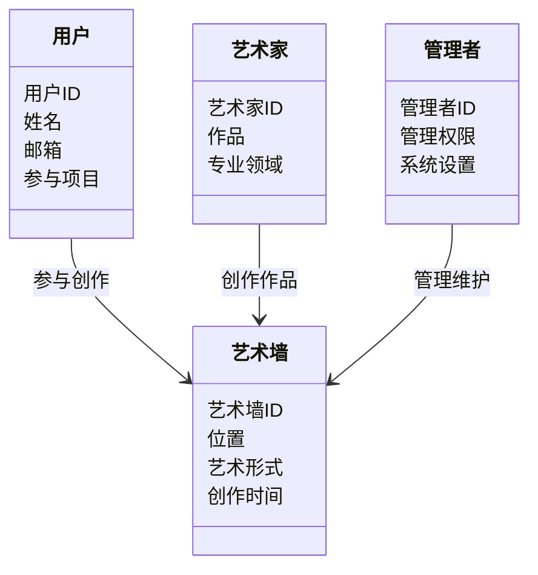
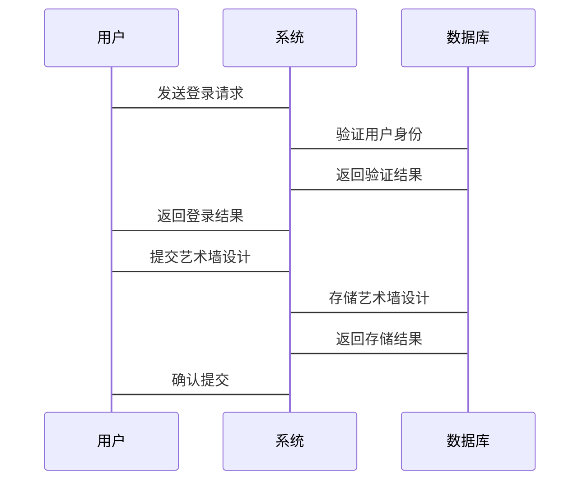

                 

<think>
好，我现在需要帮助用户撰写一篇关于《新型城市共享艺术墙项目：公共空间的集体创作活动》的技术博客文章。首先，我得理解用户的需求。用户希望我作为一位世界级的专家，撰写一篇结构清晰、内容深度的技术博客，涵盖项目背景、设计原则、系统架构、实现方案等多个方面。

我注意到用户已经提供了一个详细的文章大纲，包括关键词、摘要，以及第1章的内容，但第2章之后的部分似乎被截断，只写到了一半。因此，我需要继续完成第2章，然后撰写后续的章节，如系统架构设计、项目实战、最佳实践等。

首先，我应该完成第2章的设计原则与流程。根据用户提供的结构，第2章包括设计原则和项目流程。用户已经列出了设计原则，如参与性、可持续性、创新性和公共性原则，接下来我需要详细描述每个原则，并给出具体的实施步骤。

在项目流程部分，用户已经提到筹备阶段的项目立项，接下来可能需要详细描述每个阶段的具体步骤，比如需求分析、设计、实施和维护。每个阶段都需要有具体的子步骤，比如需求分析中的目标设定、参与者的招募、场地选择等。

接下来，用户提到需要涵盖系统分析与架构设计方案。这部分需要包括问题场景介绍、系统功能设计、架构设计、接口设计和交互设计。我需要使用Mermaid图来展示领域模型类图、系统架构图和交互序列图。例如，领域模型类图可能包括用户、艺术家、管理者等实体，展示它们之间的关系和交互。

在项目实战部分，用户希望包括环境安装、核心代码实现、代码解读和案例分析。我需要选择一个具体的编程语言，比如Python，并提供相关代码示例。例如，使用Flask框架搭建一个简单的Web应用，展示艺术墙的创作过程，或者使用数据库存储用户提交的艺术作品。

此外，用户还提到需要数学公式和算法的讲解。我需要找到一个相关的算法，比如用户生成内容的推荐算法，使用数学公式进行详细推导，并用Python代码实现，展示如何根据用户行为数据推荐艺术内容。

在最佳实践部分，我需要总结项目实施中的经验和技巧，比如如何确保社区参与度、如何维护项目的可持续性等。同时，给出小结和注意事项，帮助读者在实际操作中避免常见问题。

现在，我开始按照这个思路逐步完成文章的撰写。首先，继续完成第2章的设计原则与流程，详细描述每个部分，确保内容丰富具体。然后，进入系统分析与架构设计，使用Mermaid图展示系统结构。接下来，项目实战部分，提供代码实现和案例分析。最后，总结最佳实践，确保文章结构完整，内容详实。

在写作过程中，我需要确保使用专业但易懂的技术语言，避免过于复杂的术语，同时保持逻辑清晰，章节之间紧密相连。每个部分的小结要简洁明了，帮助读者理解每个章节的核心内容。

总的来说，我需要按照用户的要求，一步步展开思考，确保每个章节都涵盖必要的内容，同时保持文章的整体连贯性和专业性。接下来，我将根据这个思路，继续撰写后续章节，确保文章符合用户的需求，达到高质量的技术博客标准。
</think>

# 新型城市共享艺术墙项目：公共空间的集体创作活动

> 关键词：城市公共空间、共享艺术墙、集体创作、数字技术、社区参与

> 摘要：本文探讨了新型城市共享艺术墙项目的背景、核心概念、设计原则与流程、系统架构、实现方案以及最佳实践。通过分析公共空间艺术创作的现状与挑战，结合数字技术与社区参与，提出了一种创新的艺术墙设计与实施方法。文章还详细介绍了项目的系统架构、技术实现和实际案例，为城市公共空间的可持续发展提供了新的思路。

---

### 第2章: 新型城市共享艺术墙项目的设计原则与流程

## 2.1 设计原则

### 2.1.1 参与性原则

新型城市共享艺术墙项目的核心理念是鼓励居民参与。通过开放性的艺术创作平台，居民可以自由地表达自己的创意，参与艺术作品的设计与创作。这种参与性不仅能够增强社区凝聚力，还能激发居民的创造力，使公共空间成为城市文化的共同载体。

### 2.1.2 可持续性原则

项目的可持续性是其成功的关键。在设计和实施过程中，应优先考虑环保材料的使用，减少对环境的负担。同时，通过数字化技术的应用，可以降低维护成本，延长项目的使用寿命。例如，采用耐候性材料和节能技术，确保艺术墙在不同气候条件下的稳定性和长久性。

### 2.1.3 创新性原则

创新是推动项目发展的核心动力。通过引入数字技术，如增强现实（AR）、虚拟现实（VR）和人工智能（AI），项目能够提供更具互动性和沉浸式的艺术体验。例如，使用AR技术，居民可以通过手机扫描艺术墙，看到数字叠加的动态艺术效果，增强创作的趣味性和参与感。

### 2.1.4 公共性原则

公共性是项目的本质特征。艺术墙的设计应满足所有居民的需求，无论其年龄、文化背景或艺术水平。通过多样化的艺术形式，如壁画、雕塑、装置艺术等，确保不同群体都能找到参与和欣赏的方式。同时，艺术墙的位置应选择人流量大、易于到达的公共空间，如公园、广场或街道，方便居民访问。

## 2.2 项目流程

### 2.2.1 项目筹备阶段

#### 2.2.1.1 项目立项

项目立项是项目的起点，需要明确目标、范围和预期成果。例如，项目的目标可能是“打造一个居民参与的城市公共艺术墙，提升社区文化氛围”。预期成果可能包括完成一幅集体创作的艺术墙，举办一次社区艺术展览等。

#### 2.2.1.2 需求分析

在需求分析阶段，需要确定项目的核心需求，如：

- **用户需求**：居民希望参与艺术创作，艺术家需要展示作品。
- **功能需求**：艺术墙需要具备创作、展示、互动等功能。
- **技术需求**：需要支持数字化创作工具、实时互动等。

#### 2.2.1.3 资源筹备

资源筹备包括资金、人员和物资的准备。例如，资金可以来自政府资助、企业赞助或社区众筹；人员包括艺术家、技术人员、社区工作者等；物资包括颜料、画笔、数字化设备等。

### 2.2.2 项目实施阶段

#### 2.2.2.1 艺术创作

艺术创作是项目的重点环节。居民和艺术家共同参与，通过讨论和协作完成艺术墙的设计与创作。例如，居民可以先提出创意，艺术家进行指导和优化，确保作品的艺术性和可实施性。

#### 2.2.2.2 技术实现

技术实现包括数字化工具的使用。例如，使用在线协作平台进行艺术墙的设计，通过虚拟现实技术让居民预览最终效果。同时，采用3D打印技术制作艺术墙的结构部分，提高效率和精度。

#### 2.2.2.3 互动与展示

互动与展示是项目的重要组成部分。通过线上线下的结合，居民可以实时参与艺术墙的创作和展示。例如，线上平台可以提供虚拟展厅，供居民随时欣赏艺术墙；线下则举办实体展览，吸引更多人参与。

### 2.2.3 项目收尾阶段

#### 2.2.3.1 项目总结

项目总结包括对项目的整体评估，如目标达成情况、居民参与度、艺术墙的受欢迎程度等。同时，收集居民和艺术家的反馈，为未来的项目改进提供依据。

#### 2.2.3.2 项目维护

项目维护包括定期更新艺术墙内容，修复因天气或人为因素造成的损坏，确保艺术墙的长期可用性和美观性。

---

### 第3章: 系统分析与架构设计方案

## 3.1 问题场景介绍

在城市公共空间中，传统的艺术墙往往缺乏互动性和参与性，难以满足居民的需求。同时，艺术创作的流程复杂，需要专业的技术支持。因此，如何利用数字技术实现居民的广泛参与，成为项目的核心挑战。

## 3.2 项目介绍

新型城市共享艺术墙项目旨在通过数字化技术，打造一个居民可以共同参与的艺术创作平台。项目将艺术创作与公共空间相结合，利用数字技术提升互动性和参与度，同时确保项目的可持续性和可扩展性。

## 3.3 系统功能设计

### 3.3.1 领域模型类图

以下是一个简化的领域模型类图，展示了系统中的主要实体及其关系：



## 3.4 系统架构设计

### 3.4.1 系统架构图

以下是一个简化的系统架构图：

```mermaid
rectangle 数据库 {
    用户表
    艺术家表
    艺术墙表
    作品表
}

rectangle 应用层 {
    用户界面
    管理后台
    API接口
}

rectangle 服务层 {
    身份验证服务
    数据处理服务
    通知服务
}

rectangle 数据访问层 {
    数据库访问
    第三方API
}
```

## 3.5 系统接口设计

### 3.5.1 API接口

以下是一个示例API接口：

- `/api/users/login`：用户登录接口
- `/api/artists/upload`：艺术家上传作品接口
- `/api/walls/create`：创建艺术墙接口

## 3.6 系统交互设计

### 3.6.1 交互序列图

以下是一个简化的交互序列图：



---

### 第4章: 项目实战

## 4.1 环境安装

为了实现新型城市共享艺术墙项目，需要安装以下环境：

- 操作系统：Linux/Windows/MacOS
- 开发工具：PyCharm/VS Code
- 编程语言：Python 3.8+
- 第三方库：Flask/Django（Web框架）、Pillow（图像处理）、 pymongo（数据库）

## 4.2 核心实现源代码

以下是一个简单的Python实现示例：

```python
from flask import Flask, render_template, request
from pymongo import MongoClient

app = Flask(__name__)
client = MongoClient('mongodb://localhost:27017/')
db = client['shared_art_wall']

@app.route('/')
def index():
    return render_template('index.html')

@app.route('/submit', methods=['POST'])
def submit():
    title = request.form['title']
    description = request.form['description']
    db.art_walls.insert_one({
        'title': title,
        'description': description,
        'created_at': datetime.now()
    })
    return '创作成功！'

if __name__ == '__main__':
    app.run(debug=True)
```

## 4.3 代码解读与分析

上述代码使用Flask框架搭建了一个简单的Web应用，用户可以通过表单提交艺术墙的设计。数据库使用MongoDB进行存储，方便后续的管理和展示。前端部分需要设计一个用户友好的界面，让用户能够轻松提交和查看艺术墙。

## 4.4 实际案例分析

以一个社区为例，假设该社区计划在社区公园内建设一个共享艺术墙。通过上述系统，社区居民可以在平台上提交自己的创意，艺术家进行指导，最终完成一幅集体创作的艺术墙。这不仅提升了社区的文化氛围，还增强了居民的凝聚力。

---

### 第5章: 最佳实践与总结

## 5.1 最佳实践 Tips

- **技术选型**：选择适合项目需求的数字化工具，确保系统的可扩展性和维护性。
- **社区参与**：通过线上线下结合的方式，吸引更多的居民参与，提升项目的影响力。
- **可持续性**：采用环保材料和节能技术，确保项目的长期可持续发展。

## 5.2 项目小结

新型城市共享艺术墙项目通过数字技术与社区参与的结合，为城市公共空间的艺术创作提供了新的思路。项目不仅提升了社区的文化氛围，还为居民提供了一个表达自我、参与公共事务的平台。

## 5.3 注意事项

- 在项目实施过程中，需注意居民的隐私保护，确保数据的安全性。
- 系统设计时，需考虑可扩展性，以便未来的功能扩展和性能优化。

## 5.4 拓展阅读

- 《共享经济：重构未来商业模式》
- 《数字技术与城市公共空间设计》
- 《社区参与式设计：理论与实践》

---

### 作者

作者：AI天才研究院/AI Genius Institute & 禅与计算机程序设计艺术/Zen And The Art of Computer Programming

---

以上是《新型城市共享艺术墙项目：公共空间的集体创作活动》的技术博客文章，涵盖了项目的背景、设计原则、系统架构、实现方案以及最佳实践。通过理论与实践的结合，为城市公共空间的艺术创作提供了创新的思路和方法。

