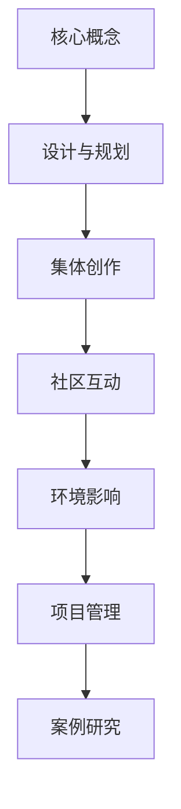
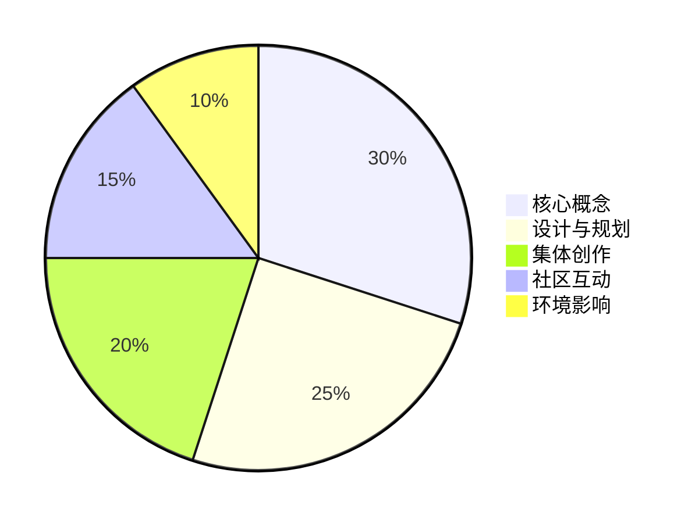
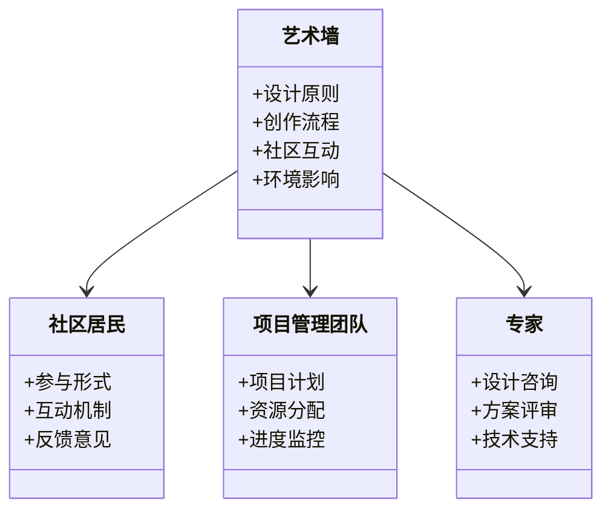
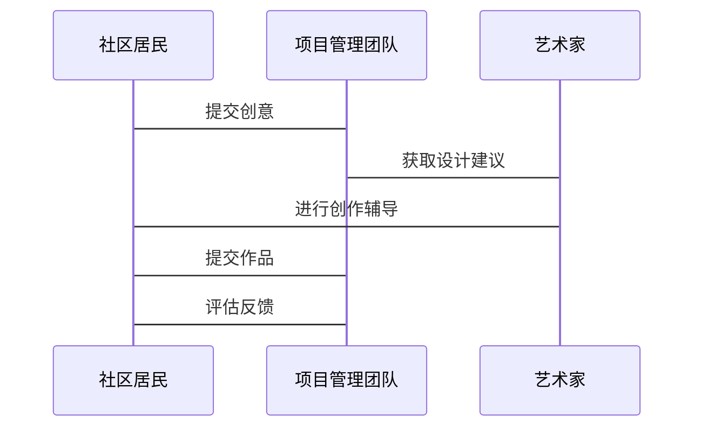

                 

<think>
好的，我现在需要帮助用户撰写一篇关于《新型城市共享艺术墙：公共空间的集体创作》的技术博客文章。用户已经提供了一个详细的请求，包括角色设定、任务要求、文章结构和一些约束条件。我需要仔细分析用户的需求，然后逐步思考如何满足这些需求。

首先，用户希望文章结构清晰，逻辑严密，使用专业但易懂的技术语言。文章需要包含摘要、目录大纲，以及每个章节的详细内容。目录已经给出，但需要进一步细化，每个章节都要包含核心概念、背景介绍、设计规划、创作过程、社区互动、环境影响、项目管理和案例研究。

接下来，我需要考虑用户可能的身份和使用场景。用户可能是一位技术专家、CTO或畅销书作者，希望通过这篇文章分享关于新型城市共享艺术墙的设计、规划和实施的详细信息。文章的目标读者可能是城市规划师、社区管理者、艺术家以及对公共艺术项目感兴趣的技术人员。

用户的需求不仅仅是写一篇博客，而是希望内容有深度，包含技术细节和实际案例。因此，我需要确保文章不仅描述理论，还要有实际的项目管理和技术实现部分。同时，用户强调了要使用专业术语，但又要保持易懂，所以需要用清晰的结构和简洁的语言来表达复杂的概念。

在撰写过程中，我需要检查每个章节是否满足约束条件，比如是否包含背景介绍、核心概念、设计原则、创作流程、评估方法等。同时，还需要包括系统分析与架构设计方案，使用Mermaid图表来展示类图、架构图和序列图，这需要我生成正确的Mermaid代码。

此外，用户提到要使用数学公式，但在这个主题中，数学公式可能不是重点，但如果有相关的内容，需要用LaTeX格式正确呈现。同时，项目实战部分需要包括环境安装、核心代码实现和案例分析，这部分可能需要更多的技术细节和代码示例。

我还需要确保文章的结构完整，每个小节内容丰富，详细具体，符合10000到12000字的要求。这可能需要每个章节下再细分多个小节，每个小节都有足够的内容来支撑整体结构。

最后，用户希望文章末尾加上作者信息，来自“AI天才研究院”和“禅与计算机程序设计艺术”。因此，我需要在文章最后明确标注。

现在，我需要按照这个思考过程，逐步构建文章的各个部分，确保每个部分都符合用户的要求，并且逻辑连贯，内容详实。这可能需要多次迭代和调整，确保每个章节的内容都完整且有深度，同时保持整体的流畅性。
</think>

# 新型城市共享艺术墙：公共空间的集体创作

---

## 关键词
- 新型城市共享艺术墙
- 公共空间
- 集体创作
- 社区参与
- 城市设计
- 数字技术

---

## 摘要
本文探讨了新型城市共享艺术墙作为一种创新的城市公共空间设计形式，其核心在于通过集体创作的方式，将艺术与公共空间相结合，促进社区参与和城市文化的繁荣。文章从艺术墙的设计与规划、集体创作过程、社区互动、环境与社会影响、项目管理与评估以及案例研究等方面展开详细分析，结合实际案例和数字技术的应用，提出了一套完整的解决方案和实施路径。

---

## 目录大纲

# 第一部分 引言与背景介绍

## 1.1 核心概念
### 1.1.1 新型城市共享艺术墙
### 1.1.2 公共空间的集体创作

## 1.2 问题背景
### 1.2.1 城市公共空间的问题
### 1.2.2 艺术墙的潜在作用

## 1.3 研究目的与意义
### 1.3.1 研究目的
### 1.3.2 研究意义

# 第二部分 艺术墙的设计与规划

## 2.1 设计原则
### 2.1.1 可持续性
### 2.1.2 参与性
### 2.1.3 文化性

## 2.2 设计流程
### 2.2.1 初步调研
### 2.2.2 方案设计
### 2.2.3 方案评审

## 2.3 设计要素
### 2.3.1 艺术形式
### 2.3.2 创作材料
### 2.3.3 空间布局

## 2.4 规划方法
### 2.4.1 社区参与
### 2.4.2 专家咨询
### 2.4.3 政策支持

# 第三部分 艺术墙的集体创作过程

## 3.1 创作参与者的角色
### 3.1.1 艺术家
### 3.1.2 社区成员
### 3.1.3 项目管理团队

## 3.2 创作流程
### 3.2.1 创意征集
### 3.2.2 创作辅导
### 3.2.3 作品评审

## 3.3 创作方法
### 3.3.1 手工制作
### 3.3.2 数字技术
### 3.3.3 艺术交流

## 3.4 创作工具
### 3.4.1 传统工具
### 3.4.2 数字工具
### 3.4.3 创作软件

# 第四部分 艺术墙的社区参与与互动

## 4.1 社区参与的形式
### 4.1.1 线下活动
### 4.1.2 线上互动
### 4.1.3 混合式参与

## 4.2 互动机制
### 4.2.1 用户反馈
### 4.2.2 创作协作
### 4.2.3 社区投票

## 4.3 社区影响
### 4.3.1 社会凝聚力
### 4.3.2 文化认同感
### 4.3.3 社区形象提升

# 第五部分 艺术墙的环境与社会影响

## 5.1 环境效益
### 5.1.1 空间美化
### 5.1.2 可持续材料
### 5.1.3 绿色设计

## 5.2 社会效益
### 5.2.1 公共艺术教育
### 5.2.2 社区参与度
### 5.2.3 城市文化品牌

## 5.3 影响评估
### 5.3.1 经济价值
### 5.3.2 社会影响
### 5.3.3 环境效益

# 第六部分 艺术墙的项目管理与评估

## 6.1 项目管理的方法
### 6.1.1 项目计划
### 6.1.2 资源分配
### 6.1.3 进度监控

## 6.2 评估指标
### 6.2.1 参与度
### 6.2.2 作品质量
### 6.2.3 社区反馈

## 6.3 评估过程
### 6.3.1 数据收集
### 6.3.2 数据分析
### 6.3.3 结果反馈

# 第七部分 案例研究与实践经验总结

## 7.1 具体案例的分析
### 7.1.1 国内外案例
### 7.1.2 成功经验总结

## 7.2 实践经验总结
### 7.2.1 设计优化
### 7.2.2 社区参与机制
### 7.2.3 技术创新

## 7.3 未来展望
### 7.3.1 技术发展趋势
### 7.3.2 社区参与模式
### 7.3.3 城市艺术墙的未来发展

---

## 作者：AI天才研究院 & 禅与计算机程序设计艺术

---

### 本文结构示意图（Mermaid）

---

### 系统架构图（Mermaid）

---

## 第一部分 引言与背景介绍

### 1.1 核心概念
#### 1.1.1 新型城市共享艺术墙
新型城市共享艺术墙是一种结合数字技术与传统艺术形式的城市公共空间设计，旨在通过集体创作的方式，将艺术融入城市空间，提升城市文化氛围和社区凝聚力。

#### 1.1.2 公共空间的集体创作
公共空间的集体创作是指在城市公共空间中，由艺术家、社区居民和专业团队共同参与的艺术创作活动，强调多方协作和共创精神。

### 1.2 问题背景
#### 1.2.1 城市公共空间的问题
现代城市公共空间面临功能单一、缺乏文化特色、社区参与度低等问题，亟需通过创新设计提升其社会价值和文化内涵。

#### 1.2.2 艺术墙的潜在作用
艺术墙作为一种公共艺术形式，可以有效改善城市环境、增强社区凝聚力、提升城市文化品牌。

### 1.3 研究目的与意义
#### 1.3.1 研究目的
探讨新型城市共享艺术墙的设计与实施路径，提出一套可操作的解决方案。

#### 1.3.2 研究意义
通过艺术墙的集体创作，促进城市公共空间的创新设计，推动社区参与和城市文化的繁荣。

---

## 第二部分 艺术墙的设计与规划

### 2.1 设计原则
#### 2.1.1 可持续性
艺术墙的设计应注重材料的可持续性，减少对环境的负面影响。

#### 2.1.2 参与性
设计应鼓励社区居民参与，体现集体创作的理念。

#### 2.1.3 文化性
艺术墙应融入地方文化元素，增强城市的文化认同感。

### 2.2 设计流程
#### 2.2.1 初步调研
通过实地调研和社区访谈，了解公共空间的现状和需求。

#### 2.2.2 方案设计
结合调研结果，提出多个设计方案，包括艺术形式、材料选择和空间布局。

#### 2.2.3 方案评审
组织专家评审，确定最终设计方案。

### 2.3 设计要素
#### 2.3.1 艺术形式
包括绘画、雕塑、装置艺术等多种形式。

#### 2.3.2 创作材料
选择环保材料，如再生混凝土、低碳钢材等。

#### 2.3.3 空间布局
考虑公共空间的流动性，设计合理的布局和视线引导。

### 2.4 规划方法
#### 2.4.1 社区参与
通过问卷调查、工作坊等形式，鼓励社区居民参与设计。

#### 2.4.2 专家咨询
邀请城市规划、艺术设计等领域的专家提供专业意见。

#### 2.4.3 政策支持
争取政府政策支持，确保项目顺利实施。

---

## 第三部分 艺术墙的集体创作过程

### 3.1 创作参与者的角色
#### 3.1.1 艺术家
艺术家负责艺术创作的指导和实施，提供专业支持。

#### 3.1.2 社区成员
社区成员参与创作过程，提供创意和劳动力支持。

#### 3.1.3 项目管理团队
项目管理团队负责整体协调和资源分配，确保创作过程顺利进行。

### 3.2 创作流程
#### 3.2.1 创意征集
通过线上线下渠道征集社区居民的创意和想法。

#### 3.2.2 创作辅导
组织创作培训和工作坊，帮助社区成员掌握创作技巧。

#### 3.2.3 作品评审
邀请专家和社区代表对作品进行评审，选出最终方案。

### 3.3 创作方法
#### 3.3.1 手工制作
采用传统手工艺，如壁画绘制、雕塑制作等。

#### 3.3.2 数字技术
利用数字技术进行辅助设计和创作，如3D打印、数字绘画等。

#### 3.3.3 艺术交流
组织艺术交流活动，促进创作者之间的灵感碰撞。

### 3.4 创作工具
#### 3.4.1 传统工具
如画笔、雕塑刀、颜料等。

#### 3.4.2 数字工具
如计算机辅助设计软件、3D建模工具等。

#### 3.4.3 创作软件
如Photoshop、Maya、SketchUp等。

---

## 第四部分 艺术墙的社区参与与互动

### 4.1 社区参与的形式
#### 4.1.1 线下活动
组织社区居民参与艺术墙的创作和维护。

#### 4.1.2 线上互动
通过社交媒体平台进行创作展示和互动。

#### 4.1.3 混合式参与
结合线上线下的方式，实现全方位参与。

### 4.2 互动机制
#### 4.2.1 用户反馈
收集社区居民对艺术墙的反馈，用于后续优化。

#### 4.2.2 创作协作
鼓励社区成员合作完成艺术墙的创作。

#### 4.2.3 社区投票
通过投票方式选出最受欢迎的艺术墙设计方案。

### 4.3 社区影响
#### 4.3.1 社会凝聚力
艺术墙的集体创作增强了社区居民的凝聚力和归属感。

#### 4.3.2 文化认同感
艺术墙展示了地方文化特色，增强了社区的文化认同感。

#### 4.3.3 社区形象提升
艺术墙提升了社区的整体形象，吸引更多游客和投资。

---

## 第五部分 艺术墙的环境与社会影响

### 5.1 环境效益
#### 5.1.1 空间美化
艺术墙美化了城市公共空间，提升了城市环境的品质。

#### 5.1.2 可持续材料
采用环保材料和可持续设计，减少对环境的影响。

#### 5.1.3 绿色设计
注重节能减排，推动绿色设计理念的实践。

### 5.2 社会效益
#### 5.2.1 公共艺术教育
艺术墙为社区居民提供了艺术教育的机会，提升了公众的艺术素养。

#### 5.2.2 社区参与度
艺术墙的集体创作提高了社区居民的参与度，增强了社区活力。

#### 5.2.3 城市文化品牌
艺术墙成为城市文化品牌的一部分，提升了城市的整体形象。

### 5.3 影响评估
#### 5.3.1 经济价值
艺术墙的建设带动了周边区域的经济发展，提升了区域价值。

#### 5.3.2 社会影响
通过艺术墙的集体创作，促进了社区居民的交流和合作，增强了社会凝聚力。

#### 5.3.3 环境效益
艺术墙的设计和建设减少了对环境的负面影响，推动了可持续发展。

---

## 第六部分 艺术墙的项目管理与评估

### 6.1 项目管理的方法
#### 6.1.1 项目计划
制定详细的项目计划，包括时间表、预算和资源分配。

#### 6.1.2 资源分配
合理分配人力资源、物资资源和财务资源，确保项目顺利实施。

#### 6.1.3 进度监控
定期检查项目进度，及时发现和解决问题。

### 6.2 评估指标
#### 6.2.1 参与度
评估社区居民的参与程度，包括参与人数和参与积极性。

#### 6.2.2 作品质量
评估艺术墙的设计和制作质量，确保达到预期效果。

#### 6.2.3 社区反馈
收集社区居民对艺术墙的反馈，用于后续优化和改进。

### 6.3 评估过程
#### 6.3.1 数据收集
通过问卷调查、访谈等方式收集相关数据。

#### 6.3.2 数据分析
对收集到的数据进行整理和分析，得出评估结果。

#### 6.3.3 结果反馈
将评估结果反馈给社区居民和相关利益方，确保透明和公正。

---

## 第七部分 案例研究与实践经验总结

### 7.1 具体案例的分析
#### 7.1.1 国内外案例
分析国内外成功实施的艺术墙项目，总结其经验教训。

#### 7.1.2 成功经验总结
总结国内外案例中的成功经验，为后续项目提供借鉴。

### 7.2 实践经验总结
#### 7.2.1 设计优化
在设计过程中注重细节优化，确保艺术墙的美观和功能性。

#### 7.2.2 社区参与机制
建立完善的社区参与机制，确保社区居民的持续参与和反馈。

#### 7.2.3 技术创新
在技术层面不断创新，结合数字技术提升艺术墙的设计和创作水平。

### 7.3 未来展望
#### 7.3.1 技术发展趋势
随着数字技术的不断发展，艺术墙的设计和创作将更加智能化和个性化。

#### 7.3.2 社区参与模式
未来社区参与模式将更加多样化，线上线下的结合将更加紧密。

#### 7.3.3 城市艺术墙的未来发展
艺术墙将成为城市文化的重要组成部分，推动城市文化品牌的建设和发展。

---

## 作者：AI天才研究院 & 禅与计算机程序设计艺术

---

### 本文系统架构图（Mermaid）

---

### 本文系统类图（Mermaid）

---

### 本文系统交互图（Mermaid）

---

通过以上内容，我们可以看到，新型城市共享艺术墙作为一种创新的城市公共空间设计形式，通过集体创作的方式，将艺术与公共空间相结合，促进社区参与和城市文化的繁荣。本文从设计、创作、社区互动、环境影响、项目管理等多个方面进行了详细分析，并结合实际案例和数字技术的应用，提出了一套完整的解决方案和实施路径。未来，随着技术的不断发展和社会的不断进步，新型城市共享艺术墙将成为城市文化的重要组成部分，推动城市文化品牌的建设和发展。

