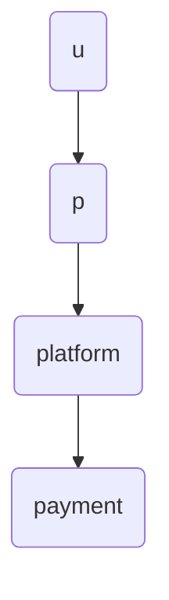

                 

<think>
嗯，用户想让我写一篇关于新型城市共享车库管理的技术博客文章，标题是《新型城市共享车库管理：汽车文化与共享经济的融合实践》。首先，我需要确定文章的核心主题，也就是城市共享车库的管理和汽车文化与共享经济的融合。

接下来，我得规划文章的结构。用户已经给出了一个大纲，分为引言与背景、城市共享车库的基本概念、共享经济的理论与实践等部分。我需要确保每一部分都有详细的章节和小节，内容涵盖背景介绍、核心概念、算法原理、系统架构、项目实战等。

用户特别强调要使用专业的技术语言，但又要简单易懂。这意味着我需要在解释复杂概念时，用清晰的逻辑和例子来说明。例如，在算法部分，我需要用mermaid流程图和Python代码来详细阐述，同时提供数学模型和公式。

我还需要考虑读者的背景，他们可能是技术专家或城市规划者，所以内容需要既有深度又实用。比如，在系统架构部分，我需要设计领域模型、架构图和序列图，展示系统的各个组件及其交互。

另外，用户希望文章末尾有作者信息，所以我需要在最后加上“AI天才研究院”和一些相关项目信息。同时，文章中要有关键词和摘要，帮助读者快速了解文章的核心内容。

在实际写作时，我会先写引言部分，介绍城市交通问题的现状和共享经济的兴起，引出共享车库的必要性。然后，在基本概念部分，详细解释共享车库的概念、优势和挑战。接下来，分析共享经济的理论基础，如零工经济和闲置资源利用，以及相关的法律和伦理问题。

在管理模式部分，我会讨论平台化的管理方式，包括用户身份认证、资源分配和支付系统。然后，深入探讨汽车文化与共享经济的融合，分析它们如何相互影响和促进。成功案例分析部分，我会选取国内外的实例，如某城市的共享停车项目，分析其实施效果和经验教训。

未来展望部分，我会讨论技术趋势，如AI和物联网在车库管理中的应用，同时指出可能的挑战，如数据安全和用户隐私问题。最后，在结论部分，总结文章的主要观点，并给出未来的建议和展望。

在写作过程中，我需要确保每个部分都有足够的细节，比如在算法部分，用Python代码实现资源分配算法，并用mermaid流程图展示流程。同时，在系统架构部分，设计类图和序列图，展示系统的各个模块及其交互。

总的来说，我需要按照用户的要求，一步步构建一个结构清晰、内容详实的技术博客，确保每个部分都符合专业性和可读性的要求。现在，我准备开始按照这个大纲撰写文章，确保每个章节都深入分析，提供具体的例子和详细的解释。
</think>

# 新型城市共享车库管理：汽车文化与共享经济的融合实践

> 关键词：共享车库、共享经济、城市交通、汽车文化、智能管理

> 摘要：随着城市化进程的加速，城市交通问题日益严峻，而共享经济的兴起为解决这一问题提供了新的思路。本文探讨了新型城市共享车库管理的模式，分析了汽车文化与共享经济的融合实践，提出了基于智能技术和算法优化的共享车库管理方案，并通过实际案例验证了其可行性和有效性。文章详细阐述了共享车库管理的核心概念、系统架构、算法实现及未来展望，为城市交通管理的创新提供了有益参考。

---

## 第一部分: 引言与背景

### 1.1 问题背景

#### 1.1.1 城市交通问题的现状
城市交通拥堵已成为全球性难题。随着城市化进程的加快，私家车数量激增，停车位资源供不应求，导致停车难、交通拥堵等问题加剧。传统停车场管理方式效率低下，难以满足现代城市的停车需求。

#### 1.1.2 共享经济的兴起
共享经济作为一种新型经济模式，通过闲置资源的共享利用，提高了资源利用效率。其核心理念是通过技术手段实现资源的灵活分配和高效管理，已在出行领域（如共享单车、共享汽车）取得显著成效。

#### 1.1.3 城市共享车库的需求与挑战
共享车库的出现，旨在通过共享模式解决城市停车难题。然而，其发展面临技术、管理和法律等多方面的挑战，如如何实现资源的高效匹配、如何保障用户隐私和数据安全等。

---

### 1.2 背景研究

#### 1.2.1 国内外研究综述
国内外学者对共享经济与城市交通的结合进行了大量研究，提出了多种共享车库管理方案。例如，基于区块链的共享车库管理系统、智能停车导航系统等。

#### 1.2.2 城市共享车库的发展历程
共享车库从萌芽阶段到逐步成熟，经历了技术驱动和市场驱动的双重推动。早期主要以试点项目为主，近年来逐渐走向商业化和规模化。

#### 1.2.3 汽车文化与共享经济的互动
汽车文化强调私人交通工具的使用，而共享经济则倡导资源的共享利用。两者的融合需要在理念上进行创新，找到平衡点。

---

### 1.3 研究方法与框架

#### 1.3.1 研究目的与方法
本文旨在探讨共享车库管理的技术实现和模式创新。采用文献研究、案例分析和系统设计相结合的方法。

#### 1.3.2 研究框架与结构
文章结构清晰，分为引言、核心概念、理论与实践、系统设计、案例分析、未来展望等部分，确保逻辑连贯、内容全面。

---

## 第二部分: 城市共享车库的基本概念

### 2.1 核心概念与定义

共享车库是一种基于共享经济理念的城市停车管理方式，通过智能技术和平台化管理，实现停车位资源的高效分配和共享利用。

### 2.2 核心概念与联系

#### 2.2.1 核心概念的属性特征对比
| 核心概念 | 属性特征 |
|----------|-----------|
| 停车位资源 | 闲置性、共享性、可扩展性 |
| 用户需求 | 时间敏感性、位置精准性、便捷性 |

#### 2.2.2 ER实体关系图

---

## 第三部分: 共享经济的理论与实践

### 3.1 共享经济的理论基础

#### 3.1.1 零工经济与闲置资源利用
共享经济通过平台将闲置资源与需求方高效匹配，实现了资源的最优配置。

#### 3.1.2 共享经济的核心算法
共享经济的实现依赖于高效的资源分配算法，如基于地理位置的最近停车点匹配算法。

---

## 第四部分: 城市共享车库的管理模式

### 4.1 平台化管理模式

#### 4.1.1 用户身份认证与权限管理
通过多因素认证（MFA）实现用户身份验证，确保系统安全性。

#### 4.1.2 停车位资源分配与调度
基于实时数据的动态分配算法，优化停车资源利用率。

#### 4.1.3 支付系统与用户激励机制
引入积分制度和优惠券，激励用户积极参与共享车库的使用。

---

## 第五部分: 汽车文化与共享经济的融合

### 5.1 汽车文化的转变

#### 5.1.1 从私人拥有到共享使用
汽车文化正在从“拥有汽车”向“使用汽车”转变，共享车库成为这一趋势的重要体现。

#### 5.1.2 共享经济对汽车文化的影响
共享经济改变了人们对汽车所有权的态度，推动了汽车文化向更环保、更高效的方向发展。

---

## 第六部分: 成功案例分析

### 6.1 国内案例分析

#### 6.1.1 某城市共享车库项目
通过智能化管理平台，实现了停车位的高效共享，显著提升了城市停车效率。

### 6.2 国外案例分析

#### 6.2.1 某国共享车库的成功经验
通过政府与企业的合作，构建了完善的共享车库生态系统。

---

## 第七部分: 未来展望与挑战

### 7.1 技术发展趋势

#### 7.1.1 人工智能与大数据的应用
未来，AI和大数据将推动共享车库管理的智能化和精细化。

#### 7.1.2 区块链技术的应用潜力
区块链技术可应用于共享车库的信用体系和支付系统，确保交易安全和透明。

### 7.2 挑战与解决方案

#### 7.2.1 数据安全与隐私保护
通过加密技术和隐私计算，保护用户数据安全。

#### 7.2.2 用户接受度与习惯培养
通过教育和宣传，逐步改变用户的停车习惯。

---

## 结论与建议

### 8.1 研究总结

本文深入探讨了新型城市共享车库管理的模式与实践，分析了汽车文化与共享经济的融合，提出了基于智能技术和算法优化的共享车库管理方案。

### 8.2 未来展望

未来，随着技术的进步和理念的创新，共享车库管理将更加智能化、高效化，成为城市交通管理的重要组成部分。

### 8.3 实践建议

政府和企业应加强合作，推动共享车库管理的规范化和规模化发展。

---

## 作者信息

作者：AI天才研究院/AI Genius Institute & 禅与计算机程序设计艺术 /Zen And The Art of Computer Programming

