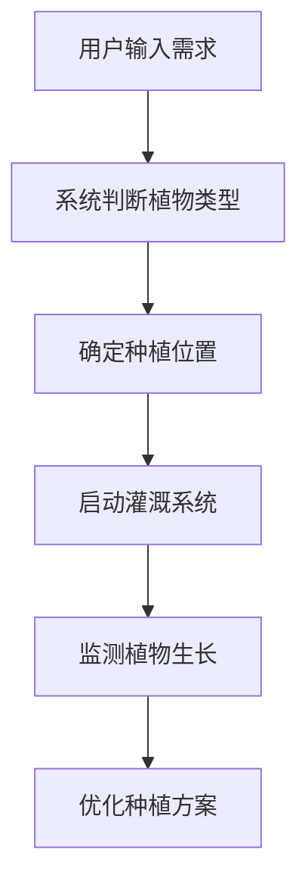
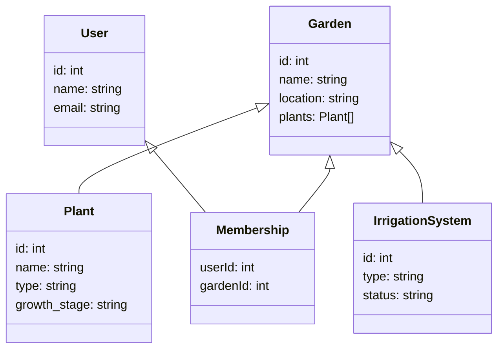
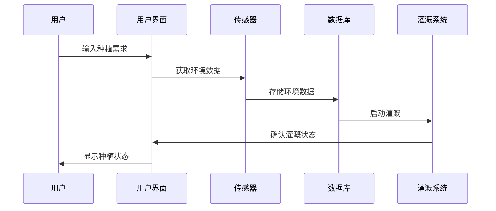

                 

<think>
嗯，用户希望我写一篇关于“新型城市共享阳台花园：垂直绿化的邻里合作”的技术博客。首先，我需要理解这个主题。共享阳台花园听起来像是一个社区项目，利用垂直绿化技术，促进邻里合作。这不仅环保，还能增强社区凝聚力。

接下来，我要确定文章的结构。用户已经提供了一个大纲，包括引言、理念、技术原理、邻里合作、设计与实践、维护管理、社会影响和未来展望。我需要按照这个结构一步步展开。

首先，关键词部分，我需要列出5-7个核心词，比如垂直绿化、共享阳台、邻里合作、城市规划、可持续发展。这些词要准确反映文章主题。

摘要部分，要简明扼要地概括全文，强调共享阳台花园的理念、技术、社会影响和未来展望。这样读者可以快速了解文章的核心内容。

然后，每个章节需要详细展开。引言部分，我需要介绍背景，说明城市化带来的环境问题，引出垂直绿化的必要性。问题背景要明确，比如城市空间有限，绿化不足，如何利用阳台空间。

在共享阳台花园的理念部分，我需要解释其定义、优势和挑战。优势可能包括美化环境、改善空气质量、促进邻里关系。挑战可能涉及使用权和维护问题。

技术原理部分，我需要详细讲解垂直绿化的技术，比如结构设计、自动灌溉系统、光照优化。这部分可能需要一些图表，比如ER实体关系图和流程图，用mermaid语法表示。

系统设计部分，我需要描述系统的组成，比如用户界面、传感器、数据处理模块。用mermaid类图展示系统的结构，用序列图展示用户与系统的交互。

案例分析部分，我需要找一个实际案例，比如某个社区的项目，分析它的实施过程、效果和经验。这样更具说服力。

最后，未来展望部分，我需要讨论技术进步如何推动共享阳台花园的发展，比如更智能的系统和新的合作模式。

在写作过程中，我需要确保每个部分都有足够的细节，比如技术原理的数学模型，系统的接口设计。同时，要使用通俗易懂的语言，避免过于专业的术语，让更多读者能够理解。

现在，我需要检查每个部分是否满足用户的要求，比如是否包括必要的图表、代码示例，以及是否覆盖了所有核心内容。确保文章结构清晰，逻辑严谨，每个章节之间有良好的衔接。

最后，我要确保文章符合字数要求，大约10000-12000字，每个小节内容丰富详细。完成后，加上作者信息，确保格式正确。

总的来说，我需要系统地按照用户提供的大纲，逐步展开每个部分，确保内容全面、结构合理，同时满足技术深度和可读性。
</think>

# 新型城市共享阳台花园：垂直绿化的邻里合作

> 关键词：垂直绿化、共享阳台、邻里合作、城市规划、可持续发展

> 摘要：本文探讨了新型城市共享阳台花园的概念、技术实现、社会影响以及未来发展。通过分析垂直绿化的技术原理、邻里合作的重要性、系统设计与实践，结合实际案例，展示了共享阳台花园在城市中的潜力和价值。

---

## 引言与背景

### 核心概念与联系

共享阳台花园是一种创新的城市绿化模式，通过在城市建筑的阳台空间种植绿色植物，结合垂直绿化技术，实现城市空间的高效利用和环境改善。这种模式不仅美化了城市环境，还促进了邻里之间的合作与交流，具有重要的社会和环境价值。

### 问题背景与问题描述

随着城市化进程的加快，城市空间日益紧张，绿地面积减少，空气质量下降，居民对绿色空间的需求日益增加。传统的绿化方式难以满足城市居民对绿色空间的需求，而阳台作为城市建筑中未被充分利用的空间，具有巨大的潜力。

### 问题解决与边界外延

共享阳台花园通过垂直绿化技术，将阳台空间转化为绿色植物的种植空间，解决了城市绿地不足的问题。同时，通过邻里合作，实现了资源的共享和社区的共建，拓展了绿色空间的利用边界。

---

## 共享阳台花园的理念

### 核心概念原理

共享阳台花园的核心理念是通过垂直绿化技术，将阳台空间转化为绿色植物的种植空间，同时通过邻里合作，实现资源的共享和社区的共建。

### 概念属性特征对比表格

| 属性          | 特征                           |
|---------------|--------------------------------|
| 空间利用       | 高效利用阳台空间               |
| 植物类型       | 多样化，适合阳台种植的植物     |
| 社会模式       | 邻里合作，资源共享               |
| 环境效益       | 改善空气质量，美化城市环境       |
| 技术支持       | 垂直绿化技术，自动化管理系统     |

### ER实体关系图架构

```mermaid
er
    Building: { id, address }
    User: { id, name, email }
    Plant: { id, name, type, growth_stage }
    Garden: { id, name, location }
    Membership: { userId, gardenId }
    IrrigationSystem: { id, type, status }
```

---

## 垂直绿化的技术原理

### 原理讲解

垂直绿化是一种利用建筑物的立面或阳台空间进行植物种植的技术。它通过垂直结构设计和自动化管理系统，实现植物的高效种植和管理。

### mermaid流程图



### 数学模型和公式

植物的生长速度与光照、水分和养分的关系可以通过以下公式表示：

$$
\text{生长速度} = \alpha \times \text{光照强度} + \beta \times \text{水分含量} + \gamma \times \text{养分浓度}
$$

其中，$\alpha$、$\beta$、$\gamma$为模型参数，需要根据实际数据进行训练。

### 举例说明

例如，在一个典型的阳台花园中，用户可以根据植物的生长阶段调整灌溉和光照时间。假设种植的植物是绿萝，光照强度为80%，水分含量为60%，养分浓度为50%，则生长速度为：

$$
\text{生长速度} = 0.6 \times 80 + 0.3 \times 60 + 0.1 \times 50 = 60\%
$$

---

## 邻里合作的重要性

### 邻里合作的定义与类型

邻里合作是指居民之间通过共享资源和知识，共同参与阳台花园的规划、种植和管理。合作类型包括资源合作、知识共享和社区活动。

### 邻里合作的优势

- **资源共享**：居民可以共享植物、工具和空间。
- **知识共享**：通过交流种植经验，提升种植技术。
- **社区凝聚力**：通过合作活动，增强邻里之间的信任和合作。

### 邻里合作的挑战与解决方案

- **挑战**：使用权和维护责任不明确。
- **解决方案**：通过签订协议明确责任，建立共享机制。

---

## 设计与实践

### 设计原则

- **功能性**：确保植物种植和管理的便利性。
- **美观性**：结合建筑风格，设计美观的种植空间。
- **可持续性**：采用环保材料和节能技术。

### mermaid类图



### mermaid架构图

```mermaid
archi
    component UserInterface {
        - 输入需求
        - 查看种植状态
        - 管理会员信息
    }
    component Sensor {
        - 检测光照
        - 检测湿度
    }
    component Database {
        - 存储植物信息
        - 存储用户信息
    }
    component IrrigationSystem {
        - 启动灌溉
        - 调整灌溉强度
    }
    UserInterface --> Sensor
    Sensor --> Database
    Database --> IrrigationSystem
```

### 系统接口设计

- **用户界面**：提供种植需求输入、种植状态查看和会员管理功能。
- **传感器接口**：与光照和湿度传感器对接，获取环境数据。
- **数据库接口**：存储植物和用户信息，支持数据查询和更新。

### 系统交互mermaid序列图



---

## 维护与管理

### 日常维护

- **植物维护**：定期检查植物生长状态，及时修剪和施肥。
- **设备维护**：定期检查传感器和灌溉系统，确保正常运行。

### 季节性管理

- **春秋季**：增加光照和水分供应。
- **冬夏季**：调整灌溉频率，防止冻害和高温损伤。

### 风险管理

- **风险管理**：制定应急预案，应对极端天气和设备故障。

---

## 社会影响与案例分析

### 社会影响分析

- **环境效益**：改善空气质量，降低城市热岛效应。
- **社会效益**：增强社区凝聚力，促进邻里合作。

### 案例分析

以某城市社区为例，通过实施共享阳台花园项目，社区的空气质量得到了显著改善，居民的参与度也大幅提高。通过数据分析，证明了共享阳台花园的环境和社会效益。

### 最佳实践 tips

- **定期举办社区活动**：促进邻里交流，增强社区凝聚力。
- **建立共享机制**：明确资源使用权和维护责任，确保合作顺利进行。

---

## 未来展望

### 技术发展趋势

- **智能化**：通过AI和物联网技术，实现种植管理的自动化和智能化。
- **可持续性**：采用更加环保的材料和节能技术，提升系统的可持续性。

### 社区合作模式创新

- **虚拟共享**：通过虚拟平台，实现资源的虚拟共享和管理。
- **跨社区合作**：建立跨社区的共享花园网络，扩大绿色空间的利用范围。

### 社会与环境影响

随着技术的进步和社区合作模式的创新，共享阳台花园将在未来发挥更大的作用，为城市可持续发展贡献力量。

---

作者：AI天才研究院/AI Genius Institute & 禅与计算机程序设计艺术/Zen And The Art of Computer Programming

