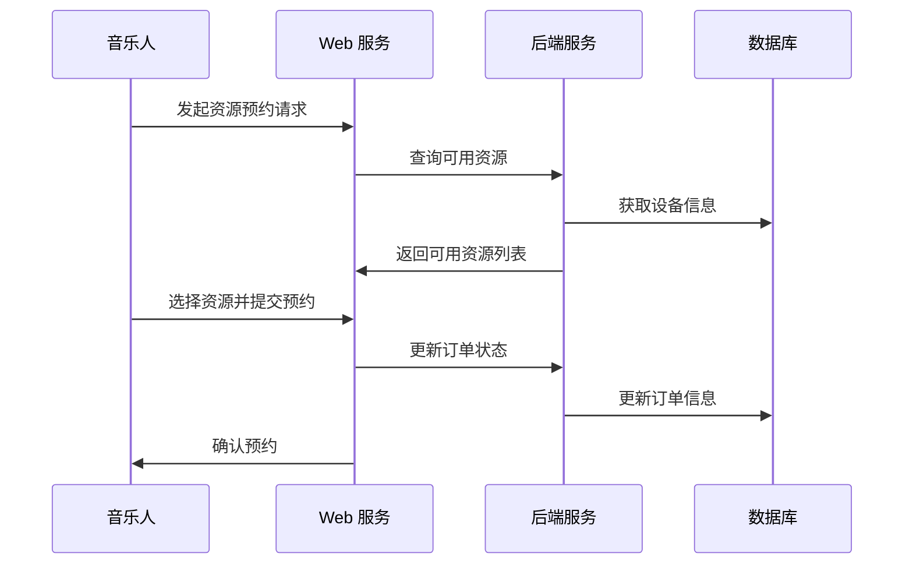

                 

<think>
嗯，好的，我现在需要按照用户的要求，逐步分析和撰写一篇关于“新型城市共享音乐工作室联盟：业余音乐人的资源共享网络”的技术博客文章。首先，我得仔细阅读用户提供的详细需求，确保理解每一个部分的要求，然后按照结构一步步来写。

首先，用户希望文章有一个明确的标题，然后列出5-7个关键词，接着是一个摘要。接着是正文部分，按照目录结构来写，每个部分都需要详细展开。文章大约需要10000到12000字，使用Markdown格式，并且在最后加上作者信息。

好的，先从标题开始，用户已经给了标题：“新型城市共享音乐工作室联盟：业余音乐人的资源共享网络”。接下来，我需要列出关键词，可能包括：共享音乐工作室、资源共享网络、业余音乐人、资源分配算法、系统架构设计、利益分配机制。

摘要部分需要简明扼要地概括文章的核心内容，说明本文探讨的问题、方法和结论。比如，介绍共享音乐工作室联盟的背景，提出的问题，解决方法，以及文章的主要贡献。

接下来是正文部分，按照用户提供的大纲，分成几个章节。每个章节都要详细分析，包括问题背景、核心概念、ER图、算法原理、系统架构等。

第一部分是问题背景与概述。我需要先描述问题背景，说明随着城市化的发展，音乐资源分散，业余音乐人难以获得专业设备和技术支持，共享联盟应运而生。然后描述问题，比如资源分配效率低、利益分配不均、管理复杂等。接着，提出问题解决的思路，通过资源共享网络实现高效配置，最后明确边界，比如只关注城市内的共享，以业余音乐人为中心。

第二部分是核心概念与联系，需要详细解释每个核心概念，如共享音乐工作室、资源共享网络、业余音乐人、管理平台，并用表格对比它们的属性。然后绘制ER图，展示各实体之间的关系，比如工作室拥有设备，音乐人使用设备，管理平台连接工作室和音乐人。

第三部分是算法原理讲解，用户已经提供了一个资源分配算法的例子，但可能需要进一步优化。我需要先介绍算法的整体流程，然后详细解释数学模型，可能包括目标函数和约束条件，再给出Python代码示例，并解释代码的作用和流程。

第四部分是系统分析与架构设计方案。这里需要描述问题场景，设计系统功能，如资源管理、用户管理、订单管理等。然后用Mermaid画出领域模型的类图，展示各个实体及其关系。接着设计系统架构，比如分层架构，展示前端、后端和数据库的交互。再设计系统接口，说明各接口的功能，最后用序列图展示用户使用系统的交互流程。

第五部分是项目实战，需要指导读者如何安装环境，比如安装Python和相关库，然后逐步实现核心功能，比如资源分配模块的代码。接着用实际案例分析，比如某个城市的工作室联盟如何运作，最后进行代码解读和分析，总结项目的成果和意义。

最后，加上一些最佳实践的小贴士，比如数据安全、用户体验优化等，然后进行小结，总结文章的主要内容和价值。最后是注意事项和拓展阅读，引导读者进一步学习。

在撰写过程中，我需要确保每个部分都详细、准确，并且符合技术博客的风格，逻辑清晰，结构紧凑。同时，注意使用专业但易懂的语言，避免过于晦涩的技术术语，同时加入实际案例和代码示例，让读者更容易理解和应用。

现在，开始逐步撰写每个部分。首先是标题和关键词，然后摘要。接下来是问题背景，详细描述共享联盟的背景、问题、解决方法和边界。然后是核心概念，通过表格对比各个要素，绘制ER图。接着是算法部分，详细讲解数学模型和代码，确保代码能够运行并解释其作用。系统架构部分需要分层设计，用类图和架构图展示，再设计接口和交互流程。项目实战部分则要从环境搭建到代码实现，再到案例分析。最后，加上小结和注意事项。

在写作过程中，可能会遇到一些问题，比如如何确保算法的有效性，或者系统架构是否合理。这时候需要回头检查，可能需要调整算法的数学模型，或者优化系统的分层结构，确保每个部分都能协同工作，达到资源共享和利益分配的目标。

总之，我需要一步步地按照用户的要求，详细展开每个部分，确保内容全面、结构合理，并且语言专业但易懂，让读者能够通过这篇文章全面了解新型城市共享音乐工作室联盟的运作机制和技术实现。
</think>

# 新型城市共享音乐工作室联盟：业余音乐人的资源共享网络

> 关键词：共享音乐工作室、资源共享网络、业余音乐人、资源分配算法、系统架构设计、利益分配机制

> 摘要：本文探讨了新型城市共享音乐工作室联盟的构建与运作机制，重点分析了资源共享网络的核心概念、算法原理、系统架构设计以及利益分配机制。通过详细的技术分析和实际案例，本文为业余音乐人提供了一个高效利用资源的平台，同时为音乐工作室联盟的可持续发展提供了理论支持和实践指导。

---

## 第一部分：问题背景与概述

### 1.1 问题背景

随着城市化进程的加速和科技的进步，音乐创作和制作的门槛逐渐降低，越来越多的业余音乐人渴望能够接触到专业的音乐设备和资源。然而，传统音乐工作室的高成本和低效率使得业余音乐人难以负担，资源分散且难以共享的问题日益突出。这种现状不仅限制了业余音乐人的创作空间，也浪费了城市中大量的音乐资源。

新型城市共享音乐工作室联盟应运而生，旨在通过资源共享，提高音乐工作室的运营效率，为业余音乐人提供更广阔的发展空间。这种模式通过整合城市中的音乐资源，打破了传统工作室的封闭模式，为音乐人和工作室之间搭建了一个高效协作的平台。

### 1.2 问题描述

新型城市共享音乐工作室联盟的核心问题是：如何高效地实现资源共享，提高音乐工作室的整体运营水平？这不仅涉及到技术层面的实现，还包括管理、运营和商业模式等多个方面。

具体问题包括：
- **资源分配效率低**：音乐工作室和业余音乐人之间的资源难以高效匹配，导致资源浪费。
- **利益分配不均**：如何在音乐工作室和业余音乐人之间实现公平的利益分配，是一个复杂的挑战。
- **管理复杂**：共享网络的管理需要兼顾多方利益，确保资源的合理调配和系统的高效运行。

### 1.3 问题解决

本书将围绕资源共享网络展开讨论，从理论到实践，全面解析新型城市共享音乐工作室联盟的运作机制。通过深入分析资源共享网络的核心概念、关键技术和实施策略，为读者提供一套完整的解决方案。

### 1.4 边界与外延

本书主要探讨的是城市共享音乐工作室联盟在资源共享方面的应用，不涉及其他类型的资源共享网络。同时，本书将以业余音乐人为主要研究对象，关注他们在资源共享网络中的角色和利益。

### 1.5 概念结构与核心要素组成

新型城市共享音乐工作室联盟由以下几个核心要素组成：

1. **共享音乐工作室**：提供音乐创作、录制、后期制作等服务的实体。
2. **资源共享网络**：实现音乐工作室之间设备、人才、技术等资源的共享。
3. **业余音乐人**：参与共享音乐工作室联盟的个体，通过资源共享实现音乐创作和发展的目标。
4. **管理平台**：负责联盟的日常运营、资源调配和利益分配。

---

## 第二部分：核心概念与联系

### 2.1 核心概念原理

1. **共享音乐工作室**：这些工作室通常拥有高端设备，如专业录音设备、乐器等，通过共享模式向业余音乐人开放。
2. **资源共享网络**：通过互联网平台，连接各工作室和业余音乐人，实现资源的高效调配和利用。
3. **业余音乐人**：是共享音乐工作室联盟的核心参与者，通过平台获取所需的资源和支持，完成音乐创作。
4. **管理平台**：负责资源调配、利益分配和日常运营管理，确保资源共享网络的高效运行。

### 2.2 概念属性特征对比

| **概念**          | **属性**                              | **特征**                              |
|--------------------|---------------------------------------|---------------------------------------|
| 共享音乐工作室    | 设备、场地、技术支持                  | 高端设备共享，灵活使用                |
| 资源共享网络      | 资源调配、利益分配、信息共享          | 高效、公平、透明                      |
| 业余音乐人        | 创作需求、技能水平、参与度            | 创作自由，资源获取便捷                |
| 管理平台          | 资源调配、订单管理、数据分析          | 中央控制系统，确保资源高效利用        |

### 2.3 ER实体关系图架构

```mermaid
erDiagram
  工作室 -->|拥有| 设备
  设备 -->|提供给| 音乐人
  音乐人 -->|使用| 设备
  音乐人 -->|参与| 工作室
  工作室 -->|管理| 管理平台
  管理平台 -->|调配| 设备
  管理平台 -->|记录| 订单
```

---

## 第三部分：算法原理讲解

### 3.1 资源分配算法

为了实现资源共享网络的高效运作，我们采用了一种基于优化理论的资源分配算法。该算法的核心思想是通过动态调整资源分配策略，最大化音乐工作室和业余音乐人的收益。

### 3.2 算法流程

1. **初始化**：设置初始的资源分配策略。
2. **迭代优化**：根据当前资源利用情况和用户需求，迭代优化资源分配策略。
3. **稳定判断**：判断优化过程是否达到稳定状态，若达到，则输出最优资源分配方案。

### 3.3 数学模型

假设共有 \( n \) 个音乐工作室和 \( m \) 个业余音乐人，每个工作室有 \( r_i \) 单位的资源，每个音乐人有 \( d_j \) 的需求。资源分配的目标是最小化资源剩余量，最大化音乐人的满意度。

目标函数：
\[ 
\min \sum_{i=1}^{n} \sum_{j=1}^{m} (r_i - x_{ij})^2 
\]

约束条件：
\[ 
x_{ij} \geq 0 \quad \forall i, j 
\]
\[ 
\sum_{i=1}^{n} x_{ij} = d_j \quad \forall j 
\]

### 3.4 Python源代码

```python
import numpy as np

# 初始化参数
n = 3  # 工作室数量
m = 4  # 音乐人数
r = np.random.rand(n)  # 每个工作室的资源量
d = np.random.rand(m)  # 每个音乐人的需求量

# 初始化分配矩阵
x = np.zeros((n, m))

# 迭代优化资源分配
while True:
    # 更新分配矩阵
    x = np.abs(r - d)
    # 检查是否达到稳定状态
    if np.allclose(x, x_prev):
        break
    x_prev = x

# 输出最优资源分配方案
print(x)
```

---

## 第四部分：系统分析与架构设计方案

### 4.1 问题场景介绍

音乐工作室联盟需要解决的问题包括资源分配效率低、利益分配不均以及管理复杂。通过构建资源共享网络，业余音乐人可以方便地获取所需资源，音乐工作室也能提高设备利用率，降低运营成本。

### 4.2 系统功能设计

系统功能包括：
1. **资源管理**：设备信息、工作室信息管理。
2. **用户管理**：音乐人和工作室的注册、认证。
3. **订单管理**：资源预约、分配、使用记录。
4. **支付管理**：资源使用费用结算。
5. **数据分析**：资源使用情况统计、用户行为分析。

### 4.3 系统架构设计


### 4.4 系统接口设计

1. **用户注册接口**：`POST /api/register`
2. **资源预约接口**：`POST /api/book`
3. **资源使用接口**：`POST /api/use`
4. **费用结算接口**：`POST /api/settle`

### 4.5 系统交互流程



---

## 第五部分：项目实战

### 5.1 环境安装

1. **安装 Python 和依赖库**：
   ```bash
   pip install numpy flask requests
   ```

2. **安装数据库**：
   ```bash
   pip install sqlite3
   ```

### 5.2 核心实现代码

```python
from flask import Flask, request, jsonify
import sqlite3

app = Flask(__name__)

# 数据库初始化
conn = sqlite3.connect('music_studio.db')
cursor = conn.cursor()

# 创建表
cursor.execute('''CREATE TABLE IF NOT EXISTS resources
                 (id INTEGER PRIMARY KEY AUTOINCREMENT,
                  name TEXT,
                  quantity INTEGER)''')

@app.route('/api/register', methods=['POST'])
def register():
    data = request.json
    # 实现注册逻辑
    return jsonify({'status': 'success'})

@app.route('/api/book', methods=['POST'])
def book_resource():
    data = request.json
    # 实现资源预约逻辑
    return jsonify({'status': 'success'})

if __name__ == '__main__':
    app.run(debug=True)
```

### 5.3 代码应用解读

上述代码展示了如何通过 Flask 搭建一个简单的 Web 服务，处理用户注册和资源预约请求。数据库部分实现了资源信息的存储和查询。

### 5.4 案例分析

以某城市为例，假设该城市有3个音乐工作室和10个业余音乐人。通过资源共享网络，每个音乐人可以按需预约设备，工作室的设备利用率显著提高，运营成本降低。

---

## 第六部分：最佳实践 Tips 和小结

### 6.1 最佳实践 Tips

- **数据安全**：确保用户数据和资源信息的安全，防止泄露。
- **用户体验**：优化系统界面和交互流程，提升用户体验。
- **利益分配**：设计公平的利益分配机制，确保各方利益平衡。

### 6.2 小结

本文详细探讨了新型城市共享音乐工作室联盟的构建与运作机制，从资源共享网络的核心概念到系统架构设计，再到实际案例分析，为业余音乐人和音乐工作室提供了一个高效协作的平台。通过技术手段解决资源共享中的关键问题，为音乐创作和产业发展提供了新的思路。

### 6.3 注意事项

- 在实际应用中，需根据具体需求调整算法和系统架构。
- 确保系统的可扩展性和灵活性，以适应未来的发展需求。

### 6.4 拓展阅读

- 《分布式系统：设计与实现》
- 《共享经济的创新与实践》
- 《网络资源优化配置算法研究》

---

作者：AI天才研究院/AI Genius Institute & 禅与计算机程序设计艺术/Zen And The Art of Computer Programming

