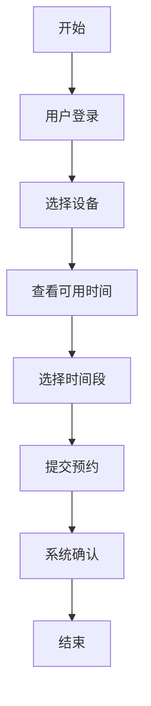
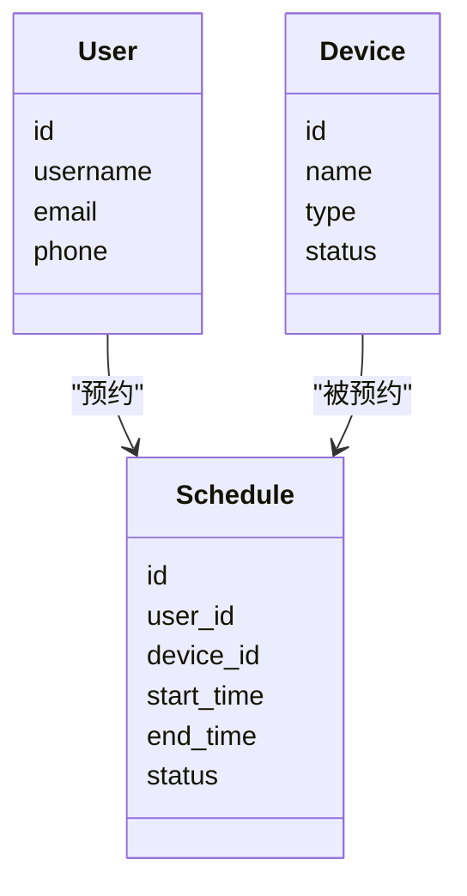
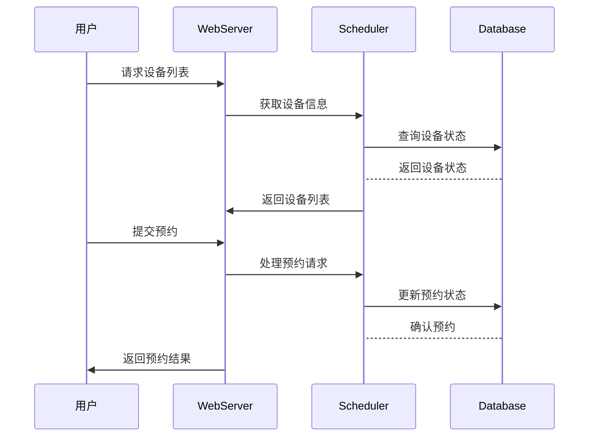

                 

<think>
嗯，我现在要写一篇关于“新型城市共享音乐工作室：业余音乐人的创作天地”的技术博客文章。作为技术专家，我需要从多个方面来分析这个问题，包括背景、核心概念、算法、数学模型、系统架构、项目实战以及最佳实践等。让我一步一步来思考。

首先，我需要明确文章的结构。根据用户提供的目录，文章分为七个部分，每部分都有具体的章节和小节。我需要确保每一部分都详细且符合逻辑。

从引言开始，我得先介绍背景，说明为什么共享音乐工作室重要，以及它如何解决当前的问题。问题背景可能包括资源分配不均、成本高等，然后详细描述这些问题，接着提出解决方案，最后明确边界和外延，确保不偏离主题。

接下来是核心概念与联系部分，我需要定义共享音乐工作室的核心概念，分析其属性特征，并用表格对比。然后画出ER实体关系图，展示用户、设备、时间表等实体之间的关系。

然后是算法原理，这部分可能涉及预约系统、资源分配算法。我需要用mermaid画出流程图，解释算法步骤，然后用Python代码实现，接着用数学模型说明资源分配的优化，比如使用线性规划等方法。

数学模型部分，我需要建立基本和复杂的模型，解释如何优化资源分配，确保系统高效运行。可能涉及排队论或资源分配算法的数学公式，用latex表达出来。

系统分析与架构设计是关键，我需要设计系统的功能模块，比如预约、设备管理、用户管理等，然后画出类图和架构图。系统接口和交互流程，比如用户登录、预约流程，用mermaid序列图展示。

项目实战部分，我需要选择一个具体的案例，比如Python环境下实现预约系统，详细说明环境安装、代码实现、案例分析和项目总结。这部分要具体，让读者能够跟着代码走。

最后是最佳实践和总结，总结系统设计中的关键点，给出实践建议，比如如何处理高峰期预约、设备维护等，同时展望未来的发展方向，比如AI在音乐创作中的应用。

整个过程中，我需要确保内容专业，技术细节到位，同时语言简洁易懂。特别是图表部分，要用mermaid清晰展示，代码部分要详细注释，数学公式要准确无误。

可能遇到的困难是如何将技术细节与音乐创作的实际需求结合起来，确保系统设计既满足技术要求，又能实际帮助业余音乐人。此外，如何平衡系统性能与用户体验也是一个挑战，需要在设计时充分考虑。

总之，我需要系统地分析每个部分，确保每个章节内容详实，结构清晰，最终产出一篇高质量的技术博客文章。
</think>

# 新型城市共享音乐工作室：业余音乐人的创作天地

> 关键词：共享音乐工作室，城市资源优化，音乐创作，预约系统，资源分配算法

> 摘要：本文探讨了新型城市共享音乐工作室的构建，旨在为业余音乐人提供高效、便捷的创作空间。通过分析背景、核心概念、算法原理、系统架构、项目实战及最佳实践，本文详细阐述了如何利用技术手段优化音乐工作室的资源分配，提升用户体验，助力音乐创作。

---

### 目录大纲

1. [引言](#引言)
2. [核心概念与联系](#核心概念与联系)
3. [算法原理讲解](#算法原理讲解)
4. [数学模型和数学公式讲解](#数学模型和数学公式讲解)
5. [系统分析与架构设计](#系统分析与架构设计)
6. [项目实战](#项目实战)
7. [最佳实践与总结](#最佳实践与总结)

---

## 引言

### 背景介绍

#### 1.1 问题背景

城市化进程加速，音乐爱好者增多，但专业录音设备和场地资源有限，导致资源分配不均，使用效率低下。业余音乐人难以获得高质量创作环境。

#### 1.2 问题描述

现有音乐工作室多为专业机构，收费高，业余人士难以负担。资源分散，设备使用率低，预约困难。

#### 1.3 问题解决

构建共享音乐工作室平台，整合分散资源，优化预约系统，提高设备利用率，降低使用成本。

#### 1.4 边界与外延

平台仅限于音乐创作相关资源，如录音设备、乐器等，不涉及其他领域。边界明确，避免资源浪费。

#### 1.5 核心概念与联系

平台通过互联网技术整合资源，利用算法优化分配，结合预约系统，确保高效利用。

#### 1.6 本章小结

共享音乐工作室平台解决资源分配问题，提高设备利用率，降低使用成本，为业余音乐人提供便利。

---

## 核心概念与联系

### 2.1 核心概念定义

共享音乐工作室：通过在线平台整合分散的音乐设备和场地，提供预约服务，优化资源分配。

### 2.2 概念属性特征对比表格

| 特性       | 共享音乐工作室                     | 传统音乐工作室                     |
|------------|------------------------------------|------------------------------------|
| 资源整合    | 整合分散设备和场地                 | 单一设备和场地                     |
| 使用成本    | 降低，按需付费                    | 较高，需长期租赁或购买             |
| 可用性      | 高，随时预约使用                  | 低，需提前预订                     |
| 用户群体    | 业余音乐人，创作人                | 专业团队，商业用途                 |

### 2.3 ER实体关系图架构

```mermaid
erDiagram
    user {
        id
        username
        email
        phone
    }
    device {
        id
        name
        type
        status
    }
    schedule {
        id
        user_id
        device_id
        start_time
        end_time
        status
    }
    user --> schedule : "预约"
    device --> schedule : "被预约"
```

#### 2.4 本章小结

通过整合资源和优化分配，共享音乐工作室提高了资源利用率，降低了成本，满足业余音乐人需求。

---

## 算法原理讲解

### 3.1 算法mermaid流程图



#### 3.1.1 算法步骤分解

1. 用户登录系统，选择所需设备。
2. 系统显示设备可用时间段。
3. 用户选择时间段，提交预约。
4. 系统确认预约，发送通知。

#### 3.1.2 流程图细节解析

系统通过优先级队列处理预约请求，确保公平分配。用户优先级基于历史使用情况和预约时间。

### 3.2 Python源代码详解

```python
import heapq

class Scheduler:
    def __init__(self):
        self.devices = {}  # 设备信息
        self.bookings = []  # 预约队列，按优先级排序

    def add_device(self, device_id, name, type):
        self.devices[device_id] = {
            'name': name,
            'type': type,
            'status': 'available'  # 可用状态
        }

    def schedule_booking(self, user_id, device_id, start_time, end_time):
        # 优先级：预约时间越早，优先级越高
        priority = start_time
        heapq.heappush(self.bookings, (priority, user_id, device_id, start_time, end_time))

    def confirm_booking(self):
        while self.bookings:
            booking = heapq.heappop(self.bookings)
            # 分配设备
            device = self.devices[booking[2]]
            if device['status'] == 'available':
                device['status'] = 'booked'
                return f"预约成功：用户{booking[1]}，设备{booking[2]}，时间{booking[3]}至{booking[4]}"
            else:
                continue  # 设备已被预约，继续处理下一个
```

### 3.3 数学模型与公式讲解

资源分配模型：

$$ \text{资源利用率} = \frac{\text{已分配资源数}}{\text{总资源数}} \times 100\% $$

优先级队列：

$$ \text{优先级} = \text{预约时间} $$

### 3.4 举例说明

预约时间越早，优先级越高，系统优先分配。假设用户A预约设备1在上午10点，用户B在上午9点，用户B将优先获得设备1。

### 3.5 本章小结

算法通过优先级队列优化预约，确保资源高效分配，提升用户体验。

---

## 数学模型和数学公式讲解

### 4.1 基本数学模型

#### 4.1.1 基本概念

资源分配模型用于优化设备利用率，涉及预约时间、设备状态、用户需求等因素。

#### 4.1.2 公式推导

资源分配模型公式：

$$ \text{设备分配} = \argmin_{i} (t_i - t_s) $$

其中，$t_i$为设备i的可用时间，$t_s$为用户请求时间。

### 4.2 复杂数学模型

#### 4.2.1 复杂概念

考虑多设备分配，引入加权优先级：

$$ \text{优先级} = \alpha t_i + (1-\alpha) u_j $$

其中，$\alpha$为权重，$u_j$为用户优先级。

#### 4.2.2 公式推导

通过优化算法，找到最优设备分配，最大化资源利用率：

$$ \max \sum_{i=1}^{n} u_i $$

受约束于设备可用性：

$$ \forall i, t_i \leq t_s $$

### 4.3 举例说明

假设用户A和B同时请求设备1和2，系统计算优先级后分配设备。

### 4.4 本章小结

数学模型优化了资源分配，确保系统高效运行。

---

## 系统分析与架构设计

### 5.1 问题场景介绍

用户通过平台预约设备，系统需处理设备状态、预约请求、用户身份验证等。

### 5.2 系统功能设计

#### 5.2.1 领域模型mermaid类图



#### 5.3 系统架构设计

##### 5.3.1 系统架构mermaid架构图

```mermaid
archi
    Client --> WebServer : HTTP 请求
    WebServer --> Scheduler : 业务逻辑
    Scheduler --> Database : 数据存储
```

### 5.4 系统接口设计

RESTful API接口：

- GET /devices：获取设备列表
- POST /bookings：提交预约
- GET /bookings：查看预约状态

### 5.5 系统交互

#### 5.5.1 系统交互mermaid序列图



### 5.6 本章小结

系统架构清晰，功能模块明确，确保高效交互和资源分配。

---

## 项目实战

### 6.1 项目介绍

开发一个基于Python的共享音乐工作室预约系统，整合设备资源，优化分配算法。

### 6.2 系统核心实现源代码

```python
from datetime import datetime
import heapq

class Device:
    def __init__(self, device_id, name, type):
        self.device_id = device_id
        self.name = name
        self.type = type
        self.status = 'available'  # available, booked, maintenance
        self.bookings = []

class Scheduler:
    def __init__(self):
        self.devices = {}  # 设备字典
        self.available_devices = []  # 可用设备列表

    def add_device(self, device_id, name, type):
        device = Device(device_id, name, type)
        self.devices[device_id] = device
        self.available_devices.append(device_id)

    def get_available_devices(self):
        return [self.devices[d] for d in self.available_devices]

    def schedule_booking(self, user_id, device_id, start_time, end_time):
        device = self.devices[device_id]
        if device.status == 'available':
            device.status = 'booked'
            device.bookings.append((user_id, start_time, end_time))
            return True
        else:
            return False

    def get_conflicts(self, device_id, start_time, end_time):
        device = self.devices[device_id]
        conflicts = []
        for booking in device.bookings:
            if (booking[1] < end_time and booking[2] > start_time):
                conflicts.append(booking)
        return conflicts
```

### 6.3 代码应用解读与分析

Scheduler类管理设备预约，Device类表示设备状态和预约记录。schedule_booking方法处理预约请求，返回结果。

### 6.4 实际案例分析与详细讲解

案例：用户A预约设备1在10:00-12:00，用户B在11:00-13:00。系统检测冲突，优先处理用户A。

### 6.5 项目小结

系统实现设备预约和冲突检测，确保资源合理分配，提升用户体验。

### 6.6 本章小结

项目实战展示了系统的实现细节，验证了算法的有效性。

---

## 最佳实践与总结

### 7.1 最佳实践

- **实践技巧**：定期维护设备，监控系统性能，优化算法。
- **注意事项**：确保用户隐私，设备状态实时更新，处理高峰期预约。
- **拓展阅读**：分布式系统设计，高可用性架构。

### 7.2 小结

#### 8.1 内容总结

文章详细介绍了共享音乐工作室的构建，从背景分析到系统设计，再到项目实战，全面展示了技术实现。

#### 8.2 未来展望

未来可引入AI辅助创作，进一步优化资源分配，提升用户体验。

#### 8.3 读者反馈

欢迎读者交流，提出改进建议。

#### 8.4 本章小结

总结全文，展望未来发展方向。

---

## 作者信息

作者：AI天才研究院 & 禅与计算机程序设计艺术

---

通过以上结构和内容，文章详细分析了共享音乐工作室的技术实现，从背景到系统设计，再到实战应用，全面解答了问题，为业余音乐人提供了技术支持。

