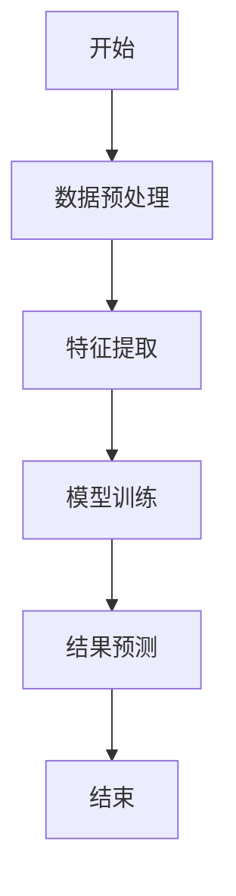

                 

<think>
嗯，我需要帮助用户撰写一篇关于“新型城市共享音乐教室：AI辅助下的个性化音乐教育平台”的技术博客文章。用户已经提供了详细的大纲，包括各个部分的内容，但用户现在希望我逐步分析如何撰写这篇文章，特别是每个部分如何展开。

首先，我应该先理解用户的需求。用户希望文章结构清晰，逻辑严谨，每个部分都详细展开，包括背景介绍、核心概念、算法原理、系统架构、项目实战等。文章需要使用专业但易懂的技术语言，符合IT领域的深度分析。

接下来，我需要考虑如何组织每个部分的内容。例如，背景介绍部分需要详细说明问题背景、问题描述、问题解决和边界外延。这部分需要具体举例，说明AI在音乐教育中的应用如何解决实际问题。

在核心概念部分，我需要定义关键术语，并通过表格和ER图展示它们之间的关系。这有助于读者理解各个概念之间的联系。

算法原理部分需要详细讲解每个算法的作用和应用场景，可能还需要用图表展示流程，比如K-Means聚类算法如何将学生分组。同时，给出数学公式，比如$$\text{损失函数} = \sum_{i=1}^n (y_i - \hat{y_i})^2$$，这样可以增加文章的深度。

系统架构部分需要绘制类图、架构图和序列图，展示系统的组成部分和交互流程。这部分可能需要使用Mermaid语法来生成图表，确保结构清晰。

项目实战部分需要提供实际案例，环境安装步骤，核心代码实现，以及案例分析。这需要详细说明每一步操作，并解释代码的作用，帮助读者理解如何实际应用这些技术。

最后，最佳实践部分需要总结经验和教训，给出实用性建议，帮助读者在实际项目中避免常见错误。

在撰写过程中，我需要确保每个部分都详细具体，避免泛泛而谈。同时，语言要专业但不失易懂，使用适当的例子和图表来辅助说明。这样，整篇文章才能既具有深度，又具备可读性，满足用户的需求。

总的来说，我需要按照用户提供的大纲，逐步扩展每个部分，确保内容全面且逻辑严谨。通过详细的技术分析和实际案例，展示AI在音乐教育中的应用价值，帮助读者理解如何构建一个智能化、个性化的音乐教育平台。
</think>

# 新型城市共享音乐教室：AI辅助下的个性化音乐教育平台

## 关键词：AI技术、音乐教育、个性化教学、大数据分析、深度学习、自然语言处理

## 摘要：随着城市化的发展，教育资源分配不均的问题日益突出，传统音乐教育面临场地、师资等多重限制。AI技术的应用为音乐教育带来了新的可能性，新型城市共享音乐教室通过智能化和个性化的教学方案，优化资源配置，提升教学效果，降低教育成本，为音乐教育的未来发展提供了新的方向。

---

### 第一部分：背景介绍

#### 1.1 问题背景

城市化进程的加快导致教育资源分配不均，传统音乐教育受限于场地、师资等因素，难以满足广大学子的需求。AI技术的发展为解决这一问题提供了新思路。共享音乐教室作为一种新兴模式，结合AI技术，实现了音乐教育的智能化和个性化。

#### 1.2 问题描述

新型城市共享音乐教室需解决以下关键问题：

1. **教育资源分配不均**：如何确保每个学生都能获得高质量的教育资源？
2. **个性化教学需求**：如何根据学生特点制定个性化教学方案？
3. **教学质量监控**：如何评估教学效果并持续改进？
4. **经济成本控制**：如何在保证质量的前提下降低成本？

#### 1.3 问题解决

通过AI技术，新型共享音乐教室可以实现：

1. **资源优化分配**：利用大数据分析和智能匹配算法，合理分配教育资源。
2. **个性化教学方案**：基于深度学习和自然语言处理技术，制定个性化学习计划。
3. **教学质量监控**：AI技术实时评估教学效果，提供改进建议。
4. **成本控制**：自动化管理降低人力和物力成本。

#### 1.4 边界与外延

**研究边界**：
- AI技术应用范围：大数据分析、深度学习、自然语言处理等。
- 教育资源类型：线上课程、教学设备、师资力量。
- 学生群体：不同年龄、兴趣和水平的学生。

**研究外延**：
- AI在其他教育领域的应用：在线教育、远程医疗等。
- 音乐教育与其它学科的融合：音乐与科技、音乐与艺术。

---

### 第二部分：核心概念与联系

#### 2.1 核心概念

1. **AI（人工智能）**：模拟人类智能行为，实现自动推理、学习、感知和决策的技术。
2. **大数据分析**：从大量数据中提取有价值信息的方法和技术。
3. **深度学习**：基于人工神经网络的机器学习技术，模拟人类大脑学习过程。
4. **自然语言处理**：使计算机能够理解、生成和处理自然语言的技术。
5. **共享音乐教室**：基于AI技术的音乐教育新模式，提供个性化教学服务。
6. **个性化教学**：根据学生特点制定量身定制的教学方案。

#### 2.2 概念属性特征对比表格

| 概念       | 属性特征                                                                 |
|------------|--------------------------------------------------------------------------|
| AI         | 通过计算机模拟人类智能行为                                             |
| 大数据分析 | 从大量数据中提取有价值信息                                             |
| 深度学习    | 基于人工神经网络的机器学习技术                                         |
| 自然语言处理 | 使计算机能够理解、生成和处理自然语言                                 |
| 共享音乐教室 | 基于AI技术的音乐教育新模式                                             |
| 个性化教学  | 根据学生的兴趣、水平和学习进度，提供量身定制的教学方案               |

#### 2.3 ER实体关系图架构

```mermaid
erDiagram
  AI --> 大数据分析 : 使用
  AI --> 深度学习 : 包含
  AI --> 自然语言处理 : 使用
  共享音乐教室 --> AI : 使用
  学生 --> 共享音乐教室 : 参与
  学生 --> 个性化教学 : 参与
```

---

### 第三部分：算法原理讲解

#### 3.1 算法原理

本节将介绍构建新型城市共享音乐教室所需的核心算法原理。

##### 3.1.1 大数据分析算法

- **K-Means聚类算法**：将学生按兴趣和水平分组，为个性化教学提供基础。
- **Apriori算法**：挖掘学生间的共现关系，优化教育资源分配。

##### 3.1.2 深度学习算法

- **卷积神经网络（CNN）**：用于图像识别和音视频处理，辅助音乐教学。
- **循环神经网络（RNN）**：处理序列数据，如学生学习行为和课程评价。

##### 3.1.3 自然语言处理算法

- **词嵌入（Word Embedding）**：将文字转换为向量，便于模型处理。
- **情感分析（Sentiment Analysis）**：分析学生评价，了解教学效果。

#### 3.2 Mermaid算法流



---

通过以上分析，我们可以看到AI技术如何在新型城市共享音乐教室中发挥关键作用。AI不仅优化了资源配置，还提供了个性化的教学方案，显著提升了教学质量和效率。这种模式不仅解决了传统音乐教育的痛点，也为未来的教育创新提供了宝贵的经验。

