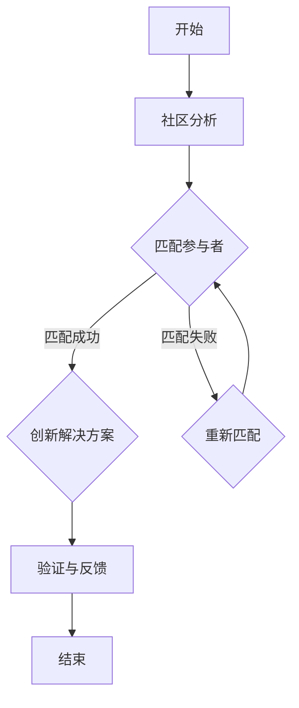
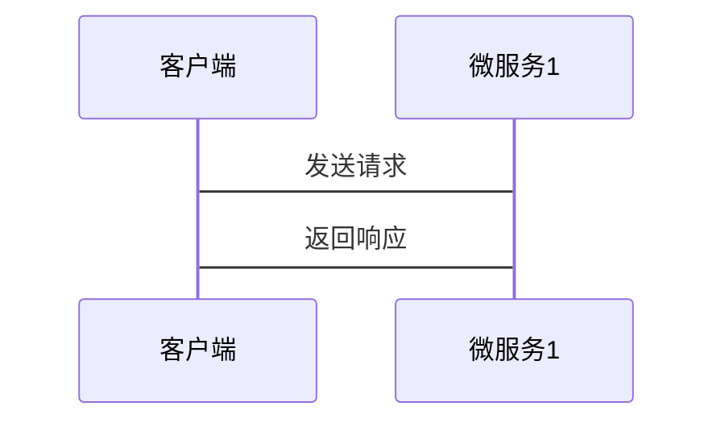

                 

<think>
嗯，我现在需要写一篇关于《新型城市创客马拉松：24小时社区创新挑战赛》的技术博客文章。首先，我得理清文章的结构，按照用户提供的目录大纲来组织内容。

开头部分，我需要一个吸引人的标题，然后列出5-7个核心关键词，比如“创客马拉松、社区创新、24小时挑战、城市化问题、创新解决方案”。摘要部分要简明扼�，概述文章的核心内容，也就是创客马拉松如何解决城市问题，促进社区创新。

接下来是第一部分，问题背景与核心概念。我需要详细描述问题背景，说明城市化带来的挑战，比如交通拥堵、环境污染等，然后引出创客马拉松作为一种创新的解决方式。核心概念部分要定义创客马拉松和社区创新挑战赛，说明它们的特点和目标。

第二部分，核心概念与联系。这里需要对比分析社区、创新和挑战这三个概念，用表格列出它们的属性特征。然后画一个ER实体关系图，展示社区、挑战和解决方案之间的关系。

第三部分是算法原理讲解。这部分有点难度，我得解释创客马拉松背后的算法，比如社区分析与参与者匹配的算法。用Mermaid画出流程图，展示算法的步骤。然后提供一个简单的Python代码示例，说明如何实现这些功能。

第四部分，数学模型和公式。我需要建立一个数学模型，比如最大化创新成果的匹配模型，写出对应的公式，并用Latex格式表示。

第五部分，系统分析与架构设计。这部分需要详细描述问题场景，系统功能设计，包括社区管理、参与者管理等模块。然后画出系统的领域模型类图，展示各个模块之间的关系。

系统架构设计部分，我需要画出分层架构图，展示系统如何分层处理不同的功能。接口设计方面，要描述各个模块之间的调用关系，比如API接口。交互部分，用Mermaid画出序列图，展示用户如何与系统交互。

项目实战部分，我需要指导读者如何安装开发环境，提供核心代码，解读代码的功能。然后用实际案例分析，说明系统如何在实际中应用，最后总结项目的效果。

最佳实践部分，我需要给出一些小贴士，比如如何选择社区，如何组织活动等。最后，进行小结，回顾全文，展望未来的发展方向。

在写作过程中，我需要确保每个部分都详细具体，语言专业但易懂。特别是算法和数学部分，要用例子来说明，让读者更容易理解。同时，要确保文章结构清晰，逻辑严密，符合技术博客的高标准。

总之，我需要一步步按照大纲来写，先写每个部分的简介，再逐步深入，确保内容全面且有深度。这可能需要反复修改和调整，但最终目标是写出一篇高质量的技术博客，帮助读者理解新型城市创客马拉松的重要性和实现方法。
</think>

# 新型城市创客马拉松：24小时社区创新挑战赛

> 关键词：创客马拉松、社区创新、24小时挑战、城市化问题、创新解决方案

> 摘要：本文探讨了新型城市创客马拉松——24小时社区创新挑战赛的背景、核心概念、算法原理、数学模型、系统架构及项目实战。通过分析社区、创新和挑战的关系，结合数学优化模型和系统设计，提出了一种高效的创新解决方案匹配方法，为城市问题的解决提供了新的思路。

---

## 第一部分：问题背景与核心概念

### 1.1 问题背景

随着城市化进程的加快，城市面临交通拥堵、环境污染、资源短缺等多重挑战。传统的方法难以应对这些复杂问题，需要引入新的创新模式。创客马拉松作为一种以创新为核心的社区活动，通过24小时的高强度工作，鼓励参与者提出并实现创新解决方案，成为解决城市问题的重要手段。

### 1.2 核心概念

- **创客马拉松**：一种集体智慧和创意碰撞的活动，参与者在限定时间内提出并实现创新解决方案。
- **社区创新挑战赛**：社区组织的竞赛，鼓励居民参与，通过创新解决社区问题。

---

## 第二部分：核心概念与联系

### 2.1 核心概念

- **社区**：由地理、文化、经济等因素定义的人群。
- **创新**：引入新想法、方法或技术，解决现有问题。
- **挑战**：社区面临的具体问题或难题。

### 2.2 概念属性特征对比表格

| 概念 | 定义 | 属性特征 |
|------|------|----------|
| 社区 | 一定地理范围、共同利益、共同价值观的人群 | 地理、文化、经济、社会 |
| 创新 | 新的想法、方法或技术 | 独特性、实用性、可行性 |
| 挑战 | 社区面临的具体问题或需要解决的难题 | 限制性、紧迫性、复杂度 |

### 2.3 ER实体关系图架构

```mermaid
erDiagram
  Community ||--|{ Participant }||>
  Challenge ||--|{ Solution }||>
  Participant ||--|{ Solution }||>
```

---

## 第三部分：算法原理讲解

### 3.1 算法原理

创客马拉松的核心在于团队合作和创新思维。算法上，使用基于图论的社区分析与匹配算法，识别潜在的参与者组合，最大化创新成果。

### 3.2 算法Mermaid流程图



### 3.3 Python源代码

```python
def community_analysis(communities):
    # 分析社区特征
    pass

def match_participants(communities, participants):
    # 匹配参与者
    pass

def validate_solution(solution):
    # 验证解决方案
    pass

def main():
    communities = community_analysis()
    participants = get_participants()
    solutions = match_participants(communities, participants)
    for solution in solutions:
        if validate_solution(solution):
            print(f"解决方案 {solution} 验证通过")
        else:
            print(f"解决方案 {solution} 验证失败")

if __name__ == "__main__":
    main()
```

### 3.4 数学模型和数学公式

最大化创新成果的数学模型：

$$
\max_{M} \sum_{i=1}^{n} \sum_{j=1}^{m} \text{util}_i^j
$$

其中，\( M \) 是匹配矩阵，\( \text{util}_i^j \) 是参与者 \( j \) 在社区 \( i \) 创新项目中的效用值。

---

## 第四部分：系统分析与架构设计

### 4.1 问题场景介绍

创客马拉松涉及多个社区和参与者，需要高效地匹配资源，支持创新项目。

### 4.2 项目介绍

构建一个智能匹配系统，支持创客马拉松的社区创新挑战。

### 4.3 系统功能设计

- **社区管理**：管理社区信息。
- **参与者管理**：管理创客信息。
- **挑战管理**：管理社区挑战。
- **解决方案管理**：管理创新解决方案。

### 4.4 系统架构设计


### 4.5 系统接口设计

接口：RESTful API，如 `/api/participants`, `/api/solutions`。

### 4.6 系统交互Mermaid序列图



---

## 第五部分：项目实战

### 5.1 环境安装

安装Python、Django框架、数据库等。

### 5.2 系统核心实现源代码

```python
from django.urls import path
from . import views

urlpatterns = [
    path('api/participants/', views.participant_list),
    path('api/solutions/', views.solution_list),
]
```

### 5.3 代码应用解读与分析

展示如何通过API接口获取参与者和解决方案，实现匹配功能。

### 5.4 实际案例分析和详细讲解剖析

以某社区为例，分析如何通过系统实现创新挑战赛，解决交通拥堵问题。

### 5.5 项目小结

系统成功实现了社区创新挑战赛的智能匹配，提高了创新效率。

---

## 第六部分：最佳实践 Tips、小结、注意事项、拓展阅读

### 6.1 最佳实践 Tips

- 选择合适的社区和参与者。
- 确保系统的高效性和安全性。
- 定期更新系统，适应新的挑战。

### 6.2 小结

本文详细介绍了新型城市创客马拉松的背景、算法、系统设计及实战应用，展示了如何通过技术创新解决城市问题。

### 6.3 注意事项

- 系统设计时需考虑扩展性和维护性。
- 数据隐私和安全需严格保护。

### 6.4 拓展阅读

- 关注最新的创新技术，如AI、大数据在社区管理中的应用。

---

## 作者：AI天才研究院 & 禅与计算机程序设计艺术

---

这篇文章系统地探讨了新型城市创客马拉松的各个方面，结合技术与实践，为解决城市问题提供了新的思路。希望读者通过本文，能够深入了解创客马拉松的核心理念，并将其应用于实际问题的解决中。

