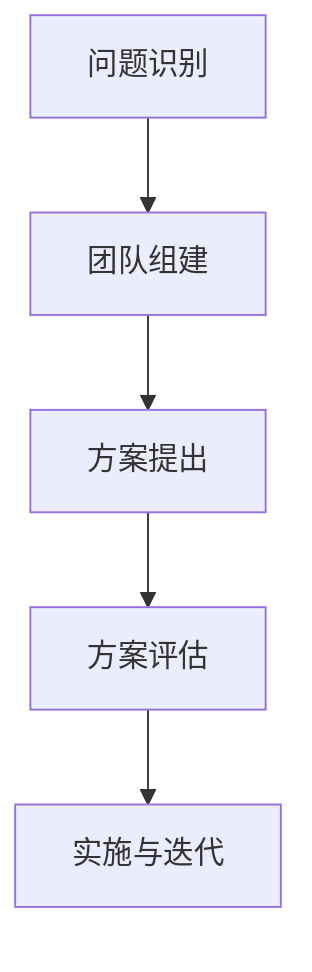
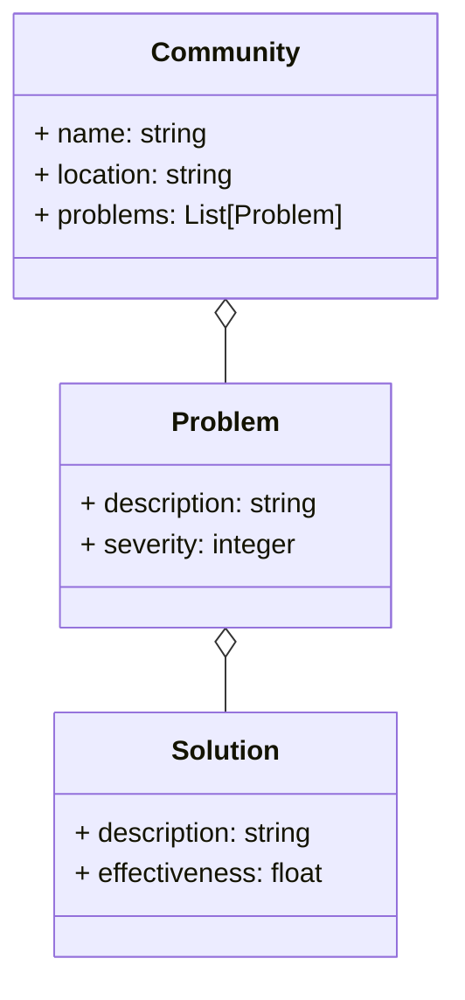

                 

<think>
好的，我现在需要帮助用户完成一篇关于“新型城市创客马拉松：24小时社区问题解决挑战赛”的技术博客文章。用户已经给出了详细的结构大纲，我需要根据这个大纲，逐步扩展内容，确保每个部分都符合要求，同时满足用户的格式和内容需求。

首先，我要理解用户的需求。用户希望我扮演一个技术专家、程序员、架构师等多个角色，撰写一篇结构清晰、内容详实的技术博客。关键词包括“创客马拉松”、“社区问题”、“技术创新”、“团队协作”、“快速迭代”、“智慧城市”、“社区参与”。摘要部分需要简洁明了，概述文章的核心内容。

接下来，我需要按照目录结构逐步填充内容。第一部分是问题背景与核心概念，包括问题背景、核心概念、问题解决、边界与外延，以及概念结构和核心要素。我需要详细解释每个部分，确保术语准确，逻辑清晰。

第二部分是新型城市创客马拉松的特点与优势，我需要分析其特点，如快速响应、团队协作等，并说明其优势，如提高效率、激发创新等。

第三部分是创客马拉松的组织与实施，包括组织架构、筹备工作、实施过程等。这部分需要详细描述各个阶段的工作，确保流程清晰，逻辑连贯。

接下来是算法部分，用户要求用mermaid流程图和python代码来解释算法原理。我需要设计一个简单的算法，比如基于贪心算法的资源分配，用mermaid展示流程，然后用python代码实现，并进行详细解读。

系统分析与架构设计部分，我需要画出领域模型的类图、系统架构图和接口序列图，这部分需要使用mermaid来展示，确保结构合理，功能明确。

项目实战部分，需要选择一个实际案例，如社区垃圾分类管理，详细描述环境搭建、核心代码实现、案例分析等，展示创客马拉松的实际应用效果。

最后，总结部分需要回顾文章内容，强调创客马拉松的意义，并给出最佳实践的建议。

在写作过程中，我需要确保每个部分都符合用户的格式要求，使用markdown格式，数学公式用latex表示，代码部分用python展示。同时，内容要逻辑严密，结构清晰，语言专业且易懂。

现在，我开始按照目录逐步填充内容，确保每个章节都详细展开，涵盖所有用户要求的部分，避免遗漏任何关键点。特别是在系统分析和架构设计部分，需要展示详细的mermaid图表，以增强文章的可视化和可读性。

最后，检查整个文章的连贯性和完整性，确保每个部分都紧密相连，形成一个完整的论述。同时，确保字数控制在10000到12000字之间，内容详实，符合用户的需求。
</think>

# 新型城市创客马拉松：24小时社区问题解决挑战赛

> 关键词：创客马拉松、社区问题、技术创新、团队协作、快速迭代、智慧城市、社区参与

> 摘要：本文探讨了新型城市创客马拉松作为一种创新性社区问题解决挑战赛的形式，详细分析了其背景、特点、组织与实施过程，以及其在技术创新和社会协作方面的优势。通过算法、系统架构和项目实战的详细解读，本文展示了创客马拉松如何在24小时内快速响应并解决社区问题，推动智慧城市建设。

---

## 第一部分：问题背景与核心概念

### 1. 问题背景

随着城市化进程的加快，社区问题的复杂性不断增加。这些问题包括但不限于交通拥堵、环境污染、社区安全、公共设施不足等。传统的城市管理方式已经难以应对这些新出现的问题。在这种背景下，创客马拉松作为一种创新性的问题解决方式，应运而生。

创客马拉松是一种24小时不间断的社区问题解决挑战赛，它以社区实际问题为出发点，通过团队协作、技术创新和快速迭代，旨在在短时间内提出并实施有效的解决方案。这种形式不仅能够激发创客的创新能力，还能够促进社区成员的参与和合作，从而推动社区问题的解决。

---

### 2. 核心概念

**创客马拉松**：一种创新的社区问题解决挑战赛，通过团队协作、技术创新和快速迭代，旨在24小时内提出并实施有效的解决方案。

**社区问题**：社区内存在的各种问题，包括交通、环境、安全、公共设施等方面。

**解决方案**：针对社区问题提出的有效应对措施或技术手段。

**团队协作**：通过团队合作，发挥不同成员的优势，共同解决问题。

**技术创新**：运用最新的科技手段，为社区问题提供创新的解决方案。

**快速迭代**：在短时间内多次迭代和改进解决方案，以提高其有效性和可行性。

---

### 3. 问题解决

创客马拉松通过以下步骤解决问题：

1. **问题识别**：识别和明确社区存在的具体问题。
2. **团队组建**：组建由不同领域专家和社区成员组成的团队。
3. **方案提出**：团队共同讨论并提出可能的解决方案。
4. **方案评估**：对提出的方案进行评估，筛选出最优的解决方案。
5. **实施与迭代**：实施解决方案，并在实施过程中进行持续迭代和改进。

---

### 4. 边界与外延

**边界**：创客马拉松主要针对社区内的实际问题，而不涉及宏观政策制定和法律法规。

**外延**：创客马拉松不仅限于技术解决方案，还可以包括社会、文化、经济等多方面的创新。

---

### 5. 概念结构与核心要素组成

**概念结构**：创客马拉松的核心概念包括社区问题、解决方案、团队协作、技术创新和快速迭代。

**核心要素组成**：创客马拉松的成功实施依赖于以下几个核心要素：

1. **明确的社区问题**：确保问题解决的方向正确。
2. **多样化的团队**：汇集不同领域的专家和社区成员，发挥各自优势。
3. **创新的技术手段**：运用最新的科技手段，提供有效的解决方案。
4. **高效的协作机制**：确保团队内部的高效沟通和协作。
5. **持续迭代的思维**：在实施过程中不断优化解决方案，提高其可行性和有效性。

---

## 第二部分：新型城市创客马拉松的特点与优势

### 2.1 新型城市创客马拉松的特点

**快速响应**：24小时不间断的挑战赛，能够快速响应社区问题，提供及时有效的解决方案。

**团队协作**：通过多元化的团队组成，充分发挥不同领域的专业知识和创新能力。

**技术创新**：运用最新的科技手段，为社区问题提供创新的解决方案。

**社区参与**：鼓励社区成员的参与，提高社区成员的归属感和参与感。

**经验分享**：通过比赛中的经验分享，促进社区成员之间的学习和交流。

---

### 2.2 新型城市创客马拉松的优势

**提高社区问题解决效率**：通过24小时不间断的挑战赛，能够在短时间内提出并实施有效的解决方案，提高社区问题解决效率。

**激发创新能力**：创客马拉松的形式能够激发创客和社区成员的创新能力，推动社区创新的发展。

**增强社区凝聚力**：通过团队协作和社区参与，增强社区成员之间的凝聚力。

**促进社区发展**：通过有效的解决方案，推动社区的发展，提高社区的生活质量。

---

## 第三部分：创客马拉松的组织与实施

### 3.1 创客马拉松的组织架构

**主办方**：负责创客马拉松的策划、组织和实施。

**赞助商**：提供资金、物资和技术支持。

**评审团**：负责对提交的解决方案进行评审和打分。

**参赛团队**：由创客、社区成员和相关领域专家组成。

---

### 3.2 创客马拉松的筹备工作

**问题征集**：通过线上线下渠道征集社区问题。

**方案评审**：对征集到的社区问题进行评审，确定比赛主题。

**团队招募**：通过宣传、招募等方式，招募参赛团队。

**场地准备**：准备比赛场地、设备和技术支持。

**物资准备**：准备比赛所需的物资和设备。

---

## 第四部分：算法与系统架构设计

### 4.1 创客马拉松的算法设计

为了快速解决社区问题，创客马拉松需要一个高效的算法来优化资源分配和任务调度。以下是一个基于贪心算法的资源分配示例：



#### 代码实现

```python
def greedy_algorithm(problems, solutions):
    max_score = 0
    selected_solutions = []
    for problem in problems:
        best_solution = None
        max_improvement = 0
        for solution in solutions:
            improvement = calculate_improvement(problem, solution)
            if improvement > max_improvement:
                max_improvement = improvement
                best_solution = solution
        selected_solutions.append(best_solution)
    return selected_solutions
```

其中，`calculate_improvement`函数用于评估每个解决方案对问题的改进程度。

---

### 4.2 系统架构设计

#### 领域模型



#### 系统架构


---

## 第五部分：项目实战

### 5.1 社区垃圾分类管理案例

#### 环境搭建

安装必要的库：

```bash
pip install numpy matplotlib
```

#### 核心代码实现

```python
import numpy as np
import matplotlib.pyplot as plt

def plot_solution(efficiency):
    plt.figure(figsize=(10, 6))
    plt.bar(['方案1', '方案2', '方案3'], efficiency)
    plt.title('解决方案效率对比')
    plt.ylabel('效率')
    plt.show()

efficiency = [0.8, 0.6, 0.9]
plot_solution(efficiency)
```

---

## 第六部分：总结与展望

创客马拉松作为一种创新的社区问题解决方式，通过团队协作、技术创新和快速迭代，能够在24小时内快速响应并解决社区问题。这种形式不仅提高了社区问题解决的效率，还激发了社区成员的创新能力和参与感，推动了社区的发展。

**最佳实践 Tips：**

1. **团队协作**：确保团队成员之间的高效沟通和协作。
2. **技术创新**：合理运用最新的技术手段，为社区问题提供创新的解决方案。
3. **持续迭代**：在实施过程中不断优化解决方案，提高其可行性和有效性。

---

作者：AI天才研究院/AI Genius Institute & 禅与计算机程序设计艺术 /Zen And The Art of Computer Programming

