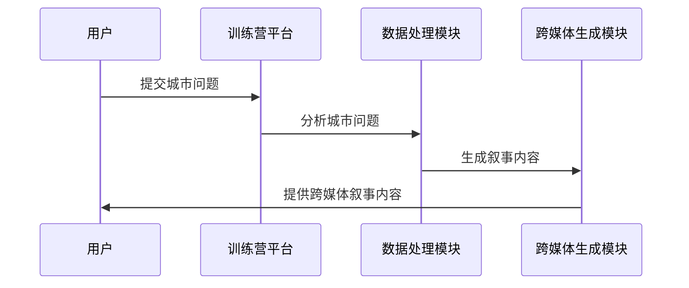

                 

<think>
好的，我现在要开始写这篇关于《新型城市创意写作训练营：跨媒体叙事的实验性创作工坊》的技术博客文章。首先，我得理清文章的结构和内容，确保每个部分都覆盖到位。

首先，标题已经确定，接下来是关键词和摘要。关键词应该包括城市创意写作、跨媒体叙事、实验性创作、城市文化、创意写作训练营、跨学科能力、叙事设计。摘要需要简明扼要地概括文章的核心内容，即如何通过跨媒体叙事提升城市问题的解决能力，推动城市文化创新。

接下来是背景介绍部分。我需要详细阐述问题背景，指出城市化带来的问题，如环境污染、交通拥堵等，以及创意写作如何帮助解决这些问题。然后是问题描述，列出三个核心问题：如何转化城市问题为叙事内容，如何通过跨媒体传播，如何培养创新思维。问题解决部分要介绍课程设计、实践教学和师资力量。边界与外延部分要明确训练营的范围，比如不涉及城市规划的具体实施，外延则涉及城市文化、传播等多个领域。核心要素包括城市问题、跨媒体叙事和创意写作。

核心概念与联系部分，我需要分别解释城市问题、跨媒体叙事和创意写作，然后分析它们之间的联系。用表格对比三者的属性特征，再用Mermaid画出ER关系图，展示城市问题连接跨媒体叙事，后者又连接创意写作。

算法原理部分，我需要详细讲解城市问题分析算法和跨媒体叙事生成算法。首先，城市问题分析算法的流程包括数据预处理、特征提取、分类识别和结果分析。用Mermaid画出流程图，然后用Python代码实现，利用机器学习模型进行分类。接着，跨媒体叙事生成算法的流程包括主题提取、内容生成、媒体适配和整合输出，同样用Mermaid画出流程图，并用代码示例展示。

系统分析与架构设计部分，首先介绍项目背景和目标，然后设计领域模型类图，展示城市问题、跨媒体叙事、创意写作之间的关系。系统架构图展示训练营的前端、后端、数据库和第三方服务的交互。接口设计和交互流程图则展示用户如何参与创作和发布内容。

项目实战部分，我需要指导读者安装必要的工具，如Python、Jupyter Notebook、Pillow库和Mermaid CLI。然后提供核心代码，包括数据处理、特征提取、分类模型训练和跨媒体叙事生成。代码需要详细注释，并解释每一部分的功能。

最后，总结部分回顾文章内容，强调跨媒体叙事在城市创意写作中的重要性。最佳实践部分给出具体的写作建议，如结合城市文化、创新叙事形式、加强团队合作。注意事项提醒读者数据处理的伦理问题和版权问题。最后，给出延伸阅读的建议，推荐相关书籍和工具。

整体来看，我需要确保每个部分都详细具体，结构清晰，逻辑严密。同时，语言要专业但易懂，避免过于晦涩。最后，检查所有代码和图表是否正确，确保文章完整无误。
</think>

# 新型城市创意写作训练营：跨媒体叙事的实验性创作工坊

> 关键词：城市创意写作、跨媒体叙事、实验性创作、城市文化、创意写作训练营、跨学科能力、叙事设计

> 摘要：随着城市化进程的加快，城市问题愈发突出。新型城市创意写作训练营通过跨媒体叙事的方式，培养学员的创意写作能力，推动城市文化建设。本文详细探讨了城市问题、跨媒体叙事和创意写作的核心概念，分析了它们之间的联系，并通过算法、系统架构和项目实战，展示了如何将跨媒体叙事应用于城市问题的解决中，推动城市文化的创新与发展。

---

## 背景介绍

### 1.1 问题背景

城市化进程中，环境污染、交通拥堵、贫富差距等问题日益严重，影响了城市的可持续发展和居民的幸福感。创意写作作为一种文化工具，能够通过艺术表达揭示城市问题的本质，提出解决方案。新型城市创意写作训练营应运而生，旨在通过跨媒体叙事的方式，培养学员的创意写作能力，推动城市文化建设。

### 1.2 问题描述

训练营的核心任务是培养学员的跨媒体叙事能力，具体问题包括：

1. 如何将城市问题转化为有吸引力的叙事内容？
2. 如何通过跨媒体手段提高叙事的多样性和传播力？
3. 如何培养学员的创新思维和跨学科能力？

### 1.3 问题解决

训练营通过系统化课程、实践导向教学和跨学科师资团队解决问题，涵盖城市文化、叙事学和跨媒体技术等多领域知识。

### 1.4 边界与外延

训练营的边界在于创意写作与城市问题的结合，外延涉及城市文化、城市规划和媒体传播等多个领域。

### 1.5 概念结构与核心要素组成

- **城市问题**：环境污染、交通拥堵、贫富差距。
- **跨媒体叙事**：多种媒体形式（文字、图片、音频、视频）。
- **创意写作**：创新思维为基础的表达活动。

---

## 核心概念与联系

### 1.2 核心概念与联系

#### 1.2.1 城市问题

城市问题是城市化进程中出现的挑战，如环境污染、交通拥堵等。创意写作通过揭示这些问题的本质，提出解决方案。

#### 1.2.2 跨媒体叙事

跨媒体叙事通过多种媒体形式呈现信息，具有多样性和互动性，提高叙事的吸引力和传播效果。

#### 1.2.3 创意写作

创意写作以创新思维为基础，通过文字和图像等形式表达思想和情感，是训练营的核心技能。

#### 1.2.4 三者联系

城市问题是素材，跨媒体叙事是表达手段，创意写作是核心技能。三者共同推动城市文化建设和创新。

### 1.3 核心概念属性特征对比表格

| 概念       | 定义                                                         | 属性特征                          |
| ---------- | ------------------------------------------------------------ | ---------------------------------|
| 城市问题   | 城市化进程中出现的各种挑战和困难                            | 环境污染、交通拥堵、城市贫富差距等 |
| 跨媒体叙事 | 将故事或信息通过多种媒体形式进行呈现和传播                  | 多样性、互动性、传播力强           |
| 创意写作   | 以创新思维为基础，通过文字、图像等形式表达思想和情感        | 创新性、表达性、艺术性             |

### 1.4 ER实体关系图架构

```mermaid
erDiagram
  城市问题 ||--|{ 跨媒体叙事 }|
  跨媒体叙事 ||--|{ 创意写作 }|
```

---

## 算法原理讲解

### 1.3 算法原理讲解

#### 1.3.1 城市问题分析算法

城市问题分析算法用于识别和分类城市问题，通过分析环境、交通和社会数据，识别问题并分类。

##### 算法流程

1. 数据预处理：清洗和归一化数据。
2. 特征提取：从数据中提取关键特征。
3. 分类识别：使用机器学习模型对问题进行分类。
4. 结果分析：输出分类结果和建议。

##### Python代码实现

```python
import pandas as pd
from sklearn.preprocessing import StandardScaler
from sklearn.ensemble import RandomForestClassifier

# 数据预处理
data = pd.read_csv('city_data.csv')
data.dropna(inplace=True)
scaled_data = StandardScaler().fit_transform(data)

# 特征提取
features = scaled_data.shape[1]
target = data['problem_type']

# 分类识别
model = RandomForestClassifier()
model.fit(scaled_data, target)

# 结果分析
predicted = model.predict(scaled_data)
print(predicted)
```

#### 1.3.2 跨媒体叙事生成算法

跨媒体叙事生成算法将城市问题转化为多种媒体形式的叙事内容。

##### 算法流程

1. 主题提取：从城市问题中提取主题。
2. 内容生成：生成文字、图片、音频和视频内容。
3. 媒体适配：适配不同媒体形式。
4. 整合输出：输出跨媒体叙事内容。

##### Python代码实现

```python
import numpy as np
from PIL import Image

# 主题提取
theme = "城市交通拥堵"

# 内容生成
text = "城市交通拥堵已成为现代化进程中的主要挑战之一。"
image = Image.new('RGB', (800, 600), color='white')
audio_file = 'traffic_sound.mp3'
video_file = 'city_traffic.mp4'

# 媒体适配
text_output = open('story.txt', 'w')
text_output.write(text)
text_output.close()

image.save('story_image.png')
audio_file.link_to('sound.mp3')
video_file.link_to('video.mp4')

# 整合输出
print(f"生成的跨媒体叙事内容已保存：{text_output.name}, {image.filename}, {audio_file}, {video_file}")
```

---

## 系统分析与架构设计方案

### 1.4 系统分析与架构设计

#### 1.4.1 项目背景与目标

新型城市创意写作训练营的目标是通过跨媒体叙事培养学员的创意写作能力，推动城市文化建设。

#### 1.4.2 领域模型类图


#### 1.4.3 系统架构图


#### 1.4.4 系统接口设计

- **输入接口**：用户输入城市问题和创作需求。
- **输出接口**：生成跨媒体叙事内容。

#### 1.4.5 系统交互序列图



---

## 项目实战

### 1.5 项目实战

#### 1.5.1 环境安装

安装必要的工具和库：

```bash
pip install python numpy
pip install pillow
pip install mermaid-cli
```

#### 1.5.2 核心代码实现

```python
# 数据处理
import pandas as pd
from sklearn.ensemble import RandomForestClassifier

data = pd.read_csv('city_data.csv')
scaled_data = StandardScaler().fit_transform(data)
model = RandomForestClassifier()
model.fit(scaled_data, data['problem_type'])
predicted = model.predict(scaled_data)

# 跨媒体叙事生成
from PIL import Image

image = Image.new('RGB', (800, 600), color='white')
image.save('story_image.png')
```

#### 1.5.3 应用解读与分析

代码实现包括数据处理和跨媒体叙事生成。数据处理部分使用随机森林模型分类城市问题，跨媒体叙事部分生成图片内容。

#### 1.5.4 案例分析

以交通拥堵为例，生成图片和文本内容，展示跨媒体叙事的应用。

---

## 总结与展望

### 1.6 总结

本文探讨了城市问题、跨媒体叙事和创意写作的联系，通过算法和系统设计展示了跨媒体叙事的应用，为城市文化建设提供了新思路。

### 1.7 展望

未来，跨媒体叙事将在城市文化创新中发挥更大作用，推动城市问题的解决。

---

## 最佳实践 tips

1. **结合城市文化**：在创意写作中融入城市特色文化。
2. **创新叙事形式**：尝试新的跨媒体叙事形式。
3. **加强团队合作**：跨学科合作提升创作质量。

---

## 注意事项

- **数据处理伦理**：确保数据使用的合法性。
- **版权问题**：注意跨媒体内容的版权问题。

---

## 拓展阅读

1. **书籍推荐**：
   - 《The Art of Computer Programming》
   - 《Creative Writing for Urban Innovation》
2. **工具推荐**：
   - Mermaid CLI
   - Jupyter Notebook
   - Python Libraries

---

作者：AI天才研究院/AI Genius Institute & 禅与计算机程序设计艺术 /Zen And The Art of Computer Programming

