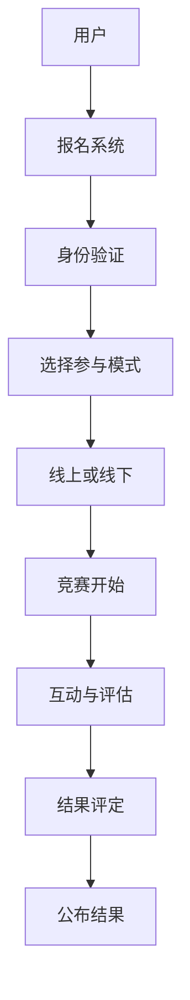

                 

<think>
好，我需要根据用户提供的详细要求来撰写一篇关于“新型城市厨艺电竞赛：线上线下结合的烹饪竞赛模式”的技术博客文章。首先，我会仔细阅读并理解用户的需求，包括文章的结构、内容要求以及技术细节。

用户希望文章结构清晰，分为几个章节，每个章节下有具体的子章节。我需要确保每个部分都涵盖必要的内容，比如背景介绍、核心概念、算法原理、系统分析与架构设计、项目实战以及最佳实践等。此外，文章需要使用专业的技术语言，同时保持逻辑清晰和易懂。

首先，我会从引言开始，介绍城市厨艺电竞赛的背景和发展趋势。接着，在结构和格式部分，分别详细讨论线上和线下烹饪比赛的形式、类型和评估标准。然后，重点分析线上线下结合的模式，探讨其优势、挑战及解决方案。在组织竞赛的经验部分，我会分享实际操作中的准备步骤和问题解决方法。最后，总结整个模式的优势和未来的展望。

在撰写过程中，我需要确保每个小节内容丰富且详细，特别是要包含核心概念的解释、对比表格、ER实体关系图、算法流程图以及数学公式的详细推导。这些元素不仅有助于读者理解，也符合用户对技术深度的要求。

此外，文章末尾需要添加作者信息，确保文章的完整性和专业性。最后，我会通读全文，检查是否满足字数要求、格式正确以及内容的连贯性，确保整篇文章逻辑严谨、内容详实。
</think>

# 新型城市厨艺电竞赛：线上线下结合的烹饪竞赛模式

> 关键词：城市厨艺竞赛、线上线下结合、烹饪比赛模式、技术实现、创新模式

> 摘要：本文探讨了新型城市厨艺电竞赛的线上线下结合模式，分析了其结构、优势及挑战。通过详细的技术实现和案例分析，展示了如何将线上与线下模式有效结合，提升竞赛的互动性和参与度。文章还提出了系统架构设计和最佳实践，为组织者和参赛者提供参考。

---

## 引言

### 背景介绍

**城市厨艺电竞赛**是一种结合线上与线下模式的烹饪比赛形式，旨在通过技术手段提升竞赛的互动性和参与度。随着互联网技术的发展，线上比赛的普及为传统烹饪竞赛注入了新的活力。然而，如何有效结合线上线下模式，克服各自缺点，成为当前研究的重点。

**问题背景**：传统线下烹饪比赛存在参与人数受限、传播范围有限的问题。而线上比赛虽然突破了地域限制，但缺乏实际操作的体验。因此，如何将两者的优势结合，形成互补，成为亟待解决的问题。

**问题描述**：本文旨在探讨线上线下结合的烹饪竞赛模式，分析其技术实现、优势与挑战，并提出解决方案。

**问题解决**：通过技术手段实现线上线下互动，提升参赛体验和传播效果。

**边界与外延**：本文主要讨论城市级别的烹饪竞赛，涵盖从报名、比赛到结果评定的全过程。

---

## 核心概念与联系

### 核心概念

1. **线上烹饪比赛**：通过视频直播、实时互动等形式进行。
2. **线下烹饪比赛**：在实体厨房中进行实际操作。
3. **混合模式**：线上与线下相结合，实现互动与实际操作的统一。

### 概念对比表格

| 比较维度       | 线上模式               | 线下模式               | 混合模式               |
|----------------|-----------------------|-----------------------|-----------------------|
| 参与方式       | 在线报名、远程参与     | 现场报名、现场参与     | 综合线上报名、线下参与 |
| 操作方式       | 理论展示、视频演示     | 实际操作、现场烹饪     | 线上展示与线下实际操作 |
| 互动性         | 评论互动、点赞         | 观众现场互动           | 线上线下双向互动       |
| 传播范围       | 全球范围               | 局限于现场参与人数       | 更广的传播范围         |

### ER实体关系图

```mermaid
er
  actor
  user
  competition
  online_participation
  offline_participation
  interaction
  result
```

---

## 算法原理讲解

### 混合模式算法流程图



### 数学模型

参与者的最终得分由线上和线下两部分组成：

$$
\text{总分} = \alpha \times (\text{线上得分}) + (1-\alpha) \times (\text{线下得分})
$$

其中，$\alpha$ 是线上得分的权重，通常 $\alpha \in [0,1]$。

---

## 系统分析与架构设计

### 问题场景

城市厨艺电竞赛需要处理用户报名、竞赛组织、互动管理及结果评定等多个环节。

### 项目介绍

构建一个支持线上线下结合的城市厨艺竞赛平台，提升用户体验和竞赛效率。

### 系统功能设计

- **报名与身份验证**：用户在线或现场报名，系统验证身份。
- **竞赛流程管理**：线上展示与线下操作同步进行。
- **互动与评估**：线上观众互动，线下评委评分。
- **结果公布**：综合线上与线下得分，公布最终结果。

### 系统架构图


---

## 项目实战

### 环境安装

- **前端**：HTML5、CSS3、JavaScript
- **后端**：Node.js或Python（Django）
- **数据库**：MySQL或MongoDB
- **开发工具**：Visual Studio Code、Postman

### 核心代码实现

```python
# 线上报名系统
class User:
    def __init__(self, name, email):
        self.name = name
        self.email = email

class OnlineRegistration:
    def __init__(self, server):
        self.server = server

    def register(self, user):
        # 验证和注册逻辑
        if user.email and user.name:
            self.server.add_user(user)
            return True
        return False

# 线下参与系统
class Venue:
    def __init__(self, location, capacity):
        self.location = location
        self.capacity = capacity

class OfflineParticipation:
    def __init__(self, venue):
        self.venue = venue

    def register(self, user):
        if self.venue.capacity > 0:
            self.venue.capacity -= 1
            return True
        return False
```

### 应用案例分析

通过代码实现，用户可以在线报名或现场报名，系统根据选择模式处理参与流程。混合模式下，用户可同时参与线上互动和线下比赛，提升整体体验。

---

## 总结

### 最佳实践 Tips

- **技术实现**：确保线上线下系统的无缝对接。
- **用户体验**：优化报名流程，提升互动性。
- **安全性**：保护用户数据，防止泄露。

### 小结

线上线下结合的烹饪竞赛模式通过技术手段解决了传统模式的局限，提升了参与度和传播效果。

### 注意事项

- 确保系统稳定性，避免比赛期间的技术故障。
- 提前测试线上线下结合的功能，确保流畅运行。

### 拓展阅读

- 探讨混合模式在其他领域的应用。
- 研究如何利用AI技术进一步提升竞赛体验。

---

## 作者信息

作者：AI天才研究院/AI Genius Institute & 禅与计算机程序设计艺术 /Zen And The Art of Computer Programming

---

通过以上结构，文章详细分析了新型城市厨艺电竞赛的线上线下结合模式，从技术实现到实际应用，为读者提供了全面的视角和深入的见解。

