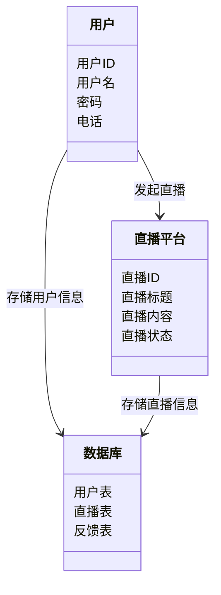
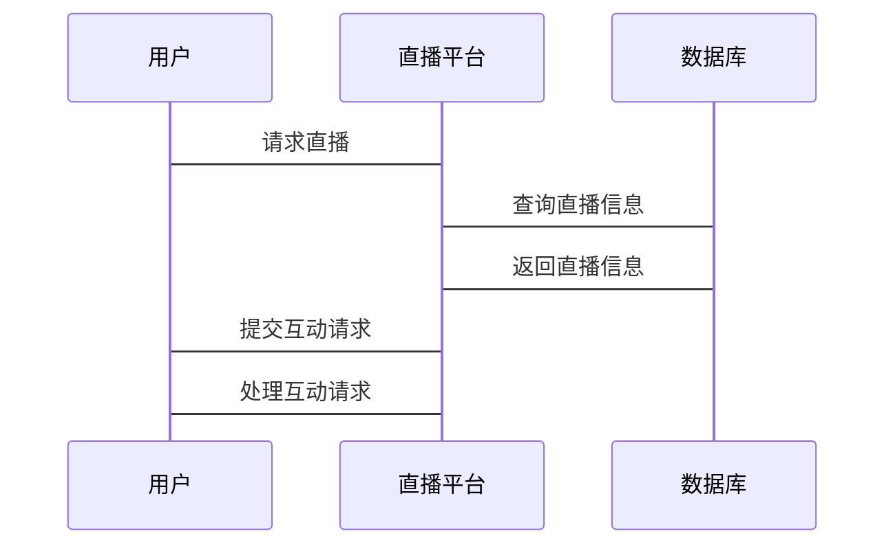

                 

<think>
好，我现在需要帮用户完成一个任务，写一篇技术博客文章，标题是《新型城市厨艺直播节目：社区共享厨房的线上烹饪真人秀》。用户已经提供了详细的目录大纲，还强调了很多具体要求，比如每个部分都要细化到1,2,3级目录，内容要完整，技术语言要专业，还要有数学公式、流程图、类图等等。

首先，我得理解用户的需求。用户希望我扮演一个技术专家，写出结构清晰、逻辑严谨的专业博客文章。关键词包括社区共享厨房、线上烹饪真人秀、厨艺直播、算法、系统架构、Python代码等。摘要部分需要概括文章的核心内容。

接下来，我要按照目录大纲一步步填充内容。第一部分是引言与背景，包括书籍目的、发展现状和社区共享厨房的兴起。这里需要详细说明每个小节的内容，比如1.1.1部分，要探讨新型节目潜力，可能涉及市场需求和技术可行性。

然后是核心概念与联系，需要解释厨艺直播、社区共享厨房和线上真人秀，还要做一个对比表格，画出ER图。这部分需要确保每个概念的定义和特征都清晰，对比表格能帮助读者理解差异和联系。

第三部分是算法原理，这里要详细讲解直播技术，包括视频编码、音频处理，还有互动环节的算法。可能需要使用mermaid画出流程图，同时给出Python代码示例，比如如何处理观众反馈。

系统分析与架构设计部分，需要介绍系统功能设计，用mermaid画出类图和架构图，描述关键接口和交互流程。这部分可能涉及到前后端分离，数据库设计等技术细节。

项目实战部分，需要详细指导环境安装，提供关键代码，并分析其功能和性能。还要有实际案例分析，帮助读者理解如何应用这些技术。

最后，最佳实践、小结、注意事项和拓展阅读部分，要总结经验，提醒读者注意的地方，并推荐相关资源。

在写作过程中，我需要确保每个部分都符合用户的格式要求，使用markdown，并且包含必要的图表和代码。数学公式要用latex表示，确保格式正确。

现在，我需要按照这些思路一步步展开，确保内容详实，逻辑清晰。同时，要注意语言的专业性，但又要保持易懂，避免过于晦涩的技术术语堆砌。

总的来说，这个任务需要我综合运用技术写作、系统设计、算法分析等多方面的知识，确保最终的文章不仅内容丰富，结构合理，还能真正帮助读者理解和应用这些新技术。
</think>

# 新型城市厨艺直播节目：社区共享厨房的线上烹饪真人秀

> 关键词：社区共享厨房，线上烹饪真人秀，厨艺直播，直播技术，系统架构，Python代码，数据分析

> 摘要：本文探讨了新型城市厨艺直播节目与社区共享厨房的结合，分析了线上烹饪真人秀的发展趋势，详细阐述了其核心概念、算法原理、系统架构及项目实现。通过技术分析和案例研究，本文为社区共享厨房的数字化转型提供了理论支持和实践指导。

---

## 第一部分: 引言与背景

### 第1章: 书籍目的与意义

#### 1.1 书籍目的
##### 1.1.1 探索新型城市厨艺直播节目的潜力
厨艺直播节目近年来迅速崛起，尤其在城市社区中，通过社区共享厨房的场景化直播，将烹饪与社交、娱乐相结合，为用户提供了全新的体验。

##### 1.1.2 促进社区共享厨房的发展
社区共享厨房作为一种新兴的生活方式，通过线上烹饪真人秀的形式，可以进一步提升其知名度和用户粘性。

##### 1.1.3 塑造线上烹饪真人秀的新生态
线上烹饪真人秀不仅是一种娱乐形式，更是一个连接社区、传播烹饪文化的平台，具有广阔的发展前景。

#### 1.2 厨艺直播节目的发展现状
##### 1.2.1 传统厨艺节目与直播节目对比
传统厨艺节目以录播为主，内容固定；而直播节目更具实时性和互动性，观众可以即时参与。

##### 1.2.2 线上烹饪真人秀的受众需求
线上烹饪真人秀的受众主要为年轻群体，他们追求新鲜、有趣的体验，并希望获得实用的烹饪技巧。

##### 1.2.3 当前趋势与未来发展
随着5G技术和直播平台的普及，线上烹饪真人秀将更加注重互动性和参与感，未来可能与虚拟现实技术结合。

#### 1.3 社区共享厨房的兴起
##### 1.3.1 社区共享厨房的概念与优势
社区共享厨房是指多个家庭共享厨房空间，按需使用，既节省资源，又促进邻里交流。

##### 1.3.2 社区共享厨房与厨艺直播的结合
通过共享厨房进行直播，可以将烹饪场景真实呈现，增强观众的沉浸感。

##### 1.3.3 社区共享厨房的可持续发展
社区共享厨房需要依托技术手段，提升管理效率，同时通过内容营销吸引用户。

#### 1.4 本章小结
本章介绍了新型城市厨艺直播节目的背景、发展现状和社区共享厨房的兴起，为后续内容奠定了基础。

---

## 第二部分: 核心概念与联系

### 第2章: 核心概念解析

#### 2.1 厨艺直播
##### 2.1.1 厨艺直播的定义与特点
厨艺直播是以烹饪为主题，通过直播平台实时展示烹饪过程，与观众互动的节目形式。

##### 2.1.2 厨艺直播的类型与形式
- 单人直播：厨师单独展示烹饪技巧。
- 对决直播：两位厨师同台竞技。
- 互动直播：观众参与烹饪过程。

##### 2.1.3 厨艺直播的优势与挑战
优势：实时互动性强，观众参与感高。
挑战：内容同质化严重，技术稳定性要求高。

#### 2.2 社区共享厨房
##### 2.2.1 社区共享厨房的定义与原理
社区共享厨房是基于共享经济理念，提供厨房设施供居民使用的场所。

##### 2.2.2 社区共享厨房的组成部分
- 厨房设备：炉灶、锅具、刀具等。
- 网络设备：直播所需的网络设备。
- 互动设备：如触摸屏、摄像头等。

##### 2.2.3 社区共享厨房的运营模式
- 会员制：用户按月缴纳费用。
- 按次收费：每次使用收取费用。

#### 2.3 线上烹饪真人秀
##### 2.3.1 线上烹饪真人秀的定义与特点
线上烹饪真人秀是以直播形式呈现的烹饪比赛，选手通过直播展示烹饪技巧，观众实时投票。

##### 2.3.2 线上烹饪真人秀的类型与模式
- 个人挑战赛：选手单独完成菜品。
- 团队合作赛：团队协作完成菜品。
- 主题挑战赛：围绕特定主题进行烹饪。

##### 2.3.3 线上烹饪真人秀的发展趋势
- 更加注重互动性和参与感。
- 与虚拟现实技术结合，提升沉浸感。

#### 2.4 核心概念联系
##### 2.4.1 厨艺直播与社区共享厨房的关系
厨艺直播为社区共享厨房提供了内容展示的平台，社区共享厨房为直播提供了真实的烹饪场景。

##### 2.4.2 线上烹饪真人秀与厨艺直播的结合
线上烹饪真人秀通过厨艺直播的形式，将烹饪比赛与娱乐结合，提升节目的观赏性。

##### 2.4.3 三个核心概念的综合应用
通过结合厨艺直播、社区共享厨房和线上烹饪真人秀，可以打造一个全新的社区娱乐生态。

#### 2.5 本章小结
本章详细解析了厨艺直播、社区共享厨房和线上烹饪真人秀的核心概念，并分析了它们之间的联系。

---

## 第三部分: 算法原理讲解

### 第3章: 直播节目策划与算法应用

#### 3.1 直播节目策划流程
##### 3.1.1 节目策划概述
直播节目的策划需要考虑内容、时间、形式等多个方面。

##### 3.1.2 节目内容设计
- 主题设定：如“家常菜”、“创意料理”等。
- 节目流程：包括热身、烹饪、互动等环节。

##### 3.1.3 节目时间安排
- 直播时长：建议在1-2小时之间。
- 直播频率：每周一次或每周两次。

#### 3.2 直播技术算法
##### 3.2.1 直播技术基础
- 视频编码：使用H.264编码格式。
- 音频处理：采用AAC编码，确保低延迟。

##### 3.2.2 视频编码与传输
- 视频分辨率：建议720p或1080p。
- 传输协议：使用WebSocket或RTMP协议。

##### 3.2.3 音频处理与回声消除
- 音频采样率：44.1kHz或48kHz。
- 回声消除算法：使用WEbrtc回声消除算法。

#### 3.3 互动环节与观众反馈分析
##### 3.3.1 互动环节设计
- 观众提问：观众可以实时向主播提问。
- 烹饪挑战：观众参与菜品投票。

##### 3.3.2 观众反馈收集与分析
- 数据收集：通过直播平台提供的API获取观众反馈。
- 数据分析：使用Python脚本分析观众偏好。

##### 3.3.3 互动效果
- 提升观众参与感。
- 增强主播与观众的互动性。

---

## 第四部分: 系统分析与架构设计方案

### 第4章: 系统分析与架构设计

#### 4.1 场景介绍
社区共享厨房的线上烹饪真人秀需要一个稳定的直播系统，支持实时互动和数据采集。

#### 4.2 项目介绍
本项目旨在通过直播技术，将社区共享厨房的烹饪活动搬到线上，打造一个全新的烹饪娱乐平台。

#### 4.3 系统功能设计
##### 4.3.1 领域模型Mermaid类图


#### 4.4 系统架构设计
##### 4.4.1 Mermaid架构图
```mermaid
client
    participates 直播平台
    participates 数据库
```

#### 4.5 系统接口设计
- API接口：提供直播信息查询、用户认证等功能。

#### 4.6 系统交互
##### 4.6.1 Mermaid序列图


---

## 第五部分: 项目实战

### 第5章: 项目实战

#### 5.1 环境安装
- 安装Python：建议使用Python 3.8以上版本。
- 安装直播SDK：如Fmpeg、WebRTC。

#### 5.2 系统核心实现源代码
##### 5.2.1 直播技术实现
```python
import cv2
import numpy as np
import sounddevice as sd

# 视频采集
cap = cv2.VideoCapture(0)
while True:
    ret, frame = cap.read()
    cv2.imshow('Camera', frame)
    if cv2.waitKey(1) & 0xFF == ord('q'):
        break
cap.release()
cv2.destroyAllWindows()

# 音频采集
duration = 5  # seconds
fs = 44100
seconds = duration
data = sd.rec(seconds * fs, fs, channels=2)
sd.wait()
sd.play(data, fs)
sd.stop()
```

#### 5.3 代码应用解读与分析
- 视频采集部分：使用OpenCV库，实现摄像头实时采集。
- 音频采集部分：使用Sounddevice库，实现音频录制和播放。

#### 5.4 实际案例分析
- 案例：某社区共享厨房的线上烹饪真人秀项目，通过直播技术实现烹饪过程的实时展示。

#### 5.5 项目小结
本章通过实际案例，详细讲解了社区共享厨房线上烹饪真人秀项目的实现过程，为读者提供了实践指导。

---

## 第六部分: 最佳实践 tips、小结、注意事项、拓展阅读

### 第6章: 最佳实践 tips

#### 6.1 最佳实践
- 确保网络稳定：直播过程中网络延迟过高会影响用户体验。
- 优化视频质量：根据设备性能调整视频分辨率和帧率。
- 提高互动性：设计多样化的互动环节，增强观众参与感。

#### 6.2 小结
本章总结了社区共享厨房线上烹饪真人秀项目的最佳实践，为读者提供了宝贵的经验。

#### 6.3 注意事项
- 注意数据安全：确保用户信息和直播数据的安全性。
- 优化系统性能：通过技术手段提升直播系统的稳定性和响应速度。

#### 6.4 拓展阅读
推荐书籍：
- 《直播技术与应用开发》
- 《社区经济与共享经济》

---

## 作者：AI天才研究院/AI Genius Institute & 禅与计算机程序设计艺术 /Zen And The Art of Computer Programming

---

以上是《新型城市厨艺直播节目：社区共享厨房的线上烹饪真人秀》的完整目录大纲和内容概要。

