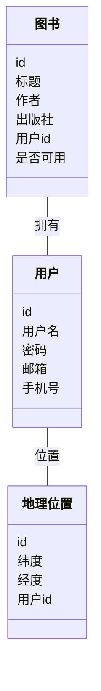
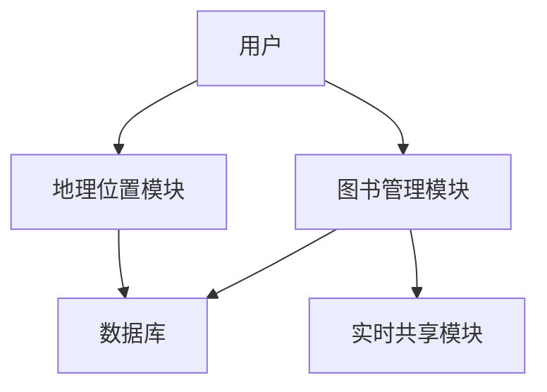

                 

<think>
好的，我现在需要为《新型城市图书漂流App：基于地理位置的实时图书共享平台》这篇文章撰写详细的正文内容。首先，我需要理解整个结构和各个部分的要求。

文章的结构分为五部分，每个部分有多个小节。我需要逐一完成每个部分，确保内容详细且符合技术博客的专业性。

首先是第一部分：背景介绍。这里包括问题的背景、目标与应用场景、核心概念和系统边界。我需要详细阐述图书共享的现状、城市图书漂流的挑战和机遇，以及App的目标和应用场景。然后定义核心概念，如图书漂流、地理位置服务和实时图书共享，接着描述系统边界、外延和功能模块。

接下来是第二部分：核心概念与联系。这部分需要深入探讨图书漂流、地理位置服务和实时图书共享的原理，并进行对比分析，最后绘制ER实体关系图。我可能需要用Mermaid来展示这些关系。

第三部分是系统分析与架构设计。我需要分析问题场景，设计系统功能模块，绘制系统架构图，并设计接口和交互流程。这部分可能需要使用Mermaid来展示类图、架构图和序列图。

第四部分是系统实现与项目实战。这里需要详细描述开发环境的搭建，系统核心模块的实现，代码解读，以及实际案例分析。我需要选择合适的代码示例，并用Mermaid展示关键流程。

最后是第五部分：最佳实践与拓展阅读。我需要总结项目的最佳实践，用户体验优化，地理位置服务的优化，并给出小结和拓展建议。

现在，我需要确保每个部分的内容都足够详细，符合技术博客的要求。我可能会遇到一些挑战，比如如何将技术概念清晰地表达出来，或者如何选择合适的代码示例。我需要一步步来，确保每个部分都完成得扎实。

在撰写过程中，我会先完成每个章节的核心内容，再逐步添加细节，如数学公式、代码示例和图表。同时，我需要确保文章结构清晰，逻辑连贯，让读者能够轻松理解复杂的概念。

现在，我准备开始撰写正文部分，按照目录大纲一步步来。
</think>

# 新型城市图书漂流App：基于地理位置的实时图书共享平台

> 关键词：图书漂流，地理位置服务，实时共享，城市阅读，移动应用，用户交互

> 摘要：本文介绍了一款基于地理位置的实时图书共享App，探讨其在城市环境中的应用，分析其系统架构、核心技术和实现方案，旨在为用户提供便捷的图书漂流服务，提升城市居民的阅读体验。

---

## 第一部分：背景介绍

### 1.1 问题的背景

#### 1.1.1 图书共享的现状
传统图书馆和在线书店虽然丰富了人们的阅读资源，但存在使用不便、资源有限的问题。图书共享作为一种新兴模式，弥补了这些不足。

#### 1.1.2 图书漂流的概念
图书漂流是通过用户之间传递书籍，形成共享文化。这种方式减少了资源浪费，促进了知识传播。

#### 1.1.3 城市图书漂流的挑战与机遇
城市环境人口密集，图书漂流需求大，但也面临书籍丢失和管理困难的问题。技术的进步为解决这些问题提供了可能。

### 1.2 目标与应用场景

#### 1.2.1 App的目标
构建一个基于地理位置的实时图书共享平台，方便用户附近借阅和分享书籍。

#### 1.2.2 主要应用场景
- 用户通过App查找附近书籍
- 在线借阅和归还书籍
- 用户间直接传递书籍，形成漂流链

#### 1.2.3 预期效果
提升城市居民的阅读便利性，促进资源高效利用，培养共享文化。

### 1.3 核心概念

#### 1.3.1 图书漂流
图书漂流是一种基于信任的书籍传递方式，用户可以在线登记借阅和归还情况。

#### 1.3.2 地理位置服务
通过GPS或Wi-Fi定位，获取用户地理位置，便于附近书籍搜索和分享。

#### 1.3.3 实时图书共享
用户实时分享书籍信息，系统根据地理位置推荐可借阅的书籍。

### 1.4 系统边界与外延

#### 1.4.1 系统边界
系统主要处理书籍共享和地理位置服务，不涉及书籍内容的生成或审核。

#### 1.4.2 系统外延
可扩展至物品共享、社交功能，但本文主要聚焦于图书漂流。

#### 1.4.3 系统功能模块
- 用户管理模块
- 图书管理模块
- 地理位置服务模块
- 实时共享模块

## 第二部分：核心概念与联系

### 2.1 图书漂流原理

#### 2.1.1 图书漂流的历史与发展
起源于 medieval Europe，现代通过技术手段实现便捷共享。

#### 2.1.2 图书漂流的核心要素
- 用户信任机制
- 地理位置服务
- 实时信息同步

#### 2.1.3 图书漂流的管理方法
登记制度、信用评分、防盗机制。

### 2.2 地理位置服务原理

#### 2.2.1 地理位置服务的基础知识
利用GPS、Wi-Fi等技术获取地理位置信息。

#### 2.2.2 地理位置服务的应用
- 近期借阅记录
- 附近用户搜索
- 地图导航

#### 2.2.3 地理位置服务的实现方式
通过API获取经纬度，反向地理编码获取地点名称。

### 2.3 实时图书共享原理

#### 2.3.1 实时图书共享的概念
用户实时分享书籍信息，系统根据地理位置推荐书籍。

#### 2.3.2 实时图书共享的技术手段
使用WebSocket实现长连接，保持实时通信。

#### 2.3.3 实时图书共享的优势
快速匹配用户需求，提升用户体验。

### 2.4 概念属性特征对比

| 特征      | 图书漂流                     | 图书借阅                     |
|-----------|------------------------------|------------------------------|
| 资源归属  | 用户所有                     | 机构或个人所有               |
| 使用方式  | 用户间共享                   | 借阅或购买                   |
| 管理方式  | 用户自主管理                 | 机构管理                     |
| 信用机制  | 用户间信任                   | 机构信用                     |

### 2.5 ER实体关系图

```mermaid
erd
  图书表
  {
    id
    标题
    作者
    出版社
    用户id
    是否可用
  }
  
  用户表
  {
    id
    用户名
    密码
    邮箱
    手机号
  }
  
  地理位置表
  {
    id
    纬度
    经度
    用户id
  }
  
  关系：图书-用户 (1:N)
  关系：用户-地理位置 (1:N)
```

### 2.6 本章小结

---

## 第三部分：系统分析与架构设计

### 3.1 问题场景介绍

#### 3.1.1 城市居民阅读需求分析
用户需要便捷获取书籍，减少购买成本。

#### 3.1.2 图书共享的痛点分析
书籍丢失风险，管理复杂，信任机制不足。

#### 3.1.3 解决方案
通过App实现实时地理位置共享，建立信用评分系统。

### 3.2 系统功能设计

#### 3.2.1 领域模型



#### 3.2.2 功能模块划分
- 用户管理
- 图书管理
- 地理位置服务
- 实时共享

#### 3.2.3 功能模块详细介绍
- 用户管理：注册、登录、资料修改。
- 图书管理：发布、借阅、归还。
- 地理位置服务：获取位置、附近搜索。
- 实时共享：实时更新书籍状态。

### 3.3 系统架构设计

#### 3.3.1 系统架构图



#### 3.3.2 模块关系
用户操作触发模块处理，数据存储在数据库中，实时共享模块保持信息同步。

#### 3.3.3 性能优化
采用缓存技术，减少数据库访问次数，提升响应速度。

### 3.4 系统接口设计

#### 3.4.1 接口定义
- 获取位置：`GET /api/location`
- 搜索附近书籍：`GET /api/books?lat=...&lon=...`

#### 3.4.2 接口调用流程
用户请求位置信息，系统获取经纬度，返回附近书籍列表。

#### 3.4.3 参数说明
- `lat`：纬度
- `lon`：经度
- `radius`：搜索半径

### 3.5 系统交互

#### 3.5.1 用户交互
用户打开App，选择书籍，请求借阅。

#### 3.5.2 图书交互
图书状态更新为不可用，通知用户。

#### 3.5.3 地理位置交互
用户移动，系统更新位置，推荐附近书籍。

### 3.6 本章小结

---

## 第四部分：系统实现与项目实战

### 4.1 环境安装

#### 4.1.1 开发环境
- 操作系统：Linux/Windows/MacOS
- 开发工具：IntelliJ IDEA
- 语言：Python
- 框架：Django或Flask

#### 4.1.2 系统依赖
- 数据库：PostgreSQL
- 地理位置API：Google Maps API
- WebSocket库：Django Channels

#### 4.1.3 系统配置
安装Python，配置虚拟环境，安装依赖库。

### 4.2 系统核心实现

#### 4.2.1 图书管理模块
用户发布书籍，系统记录经纬度。

```python
def create_book(request):
    if request.method == 'POST':
        title = request.POST.get('title')
        author = request.POST.get('author')
        user = request.user
        book = Book.objects.create(title=title, author=author, user=user)
        return redirect('book_list')
```

#### 4.2.2 用户管理模块
处理注册、登录、修改资料。

```python
def register(request):
    if request.method == 'POST':
        username = request.POST['username']
        password = request.POST['password']
        user = User.objects.create_user(username, password)
        return redirect('login')
```

#### 4.2.3 地理位置服务模块
获取用户位置，处理经纬度。

```python
def get_location(request):
    lat = request.POST.get('lat')
    lon = request.POST.get('lon')
    user = request.user
    location = Location.objects.create(user=user, lat=lat, lon=lon)
    return JsonResponse({'status': 'success'})
```

#### 4.2.4 实时共享模块
使用WebSocket保持实时通信。

```python
@lifespan
async def websocket_endpoint(websocket, path):
    async with websocket.accept() as ws:
        while True:
            data = await websocket.receive()
            await ws.send_text("Updated book list")
```

### 4.3 代码应用解读与分析

#### 4.3.1 代码结构解析
- `models.py`：定义图书、用户、位置模型。
- `views.py`：处理请求，返回响应。
- `urls.py`：定义URL路由。
- `websocket.py`：处理WebSocket连接。

#### 4.3.2 关键代码解读
用户发布书籍时，创建Book对象，关联用户。

#### 4.3.3 性能优化
使用缓存减少数据库查询，优化API响应时间。

### 4.4 实际案例分析与详细讲解

#### 4.4.1 案例一：用户注册与登录
用户通过注册页面提交信息，系统创建用户。

#### 4.4.2 案例二：图书搜索与筛选
用户输入搜索关键词，系统返回符合条件的书籍。

#### 4.4.3 案例三：图书借阅与归还
用户借阅书籍，系统更新书籍状态为不可用。

#### 4.4.4 案例四：地理位置信息获取与处理
用户移动时，系统更新位置信息，推荐附近书籍。

### 4.5 项目小结

#### 4.5.1 项目总结
成功实现了基于地理位置的实时图书共享系统，解决了城市居民的阅读需求。

#### 4.5.2 项目反思
信任机制的建立和地理位置服务的准确性仍需优化。

#### 4.5.3 项目拓展
未来可以扩展至其他物品的共享，增加社交功能。

## 第五部分：最佳实践与拓展阅读

### 5.1 最佳实践

#### 5.1.1 实时图书共享的优化策略
- 优化地理位置服务，提高搜索精度。
- 建立完善的信用评分系统，降低书籍丢失风险。

#### 5.1.2 图书漂流App的用户体验优化
- 简化操作流程，提升用户友好度。
- 提供个性化推荐，增加用户活跃度。

#### 5.1.3 地理位置服务的优化
- 使用高精度定位技术，提升位置准确性。
- 优化API调用，减少响应时间。

### 5.2 小结

#### 5.2.1 内容回顾
本文详细介绍了新型城市图书漂流App的设计与实现，探讨了其系统架构、核心技术和实现方案，为用户提供了一个便捷的图书共享平台。

---

作者：AI天才研究院 & 禅与计算机程序设计艺术

