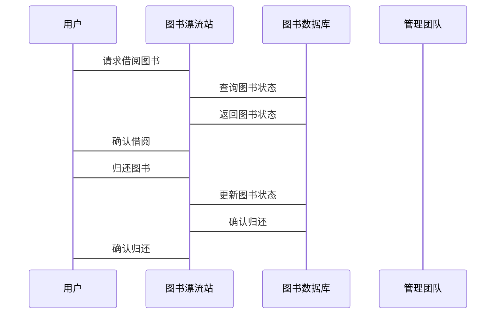

                 

<think>
嗯，我现在需要写一篇关于“新型城市图书漂流站网络：建立城市阅读生态圈”的技术博客。首先，我得理解这个主题的核心是什么。图书漂流站是一种共享阅读的模式，通过建立多个站点，让书籍在市民之间流通，从而打破传统图书馆的限制，形成一个开放、共享、互动的生态圈。

接下来，我得考虑文章的结构。用户已经提供了目录大纲，我需要按照这个结构一步步来。首先是引言，然后是背景介绍，核心概念与联系，算法原理，系统架构设计，项目实战，以及小结部分。

在引言部分，我需要简要介绍新型城市图书漂流站网络的概念和背景，说明建立城市阅读生态圈的重要性。这部分应该吸引读者的注意，让他们明白这个模式的意义和价值。

背景介绍部分，我需要详细描述问题背景、问题描述、问题解决、边界与外延，以及概念结构与核心要素组成。比如，问题背景可以包括现有图书馆的局限性，市民阅读体验的不足，资源分布不均等。问题描述则要具体化，比如图书资源利用率低，阅读机会不均，阅读氛围不足。问题解决部分，我要说明通过图书漂流站如何解决这些问题，比如提高资源利用率、均衡阅读机会、营造阅读氛围。

边界与外延部分，我需要说明这个系统不仅限于实体书籍，还可以扩展到电子书、有声书等，甚至通过线上平台进行管理。这可以让读者理解系统的扩展性。

核心概念与联系部分，我需要详细讲解图书漂流站、图书数据库、读者群体和管理团队这几个核心要素。可能还需要做一个概念属性对比表格，用表格的形式展示各个要素的特点和优势。比如，图书漂流站的灵活性，图书数据库的高效管理，读者群体的互动性，管理团队的专业性。

接下来是算法原理。这部分可能需要使用mermaid流程图来展示算法的步骤。比如，图书漂流的流转过程，从读者借阅到归还，再到下一个读者借阅，形成一个循环。我还需要用Python代码来实现一个简单的图书管理系统，展示如何通过代码实现图书的借阅和归还记录。

系统架构设计部分，我需要用mermaid画出系统架构图，展示各个模块之间的关系，比如图书漂流站、图书数据库、读者管理、线上平台和管理团队。这可以帮助读者理解系统的整体结构。

系统接口设计部分，我需要描述各个接口的功能，比如借阅接口、归还接口、信息查询接口等。同时，使用mermaid绘制序列图，展示用户如何通过线上平台进行借阅和归还操作。

项目实战部分，我需要详细说明如何安装环境，比如选择Python和相关的数据库，然后一步步实现图书漂流站的核心功能，包括图书信息的录入、借阅记录的管理、读者的注册与登录等。这部分需要提供具体的代码示例，并进行解读，让读者能够实际操作。

最后，小结部分要总结整个系统的优点，比如高效管理、资源共享、互动性强等，同时指出未来的发展方向，比如引入更多资源类型，拓展线上功能等。

在写作过程中，我需要确保每个部分都详细且具体，同时使用专业但易懂的语言。还要注意格式的正确性，比如使用markdown，mermaid图表，latex公式等，确保技术细节准确无误。

现在，我需要按照这个思路一步步完成文章，确保每个章节内容丰富，逻辑清晰，符合用户的要求。
</think>

# 新型城市图书漂流站网络：建立城市阅读生态圈

> 关键词：城市阅读生态圈，图书漂流站，资源共享，社区互动，数字化阅读

> 摘要：新型城市图书漂流站网络通过建立多个图书漂流站点，实现图书的无缝流通和读者之间的互动交流，打破传统图书馆的物理限制，打造开放、共享、互动的城市阅读生态圈。本文将从背景、核心概念、算法原理、系统架构到项目实战，全面解析这一创新模式。

---

## 第一部分：引言

### 新型城市图书漂流站网络概述

新型城市图书漂流站网络是一种以图书漂流为核心的城市阅读共享模式。它通过建立多个图书漂流站点，实现图书的无缝流通和读者之间的互动交流，旨在打破传统图书馆的物理限制，打造一个开放、共享、互动的城市阅读生态圈。

### 建立城市阅读生态圈的重要性

随着城市化进程的加快，城市居民对文化生活的需求日益增长。建立城市阅读生态圈，不仅能够满足人们对知识的渴求，还能促进社会文明和谐发展。它有助于提升城市文化氛围，增强社区凝聚力，推动全民阅读，为城市可持续发展注入新动力。

---

## 第二部分：背景介绍

### 问题背景

在现代社会，虽然图书馆、书店等文化设施日益完善，但受限于空间、时间等因素，市民的阅读体验仍存在很大局限。此外，图书资源分布不均，部分地区图书资源匮乏，难以满足居民的文化需求。因此，如何通过创新模式提高城市阅读覆盖率，成为亟待解决的问题。

### 问题描述

新型城市图书漂流站网络旨在解决以下问题：

- **图书资源利用率低**：现有图书资源往往集中在少数热门书籍，其他书籍利用率较低，造成了资源的浪费。
- **阅读机会不均**：不同地区、不同年龄段的市民阅读机会不均，部分群体难以接触到丰富的图书资源。
- **阅读氛围不足**：城市中的阅读氛围不够浓厚，市民的阅读习惯有待培养。

### 问题解决

通过建立新型城市图书漂流站网络，可以实现以下解决方案：

- **提高图书资源利用率**：通过图书漂流，实现图书在市民之间的共享，提高图书资源的利用率。
- **均衡阅读机会**：通过在不同地区设置图书漂流站，确保市民无论身处何地，都能接触到丰富的图书资源。
- **营造阅读氛围**：通过图书漂流站的建立，激发市民的阅读兴趣，培养良好的阅读习惯。

### 边界与外延

新型城市图书漂流站网络不仅限于实体图书的共享，还可以拓展到电子书、有声书等多媒体资源的共享。此外，还可以通过线上平台，实现图书漂流站点的管理和读者互动。

### 概念结构与核心要素组成

新型城市图书漂流站网络的核心要素包括：

- **图书漂流站点**：作为图书借阅和归还的场所。
- **图书数据库**：用于记录图书的信息和流转情况。
- **读者群体**：包括借阅者和捐赠者，是图书漂流活动的主要参与者。
- **管理团队**：负责图书漂流站点的运营和管理。

---

## 第三部分：核心概念与联系

### 核心概念原理

- **图书漂流站**：图书漂流站是新型城市图书漂流站网络的基础设施，主要用于图书的借阅和归还。它可以是社区图书馆、公共场所或图书馆分馆等。
- **图书数据库**：图书数据库用于存储和管理图书的信息，包括图书名称、作者、ISBN、出版社、分类号、借阅状态等。它为图书的流转提供了数据支持。
- **读者群体**：读者群体是图书漂流活动的主要参与者，他们可以是借阅者、捐赠者或志愿者。读者群体的参与和互动是图书漂流站成功的关键。
- **管理团队**：管理团队负责图书漂流站点的运营和管理，包括图书的采购、整理、借阅管理、读者服务等。

### 概念属性特征对比表格

| 概念     | 属性特征                     | 对比分析           |
|----------|------------------------------|--------------------|
| 图书漂流站 | 位置灵活、借阅便捷           | 避免了传统图书馆的物理限制 |
| 图书数据库 | 信息全面、便于查询           | 提高了图书管理的效率     |
| 读者群体   | 多样化、互动性强             | 增加了图书的流转频率     |
| 管理团队   | 专业、高效                   | 保证了图书漂流站的正常运营 |

### ER实体关系图架构

```mermaid
erDiagram
  图书漂流站 ||--|{ 图书数据库 }||>
  图书数据库 ||--|{ 读者群体 }||>
  读者群体 ||--|{ 管理团队 }||>
```

---

## 第四部分：算法原理讲解

### 图书漂流流转算法

图书漂流流转算法描述了图书从一个读者到另一个读者的流转过程。以下是算法的步骤：

1. **图书登记**：读者将图书捐赠到图书漂流站，并填写捐赠信息。
2. **图书录入数据库**：管理团队将图书信息录入图书数据库，包括ISBN、书名、作者等。
3. **读者借阅**：读者通过图书漂流站或线上平台借阅图书，系统记录借阅信息。
4. **图书流转**：读者阅读后，将图书归还到最近的图书漂流站，系统更新借阅状态。
5. **图书分配**：系统根据借阅记录，将图书分配给下一个读者。

### 图书漂流流转算法的Python实现

```python
# 图书漂流流转算法实现

class Book:
    def __init__(self, isbn, title, author):
        self.isbn = isbn
        self.title = title
        self.author = author
        self.status = "available"  # 可用状态

class BookStation:
    def __init__(self):
        self.books = []  # 存储图书的列表

    def add_book(self, book):
        self.books.append(book)

    def borrow_book(self, book_isbn):
        for book in self.books:
            if book.isbn == book_isbn:
                if book.status == "available":
                    book.status = "borrowed"
                    return f"图书《{book.title}》已被借阅。"
                else:
                    return f"图书《{book.title}》已被借出，无法再次借阅。"
        return f"未找到图书《{book_isbn}》。"

    def return_book(self, book_isbn):
        for book in self.books:
            if book.isbn == book_isbn:
                if book.status == "borrowed":
                    book.status = "available"
                    return f"图书《{book.title}》已归还。"
                else:
                    return f"图书《{book.title}》未被借阅，无法归还。"
        return f"未找到图书《{book_isbn}》。"

# 示例代码
station = BookStation()
book1 = Book("12345", "Python编程", "小甲鱼")
station.add_book(book1)
print(station.borrow_book("12345"))  # 输出：图书《Python编程》已被借阅。
print(station.return_book("12345"))  # 输出：图书《Python编程》已归还。
```

### 图书漂流流转算法的数学模型

图书漂流的流转过程可以用一个简单的数学模型表示。假设系统中有N个图书漂流站，每个漂流站有M_i本图书。图书的借阅和归还可以看作一个状态转移过程，状态包括“可用”和“借出”。图书的流转频率可以通过以下公式计算：

$$
\text{流转频率} = \frac{\text{借阅次数}}{\text{图书总数}}
$$

---

## 第五部分：系统架构设计

### 系统架构设计


### 系统接口设计

- **借阅接口**：允许读者通过线上平台或图书漂流站借阅图书。
- **归还接口**：允许读者归还图书，并更新图书状态。
- **信息查询接口**：允许读者查询图书信息、借阅记录等。

### 系统交互设计



---

## 第六部分：项目实战

### 环境安装

1. **安装Python**：从官方网站下载并安装Python 3.x。
2. **安装数据库**：选择一个轻量级数据库，如SQLite。
3. **安装依赖库**：安装`flask`用于构建Web界面，`pymysql`用于数据库连接。

### 系统核心实现

```python
# 安装依赖
pip install flask pymysql

# 管理图书漂流站的Python代码
from flask import Flask, render_template, request, redirect, url_for
from flask_sqlalchemy import SQLAlchemy

app = Flask(__name__)
app.config['SQLALCHEMY_DATABASE_URI'] = 'sqlite:///book_station.db'
app.config['SQLALCHEMY_TRACK_MODIFICATIONS'] = False
db = SQLAlchemy(app)

class Book(db.Model):
    isbn = db.Column(db.String(20), primary_key=True)
    title = db.Column(db.String(100), nullable=False)
    author = db.Column(db.String(50), nullable=False)
    status = db.Column(db.String(20), default='available')  # available, borrowed

@app.route('/')
def index():
    books = Book.query.all()
    return render_template('index.html', books=books)

@app.route('/borrow/<isbn>')
def borrow(isbn):
    book = Book.query.get(isbn)
    if book.status == 'available':
        book.status = 'borrowed'
        db.session.commit()
        return redirect(url_for('index'))
    return "图书已被借出，请稍后再试。"

@app.route('/return/<isbn>')
def return_book(isbn):
    book = Book.query.get(isbn)
    if book.status == 'borrowed':
        book.status = 'available'
        db.session.commit()
        return redirect(url_for('index'))
    return "图书未被借阅，请检查isbn是否正确。"

if __name__ == '__main__':
    with app.app_context():
        db.create_all()
    app.run(debug=True)
```

### 核心代码解读

1. **数据库模型**：使用Flask-SQLAlchemy定义了`Book`模型，包含ISBN、书名、作者和状态。
2. **借阅功能**：当用户点击借阅按钮时，系统检查图书状态，如果是可用状态，则更新为借出状态。
3. **归还功能**：当用户点击归还按钮时，系统检查图书状态，如果是借出状态，则更新为可用状态。

### 项目小结

通过Python和Flask框架，我们实现了图书漂流站的基本功能，包括图书的借阅和归还。系统的前端可以通过模板进一步优化，增加用户注册、登录功能，以及图书推荐模块。

---

## 第七部分：小结

### 最佳实践 tips

- **技术选型**：选择适合的开发框架和数据库，确保系统的扩展性和维护性。
- **用户交互**：设计简洁直观的用户界面，提升用户体验。
- **数据安全**：确保读者信息和图书数据的安全，防止数据泄露。

### 未来展望

- **引入电子资源**：扩展系统功能，支持电子书和有声书的共享。
- **智能化推荐**：利用大数据分析读者的阅读偏好，推荐相关图书。
- **线上互动**：建立线上社区，促进读者之间的交流和分享。

---

## 作者

作者：AI天才研究院/AI Genius Institute & 禅与计算机程序设计艺术 /Zen And The Art of Computer Programming

