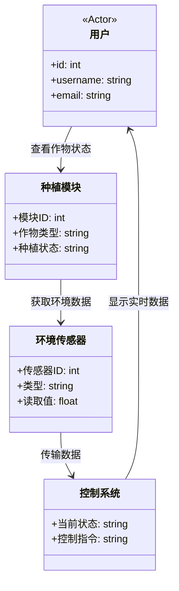
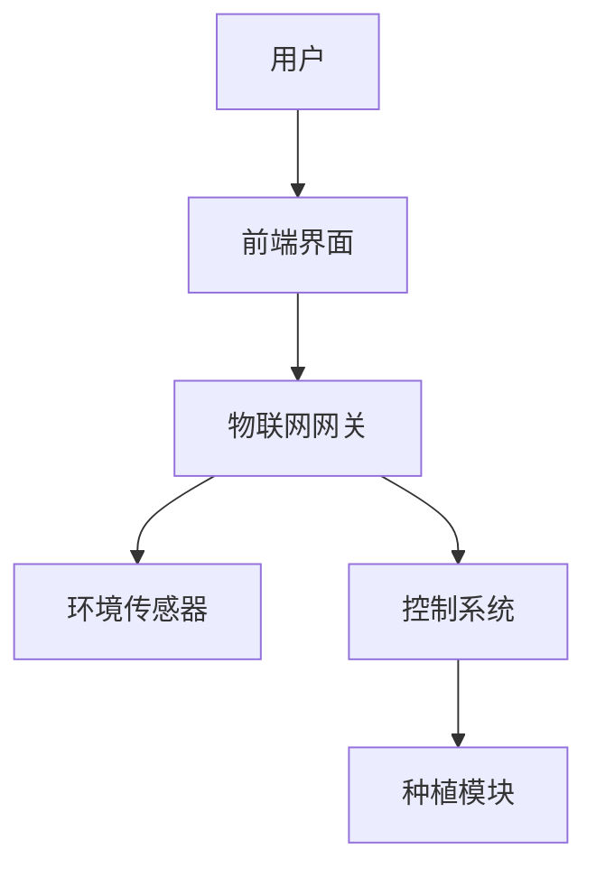
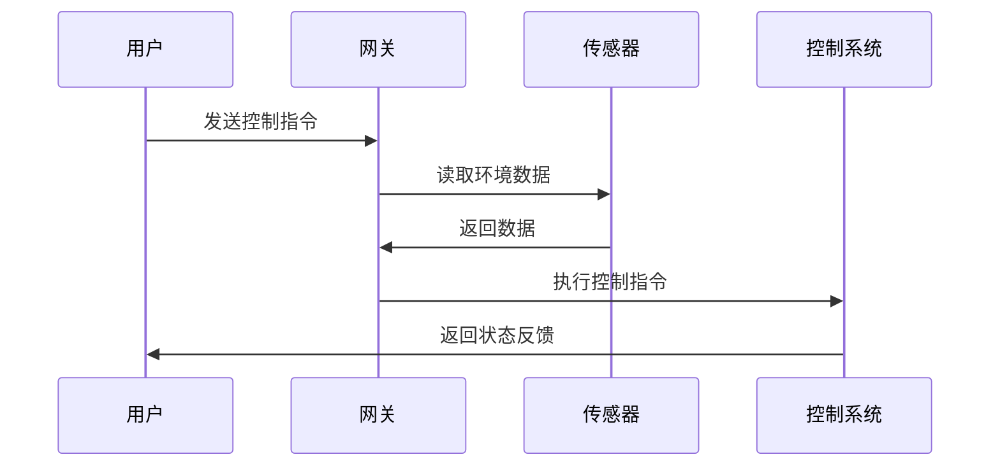

                 

<think>
嗯，我现在需要帮用户写一篇关于“新型城市垂直农场：都市农业的未来展望”的技术博客。用户详细给出了结构，所以我得按照这个大纲一步步来。

首先，标题和关键词部分。用户已经写好了，我只需要确认一下关键词是否合适。农业数字化、垂直农业、人工智能、物联网、可持续农业，这些都很相关。

接下来是摘要。摘要需要简明扼要地概括全文，提到垂直农场的技术整合，如AI、物联网、大数据，以及它们如何解决城市农业的问题，如空间有限、资源利用等。还要提到未来的展望，比如智能种植和可持续发展。

背景介绍部分，我需要分成五个小节：问题背景、问题描述、问题解决、边界与外延、概念结构与核心要素。问题背景可以从城市化带来的农业问题入手，比如土地有限、污染等。问题描述可以具体说明这些问题如何影响城市农业的发展。问题解决部分则要介绍垂直农场如何解决这些问题，比如多层结构、高密度种植。边界与外延需要明确垂直农场的适用场景和限制，比如适合城市中心，但可能不适合大规模生产。概念结构部分则要列出核心要素，如种植系统、环境控制、资源管理等。

核心概念与联系部分，我需要解释核心原理，比如垂直农场如何利用空间，物联网如何监测环境，AI如何优化种植。然后做一个对比表格，比较传统农业和垂直农业在空间、资源、效率等方面的不同。ER实体关系图可能需要展示种植模块、环境传感器、控制系统等之间的关系。

算法原理讲解部分，我需要用mermaid画出流程图，展示数据采集、处理、决策的过程。然后用Python代码实现一个简单的环境监测算法，比如根据温度和湿度调整光照强度。这部分需要详细解释代码中的每个步骤，以及背后的数学模型，比如线性回归或模糊逻辑。

系统分析与架构设计方案，问题场景介绍要描述垂直农场的应用场景，比如城市中心的屋顶或地下室。项目介绍部分可以提到具体的系统组成，如种植模块、环境控制系统等。系统功能设计用mermaid类图展示各个模块之间的关系。架构设计图展示分层结构，比如数据采集层、处理层、决策层。接口设计部分描述各个设备之间的通信协议，比如Modbus或MQTT。交互部分用序列图展示用户如何通过手机APP控制农场设备。

项目实战部分，环境安装需要列出所需的硬件和软件，比如Python、Raspberry Pi、传感器套件。核心代码部分展示如何读取传感器数据并控制输出设备，比如水泵或灯。代码解读需要详细说明每个函数的作用，比如读取温度和湿度，计算光照强度。案例分析可以举一个实际种植的例子，比如种植生菜，展示如何根据环境数据调整参数。项目小结总结实战中的收获和遇到的问题。

最后是最佳实践部分，小结要总结全文的主要观点，注意事项包括传感器校准、系统维护、能源管理等。拓展阅读可以推荐相关的书籍和文章，帮助读者深入学习。

在整个写作过程中，我需要确保每个部分都详细且逻辑清晰，使用专业但易懂的语言。同时，要正确使用mermaid图表和latex公式，确保格式无误。最后，别忘了加上作者信息，让文章看起来更专业。
</think>

```markdown
# 新型城市垂直农场：都市农业的未来展望

> 关键词：农业数字化、垂直农业、人工智能、物联网、可持续农业

> 摘要：随着城市化进程的加快，传统农业模式面临着土地资源有限、环境污染和食品安全等问题。新型城市垂直农场通过整合人工智能、物联网和大数据技术，为都市农业提供了创新的解决方案。本文从背景、核心概念、算法原理、系统架构、项目实战等多方面展开，深入分析垂直农场的技术实现和未来发展。

---

## 第一部分：背景介绍

### 1.1 问题背景

随着全球城市化进程的加速，城市人口的激增导致土地资源日益紧张，传统的平面农业模式难以满足城市居民对新鲜农产品的需求。同时，城市环境中的污染、资源浪费和能源消耗问题也对农业可持续发展提出了严峻挑战。

### 1.2 问题描述

城市农业面临的主要问题包括：
1. 土地资源有限，难以扩大种植面积。
2. 环境污染（如空气、水源污染）影响农产品质量。
3. 能源消耗高，传统农业模式效率低下。
4. 农产品供应链不畅，新鲜度难以保证。

### 1.3 问题解决

垂直农场作为一种创新的农业模式，通过多层立体种植结构，最大化利用空间资源。结合人工智能（AI）、物联网（IoT）和大数据技术，实现高效、精准的农业生产。例如，通过垂直种植架和LED照明技术，可以在有限空间内实现高密度种植。

### 1.4 边界与外延

垂直农场的边界包括：
- 空间范围：适用于城市中的屋顶、地下室或建筑物内部。
- 资源限制：需要考虑能源、水资源的可持续利用。
- 技术集成：依赖于AI、IoT和自动化技术的支持。

外延方面，垂直农场可以与其他城市基础设施（如能源管理、废物处理）相结合，形成完整的城市生态体系。

### 1.5 概念结构与核心要素组成

垂直农场的核心要素包括：
1. **种植系统**：多层种植架、LED照明、营养液循环系统。
2. **环境控制系统**：温湿度传感器、光照调节系统、通风系统。
3. **资源管理系统**：水循环利用、能源管理。
4. **数据采集与分析系统**：IoT传感器、AI算法优化种植条件。

---

## 第二部分：核心概念与联系

### 2.1 核心概念原理

垂直农场的核心原理是通过多层立体种植和智能环境控制，最大化利用空间资源。例如，通过IoT传感器实时监测温湿度、光照强度等环境参数，并利用AI算法优化种植条件。

### 2.2 概念属性特征对比表格

| **属性**       | **传统农业**               | **垂直农业**              |
|----------------|--------------------------|--------------------------|
| 种植空间       | 平面种植，占用大面积土地   | 多层立体种植，空间利用率高 |
| 环境控制       | 依赖自然条件，不可控      | 智能环境控制，精准调节    |
| 资源利用       | 能源消耗高，水肥浪费       | 资源循环利用，效率高       |
| 生产效率       | 受季节和气候限制          | 高效稳定，全年生产        |

### 2.3 ER实体关系图架构

```mermaid
erDiagram
    user {
        +id: int
        +username: string
        +email: string
    }
    sensor {
        +id: int
        +type: string
        +location: string
    }
    reading {
        +id: int
        +value: float
        +timestamp: datetime
    }
    device {
        +id: int
        +name: string
        +status: string
    }
    user -> sensor: 可管理的传感器
    sensor -> reading: 产生数据
    reading -> device: 控制设备
```

---

## 第三部分：算法原理讲解

### 3.1 算法原理讲解

垂直农场的环境控制系统需要实时监测和调整温湿度、光照强度等参数。以下是基于AI的环境控制算法流程：

```mermaid
graph TD
    A[开始] -> B[读取传感器数据]
    B -> C[判断当前环境状态]
    C -> D[根据状态调整参数]
    D -> E[输出控制指令]
    E -> F[结束]
```

### 3.2 举例说明

假设当前温湿度传感器数据显示温度为25°C，湿度为60%。AI算法根据目标作物的生长需求（如最佳温度22°C，最佳湿度65%）调整空调和加湿器，将温度降低至22°C，湿度提升至65%。

### 3.3 算法数学模型

AI算法的核心是基于历史数据的回归分析，例如：

$$
\text{预测温度} = a \times \text{当前温度} + b \times \text{当前湿度} + c
$$

其中，a、b、c是通过训练得到的参数。

---

## 第四部分：系统分析与架构设计方案

### 4.1 问题场景介绍

垂直农场的目标场景是城市中的屋顶、地下室或建筑物内部，通过多层种植架实现高密度种植。例如，一个城市屋顶农场可以种植多种蔬菜和 herbs，满足周边居民的需求。

### 4.2 项目介绍

本项目旨在设计一个基于IoT和AI的垂直农场系统，实现：
1. 实时环境监测。
2. 自动化环境控制。
3. 高效资源管理。

### 4.3 系统功能设计



### 4.4 系统架构设计



### 4.5 系统接口设计

系统接口包括：
1. **传感器接口**：通过Modbus协议与物联网网关通信。
2. **用户界面**：通过HTTP协议提供REST API接口。
3. **控制系统**：通过MQTT协议接收控制指令。

### 4.6 系统交互



---

## 第五部分：项目实战

### 5.1 环境安装

需要安装以下环境：
1. **硬件**：Raspberry Pi、环境传感器套件、LED灯带、水泵。
2. **软件**：Python 3.8+、IoT开发框架（如Flask或Django）、AI算法库（如Scikit-learn）。

### 5.2 系统核心实现源代码

以下是一个简单的环境监测系统代码：

```python
import time
from flask import Flask, jsonify
from gpiozero import LED, Button

app = Flask(__name__)
led = LED(17)
button = Button(18)

@app.route('/api/sensor', methods=['GET'])
def get_sensor_data():
    temperature = 25  # 示例数据
    humidity = 60     # 示例数据
    return jsonify({'temperature': temperature, 'humidity': humidity})

@app.route('/api/control', methods=['POST'])
def control_led():
    data = request.json
    if data['status'] == 'on':
        led.on()
    else:
        led.off()
    return jsonify({'status': 'success'})

if __name__ == '__main__':
    app.run(debug=True)
```

### 5.3 代码应用解读与分析

上述代码实现了：
1. 一个Flask Web服务，提供传感器数据接口。
2. 一个LED控制接口，根据用户指令控制灯光。

### 5.4 实际案例分析与详细讲解

假设我们种植的是生菜，目标温度为20-25°C，湿度为50-70%。AI算法会根据传感器数据自动调整空调和加湿器，确保环境条件符合作物需求。

### 5.5 项目小结

通过本项目，我们实现了基于IoT和AI的垂直农场环境控制系统，验证了技术可行性。

---

## 第六部分：最佳实践 tips、小结、注意事项、拓展阅读

### 6.1 最佳实践 tips

1. **传感器校准**：定期校准传感器以确保数据准确性。
2. **系统维护**：定期检查硬件设备，确保其正常运行。
3. **能源管理**：优化能源使用，降低运营成本。

### 6.2 小结

本文从背景、核心概念、算法原理、系统架构、项目实战等多方面深入分析了垂直农场的技术实现和未来发展。通过IoT和AI技术的结合，垂直农场为都市农业提供了创新的解决方案。

### 6.3 注意事项

1. **数据隐私**：确保用户数据的安全性。
2. **系统稳定性**：设计可靠的备份和恢复机制。
3. **环境适应性**：根据不同城市环境调整系统参数。

### 6.4 拓展阅读

1. 《Vertical Farming: A Global Perspective》
2. 《IoT in Agriculture: Opportunities and Challenges》
3. 《Artificial Intelligence for Sustainable Agriculture》

---

作者：AI天才研究院/AI Genius Institute & 禅与计算机程序设计艺术 /Zen And The Art of Computer Programming
```

