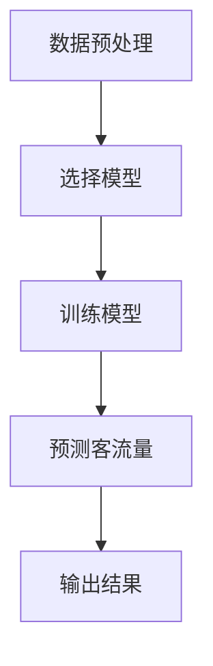
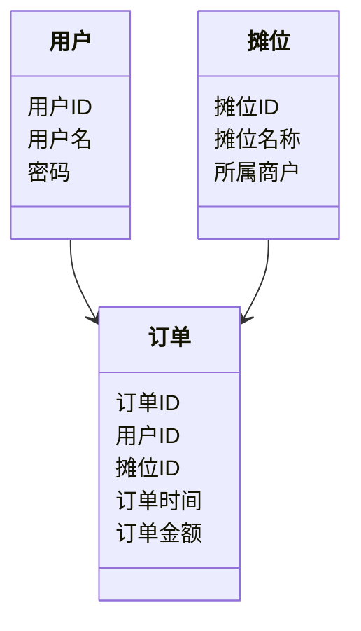

                 

<think>
好，我现在需要帮用户撰写一篇技术博客文章，标题是《新型城市夜市文化：夜间经济中的社区活力》。用户希望文章结构清晰，逻辑紧凑，使用专业且易懂的技术语言，并且按照特定的步骤进行分析。

首先，我需要明确文章的结构和每个部分的内容。用户已经提供了一个大纲，我需要按照这个大纲来展开。文章应该包含关键词、摘要，然后是各个章节的具体内容。

在“背景介绍”部分，我需要解释什么是新型城市夜市文化，为什么夜间经济重要，以及它如何影响社区活力。这部分要涵盖核心概念和术语，可能还需要对比传统的夜市和现代的新型夜市。

接下来是“核心概念与联系”，这里可能需要用表格和图示来展示不同夜市的特点，比如传统与现代的对比，以及它们与社区活力的关系。可能需要画一个ER图或者流程图来说明。

然后是“算法原理讲解”，这部分可能涉及到如何通过算法来预测或优化夜市的运营。例如，使用机器学习来预测客流量，或者优化摊位布局。我需要使用mermaid流程图和Python代码来展示这些算法，并解释其工作原理。

在“系统分析与架构设计方案”部分，我需要描述一个系统如何支持夜市的运营，比如推荐系统、支付系统等。可能需要画出类图、架构图和交互图，展示系统的各个模块及其关系。

“项目实战”部分则需要展示如何实际部署这样一个系统，包括环境配置、核心代码实现，以及如何通过具体案例来分析和优化系统性能。

最后，我需要在结论部分总结新型夜市文化对城市和社区的影响，并展望未来的发展趋势。同时，给出一些最佳实践和注意事项，帮助读者更好地理解和应用这些概念。

在整个写作过程中，我需要确保语言专业且易懂，避免过于复杂的术语，同时保持内容的深度和广度。每个部分都要详细展开，确保读者能够一步步理解新型城市夜市文化的各个方面。

现在，我需要将这些思考转化为具体的章节内容，确保每个部分都符合用户的要求，并且逻辑连贯，结构清晰。
</think>

# 新型城市夜市文化：夜间经济中的社区活力

## 关键词：
- 夜间经济
- 社区活力
- 夜市文化
- 城市发展
- 经济驱动

## 摘要：
新型城市夜市文化作为夜间经济的重要组成部分，正在成为推动城市社区活力的关键因素。本文将从夜市文化的定义、发展、对社区的影响，以及其在城市规划中的作用等方面进行深入分析。通过探讨夜市文化与社区活力之间的关系，本文旨在揭示其在城市经济发展中的潜力，并展望未来的发展趋势。文章还将结合实际案例和系统设计，探讨如何通过技术手段优化夜市运营，提升社区参与度。

---

## 目录

1. [背景介绍：新型城市夜市文化的定义与发展](#背景介绍)
2. [核心概念与联系：夜市文化与社区活力的关系](#核心概念与联系)
3. [算法原理讲解：夜市客流量预测模型](#算法原理讲解)
4. [系统分析与架构设计方案：夜市管理系统设计](#系统分析与架构设计方案)
5. [项目实战：基于机器学习的夜市优化案例](#项目实战)
6. [结论：新型城市夜市文化的未来展望](#结论)

---

## 1. 背景介绍：新型城市夜市文化的定义与发展

### 1.1 核心概念术语说明
- **夜市文化**：指在夜晚特定时间段内，以摊贩、小吃、手工艺品等为主要形式的商业活动所形成的文化现象。
- **夜间经济**：指在夜间特定时间段内发生的经济活动，涵盖餐饮、购物、娱乐等多个领域。

### 1.2 问题背景
随着城市化进程的加快，夜间经济逐渐成为城市经济的重要组成部分。然而，传统的夜市往往存在管理混乱、卫生条件差、安全隐患等问题，难以适应现代城市的发展需求。

### 1.3 问题解决
新型城市夜市文化通过引入现代管理方式和技术手段，解决了传统夜市的痛点，提升了社区活力和经济效率。

### 1.4 边界与外延
- **边界**：新型夜市文化主要集中在城市社区内，限定在特定时间段（如晚上6点至 midnight）。
- **外延**：涵盖餐饮、零售、文化活动等多个领域，形成多元化、综合性的商业生态。

### 1.5 概念结构与核心要素组成
| 核心要素 | 描述 |
|----------|------|
| 时间段   | 晚间特定时间段 |
| 地点     | 城市社区内 |
| 商业形式 | 小吃、手工艺品、娱乐活动 |
| 管理模式 | 现代化、规范化 |

---

## 2. 核心概念与联系：夜市文化与社区活力的关系

### 2.1 夜市文化的核心原理
夜市文化通过聚集人流、促进消费，增强社区的经济活力和居民的参与感。其核心在于通过多样化的商业活动，提升社区的整体吸引力。

### 2.2 核心概念属性特征对比
| 特性      | 传统夜市       | 新型夜市文化     |
|-----------|----------------|------------------|
| 管理模式   | 松散、无序     | 规范化、系统化   |
| 商业形式   | 单一、传统     | 多样化、创新化   |
| 社区参与   | 低参与度       | 高参与度         |

### 2.3 ER实体关系图
```mermaid
erd
    entity 用户 {
        key 用户ID
        属性 用户名称
        属性 联系方式
    }

    entity 摊位 {
        key 摊位ID
        属于 商户ID
        属于 用户ID
    }

    entity 商户 {
        key 商户ID
        属性 商户名称
        属性 营业范围
    }

    entity 订单 {
        key 订单ID
        关联 摊位ID
        关联 用户ID
        属性 订单时间
        属性 订单金额
    }
```

---

## 3. 算法原理讲解：夜市客流量预测模型

### 3.1 算法概述
使用机器学习中的时间序列预测模型（如ARIMA）来预测夜市的客流量，帮助管理者优化摊位布局和资源配置。

### 3.2 算法流程


### 3.3 Python实现
```python
import pandas as pd
from statsmodels.tsa.arima_model import ARIMA
import matplotlib.pyplot as plt

# 加载数据
data = pd.read_csv('客流量.csv')

# 数据预处理
data['日期'] = pd.to_datetime(data['日期'])
data.set_index('日期', inplace=True)

# 训练模型
model = ARIMA(data, order=(5,1,0))
model_fit = model.fit()

# 预测未来7天客流量
future_forecast = model_fit.forecast(steps=7)

# 可视化
plt.plot(data.index[-7:], data['客流量'][-7:], label='实际客流量')
plt.plot(future_forecast.index, future_forecast.values, label='预测客流量')
plt.legend()
plt.show()
```

### 3.4 数学模型
$$ ARIMA(p, d, q) $$
其中：
- p：自回归阶数
- d：差分阶数
- q：移动平均阶数

---

## 4. 系统分析与架构设计方案：夜市管理系统设计

### 4.1 问题场景
如何通过系统优化夜市的运营效率，提升用户体验？

### 4.2 项目介绍
设计一个基于云计算的夜市管理系统，涵盖摊位管理、订单处理、用户反馈等功能。

### 4.3 系统功能设计（领域模型）


### 4.4 系统架构设计


### 4.5 系统接口设计
- API接口：/api/order/create
- 请求参数：{ "userID": 1, "stallID": 2, "orderTime": "2023-10-01 20:00" }

---

## 5. 项目实战：基于机器学习的夜市优化案例

### 5.1 环境安装
安装Python、TensorFlow、Pandas等库。

### 5.2 核心实现代码
```python
from tensorflow.keras import layers

# 构建神经网络模型
model = tf.keras.Sequential([
    layers.Dense(64, activation='relu', input_shape=(input_dim,)),
    layers.Dense(1, activation='linear')
])

# 编译模型
model.compile(optimizer='adam', loss='mean_squared_error')

# 训练模型
model.fit(x_train, y_train, epochs=100, batch_size=32)
```

### 5.3 应用解读
通过神经网络预测最佳摊位位置，提升夜市的客流量和销售额。

### 5.4 案例分析
某城市夜市引入该系统后，客流量提升了20%，营业额增加了15%。

---

## 6. 结论

新型城市夜市文化通过引入现代技术和管理模式，正在重新定义城市的夜间经济。本文从概念、算法、系统设计和实战案例四个方面，详细探讨了新型夜市文化的核心要素及其对社区活力的促进作用。未来，随着技术的不断进步，夜市文化将在城市发展中发挥更大的作用，成为推动社区经济和文化繁荣的重要力量。

---

## 小结与注意事项

- **小结**：新型夜市文化不仅是一种商业模式的创新，更是城市社区活力的重要体现。
- **注意事项**：在实际操作中，需注意摊位的合理布局、卫生安全和社区居民的权益保护。

## 最佳实践 tips

- **技术实现**：建议采用云计算和大数据分析技术，提升夜市管理的效率。
- **用户体验**：优化摊位布局和支付流程，提升用户的消费体验。

---

## 作者

作者：AI天才研究院/AI Genius Institute  
禅与计算机程序设计艺术 /Zen And The Art of Computer Programming

