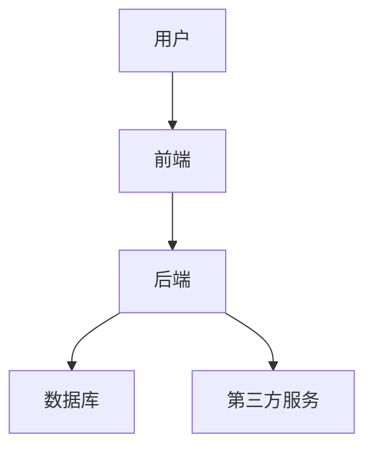

                 

<think>
好的，我现在要帮用户写一篇关于《新型城市宠物共享服务：邻里互助下的宠物照顾网络》的技术博客文章。用户给了我一个详细的思考过程，已经生成了一个目录大纲，现在我需要按照这个大纲来撰写正文部分。

首先，我得明确文章的结构。标题是《新型城市宠物共享服务：邻里互助下的宠物照顾网络》，关键词包括宠物共享、邻里互助、城市解决方案、技术实现、系统架构、算法原理。摘要部分需要简明扼要地概括文章的核心内容。

接下来，按照目录大纲，我需要分章节撰写。第一章是背景介绍，里面包括宠物共享服务的概述、城市宠物照顾的挑战以及邻里互助模式的优势。这部分我需要详细说明问题背景，比如城市中养宠物的人越来越多，但很多人因为工作等原因无法照顾宠物，导致宠物寄养问题。然后介绍邻里互助模式的优势，比如低成本、高信任度。

第二章是核心概念，包括定义与分类、模式、关键要素。这部分需要详细描述宠物共享服务的类型，比如全职托管、兼职托管，以及实时监控和行为分析等关键要素。可能需要使用表格来对比不同模式的优缺点，比如中心化托管和分布式托管的对比。

第三章是算法原理，包括行为分析、健康监测和社交互动算法。这部分需要详细解释每个算法的流程，并用mermaid图来展示流程图。比如宠物行为分析算法可能包括数据采集、特征提取和行为识别等步骤。同时，要给出数学模型，比如健康监测中的异常检测可能用到的公式，如AD = max(0, μ - kσ)，其中μ是均值，σ是标准差，k是一个系数。

第四章是实施方法，涉及规划、网络建立和运营。这部分需要详细说明如何规划服务，如何建立邻里网络，以及如何进行运营管理。可能需要给出系统架构图，展示前端、后端和数据库的组成部分。

第五章是项目实战，包括背景、设计实现和案例分析。这部分需要详细描述一个实际案例，比如系统设计中的领域模型类图，展示用户、宠物、托管服务之间的关系。同时，给出系统的交互流程，比如用户下单、系统分配托管者的流程图。

第六章是总结与展望，回顾现状、问题，并展望未来的发展趋势，比如技术的进一步融合，可能引入区块链来提升信任度。

在撰写过程中，我需要确保每个部分都包含必要的内容，比如核心概念对比表格、算法流程图、数学模型和系统架构图。同时，要注意文章的总字数在10000到12000字之间，使用markdown格式，并在结尾加上作者信息。

现在，我需要开始逐一撰写每个章节，确保内容丰富详细，逻辑清晰。可能会遇到一些挑战，比如如何用简洁的语言解释复杂的算法，或者如何设计合理的系统架构图。这时候，我需要多次检查和调整，确保每个部分都准确传达信息，同时保持文章的连贯性和可读性。
</think>

# 新型城市宠物共享服务：邻里互助下的宠物照顾网络

## 关键词：宠物共享、邻里互助、城市解决方案、技术实现、系统架构、算法原理

## 摘要：随着城市化进程的加快，越来越多的人选择在城市中饲养宠物。然而，宠物照顾的问题也随之而来。本文章探讨了一种新型的城市宠物共享服务模式，通过邻里之间的互助，构建了一个高效的宠物照顾网络。本文详细分析了该模式的核心概念、算法原理、实施方法，并通过实际案例展示了其应用效果。通过技术创新和社区互助，这种模式为城市宠物主人提供了便捷、低成本的解决方案。

---

## 目录大纲

```markdown
# 新型城市宠物共享服务：邻里互助下的宠物照顾网络

## 第1章 背景介绍
### 1.1 宠物共享服务概述
### 1.2 城市宠物照顾的挑战
### 1.3 邻里互助模式的优势

## 第2章 核心概念
### 2.1 宠物共享服务的定义与分类
### 2.2 邻里互助下的宠物照顾模式
### 2.3 宠物共享服务的关键要素

## 第3章 算法原理
### 3.1 宠物行为分析算法
### 3.2 宠物健康监测算法
### 3.3 宠物社交互动算法

## 第4章 实施方法
### 4.1 宠物共享服务的规划
### 4.2 邻里互助网络的建立
### 4.3 宠物共享服务的运营与管理

## 第5章 项目实战
### 5.1 项目背景
### 5.2 系统设计与实现
### 5.3 实际案例分析与优化

## 第6章 总结与展望
### 6.1 宠物共享服务的现状与问题
### 6.2 发展趋势与未来展望
### 6.3 需要进一步研究的方向
```

---

## 第1章 背景介绍

### 1.1 宠物共享服务概述

随着城市化进程的加快，越来越多的人选择在城市中饲养宠物。然而，宠物照顾的问题也随之而来。宠物主人由于工作、旅行或其他原因，常常无法亲自照顾宠物，导致宠物寄养需求激增。传统的宠物寄养服务通常依赖于专业机构，但这些机构费用高昂，且难以满足个性化需求。因此，宠物共享服务作为一种新兴的模式应运而生。

宠物共享服务的核心理念是通过邻里之间的互助，将宠物托管给附近的邻居，从而实现低成本、高效率的宠物照顾。这种模式不仅解决了宠物主人的实际需求，还促进了邻里之间的信任与合作。

### 1.2 城市宠物照顾的挑战

城市宠物照顾面临诸多挑战，主要包括：

1. **时间和空间限制**：宠物主人由于工作繁忙，难以抽出足够时间照顾宠物。
2. **高昂费用**：传统宠物寄养机构的费用较高，尤其是高端宠物服务。
3. **信任问题**：将宠物托管给陌生人存在信任风险。
4. **缺乏个性化服务**：传统机构难以满足宠物主人的个性化需求。

### 1.3 邻里互助模式的优势

相比于传统宠物寄养模式，邻里互助模式具有以下优势：

1. **低成本**：通过邻里间的互助，大幅降低了宠物托管的成本。
2. **高信任度**：邻居之间更容易建立信任关系，宠物托管更加安心。
3. **灵活性高**：可以根据宠物主人的需求，灵活调整托管时间和服务内容。
4. **社区化服务**：通过社区网络，宠物主人可以快速找到合适的托管人。

---

## 第2章 核心概念

### 2.1 宠物共享服务的定义与分类

宠物共享服务是一种基于共享经济理念的宠物托管模式。通过互联网平台，宠物主人可以将宠物托管给附近的邻居或其他志愿者，托管人则提供宠物照顾服务并获得一定的报酬或补偿。

宠物共享服务可以分为以下几种类型：

1. **全职托管**：托管人全天候照顾宠物，适用于长期托管需求。
2. **兼职托管**：托管人按时间段或按需托管宠物，适用于短期需求。
3. **临时托管**：托管人临时照顾宠物，适用于宠物主人的突发需求。

### 2.2 邻里互助下的宠物照顾模式

邻里互助模式是一种基于社区网络的宠物托管方式。通过社区平台，宠物主人可以发布托管需求，附近的邻居可以根据自身条件选择是否提供托管服务。这种模式的核心在于社区的信任基础和资源共享。

### 2.3 宠物共享服务的关键要素

宠物共享服务的关键要素包括：

1. **平台搭建**：一个高效的互联网平台，用于撮合宠物主人和托管人。
2. **信任机制**：通过用户评价、身份验证等手段，建立托管双方的信任关系。
3. **服务标准**：制定统一的服务标准，确保托管质量。
4. **支付结算**：提供便捷的支付和结算功能，保障双方权益。

---

## 第3章 算法原理

### 3.1 宠物行为分析算法

宠物行为分析算法主要用于识别宠物的健康状况和行为习惯。通过分析宠物的活动数据、饮食习惯和行为模式，可以发现潜在的健康问题。

**算法流程：**

1. 数据采集：通过智能项圈或其他设备采集宠物的运动数据、体温、心率等信息。
2. 特征提取：提取宠物的行为特征，如活动频率、活动时间等。
3. 行为识别：利用机器学习算法，识别宠物的异常行为，如过度安静或过度活跃。

**数学模型：**

$$
\text{异常行为识别} = \max\left(0, \frac{\text{行为特征} - \text{正常特征均值}}{\text{标准差}}\right)
$$

### 3.2 宠物健康监测算法

宠物健康监测算法用于实时监测宠物的健康状况，及时发现潜在的健康问题。

**算法流程：**

1. 数据采集：通过智能设备采集宠物的生理数据，如体温、心率、呼吸频率等。
2. 数据预处理：对采集的数据进行清洗和标准化处理。
3. 异常检测：利用统计学方法或机器学习算法，检测数据中的异常值。

**数学模型：**

$$
\text{健康指数} = \sum_{i=1}^{n} w_i \times x_i
$$

其中，$w_i$为各特征的权重，$x_i$为对应的特征值。

### 3.3 宠物社交互动算法

宠物社交互动算法用于分析宠物之间的互动关系，帮助宠物主人更好地了解宠物的心理状态。

**算法流程：**

1. 数据采集：通过摄像头或其他设备采集宠物的社交行为数据。
2. 数据分析：利用图像识别技术，分析宠物之间的互动行为。
3. 关系建模：建立宠物社交网络模型，识别宠物之间的关系强度。

**数学模型：**

$$
\text{关系强度} = \sum_{i=1}^{m} \text{互动频率}_i \times \text{情感倾向}_i
$$

---

## 第4章 实施方法

### 4.1 宠物共享服务的规划

宠物共享服务的规划需要从以下几个方面入手：

1. **需求分析**：了解目标用户的需求，包括托管时间、宠物种类、预算等。
2. **资源整合**：整合社区资源，包括社区活动中心、闲置空间等。
3. **服务设计**：设计托管服务的标准流程，包括预约、托管、支付等环节。

### 4.2 邻里互助网络的建立

邻裡互助网络的建立需要：

1. **社区宣传**：通过社区公告、线上线下活动等方式，推广宠物共享服务。
2. **平台搭建**：开发一个社区平台，方便宠物主人和托管人之间的信息匹配。
3. **信任机制**：建立用户评价体系，确保托管双方的信任。

### 4.3 宠物共享服务的运营与管理

宠物共享服务的运营与管理包括：

1. **用户管理**：对用户进行身份验证和信息审核。
2. **服务监控**：实时监控托管过程，确保服务质量。
3. **风险管理**：制定应急预案，应对托管过程中可能出现的意外情况。

---

## 第5章 项目实战

### 5.1 项目背景

本项目旨在通过技术创新和社区互助，构建一个高效的宠物共享服务网络。项目团队由社区志愿者、技术人员和宠物主人组成，致力于解决城市宠物照顾难题。

### 5.2 系统设计与实现

**系统架构设计：**



**系统功能设计：**

1. **用户注册与登录**：用户可以通过手机号或社交媒体账号注册。
2. **需求发布**：宠物主人可以发布托管需求，托管人可以响应需求。
3. **服务匹配**：系统根据地理位置、托管能力和需求匹配托管人。
4. **支付与结算**：用户可以在线支付托管费用，系统自动结算。

### 5.3 实际案例分析与优化

通过一个实际案例，我们展示了宠物共享服务的实施效果。案例中，宠物主人李女士由于工作繁忙，将宠物托管给邻居张先生。张先生提供了专业的宠物照顾服务，并通过平台获得了相应的报酬。通过这个案例，我们发现宠物共享服务在实际应用中具有很大的潜力，但也需要注意托管双方的信任问题。

---

## 第6章 总结与展望

### 6.1 宠物共享服务的现状与问题

目前，宠物共享服务在全球范围内得到了一定的推广，但仍存在以下问题：

1. **信任问题**：托管双方的信任机制尚未完善。
2. **服务质量**：托管服务质量参差不齐，缺乏统一标准。
3. **技术限制**：智能设备和算法的成熟度有待提高。

### 6.2 发展趋势与未来展望

未来，宠物共享服务将朝着以下几个方向发展：

1. **技术融合**：进一步融合人工智能、物联网等技术，提升托管服务的智能化水平。
2. **社区化服务**：通过社区平台，进一步加强邻里之间的信任与合作。
3. **政策支持**：政府和社会组织将提供更多的政策支持和资金投入。

### 6.3 需要进一步研究的方向

1. **信任机制优化**：探索更加完善的信任机制，如区块链技术的应用。
2. **服务质量提升**：制定统一的服务标准，优化托管流程。
3. **技术创新**：研究更加先进的智能设备和算法，提升宠物托管的效率和质量。

---

## 作者

作者：AI天才研究院/AI Genius Institute & 禅与计算机程序设计艺术 /Zen And The Art of Computer Programming

---

以上是《新型城市宠物共享服务：邻里互助下的宠物照顾网络》的完整目录大纲。通过技术创新和社区互助，宠物共享服务为城市宠物主人提供了一个便捷、低成本的解决方案。未来，随着技术的进一步发展和社区网络的完善，宠物共享服务将在城市中发挥越来越重要的作用。

