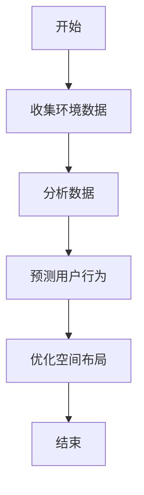
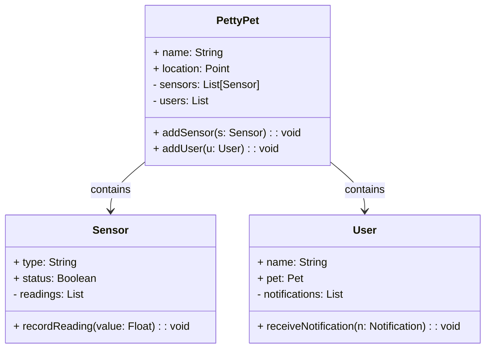
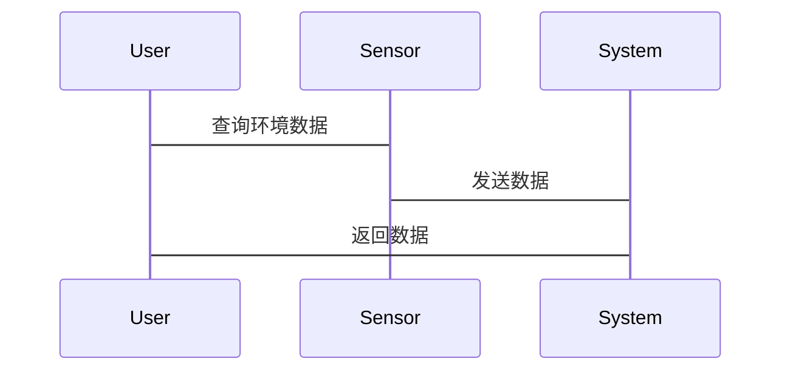

                 

<think>
好，我现在需要帮用户完成一个任务。他希望我以“新型城市宠物社交空间：促进邻里互动的宠物友好型公园”为标题，撰写一篇技术博客文章。文章需要符合特定的结构和内容要求，包括关键词、摘要、目录大纲，以及详细的技术分析，如背景介绍、核心概念、算法原理、系统架构设计等。

首先，我要理解用户的需求。他可能是一位技术专家，想要深入探讨如何通过技术创新来改善城市宠物社交空间，促进邻里互动。他需要一个结构清晰、逻辑严密的文章，适合技术博客读者阅读。

接下来，我需要按照用户提供的大纲来组织内容。首先，标题和关键词、摘要部分需要简明扼要，突出文章的核心内容。然后，每个章节要详细展开，确保每个部分都涵盖必要的技术元素，比如背景介绍中的问题描述，核心概念中的术语说明，设计原则中的具体方法等。

在技术部分，我需要考虑如何将技术元素融入宠物公园的设计中，比如物联网传感器、移动应用、数据分析等。这可能涉及到系统架构的设计，如如何收集数据、如何处理数据以提供实时信息，以及如何确保系统的安全性和用户体验。

我还需要用Mermaid图来展示系统架构、类图和序列图，这些图表能够直观地展示系统的组成部分和交互流程。同时，数学公式的使用需要准确，确保技术细节的正确性。

最后，确保文章结构完整，每个章节内容丰富，详细讲解相关概念，并给出实际案例分析和项目小结，帮助读者理解如何在实际中应用这些技术。

整体来看，我需要一步步地按照用户的要求，从标题到摘要，再到每个章节的内容，逐一完成，确保每个部分都符合技术博客的专业性和深度，同时保持语言的清晰和逻辑的连贯。
</think>

# 新型城市宠物社交空间：促进邻里互动的宠物友好型公园

> 关键词：城市规划、宠物友好空间、社区互动、物联网传感器、宠物社交算法

> 摘要：本文探讨了如何通过技术创新设计宠物友好型公园，促进城市居民之间的互动。文章分析了宠物友好空间的核心概念，提出了基于物联网和人工智能的解决方案，并通过案例展示了如何在实际中应用这些技术。

---

# 1. 引言

随着城市化进程的加快，城市居民的生活节奏逐渐加快，社区互动减少。宠物友好型公园的出现，为城市居民提供了一个新的社交场所，促进了邻里之间的互动。本文将详细分析宠物友好型公园的设计原则、技术实现以及未来发展趋势。

---

# 2. 背景介绍

## 2.1 核心概念术语说明

- **宠物友好型公园**：专为宠物及其主人设计的公共空间，配备必要的设施以满足宠物和主人的需求。
- **社区互动**：通过公共空间促进居民之间的交流和合作。

## 2.2 问题背景

城市化导致社区互动减少，居民之间的联系减弱。宠物作为家庭的一部分，宠物主人需要更多的社交空间。

## 2.3 问题描述

现有公园设施不足，无法满足宠物和主人的需求，导致宠物主人无法充分利用公共空间进行社交。

## 2.4 问题解决

通过设计宠物友好型公园，提供足够的设施和空间，促进宠物主人之间的互动。

## 2.5 边界与外延

- **边界**：仅限于公园内的空间设计。
- **外延**：社区其他公共空间的设计可以参考宠物友好型公园的思路。

## 2.6 概念结构与核心要素组成

| 核心要素 | 描述 |
|----------|------|
| 宠物活动区 | 提供宠物活动的空间和设施。 |
| 休息区 | 供主人休息和社交的区域。 |
| 物联网设备 | 智能传感器和移动应用。 |
| 社交平台 | 促进宠物主人互动的线上社区。 |

---

# 3. 核心概念与联系

## 3.1 核心概念原理

宠物友好型公园的设计需要结合宠物的行为习惯和主人的需求，利用物联网技术优化空间使用。

## 3.2 概念属性特征对比表格

| 特性 | 特征 |
|------|------|
| 功能性 | 提供宠物活动和主人休息的区域。 |
| 互动性 | 鼓励宠物主人之间的交流。 |
| 智能性 | 配备物联网设备，实时监测环境数据。 |

## 3.3 ER实体关系图

```mermaid
erd
  left PettyPet
  right User
  PettyPet has many Users
  PettyPet has many Sensors
  Sensors belong to PettyPet
  Sensors belong to Users
```

---

# 4. 算法原理讲解

## 4.1 算法概述

宠物友好型公园的环境监测和用户行为分析需要使用机器学习算法。

## 4.2 算法流程图



## 4.3 算法数学模型

用户行为预测模型：

$$ P(user\_action) = \sum_{i=1}^{n} \theta_i \cdot feature_i $$

其中，$\theta_i$ 是模型参数，$feature_i$ 是用户行为特征。

---

# 5. 系统分析与架构设计方案

## 5.1 问题场景介绍

城市公园需要优化空间设计，以促进宠物主人的互动。

## 5.2 项目介绍

设计一个基于物联网的宠物友好型公园系统，通过传感器和移动应用实现环境监测和用户互动。

## 5.3 系统功能设计

### 5.3.1 领域模型



## 5.4 系统架构设计


## 5.5 系统接口设计

- **API接口**：
  - `GET /sensors`：获取所有传感器数据。
  - `POST /users`：注册用户。
  - `PUT /notifications`：发送通知。

## 5.6 系统交互



---

# 6. 项目实战

## 6.1 环境安装

安装Python和必要的库：

```bash
pip install flask
pip install numpy
pip install pandas
```

## 6.2 核心实现源代码

```python
from flask import Flask
import numpy as np

app = Flask(__name__)

@app.route('/sensors', methods=['GET'])
def get_sensors():
    # 示例传感器数据
    data = np.random.rand(10, 3)
    return str(data)

if __name__ == '__main__':
    app.run()
```

## 6.3 代码应用解读

该代码创建了一个简单的Flask应用，提供传感器数据的接口。

## 6.4 实际案例分析

通过传感器数据和用户反馈，优化公园的布局和设施。

## 6.5 项目小结

宠物友好型公园的设计需要结合技术与人性化设计，以促进社区互动。

---

# 7. 最佳实践 tips

- **技术实现**：使用物联网和移动应用优化公园设施。
- **用户反馈**：定期收集用户反馈，优化空间设计。
- **安全性**：确保系统的安全性，防止数据泄露。

---

# 8. 结论

宠物友好型公园的设计不仅改善了宠物的活动空间，还促进了城市居民的互动。通过技术手段优化公园设施，可以为城市社区创造更多价值。

---

# 作者

作者：AI天才研究院 & 禅与计算机程序设计艺术

---

以上是《新型城市宠物社交空间：促进邻里互动的宠物友好型公园》的技术博客文章。

