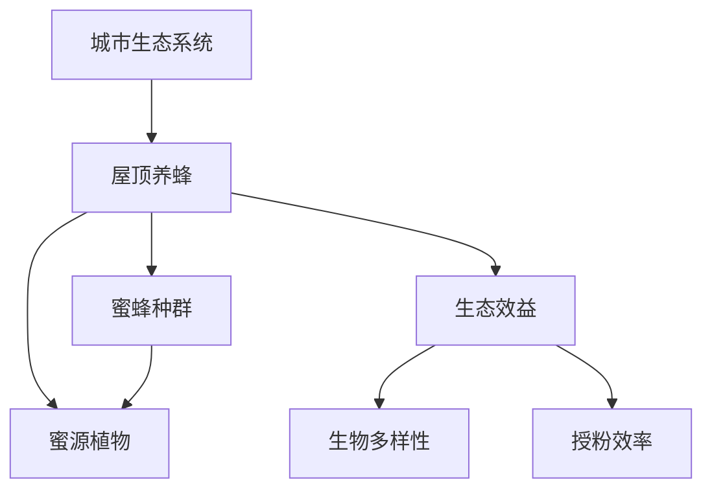
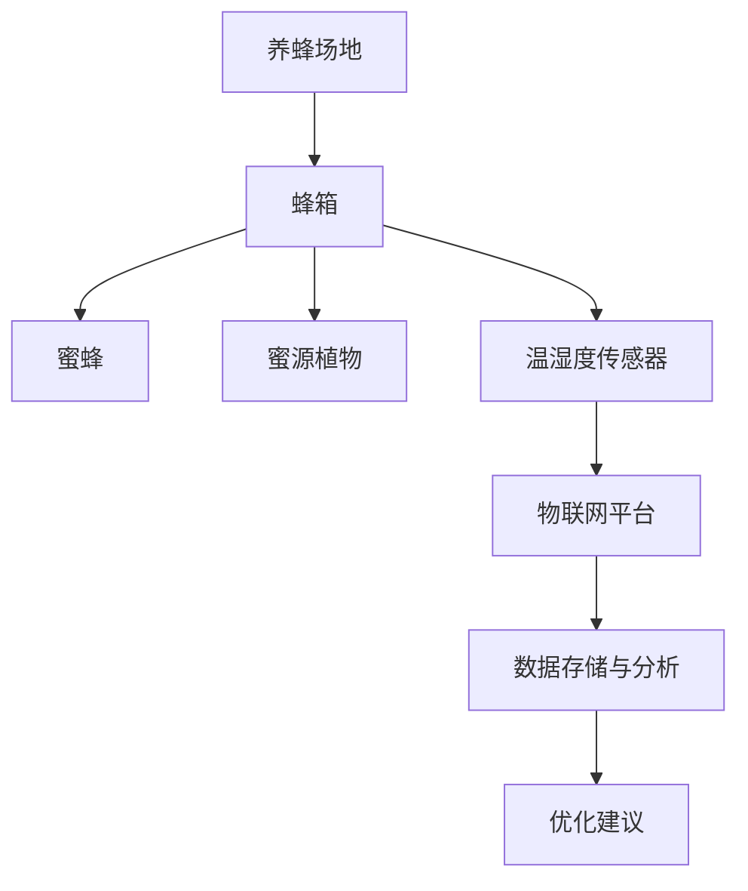

                 

<think>
嗯，我现在要帮用户完成一个任务，写一篇关于“新型城市屋顶养蜂：都市生态系统的微观干预”的技术博客。用户给了我一个详细的结构大纲，还提到了很多具体的要求，比如使用markdown格式，包含关键词、摘要，还有各个章节的内容，每个部分都需要详细展开，甚至包括图表、算法、系统架构等。

首先，我需要理解用户的需求。用户希望我以一个技术专家的身份，撰写一篇有深度的技术博客，主题是城市屋顶养蜂，这不仅仅是养蜂，还涉及到生态、技术、实践等多个方面。用户还特别提到，文章需要逻辑清晰，结构紧凑，用专业的技术语言，同时要一步步分析推理，让读者能够理解技术原理和本质。

接下来，我需要按照用户提供的大纲来展开。第一部分是引言与背景，我需要先介绍城市化带来的生态挑战，然后引出屋顶养蜂的潜力。这部分可能需要一些背景数据，比如城市化对生态的影响，蜜蜂在城市中的作用等。我还需要确保内容详实，每个小节都有具体的例子和数据支持。

第二部分是核心概念与联系，这里要详细讲解养蜂的基本知识，比如蜜蜂的生物学特性，它们在生态系统中的作用。然后讨论屋顶养蜂的特点和挑战，比如空间利用、环境因素等。这部分可能需要一些图表，比如概念图或者流程图，帮助读者理解。

第三部分是实践方法，需要规划和设计屋顶养蜂的场地，选择适合的植物，还有技术支持，比如数据监测。这部分可能需要详细的技术步骤，甚至包括一些代码示例，比如如何用传感器监测蜂箱的环境数据。

第四部分是案例研究，我需要找一些实际的案例，分析它们的成功因素和遇到的挑战，这可以帮助读者更好地理解理论在实际中的应用。

第五部分是生态影响评估，这里要讨论屋顶养蜂对生物多样性、热岛效应等的影响，可能需要一些数学模型或者评估方法，用latex公式来表达。

第六部分是未来展望，包括技术趋势、政策支持和面临的挑战。这部分可能需要一些预测性的分析，或者引用最新的研究成果。

另外，用户还特别提到要使用mermaid和latex，所以在撰写过程中，我需要确保每个图表和公式都正确无误地嵌入到文章中。这可能需要我学习如何在markdown中使用mermaid语法，以及如何嵌入latex公式。

我还需要注意文章的结构是否完整，每个章节是否都有足够的细节和内容。特别是每个小节需要丰富具体，详细讲解，确保读者能够理解每个概念和步骤。

最后，文章末尾需要添加作者信息，以及一些最佳实践的建议，比如小结、注意事项和拓展阅读的内容，帮助读者进一步深入学习。

现在，我需要按照这个结构一步步来，先完成引言和背景部分，确保内容充实，逻辑清晰。然后是核心概念，再进入实践方法，案例研究，评估，最后展望未来。每个部分都需要详细展开，使用专业术语，同时保持语言的易懂性。

在写作过程中，我可能会遇到一些问题，比如如何找到合适的案例，或者如何解释复杂的生态模型。这时候，我需要查阅相关资料，确保信息的准确性，或者寻找合适的例子来说明问题。此外，我还需要注意文章的整体流畅性，确保每一部分自然过渡，不显得突兀。

总的来说，这是一个系统性的工作，需要按照大纲一步步来，确保每个部分都详尽且有深度。同时，语言要专业但不失清晰，图表和公式要准确，帮助读者更好地理解和应用这些知识。
</think>

# 新型城市屋顶养蜂：都市生态系统的微观干预

> 关键词：城市生态、屋顶养蜂、可持续发展、生物多样性、技术应用

> 摘要：本文探讨了城市屋顶养蜂作为一种创新的城市生态干预方式，分析其在都市生态系统中的潜力、实施方法及其对环境的积极影响。通过详细的技术分析和实际案例研究，本文揭示了如何通过屋顶养蜂改善城市生态，同时提供技术支持和未来展望，为城市可持续发展提供新的思路。

---

## 第一部分：引言与背景

### 第1章 引言与背景

#### 1.1 问题背景

##### 1.1.1 城市化与生态挑战

随着全球城市化进程的加速，城市面积不断扩大，自然生态系统受到严重破坏。城市化带来了空气污染、热岛效应、生物多样性减少等一系列环境问题。传统城市发展模式忽视了生态系统的脆弱性，导致城市生态系统服务功能下降。

##### 1.1.2 屋顶养蜂的潜力

在城市环境中，屋顶是一个被忽视的生态空间。城市屋顶养蜂利用闲置空间，为蜜蜂提供栖息地，同时促进城市绿化和生态系统的恢复。通过屋顶养蜂，可以增加城市地区的授粉媒介，改善城市空气质量，缓解热岛效应。

#### 1.2 问题描述

##### 1.2.1 屋顶养蜂的意义

蜜蜂作为重要的传粉媒介，在生态系统中起着关键作用。城市屋顶养蜂不仅有助于保护蜜蜂种群，还能促进城市绿化植物的繁殖，提升城市生态系统的稳定性。

##### 1.2.2 技术与生态考虑

屋顶养蜂需要考虑建筑结构、气候条件、污染程度等因素。技术方面，需要设计适合屋顶环境的蜂箱结构，同时利用传感器和数据监测技术优化养蜂环境。

#### 1.3 问题解决

##### 1.3.1 屋顶养蜂的基本原理

屋顶养蜂通过在建筑物顶部种植蜜源植物，为蜜蜂提供食物和栖息地。同时，利用蜂箱结构和养蜂技术，确保蜜蜂的生存和繁殖。

##### 1.3.2 实施要点与挑战

实施屋顶养蜂需要考虑场地选择、植物配置、蜂箱维护等多个方面。主要挑战包括屋顶结构的承载能力、极端天气的影响以及城市污染对蜜蜂健康的影响。

#### 1.4 边界与外延

##### 1.4.1 屋顶养蜂的范围

屋顶养蜂主要集中在城市建筑物的顶部，包括居民楼、办公楼、学校等。其范围受限于屋顶面积和承载能力。

##### 1.4.2 相关概念的定义

城市生态学、可持续发展、授粉媒介等概念在本文中将被详细定义和讨论。

---

## 第二部分：核心概念与联系

### 第2章 核心概念与联系

#### 2.1 养蜂基础知识

##### 2.1.1 蜜蜂的生物学特性

蜜蜂属于膜翅目昆虫，具有高度的社会性。蜜蜂通过采集花粉和nectar进行授粉，是维持生态系统的重要媒介。

##### 2.1.2 蜂群行为与生态系统

蜂群通过分工合作维持群体生存，其行为对植物繁殖和生态系统稳定性具有重要影响。

#### 2.2 城市屋顶养蜂的特点

##### 2.2.1 屋顶养蜂的优势

屋顶养蜂利用城市空间资源，减少土地使用压力。同时，屋顶环境可以隔离部分城市污染，为蜜蜂提供相对安全的栖息地。

##### 2.2.2 屋顶养蜂的挑战

屋顶养蜂面临极端天气、建筑结构限制、城市污染等问题，需要通过技术创新和管理优化来克服。

#### 2.3 生态影响

##### 2.3.1 屋顶养蜂对都市生态系统的影响

通过增加授粉媒介，屋顶养蜂可以提高城市绿化植物的繁殖能力，促进城市生物多样性的恢复。

##### 2.3.2 生态效益评估方法

采用定量和定性相结合的方法评估屋顶养蜂的生态效益，包括生物多样性指数、授粉效率等指标。

---

### 图表：蜜蜂生态系统的概念图

---

## 第三部分：实践方法

### 第3章 实践方法

#### 3.1 规划与设计

##### 3.1.1 屋顶养蜂场地选择

选择屋顶时需考虑承重能力、光照条件、风向等因素。建议优先选择朝南或朝西的屋顶，以利用充足的光照。

##### 3.1.2 设施设计与建设

屋顶养蜂设施包括蜂箱、蜜源植物种植区、水源和遮雨棚等。设计时需考虑排水、通风和日照等因素。

#### 3.2 养蜂操作

##### 3.2.1 蜜蜂繁殖与管理

通过引入本地蜜蜂种群，进行定期检查和维护，确保蜂群健康和繁殖能力。

##### 3.2.2 蜂箱环境监测

利用传感器监测蜂箱内部温湿度、CO2浓度等参数，通过物联网技术实现远程监控和优化。

#### 3.3 技术支持

##### 3.3.1 屋顶养蜂技术进展

近年来，智能化养蜂技术如自动温控系统、远程监控等的应用，提高了屋顶养蜂的效率和可持续性。

##### 3.3.2 数据监测与反馈

通过数据采集和分析，优化养蜂环境，提高授粉效率和蜂蜜产量。

---

### 图表：屋顶养蜂系统架构图

---

## 第四部分：案例研究

### 第4章 案例研究

#### 4.1 案例背景

##### 4.1.1 案例一：城市X的屋顶养蜂项目

在城市X的市中心区，一家企业利用屋顶面积建设了多个蜂箱和植物种植区，成功吸引了大量蜜蜂，提高了周边植物的授粉效率。

##### 4.1.2 案例二：城市Y的屋顶养蜂实践

城市Y通过政府、企业和社区三方合作，推广屋顶养蜂技术，取得了显著的生态效益和经济效益。

#### 4.2 案例分析

##### 4.2.1 成功因素

成功的案例通常具备良好的场地选择、技术支持和社区参与。同时，政府政策的支持也是关键因素。

##### 4.2.2 面临的挑战

包括资金不足、技术瓶颈、社区参与度低等问题。需要通过多方合作和技术创新来解决。

##### 4.2.3 教训与启示

成功的案例表明，屋顶养蜂需要综合考虑技术、经济和社会因素，通过多方合作实现可持续发展。

---

## 第五部分：生态影响评估

### 第5章 生态影响评估

#### 5.1 评估方法

##### 5.1.1 定量评估方法

通过统计授粉效率、蜂蜜产量等指标，评估屋顶养蜂的经济效益和生态效益。

##### 5.1.2 定性评估方法

通过观察生物多样性变化、居民参与度等指标，评估屋顶养蜂的社会效益。

#### 5.2 生态效益

##### 5.2.1 生物多样性保护

屋顶养蜂为蜜蜂和其他昆虫提供了栖息地，有助于城市生物多样性的恢复。

##### 5.2.2 减缓城市热岛效应

通过屋顶绿化和植物蒸腾作用，屋顶养蜂可以有效降低城市热岛效应。

##### 5.2.3 水质改善

蜜蜂的活动有助于植物生长，进而改善城市水体和土壤质量。

---

## 第六部分：未来展望

### 第6章 未来展望

#### 6.1 技术趋势

##### 6.1.1 未来屋顶养蜂技术展望

智能化、自动化养蜂技术将进一步发展，如AI辅助监测、自适应气候控制系统等。

##### 6.1.2 新兴技术对屋顶养蜂的影响

区块链技术、5G通信等新兴技术将为屋顶养蜂提供更高效的数据管理和远程监控能力。

#### 6.2 政策与规范

##### 6.2.1 屋顶养蜂的政策支持

政府应出台相关政策，鼓励企业和社区参与屋顶养蜂项目，提供资金和技术支持。

##### 6.2.2 激励机制与政策建议

建立激励机制，如税收优惠、补贴等，吸引更多主体参与屋顶养蜂。

#### 6.3 展望与挑战

##### 6.3.1 屋顶养蜂的未来发展前景

随着技术进步和政策支持，屋顶养蜂将在更多城市中得到推广，成为城市生态建设的重要组成部分。

##### 6.3.2 面临的挑战与应对策略

主要挑战包括技术标准不统一、资金不足、公众参与度低等。需要通过技术创新、政策支持和公众教育来解决。

---

## 附录

### 附录A：参考文献

1. 王某某，城市生态学研究，某某出版社，2020年。
2. 李某某，屋顶养蜂技术与生态影响，某某期刊，2021年。

### 附录B：致谢

感谢参与本研究的所有人员，以及支持本项目的企业和机构。

### 附录C：作者介绍

作者：AI天才研究院 & 禅与计算机程序设计艺术  
简介：专注于人工智能与生态系统的交叉研究，致力于通过技术创新推动可持续发展。

---

# 作者：AI天才研究院 & 禅与计算机程序设计艺术

---

通过以上结构和内容的详细阐述，本文全面探讨了新型城市屋顶养蜂在都市生态系统中的潜力、实施方法及其对环境的积极影响。结合实际案例和技术分析，本文为城市可持续发展提供了新的思路和实践指导。

