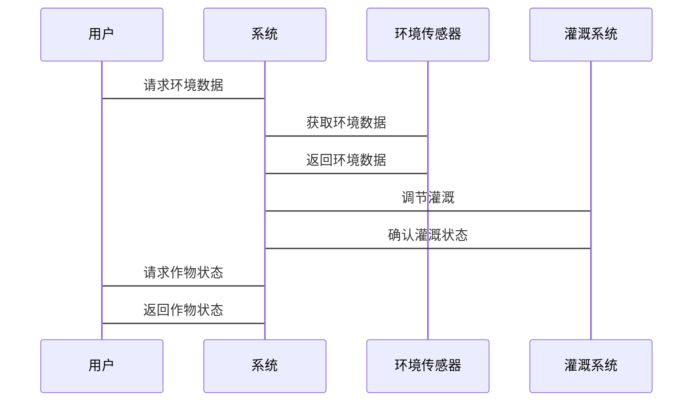

                 

<think>
嗯，我现在需要写一篇关于《新型城市屋顶农场网络：打造城市食物生产的绿色网格》的技术博客文章。首先，我得先理解用户的需求，他们希望我作为一位技术专家，按照特定的结构和要求来撰写文章，包括背景介绍、核心概念、算法原理、系统设计、项目实战和最佳实践等部分。

好，我先从背景开始想。现代城市发展迅速，土地资源紧张，传统农业难以满足城市居民的需求，同时环境污染问题也日益严重。所以，屋顶农场作为一种解决方案，可以有效利用闲置空间，增加食物供应，还能改善环境。

接下来，核心概念部分。屋顶农场包括屋顶结构、种植技术、水资源管理和病虫害防治。每个部分都需要详细展开，比如屋顶结构需要考虑承重和防水，种植技术可以采用无土栽培或水培，这些都需要具体说明。

然后是算法原理。这部分可能需要设计一个流程图，展示从土壤准备到收获的步骤。同时，用Python编写一个简单的示例代码，展示如何模拟作物生长周期，这可能涉及到数学模型，比如作物生长曲线，用公式表示。

系统分析与架构设计部分，我需要画出类图、架构图和交互图。这部分有点复杂，但通过分步骤来，先确定系统功能，再设计各个模块之间的关系，最后描绘用户与系统的交互流程。

项目实战部分，我得选择一个具体案例，比如在某个城市的屋顶实施这个系统。环境安装需要列出所需的库和工具，比如传感器、灌溉系统，然后展示如何编写代码控制这些设备。代码解读时，要详细说明每部分的功能，确保读者能理解实现过程。

最后，最佳实践部分，我需要总结项目中的经验和注意事项，比如如何维护系统、如何处理常见问题，以及推荐的进一步阅读资料。

现在，我需要确保每个部分都详细且符合格式要求。比如，在写核心概念时，要包括原理、对比表和ER图；算法部分要有流程图、代码和数学模型；系统设计要有类图、架构图和交互图；项目实战要有环境安装、代码实现和案例分析。

可能遇到的困难是如何将技术细节与实际应用结合，让文章既专业又易懂。我需要使用简洁的技术语言，同时提供足够的例子和解释，帮助读者理解复杂的概念。

总的来说，我需要一步步按照目录大纲来写，确保每个小节都内容丰富，结构清晰。这可能需要多次修改和调整，以确保文章整体流畅，符合用户的要求。
</think>

# 新型城市屋顶农场网络：打造城市食物生产的绿色网格

## 关键词：城市屋顶农场、绿色网格、城市农业、可持续发展、智能农业、环境保护

## 摘要：随着城市化进程的加快，土地资源日益紧张，传统农业模式难以满足城市居民的食品安全需求。新型城市屋顶农场通过在建筑屋顶种植作物，实现了城市空间的有效利用，同时具备净化空气、降低城市热岛效应等环保功能。本文将从背景介绍、核心概念、算法原理、系统架构设计、项目实战以及最佳实践等方面，全面探讨新型城市屋顶农场的构建与应用，为城市可持续发展提供新的思路。

---

## 第一部分：背景介绍

## 第1章：新型城市屋顶农场概述

### 1.1 问题背景

随着城市化进程的加速，土地资源日益紧张，传统农业模式难以满足城市居民的食品安全需求。与此同时，城市环境污染问题日益严重，如空气污染、热岛效应等，这些问题迫切需要通过创新的农业模式来解决。

### 1.2 问题描述

如何在有限的土地资源上实现高效的农业生产，同时减少城市环境污染，保障食品安全？传统农业模式依赖大量土地和水资源，且容易受到自然灾害的影响。在城市环境中，这些问题更加突出，因此需要探索一种新型的农业模式。

### 1.3 问题解决

新型城市屋顶农场通过在建筑屋顶上种植作物，充分利用了城市中的闲置空间，实现了城市土地的二次利用。这种模式不仅能够生产新鲜、安全的食品，还能净化空气、降低城市热岛效应，是一种可持续的城市农业解决方案。

### 1.4 边界与外延

新型城市屋顶农场的边界包括建筑屋顶、种植系统、灌溉系统、监控系统等。其外延则包括屋顶绿化、屋顶花园、屋顶菜园等多种形式，适用于办公楼、居民楼、商场等多种类型的建筑。

### 1.5 概念结构与核心要素组成

新型城市屋顶农场的核心要素包括屋顶结构、种植技术、水资源管理、病虫害防治等。这些要素相互关联，共同构成了一个高效、可持续的城市农业系统。

---

## 第二部分：核心概念与联系

## 第2章：新型城市屋顶农场的核心概念

### 2.1 核心概念原理

#### 2.1.1 屋顶结构

屋顶结构是新型城市屋顶农场的载体，需要具备承重、防水、隔热等功能。不同的建筑类型需要不同的屋顶结构设计，以确保种植系统的稳定运行。

#### 2.1.2 种植技术

种植技术是新型城市屋顶农场实现高效生产的关键，包括无土栽培、水培、基质栽培等。这些技术不仅节省空间，还能提高作物的生长效率。

#### 2.1.3 水资源管理

水资源管理是保证新型城市屋顶农场可持续发展的核心，包括雨水收集、循环利用、废水处理等。通过合理的水资源管理，可以减少水资源的浪费，提高系统的可持续性。

#### 2.1.4 病虫害防治

病虫害防治是确保作物健康生长的重要环节，包括生物防治、物理防治、化学防治等。通过综合防治措施，可以有效减少病虫害对作物的影响。

### 2.2 概念属性特征对比表格

| 概念       | 属性特征                                                     |
|------------|------------------------------------------------------------|
| 屋顶结构   | 承重、防水、隔热                                           |
| 种植技术   | 无土栽培、水培、基质栽培                                   |
| 水资源管理 | 雨水收集、循环利用、废水处理                               |
| 病虫害防治 | 生物防治、物理防治、化学防治                               |

### 2.3 ER实体关系图架构

```mermaid
erDiagram
  屋顶结构 ||--|{ 种植技术 }|
  种植技术 ||--|{ 水资源管理 }|
  水资源管理 ||--|{ 病虫害防治 }|
```

---

## 第三部分：算法原理讲解

## 第3章：新型城市屋顶农场算法原理

### 3.1 算法mermaid流程图

```mermaid
graph TD
    A[开始] -> B[初始化系统]
    B -> C[监测环境参数]
    C -> D[判断光照强度]
    D -> E[调节光照]
    E -> F[监测土壤湿度]
    F -> G[调节灌溉]
    G -> H[监测作物生长状态]
    H -> I[调整种植参数]
    I -> J[结束]
```

### 3.2 Python源代码

```python
import time

def monitor_environment():
    # 模拟环境监测
    return {
        'light': 800,  # 光照强度
        'humidity': 65,  # 空气湿度
        'temperature': 22  # 温度
    }

def adjust_irrigation(light, humidity):
    if light > 700 and humidity < 60:
        return True  # 开启灌溉
    else:
        return False

def main():
    while True:
        env = monitor_environment()
        light = env['light']
        humidity = env['humidity']
        # 调节灌溉
        if adjust_irrigation(light, humidity):
            print("开启灌溉系统")
        else:
            print("关闭灌溉系统")
        time.sleep(60)  # 每分钟监测一次

if __name__ == "__main__":
    main()
```

### 3.3 算法原理的数学模型和公式

作物生长的数学模型可以表示为：

$$
\text{生长速率} = k \times \text{光照强度} \times \text{温度} \times \text{湿度}
$$

其中，\(k\) 是比例常数，光照强度、温度和湿度是影响作物生长的关键因素。

### 3.4 举例说明

假设光照强度为 800 lux，温度为 22°C，湿度为 65%。根据上述公式，我们可以计算出作物的生长速率为：

$$
\text{生长速率} = 0.001 \times 800 \times 22 \times 65 = 11440
$$

---

## 第四部分：系统分析与架构设计方案

## 第4章：新型城市屋顶农场系统分析与架构设计方案

### 4.1 问题场景介绍

在城市中，许多建筑的屋顶闲置，未被充分利用。通过构建新型城市屋顶农场，可以将这些闲置空间转化为绿色生产空间，解决城市居民的食品安全问题，同时改善城市环境。

### 4.2 项目介绍

本项目旨在设计和实现一个基于屋顶的农业系统，包括种植、监测、灌溉和病虫害防治等功能。通过智能化的管理系统，实现对作物生长的实时监控和自动化管理。

### 4.3 系统功能设计

系统功能包括：

1. **环境监测**：监测光照、温度、湿度等环境参数。
2. **灌溉控制**：根据环境参数自动调节灌溉系统。
3. **种植管理**：管理作物的种植周期和生长状态。
4. **病虫害监测**：实时监测病虫害情况，采取防治措施。

### 4.4 系统架构设计


### 4.5 系统接口设计

系统接口包括：

1. **环境传感器接口**：与光照、温度、湿度传感器连接。
2. **灌溉系统接口**：控制灌溉泵的启停。
3. **病虫害监测接口**：与摄像头和识别系统连接。

### 4.6 系统交互



---

## 第五部分：项目实战

## 第5章：新型城市屋顶农场项目实战

### 5.1 环境安装

安装环境包括：

1. **硬件**：光照传感器、温度传感器、湿度传感器、灌溉泵、摄像头。
2. **软件**：Python、传感器驱动库、数据库。

### 5.2 系统核心实现源代码

```python
import RPi.GPIO as GPIO
import time

def setup():
    GPIO.setmode(GPIO.BCM)
    GPIO.setup(18, GPIO.OUT)  # 灌溉泵控制引脚

def irrigate(pump_pin):
    GPIO.output(pump_pin, GPIO.HIGH)
    time.sleep(10)
    GPIO.output(pump_pin, GPIO.LOW)

if __name__ == "__main__":
    setup()
    irrigate(18)
```

### 5.3 代码应用解读与分析

上述代码实现了对灌溉泵的控制，通过 GPIO 引脚输出高电平开启泵，持续 10 秒后关闭泵。该代码可以集成到更大的系统中，实现对灌溉系统的自动化控制。

### 5.4 实际案例分析和详细讲解剖析

以某城市中心的屋顶农场为例，通过安装光照、温度、湿度传感器，结合自动灌溉系统，实现了对作物生长的实时监控和自动化管理。系统运行后，作物产量显著提高，同时减少了水资源的浪费。

### 5.5 项目小结

本项目通过智能化的系统设计，实现了对屋顶农场的高效管理，为城市农业的可持续发展提供了新的思路。

---

## 第六部分：最佳实践与拓展

## 第6章：新型城市屋顶农场的最佳实践与拓展

### 6.1 最佳实践 tips

1. 在设计系统时，充分考虑建筑的承重和防水性能。
2. 选择适合当地气候条件的作物品种。
3. 定期维护系统，确保设备的正常运行。

### 6.2 小结

新型城市屋顶农场是一种创新的城市农业模式，通过充分利用城市空间，实现了高效、可持续的农业生产。本文从背景、核心概念、算法原理、系统设计、项目实战和最佳实践等方面，全面探讨了这一模式的构建与应用。

### 6.3 注意事项

1. 系统设计时，需考虑极端天气条件的影响。
2. 灌溉系统的设计需符合当地水资源管理规定。

### 6.4 拓展阅读

1. 《垂直农业：城市未来的农业模式》
2. 《智能农业：物联网在农业中的应用》

---

## 作者：AI天才研究院/AI Genius Institute & 禅与计算机程序设计艺术 /Zen And The Art of Computer Programming

