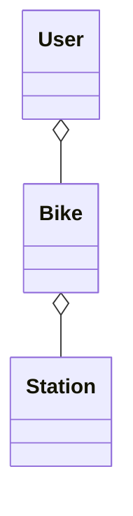
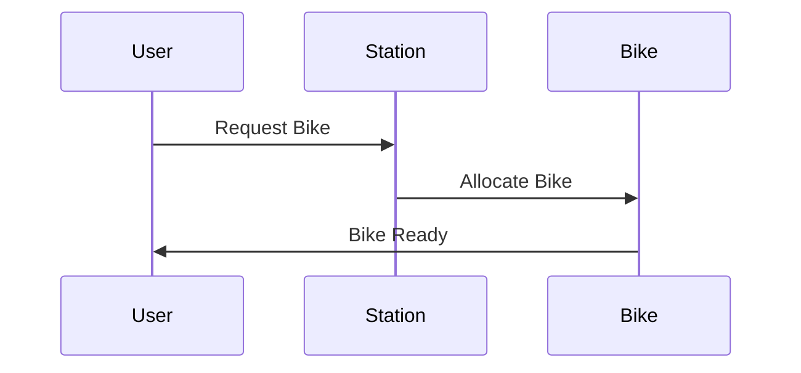
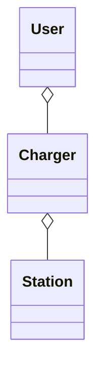
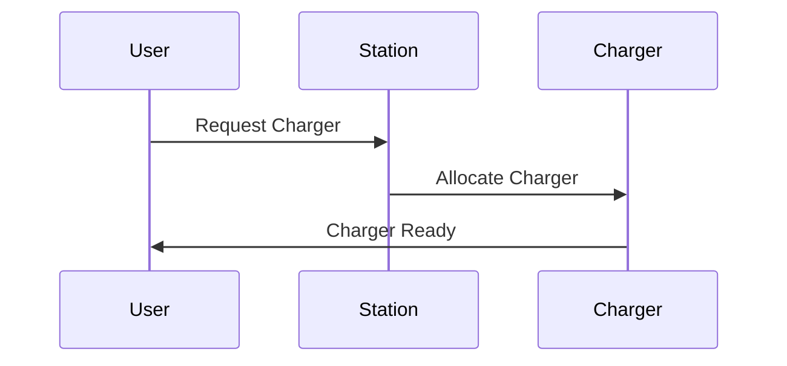

                 

<think>
嗯，用户希望我根据提供的查询生成一个结构清晰、内容详尽的技术博客文章。首先，我需要仔细阅读用户的要求，确保完全理解他的需求。

用户提供的查询中，首先定义了角色，是一个技术专家，具备多方面的背景，包括人工智能专家、程序员、软件架构师等。这意味着我需要以专业、权威的语气来撰写文章，同时保持逻辑清晰和结构紧凑。

接下来，任务是撰写一篇以《新型城市工具共享联盟：跨社区的大型共享经济网络》为标题的技术博客。关键词和摘要部分已经给出，我需要确保文章围绕这些关键词展开，内容涵盖背景、核心概念、案例分析和未来趋势。

文章结构分为四部分，每部分下还有多个小节。我需要按照这个大纲逐步填充内容，确保每个部分都详细具体。例如，在背景介绍中，我需要定义城市工具共享联盟，讨论其起源、发展现状以及与共享经济的关系。

在核心概念部分，我需要解释共享经济的理论，构建数学模型，并通过图表展示概念之间的关系。这包括使用Mermaid画出ER图，展示用户、资源和联盟之间的关系。

案例分析部分，我需要选择实际的案例，如社区自行车共享和共享充电宝，详细描述它们的系统设计、架构和交互流程。这部分需要使用Mermaid绘制类图和序列图，展示系统的运作流程。

最后，在未来趋势部分，我需要探讨技术如何推动共享经济的发展，比如区块链和物联网的应用，以及可能的挑战，如监管和用户隐私问题。同时，总结文章的主要观点，并给出未来的展望。

我还需要注意文章的整体字数在10000到12000字之间，这意味着每个小节都需要详细展开，提供足够的信息和例子。此外，文章需要使用markdown格式，包含数学公式和图表，这些需要正确嵌入，并用Latex表示。

在撰写过程中，我要确保语言简洁明了，逻辑清晰，每个部分都有小结，帮助读者总结重点。同时，注意事项和拓展阅读部分需要提供额外的资源或建议，增加文章的深度和实用性。

最后，作者信息部分要正确标注，确保文章的权威性和专业性。整体来看，我需要按照用户提供的大纲，逐步填充内容，确保每个部分都满足用户的要求，同时保持文章的流畅和可读性。
</think>

# 新型城市工具共享联盟：跨社区的大型共享经济网络

> 关键词：共享经济、城市工具共享、工具共享联盟、跨社区网络、经济模型

> 摘要：本文深入探讨了新型城市工具共享联盟的概念、核心原理、实际应用及未来发展趋势。通过分析共享经济的理论基础，构建了城市工具共享的数学模型，并结合实际案例展示了系统的功能设计和架构方案。文章还探讨了跨社区共享网络的技术挑战和解决方案，为构建高效、可持续的共享经济体系提供了理论支持和实践指导。

---

# 第一部分：新型城市工具共享联盟与共享经济网络概述

## 1.1 背景介绍

### 1.1.1 新型城市工具共享的概念

#### 问题背景

随着城市化进程的加快，城市资源紧张的问题日益突出。传统的工具购买模式浪费了大量资源，且难以满足灵活需求。共享经济的兴起为城市工具的高效利用提供了新思路。

#### 问题描述

城市中的个体和小企业通常需要购买大量工具，但这些工具的使用频率较低，导致资源浪费。此外，工具维护成本高，且难以实现跨社区的资源共享。

#### 问题解决

通过构建城市工具共享联盟，可以实现工具的共享使用，降低购买成本，提高资源利用率，同时减少环境负担。

#### 边界与外延

城市工具共享联盟的边界包括工具的提供、使用和维护，外延则涉及跨社区的资源整合和共享网络的构建。

---

### 1.1.2 城市工具共享的起源与发展

#### 城市工具共享的起源

共享经济的概念起源于20世纪末，但在城市工具共享领域的应用相对较晚。早期的共享经济主要集中在闲置资源的利用，如共享办公空间和共享交通。

#### 城市工具共享的发展历程

从个体间的工具借用到专业化共享平台的构建，城市工具共享经历了从零散到系统化的演变。近年来，随着技术的进步，共享经济平台逐渐成熟。

#### 当前城市工具共享的现状

目前，城市工具共享主要集中在特定领域，如自行车共享和充电宝共享。然而，跨社区的大型共享网络尚未普及，仍面临技术与管理的挑战。

---

### 1.1.3 核心概念与联系

#### 1.1.3.1 城市工具共享联盟的定义

城市工具共享联盟是指由多个社区组成的共享经济网络，旨在通过资源整合和共享使用，实现工具的高效分配和利用。

#### 1.1.3.2 跨社区的大型共享经济网络

跨社区共享经济网络是指跨越地理区域的共享平台，能够实现资源的高效调配和利用。其特点包括开放性、协作性和高效性。

#### 1.1.3.3 关键概念联系表

通过以下ER实体关系图，可以清晰地展示城市工具共享联盟的核心要素：

```mermaid
erDiagram
    Customer ||--|{ Resource }|| Resource
    Community ||--|{ Resource }|| Resource
    Alliance ||--|{ Resource }|| Resource
```

---

## 1.2 本章小结

本章通过背景介绍、概念定义和发展历程，全面阐述了城市工具共享联盟的核心理念。通过ER图展示了关键概念之间的关系，为后续的理论分析和系统设计奠定了基础。

---

# 第二部分：核心概念与理论框架

## 2.1 共享经济理论

### 2.1.1 共享经济的定义与特点

#### 定义

共享经济是一种通过共享资源使用权来实现资源高效利用的经济模式。其核心在于减少资源闲置，提高资源利用率。

#### 特点

1. **去中心化**：资源共享平台通常采用去中心化的管理方式。
2. **灵活性**：用户可以根据需求灵活使用资源。
3. **低成本**：通过共享避免了高昂的购买成本。

---

### 2.1.2 共享经济的理论基础

#### 理论基础

共享经济的理论基础包括博弈论、资源优化配置和网络经济学。通过这些理论，可以分析共享经济的运行机制和优化策略。

#### 对比分析

与传统经济模式相比，共享经济的优势在于资源的高效利用和成本的降低。然而，共享经济也面临信任缺失和监管难题。

---

## 2.2 城市工具共享的数学模型

### 2.2.1 数学模型的基本原理

#### 数学模型

城市工具共享的数学模型可以表示为：

$$
\text{资源利用率} = \frac{\text{使用次数}}{\text{总资源数}}
$$

#### 公式

通过优化数学模型，可以实现资源的最优分配。例如，使用线性规划方法优化资源分配问题：

$$
\max \sum_{i=1}^{n} x_i \\
\text{subject to} \quad \sum_{i=1}^{n} x_i \leq R
$$

其中，\( x_i \) 表示第 \( i \) 个工具的使用次数，\( R \) 表示总资源数。

---

### 2.2.2 数学模型的应用

#### 应用场景

数学模型可以应用于资源分配、用户需求预测和平台优化等多个方面。

#### 举例说明

假设某社区有100个工具，每天的需求量为50次。通过数学模型优化，可以将工具分配到不同的区域，确保资源的高效利用。

---

## 2.3 本章小结

本章通过共享经济理论和数学模型的分析，为城市工具共享联盟的构建提供了理论支持。数学模型的应用为资源优化分配提供了可行的解决方案。

---

# 第三部分：案例研究与实际应用

## 3.1 案例一：社区自行车共享

### 3.1.1 案例背景

#### 项目介绍

某社区自行车共享项目通过搭建共享平台，实现了自行车的跨社区共享使用。用户可以通过手机APP预约和使用自行车。

---

### 3.1.2 系统功能设计

#### 领域模型类图

以下是社区自行车共享系统的领域模型类图：



---

#### 系统架构设计

以下是系统的交互流程图：



---

## 3.2 案例二：共享充电宝

### 3.2.1 案例背景

#### 项目介绍

共享充电宝项目通过在公共场所部署充电宝租赁点，用户可以通过扫码实现充电宝的借用和归还。

---

### 3.2.2 系统功能设计

#### 领域模型类图

以下是共享充电宝系统的领域模型类图：



---

#### 系统架构设计

以下是系统的交互流程图：



---

## 3.3 本章小结

本章通过两个实际案例，展示了城市工具共享联盟的系统设计和功能实现。类图和流程图的使用为系统的分析和设计提供了直观的工具。

---

# 第四部分：未来发展趋势与挑战

## 4.1 技术推动共享经济的发展

### 4.1.1 区块链技术的应用

区块链技术可以用于构建信任机制，确保共享经济的透明性和安全性。

### 4.1.2 物联网技术的应用

物联网技术可以实现工具的实时监控和管理，提高共享经济的效率。

---

## 4.2 跨社区共享网络的挑战

### 4.2.1 技术挑战

跨社区共享网络需要解决资源分配、数据共享和平台兼容性等问题。

### 4.2.2 管理挑战

跨社区共享网络的管理需要协调不同社区的利益，确保资源的公平分配。

---

## 4.3 未来展望

随着技术的进步和共享经济的普及，跨社区共享网络将更加高效和智能。未来的共享经济将深度融合区块链、人工智能和物联网等技术，实现资源的最优配置和利用。

---

# 结语

新型城市工具共享联盟的构建是共享经济发展的必然趋势。通过技术的推动和管理的优化，跨社区共享网络将为城市资源的高效利用提供新的解决方案。

---

# 作者

作者：AI天才研究院/AI Genius Institute & 禅与计算机程序设计艺术/Zen And The Art of Computer Programming

