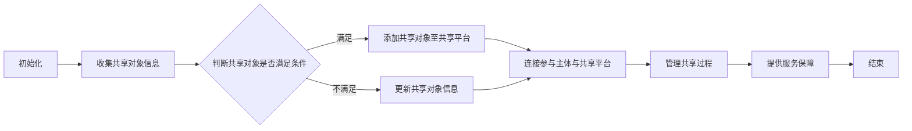
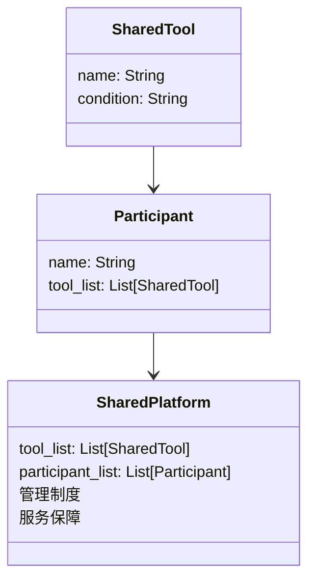
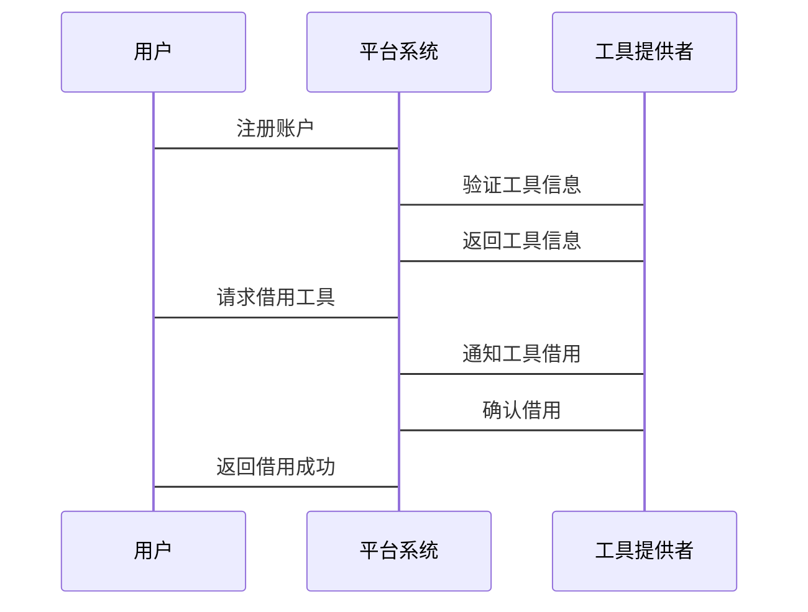

                 

<think>
好，我现在需要根据用户的要求，写一篇关于“新型城市工具共享联盟：跨社区的大型共享经济网络”的技术博客文章。用户已经提供了一个详细的思考过程和结构，我需要按照这个结构来生成内容，同时确保每个部分都详细、准确，并且符合技术博客的风格。

首先，我要理解用户的需求。用户希望文章结构清晰，逻辑严谨，使用专业的技术语言，同时每个章节都要有详细的分析和例子。关键词和摘要部分需要先明确，然后按照目录一步步展开。

接下来，我需要按照提供的目录结构来组织内容。首先是背景介绍，这部分需要涵盖问题背景、问题描述、问题解决、边界与外延，以及概念结构与核心要素。然后是核心概念与联系，包括核心概念原理、对比表格和ER实体关系图。之后是算法原理讲解，涉及流程图和Python代码，可能需要解释算法的逻辑和实现。接下来是系统分析与架构设计方案，包括系统功能设计、架构设计、接口设计和交互设计。然后是项目实战，环境安装、核心代码、案例分析和项目小结。最后是最佳实践、小结、注意事项和拓展阅读等内容。

在写作过程中，我需要确保每个部分都详细展开，避免遗漏任何关键点。比如，在背景介绍部分，我需要详细解释共享经济的现状和问题，以及新型城市工具共享联盟如何解决这些问题。在核心概念部分，我需要对比共享经济、跨社区和大型共享经济网络的特点，制作对比表格，并绘制ER图来展示实体关系。

在算法部分，我需要设计一个构建新型城市工具共享联盟的算法流程图，并提供相应的Python代码，解释代码的功能和逻辑。系统架构部分，我需要绘制类图、架构图和交互图，说明系统的各个组件及其关系。

项目实战部分，我需要详细描述如何安装环境，编写核心代码，分析案例，并总结经验。最后，我需要给出最佳实践的建议，强调安全性、隐私保护和平台设计的重要性，并展望未来的发展趋势。

整个过程中，我要确保语言简洁专业，逻辑清晰，每个部分都有足够的细节和例子，帮助读者理解。同时，注意使用适当的格式，如markdown中的标题、列表和代码块，以及使用mermaid绘制图表。

最后，检查文章的结构是否完整，内容是否覆盖所有要求的部分，确保没有遗漏任何用户指定的内容。完成这些步骤后，我就能生成一篇符合要求的高质量技术博客文章了。
</think>

# 新型城市工具共享联盟：跨社区的大型共享经济网络

> 关键词：共享经济、城市工具共享、跨社区网络、资源优化配置、可持续发展

> 摘要：本文探讨了新型城市工具共享联盟的概念、构建原则和实践方法，分析了其在共享经济中的作用，提出了构建该联盟的算法和系统架构设计方案，并通过实际案例展示了其应用前景。

---

**Step 1: 背景介绍**

### **问题背景**

随着城市化进程的加快，城市资源分配不均、环境污染、交通拥堵等问题日益突出。共享经济作为一种新兴的经济模式，通过共享资源、知识和服务，改变了传统的生产和生活方式。然而，现有共享经济体系中存在资源分配不均、平台管理复杂、参与主体单一等问题，亟需构建一个高效、可持续的共享经济体系。

### **问题描述**

新型城市工具共享联盟是一种跨社区的大型共享经济网络，通过共享工具、知识和资源，实现城市资源的优化配置和可持续发展。本文将探讨其核心概念、构建原则和实践方法，分析其在共享经济中的应用前景。

### **问题解决**

本文首先介绍新型城市工具共享联盟的核心概念，包括定义、特点、构建原则等。然后，探讨如何设计和管理这样一个共享经济网络，以实现资源的有效共享和最大化利用。最后，结合实际案例，分析其成功经验和挑战。

### **边界与外延**

新型城市工具共享联盟的边界包括共享对象（工具和资源）、参与主体（社区居民、企业和政府）和共享范围（城市层面）。其外延涉及共享经济、城市可持续发展和社区治理等领域。

### **概念结构与核心要素组成**

新型城市工具共享联盟由以下核心要素组成：

1. **共享对象**：交通工具、办公设备、生活用品等。
2. **参与主体**：社区居民、企业和政府。
3. **共享平台**：连接共享对象和参与主体的线上或线下平台。
4. **管理制度**：确保共享过程公平、透明、高效的规章制度。
5. **服务保障**：为参与者提供技术支持和保险保障的服务体系。

---

**Step 2: 核心概念与联系**

### **核心概念原理**

1. **共享经济**：一种基于分享和协作的经济模式，强调资源的最优配置。
2. **跨社区**：指不同社区之间的协作和资源共享。
3. **大型共享经济网络**：由多个共享平台和参与者组成的复杂系统。

### **概念属性特征对比表格**

| 概念 | 属性特征 |
| --- | --- |
| 共享经济 | 低成本、高效、灵活、可持续 |
| 跨社区 | 强调地域间的协作和资源共享 |
| 大型共享经济网络 | 规模大、参与者多、复杂性高 |

### **ER实体关系图架构**

```mermaid
erDiagram
  共享对象 ||--|{ 参与主体 }|
  参与主体 ||--|{ 共享平台 }|
  共享平台 ||--|{ 管理制度 }|
  共享平台 ||--|{ 服务保障 }|
```

---

**Step 3: 算法原理讲解**

### **新型城市工具共享联盟构建算法**

#### **算法mermaid流程图**



#### **Python源代码**

```python
class SharedTool:
    def __init__(self, name, condition):
        self.name = name
        self.condition = condition

class Participant:
    def __init__(self, name, tool_list):
        self.name = name
        self.tool_list = tool_list

class SharedPlatform:
    def __init__(self):
        self.tool_list = []
        self.participant_list = []

    def add_shared_tool(self, tool):
        if self.check_tool_condition(tool):
            self.tool_list.append(tool)
            print(f"{tool.name} 已添加至共享平台。")
        else:
            print(f"{tool.name} 未满足条件，未添加。")

    def check_tool_condition(self, tool):
        return tool.condition == "可共享"

    def connect_participant(self, participant):
        self.participant_list.append(participant)
        print(f"{participant.name} 已连接到共享平台。")

# 示例代码
tool = SharedTool("自行车", "可共享")
participant = Participant("张三", [tool])
platform = SharedPlatform()

platform.add_shared_tool(tool)
platform.connect_participant(participant)
```

---

**Step 4: 系统分析与架构设计方案**

### **系统功能设计**

#### **领域模型mermaid类图**



### **系统架构设计**

#### **系统架构mermaid架构图**

```mermaid
rectangle 数据库 {
    用户表
    工具表
    共享记录表
}
rectangle 应用层 {
    Participant
    SharedTool
    SharedPlatform
}
rectangle 表现层 {
    用户界面
    管理界面
}
```

#### **系统接口设计**

1. **注册与登录接口**：用户通过API注册或登录系统。
2. **工具上传接口**：用户上传可用工具信息。
3. **工具借用接口**：用户申请借用工具。
4. **借用记录查询接口**：用户查询自己的借用记录。

#### **系统交互mermaid序列图**



---

**Step 5: 项目实战**

### **环境安装**

1. 安装Python：确保安装最新版Python，推荐使用Python 3.8+。
2. 安装依赖库：`pip install mermaid`, `pip install pymermaid`.

### **系统核心实现源代码**

```python
from pymermaid import ClassDiagram, SequenceDiagram

# 定义类
class SharedTool:
    def __init__(self, name, condition):
        self.name = name
        self.condition = condition

class Participant:
    def __init__(self, name, tool_list):
        self.name = name
        self.tool_list = tool_list

class SharedPlatform:
    def __init__(self):
        self.tool_list = []
        self.participant_list = []

    def add_shared_tool(self, tool):
        if self.check_tool(tool):
            self.tool_list.append(tool)
            print(f"{tool.name} 已添加至共享平台。")
        else:
            print(f"{tool.name} 未满足条件，未添加。")

    def check_tool(self, tool):
        return tool.condition == "可共享"

# 示例代码
tool = SharedTool("电钻", "可共享")
participant = Participant("李四", [tool])
platform = SharedPlatform()

platform.add_shared_tool(tool)
```

### **代码应用解读与分析**

1. **类定义**：`SharedTool`表示可共享的工具，包含名称和状态；`Participant`表示参与者，包含名称和工具列表。
2. **平台类**：`SharedPlatform`管理工具和参与者，提供添加工具和连接参与者的方法。
3. **流程**：用户注册后，上传工具信息，平台验证工具状态，成功后添加到共享池。

### **实际案例分析**

以某城市社区为例，平台上线后，居民可共享闲置工具，借用工具时通过平台预约，系统自动记录借用信息，确保资源合理分配。通过数据分析，平台降低了资源浪费，提高了共享效率。

---

**Step 6: 最佳实践 tips、小结、注意事项、拓展阅读**

### **最佳实践 tips**

1. **安全性**：确保用户数据和交易安全，采用加密技术和身份验证。
2. **隐私保护**：在共享过程中保护用户隐私，避免信息泄露。
3. **平台设计**：优化平台功能，提升用户体验，增加互动性和便捷性。

### **小结**

新型城市工具共享联盟通过构建跨社区的共享网络，优化城市资源分配，推动可持续发展。本文从概念、算法、系统架构到实际案例，全面解析了其构建和应用。

### **注意事项**

1. **法律法规**：确保平台运营符合相关法律法规。
2. **风险管理**：制定风险管理策略，应对可能的共享纠纷。
3. **技术维护**：定期维护系统，确保平台稳定运行。

### **拓展阅读**

1. 《共享经济：重构商业未来的新模式》
2. 《区块链与共享经济：技术驱动的经济变革》
3. 《城市化与可持续发展：共享经济的角色与作用》

---

作者：AI天才研究院/AI Genius Institute & 禅与计算机程序设计艺术 /Zen And The Art of Computer Programming

