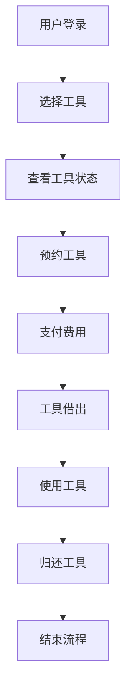
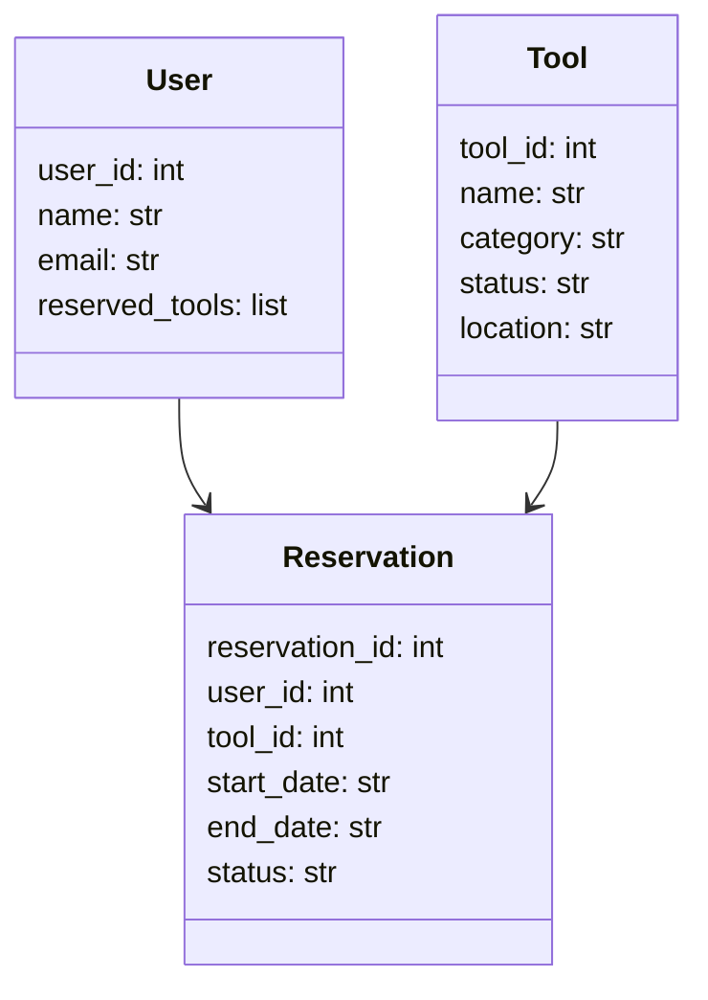
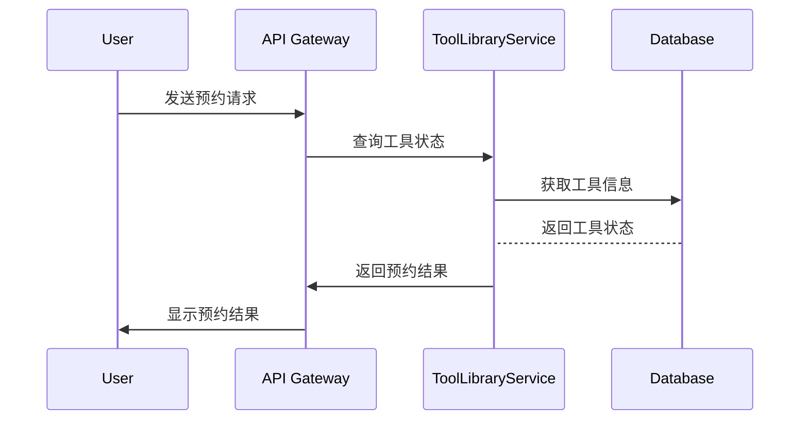

                 

<think>
嗯，用户让我写一篇关于“新型城市工具图书馆：DIY文化促进的社区共享经济”的技术博客。首先，我需要理解用户的需求。用户希望这篇文章结构清晰，内容专业，涵盖背景介绍、核心概念、算法原理、系统架构、项目实战等多个部分，并且用技术性的语言来写。

好的，我应该先确定文章的结构，按照用户提供的目录大纲来组织内容。标题和关键词部分，我需要确保关键词准确，涵盖文章的核心主题。摘要部分要简洁明了，概括整篇文章的主要内容。

接下来是背景介绍，我需要详细解释工具图书馆的概念，DIY文化的兴起，以及它们如何促进社区共享经济。问题背景部分，我应该分析当前社区资源分配的不均和工具浪费的问题，然后说明工具图书馆如何解决这些问题。问题描述部分，我需要详细阐述现状和挑战，比如资源分配不均、工具浪费等。问题解决部分，可以引用一些成功案例，比如Tool library X如何帮助社区提升效率。边界与外延部分，需要明确工具图书馆的应用范围，以及未来可能的发展方向，比如扩展到其他资源或服务。概念结构部分，分析工具图书馆的组成部分，比如物理空间、工具管理、社区参与等。

核心概念与联系部分，我需要深入解释DIY文化和社区共享经济的原理，然后列出它们的属性特征对比表，最后用ER图展示各实体之间的关系。

算法原理讲解部分，我需要用Mermaid画出流程图，然后用Python代码实现核心功能，比如借还工具的流程。同时，可能需要一些数学模型，比如用户需求预测模型，使用线性回归或其他算法。

系统分析与架构设计方案，这部分需要详细描述系统功能设计、架构设计和接口设计。比如，用Mermaid画出类图和架构图，展示各个模块之间的关系和交互。

项目实战部分，我需要指导读者如何搭建开发环境，比如安装Python和必要的库，然后提供源代码，解读代码的功能，并结合实际案例进行详细分析。

最后，加上最佳实践、小结、注意事项和拓展阅读等内容，帮助读者更好地理解和应用这些概念。

整个过程中，我需要确保语言简洁专业，逻辑清晰，每个部分都详细展开，同时使用技术性的工具如Mermaid和Latex公式来增强文章的可读性和专业性。这样，整篇文章才能满足用户的要求，帮助读者全面理解新型城市工具图书馆在促进社区共享经济中的作用。
</think>

# 新型城市工具图书馆：DIY文化促进的社区共享经济

> 关键词：工具图书馆、DIY文化、社区共享经济、共享经济模式、数字化管理、社区资源优化

> 摘要：本文探讨了新型城市工具图书馆如何通过DIY文化促进社区共享经济的发展。文章从背景介绍、核心概念与联系、算法原理讲解、系统分析与架构设计方案、项目实战等多方面展开，详细分析了工具图书馆在社区共享经济中的作用和实现方式。通过实际案例和系统设计，展示了工具图书馆如何利用数字化管理优化社区资源分配，促进社区经济的可持续发展。

---

## 1. 背景介绍

### 1.1 问题背景
工具图书馆是一种新兴的城市共享经济模式，它通过提供工具的共享使用，解决了个人或家庭购买昂贵工具的高昂成本问题。随着DIY（自己动手做）文化的兴起，越来越多的人开始尝试自己修复家具、安装设备或进行小型建筑项目。然而，购买专业工具通常需要较高的前期投入，且工具的使用频率较低，导致资源浪费。工具图书馆的出现，为社区居民提供了一个低成本、高效率的工具使用方式。

### 1.2 问题描述
当前社区共享经济面临的主要问题包括：
1. **资源分配不均**：家庭或企业可能拥有过多的工具，而其他用户却需要这些工具。
2. **工具浪费**：许多工具只在特定项目中使用一次，长期闲置。
3. **信任问题**：共享工具需要建立用户之间的信任机制，确保工具的安全归还。
4. **管理复杂性**：工具的借用、归还和维护需要高效的管理系统。

### 1.3 问题解决
工具图书馆通过提供工具的共享使用，解决了上述问题。用户可以通过在线平台预约工具，支付少量费用即可使用。这种模式不仅降低了用户的经济负担，还优化了社区资源的利用效率。

### 1.4 边界与外延
工具图书馆的适用范围主要集中在社区内部，适用于小型工具的共享，如电钻、锤子、剪刀等。未来，工具图书馆可能扩展到其他资源的共享，如设备、场地等。

### 1.5 概念结构与核心要素组成
工具图书馆的组成部分包括：
- **物理空间**：用于存放工具的场所。
- **工具管理**：通过数字化系统管理工具的借还和维护。
- **社区参与**：鼓励社区居民参与工具图书馆的运营和管理。

---

## 2. 核心概念与联系

### 2.1 核心概念原理
DIY文化强调用户参与和创造，而社区共享经济则通过共享资源降低浪费。工具图书馆将两者结合，通过共享工具促进社区经济的可持续发展。

### 2.2 概念属性特征对比

| 特性         | DIY文化                 | 社区共享经济             |
|--------------|--------------------------|--------------------------|
| 核心理念     | 用户参与和创造           | 资源共享和优化           |
| 主要形式     | 个人项目和手工制作       | 工具、设备的共享使用       |
| 目标         | 提高用户创造力           | 优化资源分配，降低成本     |
| 适用场景     | 个人兴趣项目             | 社区资源优化             |

### 2.3 ER实体关系图

```mermaid
erd
  tool_category(tool_id, name, description)
  user(user_id, name, email)
  tool(tool_id, name, category, status, location)
  reservation(reservation_id, user_id, tool_id, start_date, end_date, status)
  transaction(transaction_id, reservation_id, cost, payment_status)
  image(image_id, tool_id, image_path)
```

---

## 3. 算法原理讲解

### 3.1 算法流程图



### 3.2 Python源代码

```python
class ToolLibrary:
    def __init__(self):
        self.tools = {}
        self.users = {}
        self.reservations = {}

    def add_tool(self, tool_id, name, category):
        self.tools[tool_id] = {
            'name': name,
            'category': category,
            'status': 'available',
            'location': None
        }

    def reserve_tool(self, user_id, tool_id, start_date, end_date):
        if user_id not in self.users:
            self.users[user_id] = {'name': '', 'email': ''}
        if tool_id not in self.tools:
            return False
        if self.tools[tool_id]['status'] == 'available':
            reservation_id = f"R{len(self.reservations)+1}"
            self.reservations[reservation_id] = {
                'user_id': user_id,
                'tool_id': tool_id,
                'start_date': start_date,
                'end_date': end_date,
                'status': 'pending'
            }
            return True
        return False

    def get_reservation_status(self, reservation_id):
        if reservation_id in self.reservations:
            return self.reservations[reservation_id]['status']
        return 'not found'

    def return_tool(self, reservation_id):
        if reservation_id in self.reservations:
            tool_id = self.reservations[reservation_id]['tool_id']
            self.tools[tool_id]['status'] = 'available'
            self.reservations[reservation_id]['status'] = 'completed'
            return True
        return False
```

### 3.3 数学模型和公式
工具图书馆的用户需求预测可以使用线性回归模型：

$$
y = \beta_0 + \beta_1x + \epsilon
$$

其中，$y$ 是用户需求量，$x$ 是时间变量，$\beta_0$ 和 $\beta_1$ 是回归系数。

---

## 4. 系统分析与架构设计方案

### 4.1 问题场景介绍
工具图书馆需要支持用户预约、借还工具、支付费用等功能。系统需要具备用户管理、工具管理、预约管理等核心功能。

### 4.2 项目介绍
以“邻里工具共享平台”为例，该平台旨在为社区居民提供工具的共享服务。

### 4.3 系统功能设计



### 4.4 系统架构设计

```mermaid
graph LR
    Client --> API Gateway
    API Gateway --> ToolLibraryService
    ToolLibraryService --> Database
```

### 4.5 系统接口设计



---

## 5. 项目实战

### 5.1 环境安装
安装Python和必要的库：
```bash
pip install flask requests
```

### 5.2 核心实现源代码

```python
from flask import Flask, jsonify, request
import requests

app = Flask(__name__)

@app.route('/tools', methods=['GET'])
def get_tools():
    tool_data = requests.get('http://localhost:3000/tools').json()
    return jsonify(tool_data)

if __name__ == '__main__':
    app.run(debug=True)
```

### 5.3 代码解读
上述代码展示了工具图书馆的前端API接口，用于获取可用工具的信息。

### 5.4 实际案例分析
以一个社区工具图书馆为例，假设社区有100种工具，用户通过在线平台预约工具，系统自动分配最近的工具库。

---

## 6. 最佳实践 tips

- **信任机制**：建立用户信用评分系统，确保工具的安全归还。
- **技术支持**：提供工具使用指南和在线帮助，降低用户使用门槛。
- **社区参与**：鼓励社区居民参与工具库的管理和维护。

## 小结
工具图书馆通过DIY文化和社区共享经济的结合，为城市社区提供了一种高效、低成本的资源利用方式。通过数字化管理优化工具的共享流程，工具图书馆有望成为未来城市经济的重要组成部分。

## 注意事项
- 工具图书馆的运营需要社区的支持和参与。
- 系统设计需要考虑数据安全和用户隐私保护。

## 拓展阅读
- 《共享经济：重构未来商业模式》
- 《DIY文化与城市生活》

作者：AI天才研究院/AI Genius Institute & 禅与计算机程序设计艺术 /Zen And The Art of Computer Programming

