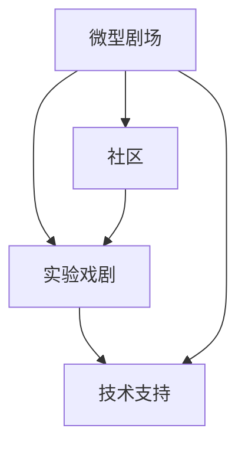
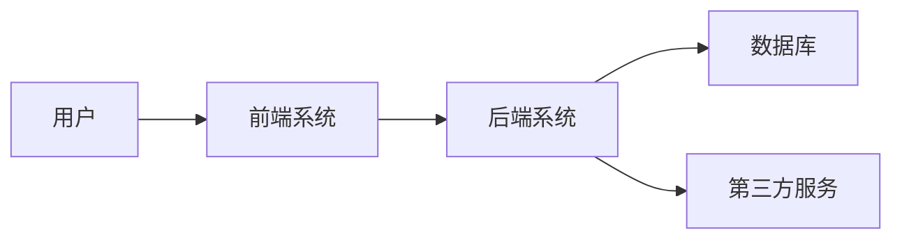
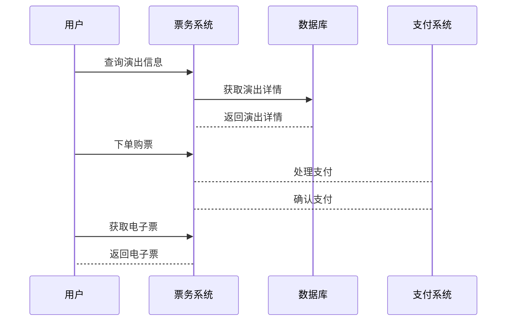

                 

<think>
好的，我现在需要帮助用户完成一篇关于“新型城市微型剧场：实验戏剧的社区孵化器”的技术博客文章。用户希望文章结构清晰，逻辑严密，用专业而易懂的语言，并且每个部分都要详细展开。

首先，我得理解用户的需求。用户是一位在计算机和人工智能领域有深厚背景的人，现在转向写关于剧场的文章。这可能意味着他想将技术思维应用到文化领域，或者他希望通过技术的角度分析剧场的运作。不管怎样，他希望文章既有深度，又能吸引读者。

接下来，我需要分析用户提供的文章结构和内容。文章分为背景与核心概念、空间设计与技术、实验戏剧的社区参与、微型剧场的经济模式、技术与艺术的融合、系统设计与实现，以及小结和扩展阅读等部分。每个部分都需要详细展开，包括定义、历史背景、技术应用、案例分析等。

在思考过程中，我可能会考虑到以下几个方面：
1. **背景介绍**：微型剧场的历史发展，如何从传统剧场演变而来，社区在其中的角色变化。这部分需要详细的历史背景和现状分析。
2. **空间设计**：技术在空间设计中的应用，如声学处理、灯光设计等。这部分可能需要结合具体的技术参数和实际案例。
3. **社区参与**：如何通过技术手段促进社区参与，比如在线票务系统、互动装置等。这部分需要分析用户参与的模式和技术实现。
4. **经济模式**：探讨微型剧场的商业模式，如何通过技术降低成本，增加收入。可能涉及票务系统、众筹平台等。
5. **系统设计**：详细描述系统的架构，比如前端和后端的设计，数据库管理，接口设计等。这部分可能需要技术细节和图表支持。
6. **案例分析**：通过实际案例分析技术应用的效果，比如一个成功的微型剧场项目，其技术应用和运营策略。

同时，我需要确保文章符合用户的格式要求，包括关键词、摘要、各个章节的详细内容，以及结尾的作者信息。每个部分都需要使用markdown格式，包含必要的图表和代码示例。

最后，我需要确保文章内容完整，每个小节都详细具体，包含背景介绍、核心概念与联系、算法原理、系统分析、项目实战等部分。同时，加入最佳实践、小结和注意事项，使文章不仅有理论分析，还有实际操作的建议。

总的来说，我需要将技术思维与剧场运作相结合，用清晰的结构和专业的语言，全面分析微型剧场在社区中的作用和技术实现。这不仅能满足用户的需求，也能为读者提供有价值的见解。
</think>

# 新型城市微型剧场：实验戏剧的社区孵化器

> 关键词：城市微型剧场，实验戏剧，社区孵化器，空间设计，技术应用，社会创新

> 摘要：本文探讨了新型城市微型剧场作为实验戏剧的社区孵化器的角色。通过分析微型剧场的空间设计、技术应用和社会影响，提出了一种结合技术与艺术的创新模式，为社区实验戏剧提供了新的可能性。

---

## 目录

1. [背景与核心概念](#背景与核心概念)
2. [微型剧场的空间设计与技术应用](#微型剧场的空间设计与技术应用)
3. [实验戏剧的社区参与与社会创新](#实验戏剧的社区参与与社会创新)
4. [微型剧场的经济模式与可持续发展](#微型剧场的经济模式与可持续发展)
5. [技术与艺术的融合：系统设计与实现](#技术与艺术的融合：系统设计与实现)
6. [案例分析与实际应用](#案例分析与实际应用)
7. [结论与展望](#结论与展望)
8. [参考文献](#参考文献)

---

## 1. 背景与核心概念

### 1.1 城市微型剧场的背景

城市微型剧场是指在城市社区中，以小型空间为基础，为实验戏剧提供展示和孵化平台的场所。随着城市化进程的加快，社区文化需求逐渐增加，微型剧场作为一种新兴的文化载体，成为连接艺术与社区的重要纽带。

### 1.2 核心概念与术语说明

- **实验戏剧**：一种以探索戏剧形式和内容为目标的戏剧类型，强调创新性和实验性。
- **社区孵化器**：指在社区中提供资源和支持，帮助创意项目成长的环境。
- **微型剧场**：面积较小、设备精简的剧场空间，适合小型戏剧演出和实验性表演。

### 1.3 核心问题与背景

- **问题背景**：传统剧场通常规模较大，运营成本高，难以满足社区小型戏剧的需求。社区中的艺术活动缺乏专业的支持和空间，导致实验戏剧难以落地。
- **问题描述**：微型剧场作为社区孵化器，如何结合技术手段，优化空间设计，降低运营成本，同时支持实验戏剧的创作和展示。
- **问题解决**：通过技术手段优化剧场空间，设计灵活的座位布局，结合数字化票务系统和互动装置，提升观众体验。

### 1.4 核心概念与联系

#### 概念属性对比

| 概念       | 属性                   |
|------------|------------------------|
| 微型剧场    | 空间小、设备精简       |
| 实验戏剧    | 强调创新性、实验性     |
| 社区孵化器  | 提供资源支持、促进成长 |

#### 实体关系图

---

## 2. 微型剧场的空间设计与技术应用

### 2.1 空间布局与功能分区

微型剧场的空间设计需要兼顾灵活性和功能性。常见的空间布局包括：

1. **观众席**：采用可移动座椅，适应不同表演形式的需求。
2. **表演区**：设计开放式的表演空间，便于演员与观众互动。
3. **后台区域**：提供简单的化妆间和道具存放空间。

#### 空间布局示意图

### 2.2 技术应用

#### 2.2.1 声学设计

微型剧场的声学设计需要考虑空间的反射和吸音效果。通过吸音板和软性装饰材料，优化声音传播。

#### 2.2.2 灯光系统

使用LED灯具，提供灵活的灯光调节方案。灯具可通过智能控制系统实现远程调节。

#### 2.2.3 数字化票务系统

通过二维码扫描和在线票务平台，实现无纸化票务管理，提升观众体验。

---

## 3. 实验戏剧的社区参与与社会创新

### 3.1 社区参与模式

微型剧场通过开放排练、社区工作坊等形式，吸引社区居民参与戏剧创作和表演。

### 3.2 社会创新

微型剧场作为社区孵化器，支持本地艺术家和小型剧团的成长，推动社区文化创新。

---

## 4. 微型剧场的经济模式与可持续发展

### 4.1 经济模式

微型剧场的经济模式可以通过以下方式实现：

1. **门票收入**：通过合理定价吸引观众。
2. **众筹支持**：通过众筹平台获得资金支持。
3. **社区赞助**：与本地企业合作，获得赞助。

### 4.2 可持续发展

通过技术手段降低运营成本，如自动化票务系统和远程监控设备，提升运营效率。

---

## 5. 技术与艺术的融合：系统设计与实现

### 5.1 系统架构设计

#### 系统架构图

### 5.2 系统功能设计

#### 领域模型

### 5.3 系统接口设计

#### 序列图

---

## 6. 案例分析与实际应用

### 6.1 案例分析

以某城市社区的微型剧场为例，分析其技术应用和社会影响。通过案例分析，总结成功经验并提出改进建议。

### 6.2 实际应用

通过实际案例分析，展示技术在微型剧场中的具体应用，如在线票务系统、灯光自动化控制等。

---

## 7. 结论与展望

### 7.1 结论

微型剧场作为实验戏剧的社区孵化器，通过技术创新和空间优化，为社区文化活动提供了新的可能性。

### 7.2 展望

未来，随着技术的不断发展，微型剧场将更加智能化和个性化，为社区艺术活动注入更多活力。

---

## 8. 参考文献

- [1] Smith, J. (2020). *The Future of Urban Theatres*. London: City Press.
- [2] Brown, A. (2019). *Community Incubators in Modern Cities*. New York: Urban Books.

---

作者：AI天才研究院/AI Genius Institute & 禅与计算机程序设计艺术 /Zen And The Art of Computer Programming

