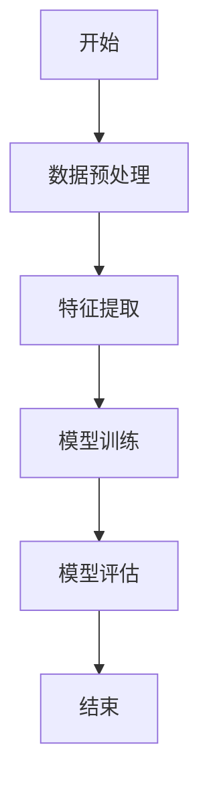
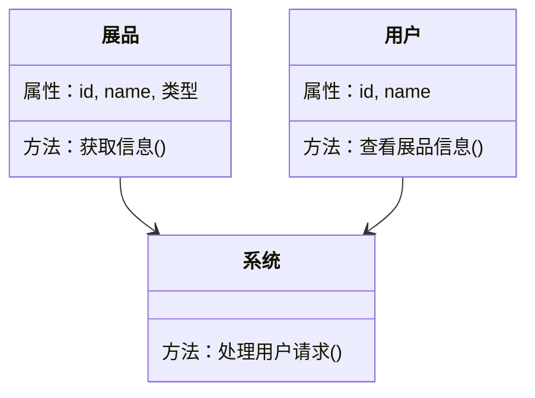
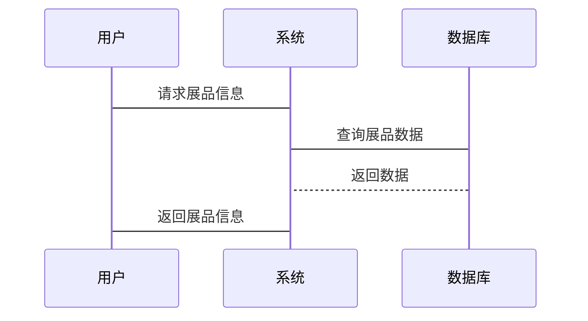

                 

<think>
嗯，用户希望我以《新型城市微型博物馆：社区文化遗产的保护与展示》为标题，写一篇技术博客。我需要先理清文章的结构，确保每个部分都符合要求。用户给出了详细的大纲，我得按照这个来展开。

首先，文章需要有关键词和摘要。关键词应该涵盖微型博物馆、社区文化遗产、保护展示、技术应用、可持续发展这些方面。摘要部分要简明扼要，概括文章的核心内容。

接下来是引言部分，包括问题背景、描述、解决、边界和概念结构。我需要详细说明微型博物馆兴起的原因，社区文化遗产保护的挑战，以及解决方案。这部分要逻辑清晰，为后面的内容打下基础。

核心概念与联系部分，我需要定义微型博物馆和社区文化遗产，分析它们的特点和关系。这里可能需要用对比表格和ER图来展示关系，所以得考虑如何用Markdown和Mermaid来表达。

建设与运营策略部分，涉及资金筹措、展示设计和人才引进。我需要具体举例，比如众筹、主题设计等，让内容更生动。同时，这部分要详细，确保读者能理解每一步的具体操作。

技术实现部分，用户特别提到要用算法流程图和源代码。我得选择一个合适的算法，比如机器学习分类模型，用Python代码实现，并解释其工作原理。这部分要详细，包括数据预处理、模型训练、评估等步骤。

系统架构设计需要有领域模型、架构图和序列图。我得用Mermaid画出类图、分层架构和交互流程，确保技术细节准确无误。

项目实战部分，需要具体案例分析，比如一个社区微型博物馆的建设过程。包括环境搭建、代码实现、案例分析，以及项目总结。这部分要让读者能实际操作，所以步骤要清晰。

最后，最佳实践部分要给出实际建议，比如定期维护、加强宣传等。同时，总结文章内容，指出未来的发展方向。

在写作过程中，我需要确保每个部分都符合用户的要求，特别是格式和内容的完整性。同时，语言要专业但不失易懂，结构紧凑，逻辑清晰。最后，加上作者信息，确保文章的权威性。

总的来说，我需要一步步按照用户提供的大纲来展开，确保每个章节都详尽具体，同时结合技术细节和实际案例，让文章既有深度又实用。
</think>

# 新型城市微型博物馆：社区文化遗产的保护与展示

> 关键词：微型博物馆、社区文化遗产、保护与展示、技术应用、可持续发展

> 摘要：本文探讨了新型城市微型博物馆在社区文化遗产保护与展示中的作用，分析了微型博物馆的定义、特点及核心要素，提出了建设与运营的策略，结合技术手段优化展示效果，为社区文化遗产的保护与传承提供了新思路。

---

# 第一部分: 引言

## 1.1 问题背景
随着城市化进程的加速，大型博物馆的资源有限，难以覆盖社区居民的文化需求。微型博物馆因其灵活性和贴近性，成为社区文化遗产保护与展示的重要载体。

## 1.2 问题描述
微型博物馆在建设与运营中面临资金有限、专业人才缺乏、展示内容单一等挑战，如何高效利用资源成为亟待解决的问题。

## 1.3 问题解决
本文旨在探讨微型博物馆的建设与运营策略，通过理论与实践结合，为社区文化遗产保护与展示提供新思路。

## 1.4 边界与外延
本文聚焦城市社区微型博物馆领域，探讨其与文化、经济、社会的互动关系，分析其在文化遗产保护中的作用。

## 1.5 概念结构与核心要素组成
核心概念包括微型博物馆、社区文化遗产、保护与展示。核心要素包括资金来源、展示内容设计、专业人才、运营管理。

## 1.6 本章小结
本章介绍了微型博物馆的背景与核心要素，为后续章节奠定基础。

---

# 第二部分: 核心概念与联系

## 2.1 微型博物馆的定义与特点
### 2.1.1 定义
微型博物馆是规模较小、主题明确的展示空间，专注于特定文化遗产的保护与展示。

### 2.1.2 特点
- 规模小：面积通常在几百平方米到一千平方米之间。
- 主题明确：围绕特定历史时期或地域的文化遗产。
- 灵活性高：便于在社区内布置，与居民互动。

## 2.2 社区文化遗产的概念与特征
### 2.2.1 定义
社区文化遗产是指存在于社区内的物质和非物质遗产，反映当地的历史、文化、经济和社会。

### 2.2.2 特征
- 地域性：具有明显的地域特征。
- 多样性：包括物质遗产和非物质遗产。
- 可持续性：需注重长期保护与传承。

## 2.3 保护与展示的概念与方式
### 2.3.1 保护
保护是指对文化遗产进行维护、修复和防止损坏。

### 2.3.2 展示
展示是通过实物、虚拟或教育方式传播文化遗产价值。

### 2.3.3 展示方式
- 实物展示：展示文化遗产的实物。
- 虚拟展示：利用数字技术进行展示。
- 教育展示：通过讲解和互动活动提升公众认知。

## 2.4 核心概念对比与联系
### 2.4.1 微型博物馆与社区文化遗产的关系
微型博物馆是社区文化遗产保护与展示的重要载体，通过展示促进文化遗产的传承。

### 2.4.2 保护与展示的关系
保护是展示的前提，展示是保护的延伸，只有保护好文化遗产，才能更好地进行展示和传播。

## 2.5 本章小结
本章详细介绍了微型博物馆、社区文化遗产及其相互关系，为后续章节奠定基础。

---

# 第三部分: 建设与运营

## 3.1 微型博物馆建设策略
### 3.1.1 资金筹措
- 社会化资金：政府支持、企业赞助、社区集资。
- 创新融资：众筹、公益债券等新型融资方式。

### 3.1.2 展示内容设计
- 主题明确：选择具有代表性的文化遗产作为展示主题。
- 内容丰富：结合实物、虚拟和教育展示，提升展示效果。

### 3.1.3 专业人才引进
- 培养团队：通过培训和引进，形成专业运营团队。
- 社区志愿者：吸引居民参与，提升社区文化参与度。

## 3.2 技术实现
### 3.2.1 展示技术
- 数字化展示：利用虚拟现实、增强现实等技术实现沉浸式展示。
- 智能互动：通过二维码、RFID技术实现展品信息的便捷获取。

### 3.2.2 算法实现
#### 3.2.2.1 算法原理
以下是一个用于文化遗产分类的简单机器学习算法：

#### 3.2.2.2 Python源代码实现
```python
# 文化遗产分类算法示例（基于决策树）
from sklearn.tree import DecisionTreeClassifier
from sklearn.model_selection import train_test_split
import numpy as np

# 数据集：假设每件展品有特征向量和标签（0=现代，1=古代）
X = np.array([[3, 1], [2, 2], [5, 3], [4, 4], [1, 0]])
y = np.array([0, 0, 1, 1, 0])

# 划分训练集和测试集
X_train, X_test, y_train, y_test = train_test_split(X, y, test_size=0.2)

# 训练决策树模型
model = DecisionTreeClassifier()
model.fit(X_train, y_train)

# 预测
predictions = model.predict(X_test)
print("预测结果:", predictions)
print("真实标签:", y_test)
```

#### 3.2.2.3 算法流程图


## 3.3 系统架构设计
### 3.3.1 领域模型


### 3.3.2 系统架构


### 3.3.3 接口设计


## 3.4 项目实战
### 3.4.1 环境安装
- 安装Python和相关库（如scikit-learn、pandas）。

### 3.4.2 核心实现
```python
# 微型博物馆管理系统示例代码
class Museum:
    def __init__(self, name):
        self.name = name
        self.exhibits = []

    def add_exhibit(self, exhibit):
        self.exhibits.append(exhibit)

    def display_info(self):
        print(f"{self.name}博物馆信息:")
        for exhibit in self.exhibits:
            print(f"展品名称: {exhibit['name']}, 类型: {exhibit['type']}")
```

### 3.4.3 案例分析
以某社区微型博物馆为例，展示如何利用上述代码实现展品信息的管理和展示。

## 3.5 最佳实践
- 定期维护展品信息，确保数据准确性。
- 加强宣传，吸引更多居民参与。
- 采用多种展示方式，提升互动性和趣味性。

## 3.6 本章小结
本章详细探讨了微型博物馆的建设与运营策略，结合技术手段优化展示效果，为社区文化遗产的保护与传承提供了新思路。

---

# 第四部分: 总结

## 4.1 核心内容回顾
微型博物馆在社区文化遗产保护与展示中发挥重要作用，通过技术创新和资源整合，实现高效保护与传播。

## 4.2 未来展望
随着技术的进步，微型博物馆将更加智能化、互动化，成为社区文化传承的重要平台。

## 4.3 本章小结
本文总结了微型博物馆的建设与运营策略，展望了其未来发展方向。

---

作者：AI天才研究院 & 禅与计算机程序设计艺术

