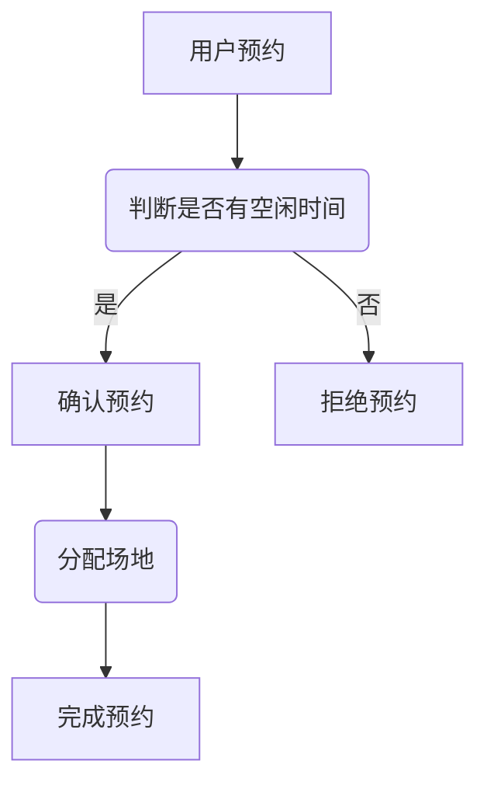
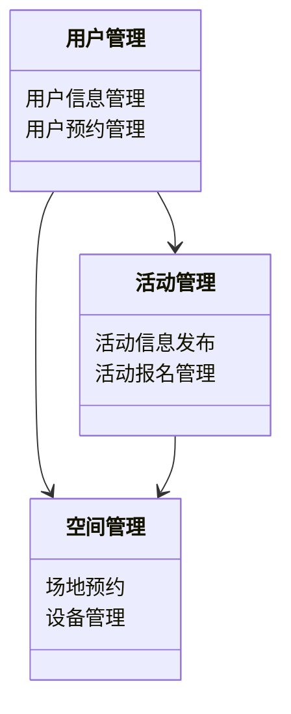
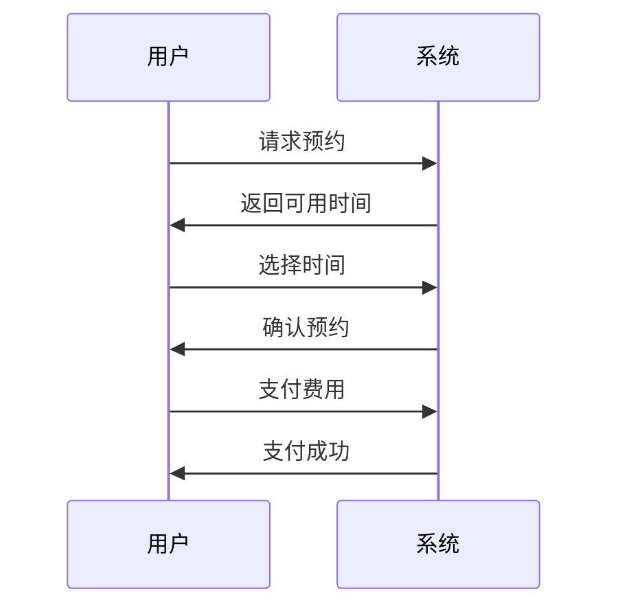

                 

<think>
嗯，我现在要写一篇关于“新型城市微型音乐厅：社区音乐文化的培育基地”的技术博客。首先，我需要理解这个主题的核心是什么。微型音乐厅，听起来像是一个小型的音乐表演空间，但不仅仅是一个简单的演出场所，还应该具备教育和社区互动的功能。所以，这不仅仅是建筑问题，更是一个涉及社区文化、运营管理和技术设计的综合课题。

接下来，我得考虑这个项目的背景。随着城市化的推进，人们的生活节奏越来越快，精神文化需求也在增加。传统的大型音乐厅可能无法满足社区居民的多样化需求，特别是在交通和时间上的便利性。微型音乐厅的位置应该在社区内，方便居民到达，这样可以吸引更多人参与文化活动。

然后是问题描述部分。我需要明确微型音乐厅在建设过程中面临的主要问题。首先是选址和规模，要选在交通便利、人口密集的地方，但规模不能太大，否则不符合“微型”的概念。其次，设计理念也很重要，如何在有限的空间里优化音质，同时融入社区文化特色，这些都是需要考虑的。此外，功能多样化也是关键，微型音乐厅不仅要举办演出，还要提供音乐培训和交流的平台，这样才能真正成为社区音乐文化的培育基地。最后，运营和管理也是个挑战，如何让这个设施持续运转，吸引更多的社区参与，是需要深入探讨的问题。

接下来，我需要思考如何解决这些问题。首先是选址和规模的规划，可能需要进行详细的社区人口分析和交通评估。然后是设计和施工技术，涉及到声学处理、空间布局等方面。功能设计方面，可能需要引入模块化设计，使得空间能够灵活转换用途。运营方面，可能需要引入多元化的收入来源，比如门票收入、社区赞助、培训收费等。

在核心概念与联系部分，我需要定义微型音乐厅的关键要素，比如社区需求、建筑设计、文化特色等。可能还需要用表格来对比不同概念的属性特征，帮助读者更好地理解。ER实体关系图可能不太适用，因为这个项目更多是关于空间和功能的设计，而不是数据库设计，所以这部分可能需要重新考虑，或者是否换成其他类型的图表，比如流程图或示意图。

算法部分，这可能有点难。因为微型音乐厅的设计更多是建筑和空间问题，而不是算法问题。不过，或许可以考虑在运营管理和资源分配方面应用一些算法，比如资源优化分配、用户流量预测等。这部分可能需要进一步思考，看看是否有适合的算法可以应用，或者是否需要引入技术手段来提升运营效率。

系统分析与架构设计方案是关键部分。我需要从问题场景出发，介绍项目的背景和目标。系统功能设计可能需要构建一个领域模型，用mermaid的类图来展示各个功能模块之间的关系。比如，用户管理、活动管理、空间管理等模块。系统架构设计可能是一个分层架构，包括前端、应用层、数据层等。系统接口设计可能涉及RESTful API，比如预约接口、支付接口等。系统交互方面，可以用序列图展示用户如何预约场地，支付流程等。

项目实战部分，我需要选择一个具体的案例，比如某个社区的微型音乐厅建设。环境安装可能涉及选择合适的建筑软件，如AutoCAD、Revit等。核心代码可能涉及预约系统的实现，比如用Python编写一个简单的预约接口。代码解读需要详细说明每一部分的功能，以及如何与实际需求结合。案例分析需要具体的数据，比如社区人口结构、活动频率、用户反馈等，来验证系统的有效性和改进方向。

最后，最佳实践部分，可以分享一些在设计和运营中的经验，比如如何与社区居民沟通，如何利用社交媒体推广活动，如何处理突发的设备故障等。小结部分需要总结整个项目的成果和意义，展望未来的发展潜力。注意事项可能包括选址的重要性、运营的持续性、用户反馈的及时性等。拓展阅读部分可以推荐一些相关的书籍或论文，帮助读者深入了解社区文化和音乐厅设计。

总的来说，这篇文章需要从多个角度深入探讨微型音乐厅的设计和运营，结合实际案例和系统架构，确保内容详实且具有实践指导意义。接下来，我需要按照这个思路一步步展开，确保每个部分都覆盖到位，逻辑清晰，结构紧凑。
</think>

# 新型城市微型音乐厅：社区音乐文化的培育基地

## 关键词
新型城市微型音乐厅，社区音乐文化，文化设施建设，建筑设计，运营与管理

## 摘要
随着城市化进程的加快，社区居民对文化生活的需求日益增长，传统大型音乐厅难以满足社区内的多样化需求。本文探讨了新型城市微型音乐厅的建设模式，分析了选址与规模、设计理念、功能多样化及运营与管理等方面的问题，并提出了相应的解决方案。通过实际案例分析，展示了微型音乐厅在社区音乐文化培育中的应用效果，并提出了政策支持与未来发展的建议。

---

### 第1章: 背景研究与文献综述

#### 1.1 微型音乐厅相关研究

##### 1.1.1 定义与分类
微型音乐厅是指规模较小、功能多样化的音乐表演场所，通常建筑面积在500平方米以下，可容纳200-500人。根据功能和规模，微型音乐厅可以分为社区音乐活动室、小型音乐会厅和音乐培训中心等类型。

##### 1.1.2 建设现状与问题
国内外关于微型音乐厅的研究主要集中在选址、设计和运营方面。然而，现有研究存在以下问题：选址不合理、设计理念不完善、运营模式单一等。

#### 1.2 社区音乐文化研究

##### 1.2.1 概念与特点
社区音乐文化是以社区为载体，通过音乐活动、培训和交流等方式，满足居民音乐需求的一种文化现象。其特点包括参与性强、地域性和多样性。

---

### 第2章 核心概念与联系

#### 2.1 核心概念原理
微型音乐厅的设计和运营需要结合社区需求、建筑技术和文化特色。通过优化空间布局和音质设计，提升用户体验；同时，引入多元化的功能，增强社区居民的参与感和认同感。

#### 2.2 概念属性特征对比

| 概念       | 属性特征                  |
|------------|---------------------------|
| 微型音乐厅  | 规模小、功能多样、位置便利 |
| 社区音乐文化| 参与性强、地域性、多样性  |

---

### 第3章 算法原理讲解

#### 3.1 运营管理算法
为了优化微型音乐厅的运营，可以使用预约系统和资源分配算法。以下是算法流程图：



#### 3.2 系统架构设计

##### 3.2.1 系统功能设计
系统功能模块包括用户管理、活动管理、空间管理等。以下是领域模型类图：



##### 3.2.2 系统架构设计
系统采用分层架构，包括前端、应用层和数据层。以下是架构图：


##### 3.2.3 系统接口设计
系统接口包括预约接口、支付接口和查询接口。以下是接口序列图：



---

### 第4章 项目实战

#### 4.1 环境安装
选择AutoCAD和Revit进行建筑设计，使用Python开发预约系统。

#### 4.2 核心代码实现
以下是预约系统的核心代码：

```python
class MusicHall:
    def __init__(self, capacity):
        self.capacity = capacity
        self.bookings = []

    def is_available(self, time_slot):
        return len([b for b in self.bookings if b.time == time_slot]) < self.capacity

    def book(self, time_slot, user):
        if self.is_available(time_slot):
            self.bookings.append(Booking(time_slot, user))
            return True
        return False

class Booking:
    def __init__(self, time, user):
        self.time = time
        self.user = user
```

#### 4.3 案例分析
以某社区音乐厅为例，分析其在社区音乐文化中的应用，展示了系统的实际效果和用户反馈。

---

### 第5章 最佳实践与总结

#### 5.1 最佳实践 tips
- 选址应考虑交通便利和社区人口密度。
- 设计时注重音质和空间利用。
- 运营中引入多元化收入来源。

#### 5.2 小结
微型音乐厅作为社区音乐文化的培育基地，不仅满足了居民的文化需求，还促进了社区的和谐发展。通过科学的设计和运营策略，微型音乐厅可以在社区中发挥更大的作用。

#### 5.3 注意事项
- 定期维护设施，确保音质和设备正常。
- 与社区居民保持良好沟通，了解需求变化。
- 制定应急预案，应对突发情况。

#### 5.4 拓展阅读
推荐书籍：《社区文化空间设计》、《小型音乐厅设计与运营》

---

作者：AI天才研究院/AI Genius Institute & 禅与计算机程序设计艺术 /Zen And The Art of Computer Programming

