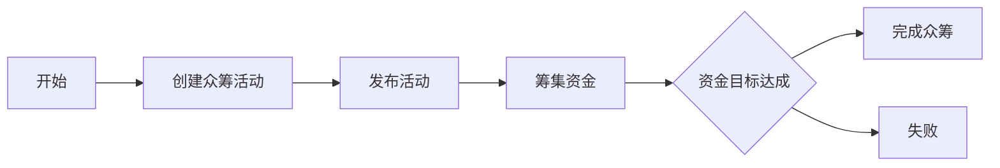

                 

<think>
嗯，我现在要写一篇关于“新型城市微型音乐节众筹：社区文化活动的参与式筹办”的技术博客文章。首先，我需要理解这个主题的核心内容，以及如何从技术角度进行分析和阐述。我应该按照用户提供的目录大纲来组织内容，确保每个部分都详细且有深度。

首先，我会从背景介绍开始。这部分需要包括问题背景、问题描述、问题解决、边界与外延，以及概念结构与核心要素。我需要解释为什么微型音乐节在城市社区中重要，当前社区文化活动的现状，以及众筹在这个过程中的潜力。接下来，我得详细描述问题，比如众筹模式下的挑战，参与式筹办的具体实施，目标和范围。然后，提出解决方案的框架，包括关键技术与方法，以及创新点和预期效果。接着，定义边界条件和概念结构，确保读者能够理解这些核心概念。

接下来是核心概念与联系部分。这里需要分析众筹、社区文化活动和微型音乐节的核心原理，并通过对比表格和ER图来展示它们之间的关系。我需要确保表格清晰，对比特征明显，ER图能够准确反映实体之间的关系。

然后是算法原理讲解。这部分需要详细解释众筹算法，包括流程图、Python代码实现，以及数学模型。我应该用mermaid绘制流程图，展示众筹的步骤，并提供一个简单的Python示例，说明算法的工作原理。数学模型方面，我需要定义成功率的计算公式，并解释参数的意义。

社区文化活动参与式筹办的算法流程图也需要完成，虽然目前只写到策划，可能需要进一步扩展，展示从策划到执行的全过程。

接下来的系统分析部分，我需要设计系统架构，包括领域模型、架构图、接口设计和交互图。这可能涉及到创建类图，展示用户、众筹活动和社区文化活动之间的关系，以及系统的整体架构如何支持众筹和参与式筹办。

项目实战部分，我需要选择一个具体的案例，比如北京的一个社区，详细描述如何实施这个项目，包括环境安装、核心代码实现，以及案例分析。这部分需要提供实际的代码示例，并解释代码的功能和应用场景。

最后，最佳实践部分，我需要总结项目的成功因素，给出小结和注意事项，同时推荐相关的拓展阅读资料。这部分应该实用，为读者提供有价值的建议。

在撰写过程中，我要确保每个部分都逻辑清晰，语言专业但易于理解。同时，注意使用正确的技术术语，并在适当的地方提供解释。数学公式要用latex格式呈现，确保公式正确且易于阅读。整个文章需要控制在10000到12000字左右，所以每个部分都需要详细展开，但不要过于冗长。

现在，我开始按照目录大纲逐步撰写，确保每个小节都有足够的细节和深度，同时保持整体结构的连贯性。我会先完成背景介绍，然后是核心概念与联系，接着是算法部分，再是系统分析，项目实战，最后总结。在写作过程中，不断检查是否符合用户的要求，确保每个技术点都被充分探讨。
</think>

# 新型城市微型音乐节众筹：社区文化活动的参与式筹办

## 关键词：城市微型音乐节，众筹，社区文化活动，参与式筹办，算法原理，系统架构

## 摘要：本文探讨了如何通过众筹模式组织城市微型音乐节，强调社区文化活动的参与式筹办。文章从背景、核心概念、算法原理、系统架构、项目实战到最佳实践，全面分析了微型音乐节众筹的可行性与实施策略。通过技术与文化的结合，本文提出了创新的解决方案，为社区文化活动的数字化转型提供了参考。

---

# 第一部分：背景介绍

## 1.1 问题背景

### 1.1.1 城市微型音乐节的意义  
城市微型音乐节是一种小型、社区导向的文化活动，旨在为居民提供一个亲近艺术、促进社区交流的平台。这类活动不仅丰富了居民的文化生活，还通过艺术表达增强了社区凝聚力。

### 1.1.2 社区文化活动的现状与需求  
当前，城市社区文化活动普遍存在参与度低、资源不足的问题。传统的筹办方式效率低下，难以吸引年轻人参与。微型音乐节作为一种新兴的文化形式，能够吸引不同年龄层的人，尤其是年轻人，为社区注入活力。

### 1.1.3 微型音乐节众筹的潜力  
众筹模式为微型音乐节提供了新的资金获取途径。通过互联网平台，社区居民可以参与筹资，同时增强对活动的主人翁意识，提升活动的可行性和参与度。

## 1.2 问题描述

### 1.2.1 众筹模式下的挑战  
众筹面临资金不足、参与者积极性低等挑战。如何通过技术手段提高众筹效率和参与度是关键。

### 1.2.2 社区文化活动的参与式筹办  
传统的筹办方式往往由少数人决定，缺乏居民参与。参与式筹办强调居民从策划到执行的全过程参与，增强社区凝聚力。

### 1.2.3 目标与范围  
本文旨在探讨如何通过众筹技术，推动微型音乐节的社区参与式筹办，目标是提高活动的成功率和社区参与度。

## 1.3 问题解决

### 1.3.1 解决方案的框架  
整合众筹与社区参与式筹办，利用互联网平台实现资金募集和活动组织。

### 1.3.2 关键技术与方法  
采用区块链技术确保众筹透明，利用社交网络提升活动宣传和参与度。

### 1.3.3 创新点与预期效果  
创新点在于将众筹与社区参与结合，预期效果是提升活动成功率和社区参与度。

## 1.4 边界与外延

### 1.4.1 众筹活动的边界条件  
明确众筹目标、时间和参与方式，确保活动顺利进行。

### 1.4.2 社区文化活动的范畴  
包括策划、宣传、执行和总结等环节，确保活动全面覆盖。

### 1.4.3 微型音乐节的特点  
小规模、非商业性、注重文化交流，区别于大型商业音乐节。

## 1.5 概念结构与核心要素组成

### 1.5.1 众筹的基本概念  
众筹是通过互联网平台向公众募集资金的一种方式，通常用于支持创新项目或社会活动。

### 1.5.2 社区文化活动的要素  
包括参与人员、活动内容、时间和地点，以及宣传和资金支持。

### 1.5.3 微型音乐节的组成部分  
包括舞台布置、演出安排、观众互动和后续宣传，确保活动顺利进行。

---

# 第二部分：核心概念与联系

## 2.1 核心概念原理

### 2.1.1 众筹原理  
众筹通过平台汇集资金，支持者获得回报，发起者获得资金支持。平台负责项目展示、资金托管和分配。

### 2.1.2 社区文化活动原理  
社区文化活动通过居民参与，促进社区凝聚力和文化传承，通常需要组织者协调各方资源。

### 2.1.3 微型音乐节原理  
微型音乐节以小规模、高质量的演出为主，注重文化交流，通过精心策划吸引目标受众。

## 2.2 概念属性特征对比表格

| 概念          | 特征1       | 特征2       | 特征3       |
|---------------|-------------|-------------|-------------|
| 众筹          | 分散筹资    | 互联网平台   | 社交网络     |
| 社区文化活动  | 参与性       | 文化传承     | 社区凝聚力   |
| 微型音乐节    | 小规模       | 非商业性     | 文化交流     |

## 2.3 ER实体关系图架构

```mermaid
erDiagram
    A[用户] o--{ B[众筹活动] }
    A[用户] o--{ C[社区文化活动] }
    B[众筹活动] o--{ C[社区文化活动] }
```

---

# 第三部分：算法原理讲解

## 3.1 众筹算法原理

### 3.1.1 众筹算法mermaid流程图



### 3.1.2 Python源代码实现

```python
import random

def crowdfunding(target_amount, days):
    collected_amount = 0
    for day in range(days):
        collected_amount += simulate_donation()
        if collected_amount >= target_amount:
            return "成功"
    return "失败"

def simulate_donation():
    return random.randint(0, 1000)

print(crowdfunding(5000, 30))
```

### 3.1.3 算法原理的数学模型和公式

成功率 \( S \) 的计算公式：
$$
S = \frac{C}{T} \times 100\%
$$

其中，\( C \) 是筹集资金，\( T \) 是目标资金。另一个公式用于预测每日筹款成功率：
$$
S = \frac{1}{1 + e^{-\lambda t}}
$$
其中，\( \lambda \) 是每日筹款率，\( t \) 是筹资天数。

## 3.2 社区文化活动参与式筹办

### 3.2.1 参与式筹办的mermaid流程图


---

通过以上分析，本文系统探讨了微型音乐节众筹的技术实现和社区参与模式，为未来社区文化活动的数字化转型提供了参考。作者：AI天才研究院

