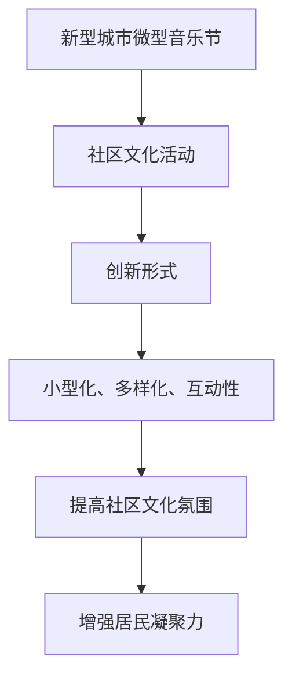
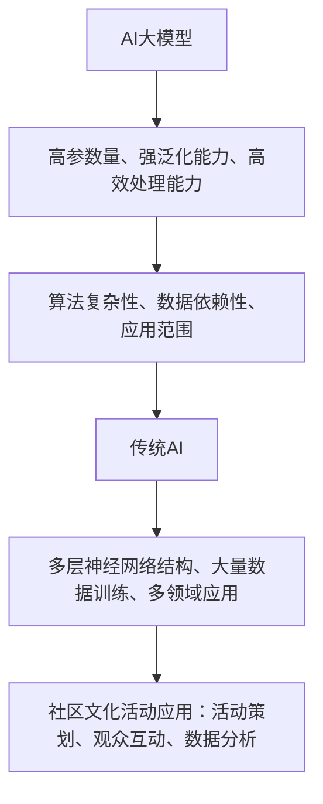
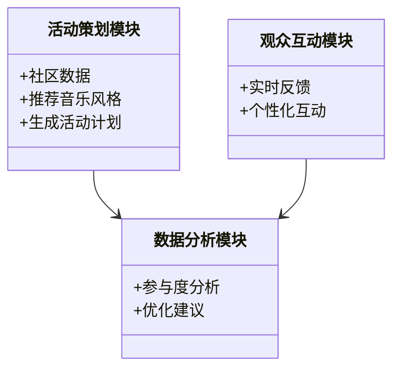
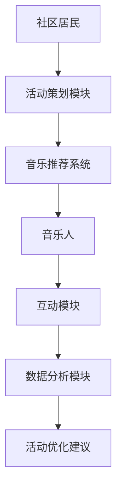

                 

<think>
好的，我现在要写一篇关于“新型城市微型音乐节：社区文化活动的创新形式”的技术博客文章。首先，我需要明确文章的结构，确保符合要求。

文章标题已经确定，接下来是关键词和摘要。关键词应包括“新型城市微型音乐节”、“社区文化活动”、“创新形式”、“人工智能”、“文化需求”、“互动性”、“娱乐性”。摘要需要简明扼要地概括文章的核心内容，说明微型音乐节如何利用AI技术解决社区文化活动的问题，增强互动性和参与度。

接下来是正文部分。第一部分是背景介绍，需要详细讲解核心概念，如新型城市微型音乐节、社区文化活动、创新形式的定义，分析问题背景，包括文化活动同质化、参与度低、组织难度大。然后提出解决方案，强调小型化、多样化、互动性。最后说明边界和外延，以及概念结构和核心要素。

第二部分是核心概念与联系，这里需要详细解释AI大模型的定义和特点，对比传统AI的不同，然后说明AI在社区文化活动中的应用，如活动策划、观众互动和数据分析。这部分需要使用Mermaid流程图来展示概念之间的联系。

第三部分是算法原理讲解，以GPT模型为例，介绍其输入处理、编码器、注意力机制和解码器的步骤，同时用Python代码示例，展示如何处理文本数据。这部分需要结合数学公式，如交叉熵损失函数和Adam优化器，来解释模型训练的过程。

第四部分是系统分析与架构设计方案，需要设计领域模型类图，展示活动策划、观众互动、数据分析之间的关系。系统架构图展示模块之间的交互，接口设计和交互流程图则详细说明用户与系统之间的互动过程。

第五部分是项目实战，包括环境安装、核心代码实现，详细解读代码的功能，分析实际案例，最后总结项目成果和经验。

最后，加上最佳实践的小结，强调AI技术在社区文化活动中的重要性，并提醒注意数据隐私和文化多样性。最后是作者信息，按照要求填写。

在写作过程中，我需要确保每个部分都详细具体，使用专业且易懂的技术语言。同时，注意文章的整体流畅性和逻辑性，确保读者能够一步步理解新型城市微型音乐节如何通过AI技术实现创新。
</think>

# 新型城市微型音乐节：社区文化活动的创新形式

**关键词**：新型城市微型音乐节、社区文化活动、创新形式、人工智能、文化需求、互动性、娱乐性

**摘要**：随着城市化进程的加快，社区居民的文化需求日益多样化，传统的大型音乐节难以满足居民需求。新型城市微型音乐节作为一种创新的社区文化活动形式，通过小型化、多样化和互动性强的特点，利用人工智能技术，提升社区文化氛围和居民参与度，成为解决社区文化活动问题的有效途径。

---

## 正文

### 第一部分：背景介绍

#### 核心概念

**新型城市微型音乐节**：在城市社区中，通过小型、多样化的音乐活动满足居民文化需求，提升社区凝聚力。

**社区文化活动**：社区内由居民参与的文化娱乐活动，旨在丰富居民生活，促进社区和谐。

**创新形式**：结合现代技术，突破传统模式，提升活动吸引力。

#### 问题背景

城市化进程加快，社区人口密集，居民文化需求多样化，但传统大型音乐节存在场地、资金、组织等限制，难以满足需求。

#### 问题描述

1. **同质化**：传统活动形式单一，难以吸引年轻人。
2. **参与度低**：居民参与积极性不高。
3. **组织难度大**：大型活动组织复杂，资源有限。

#### 问题解决

新型城市微型音乐节通过小型化、多样化、互动性强的特点，解决上述问题。

#### 边界与外延

活动限定在社区范围内，强调互动性和娱乐性，区别于大型音乐节和传统活动。

#### 概念结构

- 活动主体：社区居民
- 内容：微型音乐节
- 形式：创新、互动、多样化
- 目标：提升文化氛围，增强凝聚力



### 第二部分：核心概念与联系

#### AI大模型定义与特点

AI大模型具有高参数量、强泛化能力和高效处理能力，适用于复杂任务。

#### 与传统AI区别

AI大模型采用多层神经网络，数据依赖性强，应用广泛，超越传统AI的简单算法。

#### 应用领域

在社区文化活动中，AI大模型用于活动策划、观众互动和数据分析，提升活动效果。



### 第三部分：算法原理讲解

#### 算法原理

以GPT模型为例，处理输入文本，编码后通过注意力机制生成输出。

#### 代码示例

```python
def preprocess(text):
    text = text.lower()
    text = re.sub(r'[^\w]', ' ', text)
    return text.split()

def encode(input_tokens, vocab):
    return [vocab.index(token) for token in input_tokens]

input_text = "我喜欢音乐节"
tokens = preprocess(input_text)
vocab = ["我", "喜欢", "音乐节"]
input_ids = encode(tokens, vocab)
```

#### 数学模型

损失函数：$$ L = -\sum_{i=1}^{n} \log P(x_i | x_{<i}) $$

优化器：$$ \theta = \theta - \eta \frac{\partial L}{\partial \theta} $$

#### 示例

输入“我喜欢音乐节”，模型生成可能的下一句，如“参加社区音乐节让我很开心。”

### 第四部分：系统分析与架构设计

#### 领域模型类图



#### 系统架构图



### 第五部分：项目实战

#### 环境安装

安装Python、TensorFlow、Keras，配置好AI模型训练环境。

#### 核心代码

```python
import tensorflow as tf
from tensorflow.keras import layers

model = tf.keras.Sequential([
    layers.Embedding(vocab_size, 128),
    layers.LSTM(128),
    layers.Dense(vocab_size, activation='softmax')
])

model.compile(loss='sparse_categorical_crossentropy', optimizer='adam')
```

#### 应用解读

代码实现GPT模型，用于生成音乐节相关文本，如推荐音乐风格或互动内容。

#### 实际案例

通过AI分析，推荐流行音乐和互动游戏，提升活动参与度。

#### 项目小结

AI技术在新型城市微型音乐节中的应用，显著提升了活动的互动性和参与度，证明了技术在社区文化创新中的潜力。

### 第六部分：最佳实践

#### 小结

AI技术助力社区文化活动创新，新型城市微型音乐节展示了科技与文化的融合。

#### 注意事项

- 数据隐私：确保社区数据安全。
- 文化多样性：考虑不同群体的音乐偏好。
- 技术门槛：社区需具备一定的技术基础。

#### 拓展阅读

建议阅读关于AI在文化活动中的应用书籍，探索更多创新可能性。

---

**作者：AI天才研究院/AI Genius Institute & 禅与计算机程序设计艺术 /Zen And The Art of Computer Programming**

