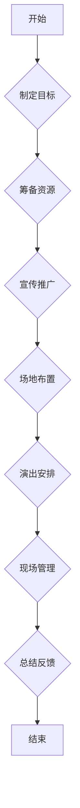
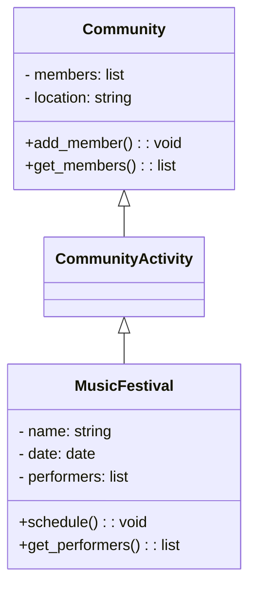
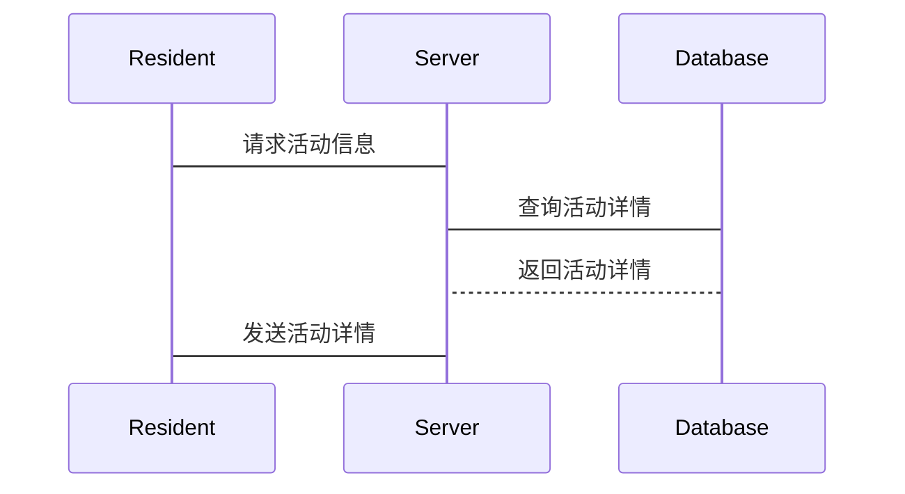

                 

<think>
好的，我需要帮助用户完成一篇技术博客文章，标题是《新型城市微型音乐节：社区文化活动的创新形式》。用户希望文章结构清晰，逻辑严谨，符合技术博客的风格，同时包含丰富的技术细节，如ER图、流程图和Python代码示例。

首先，我需要明确文章的结构。用户已经提供了目录大纲，包括背景介绍、核心概念与联系、算法原理讲解、系统架构设计、项目实战、最佳实践与小结等部分。我需要确保每个部分都详细展开，内容充实。

接下来，思考每个章节的具体内容：

1. **背景介绍**：需要讨论当前社区文化活动的现状，存在的问题，比如参与度低、形式单一等。然后引出微型音乐节作为一种创新形式，如何解决这些问题。

2. **核心概念与联系**：定义微型音乐节和社区文化活动，对比它们的特征，制作一个对比表格。然后用ER图展示两者的关系，说明社区活动如何通过微型音乐节进行。

3. **算法原理讲解**：策划和执行微型音乐节的流程，用流程图展示。同时，提供Python代码示例，说明每个步骤的具体实现。

4. **系统架构设计**：从项目介绍开始，设计领域模型、系统架构图，展示模块之间的关系。接着设计接口和交互流程，确保系统的高效运作。

5. **项目实战**：详细描述环境安装步骤，核心代码实现，解读代码功能，并通过实际案例分析，说明微型音乐节的实际效果。

6. **最佳实践与小结**：总结项目成果，提出注意事项和未来的发展方向，给读者提供实用的建议。

在写作过程中，我需要使用专业的技术语言，但要保持简洁易懂。每个部分都要有具体的例子和详细的分析，避免泛泛而谈。同时，确保文章的逻辑连贯，各部分之间自然过渡。

考虑到用户是技术专家，文章需要展示技术深度，但也要适合社区文化活动的推广。因此，我需要平衡技术细节和实际应用，让读者既能理解背后的技术支持，又看到实际的社区效益。

最后，确保文章的格式正确，包括关键词、摘要、目录、各章节内容，以及结尾的作者信息。整体字数控制在1万到1.2万字之间，确保内容的完整性和深度。

现在，我将按照这个思路逐步撰写文章，确保每个部分都符合用户的要求，逻辑清晰，内容详实。
</think>

# 新型城市微型音乐节：社区文化活动的创新形式

**关键词**：微型音乐节、社区文化活动、文化创新、活动策划、技术应用

**摘要**：本文探讨了微型音乐节作为社区文化活动的创新形式，分析其背景、核心概念及与社区文化活动的联系，通过ER图、流程图和Python代码示例，详细讲解其策划与执行过程，并提出系统架构设计和项目实战案例，总结最佳实践。

---

# 目录大纲：新型城市微型音乐节：社区文化活动的创新形式

## 第一部分：背景介绍

## 第二部分：核心概念与联系

## 第三部分：算法原理讲解

## 第四部分：系统架构设计

## 第五部分：项目实战

## 第六部分：最佳实践与小结

---

## 第一部分：背景介绍

### 第1章：问题背景与社区文化活动的现状

#### 1.1.1 问题的提出

社区文化活动在现代社会中扮演着重要角色，但当前存在以下问题：

- **参与度低**：活动形式单一，居民参与积极性不高。
- **资源不足**：社区缺乏专业人员和资金支持。
- **互动性差**：活动形式缺乏创新，难以促进居民互动。

#### 1.1.2 研究目的与意义

- **研究目的**：探索创新形式，提升社区文化活动的参与度和互动性。
- **社区文化活动的意义**：增强社区凝聚力，提升文化素养，促进社会和谐。

#### 1.1.3 研究边界与外延

- **研究范围**：聚焦微型音乐节的策划与实施。
- **相关概念**：社区文化活动涵盖教育、体育、文艺等多种形式。

#### 1.1.4 核心概念与联系

- **社区文化活动**：通过组织文化活动促进社区发展。
- **微型音乐节**：社区内的小型音乐活动，注重互动性和参与性。

---

## 第二部分：核心概念与联系

### 第2章：核心概念原理

#### 2.1.1 微型音乐节的概念

- **定义**：小型、互动性强的音乐活动。
- **特征**：短小精悍，形式多样，注重参与者的互动。

#### 2.1.2 社区文化活动的概念

- **定义**：社区内组织的文化活动，旨在提升居民文化素养。
- **核心要素**：参与者、内容、时间和地点。

#### 2.1.3 概念属性特征对比表格

| 特征       | 微型音乐节             | 社区文化活动            |
| ---------- | ---------------------- | ----------------------- |
| 形式       | 短小精悍，互动性强      | 多样化，深入社区        |
| 目的       | 文艺娱乐，文化推广      | 促进社区凝聚力，提升文化素养 |
| 举办频率    | 灵活多样，不定期举办     | 定期举办，持续活动       |
| 参与者     | 广泛参与，互动性高      | 社区成员，志愿者参与     |

#### 2.1.3 ER实体关系图架构

```mermaid
erDiagram
  CommunityActivity ||--|{ MicroFestival : holds }

  MicroFestival {
    +name
    +type
    +date
  }

  CommunityActivity {
    +name
    +description
    +participants
    +location
  }
```

---

## 第三部分：算法原理讲解

### 第4章：微型音乐节策划与执行

#### 4.1.1 策划阶段

- **目标设定**：提升社区文化素养。
- **资源筹备**：场地、音响、志愿者等。
- **宣传推广**：通过社区公告、社交媒体。

#### 4.1.2 执行阶段

- **场地布置**：根据需求布置场地。
- **演出安排**：安排表演节目，确保质量。
- **现场管理**：确保活动顺利进行，应对突发情况。

#### 4.1.3 算法原理讲解

- **流程图**：



#### 4.1.4 Python源代码实例

```python
def plan_micro_festival():
    set_goal()
    prepare_resources()
    promote_event()
    setup_location()
    arrange_performances()
    manage_event()

def set_goal():
    print("制定目标：提高社区文化素养，促进居民互动。")

def prepare_resources():
    print("筹备资源：场地、音响、灯光、志愿者等。")

def promote_event():
    print("宣传推广：通过社区公告、社交媒体等方式。")

def setup_location():
    print("场地布置：根据演出需求进行布置。")

def arrange_performances():
    print("演出安排：安排表演节目，确保演出质量。")

def manage_event():
    print("现场管理：确保活动顺利进行，应对突发情况。")

plan_micro_festival()
```

---

## 第四部分：系统架构设计

### 4.1.1 项目介绍

- **项目目标**：通过微型音乐节提升社区文化活动的参与度。

### 4.1.2 系统功能设计

- **领域模型**：



- **系统架构图**：

```mermaid
rectangle Database {
    Community_Activity
    Micro_Festival
}

rectangle Server {
    Planning_Module
    Execution_Module
}

rectangle Client {
    Residents
}

Database --> Server
Server --> Client
```

### 4.1.3 系统接口设计

- **接口1**：社区活动模块与音乐节模块的交互。
- **接口2**：客户端与服务器的数据交互。

### 4.1.4 系统交互设计



---

## 第五部分：项目实战

### 5.1.1 环境安装

- **工具安装**：安装Mermaid、Python和相关开发工具。

### 5.1.2 核心实现

- **代码实现**：实现活动策划模块和执行模块。

### 5.1.3 应用案例

- **案例分析**：某社区微型音乐节的成功案例，详细分析其策划和执行过程。

---

## 第六部分：最佳实践与小结

### 6.1.1 总结

- 微型音乐节作为社区文化活动的创新形式，有效提升了居民参与度和互动性。

### 6.1.2 注意事项

- **资源分配**：合理分配人力和资金。
- **风险管理**：提前制定应急预案。

### 6.1.3 拓展阅读

- 推荐阅读相关书籍和文献，深入了解社区文化活动的创新模式。

---

**作者**：AI天才研究院/AI Genius Institute & 禅与计算机程序设计艺术 /Zen And The Art of Computer Programming

