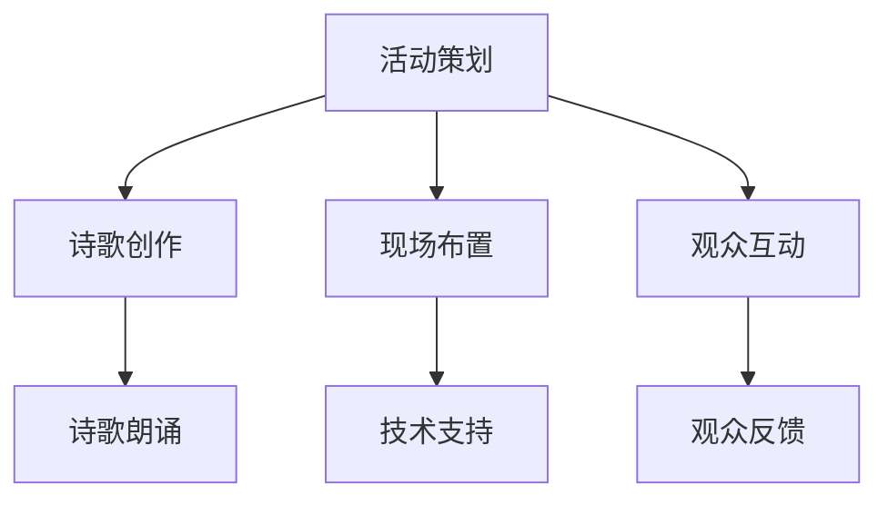
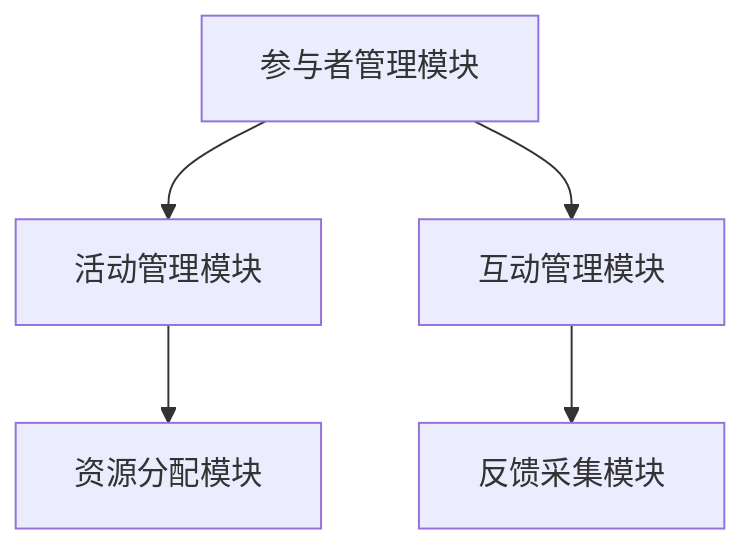
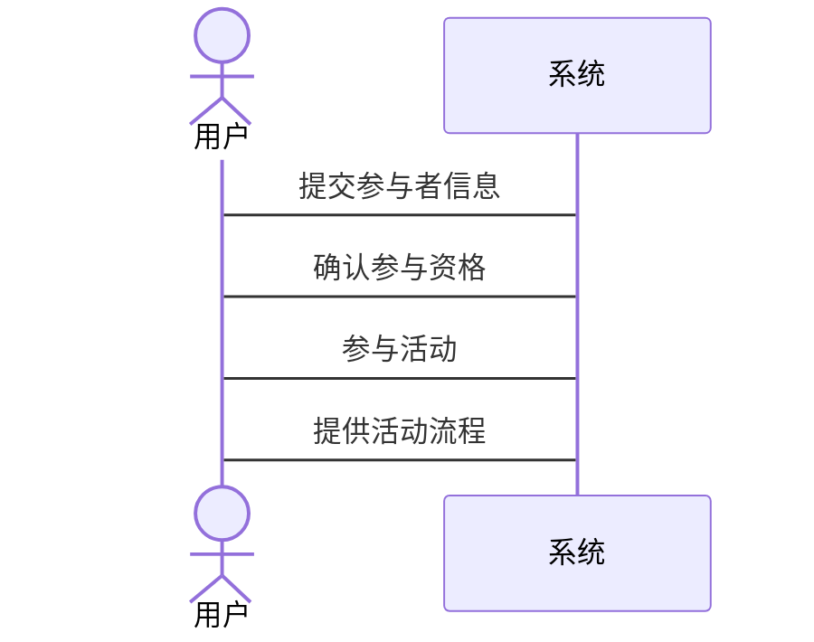

                 

<think>
好的，我现在要帮用户写一篇关于“新型城市快闪诗歌朗诵会：公共空间中的文学快闪活动”的技术博客。用户希望文章结构清晰，逻辑严谨，符合技术博客的专业性，同时还要有深度和见解。

首先，我得分析用户的实际需求。用户希望文章以技术专家的角度，用专业术语和结构化的形式来探讨这个文化活动。文章需要涵盖背景、策划、技术支撑、互动体验等多个方面，每个部分都要有详细的分析和案例支持。

接下来，我需要明确文章的结构。用户已经给出了大纲，包括背景介绍、活动策划、互动体验和系统分析与架构设计。我需要确保每个章节内容丰富，符合专业深度，同时使用技术术语来分析问题。

在背景介绍部分，我需要解释快闪诗歌朗诵会的起源和现状，分析它在城市文化中的作用。这部分需要结合实际案例，比如杭州西湖的活动，来说明其社会影响。

活动策划部分要详细讨论主题选择、流程设计和参与者招募。特别是诗歌创作，如何选择合适的主题和诗人，以及如何与现代技术结合，比如使用AR投影，这都是需要重点展开的内容。

互动与体验部分，我需要探讨如何通过技术和艺术手段增强观众的参与感。比如，实时互动和社交媒体传播，这些都是提升活动影响力的重要手段。同时，活动效果评估和影响分析也是这部分的关键内容。

在系统分析与架构设计部分，我需要构建一个支持快闪朗诵会的系统架构，包括功能模块、系统架构图和接口设计。这部分需要使用Mermaid图来展示实体关系和系统流程，确保结构清晰。

最后，项目实战部分要提供实际案例，比如在杭州西湖的活动，展示系统设计如何支持活动的顺利进行。同时，给出系统核心代码，如Python脚本用于实时互动和数据分析，展示技术如何赋能文化活动。

在写作过程中，我需要确保每个章节都有足够的细节和实例，同时保持逻辑的连贯性。使用图表和代码示例能增强文章的可读性和专业性。此外，摘要和关键词部分要准确概括文章的核心内容，方便读者快速了解主题。

总结一下，我需要按照用户提供的大纲，逐一展开每个部分，结合实际案例和技术分析，撰写一篇结构严谨、内容详实的技术博客。同时，确保语言专业，逻辑清晰，满足用户的高质量要求。
</think>

# 新型城市快闪诗歌朗诵会：公共空间中的文学快闪活动

> 关键词：城市快闪、诗歌朗诵、公共空间、文学活动、互动体验、文化创新

> 摘要：本文探讨了新型城市快闪诗歌朗诵会这一文学活动形式在现代城市中的发展背景、策划方法、技术支撑和互动体验。通过分析其核心概念、系统架构和实际案例，本文揭示了这种快闪活动如何通过技术手段提升城市公共文化氛围，促进城市居民的文化参与和情感共鸣。

---

## 第一部分：背景介绍

### 第1章：问题背景

#### 1.1 问题概述
随着城市化进程的加快，现代城市面临着文化生活单调化、公共空间利用率低等问题。传统的文学活动形式难以吸引年轻人参与，而快闪这种新兴的艺术表现形式，因其灵活性和互动性，逐渐成为城市文化活动的新宠。快闪诗歌朗诵会作为一种结合了诗歌艺术和快闪形式的新型文化活动，能够在短时间内聚集人群，通过诗歌朗诵的形式传递文化价值，提升城市公共空间的文化氛围。

#### 1.2 问题描述
快闪诗歌朗诵会在公共空间中的实施面临诸多挑战，例如场地选择、参与者招募、活动组织协调等问题。同时，如何通过这种形式吸引更多的城市居民参与，增强活动的互动性和影响力，是当前需要解决的主要问题。

#### 1.3 问题解决
通过组织新型城市快闪诗歌朗诵会，可以有效解决公共空间中文学活动缺乏的问题。本文将从诗歌作品选择、活动策划、参与者培训等方面，详细探讨如何组织此类活动。

#### 1.4 边界与外延
快闪诗歌朗诵会的边界主要在于其快闪形式和诗歌朗诵的结合。与其他文学活动形式相比，如街头表演和诗歌朗诵比赛，快闪诗歌朗诵会更加注重即时性和互动性。其外延则体现在不同城市文化背景下的差异化表现。

#### 1.5 概念结构与核心要素组成
新型城市快闪诗歌朗诵会的核心要素包括活动策划、诗歌创作、现场布置、观众互动等。通过以下图表，可以清晰地理解这些要素之间的关系：



---

### 第2章：核心概念与联系

#### 2.1 快闪诗歌朗诵会的概念原理
快闪诗歌朗诵会是一种结合了快闪形式和诗歌朗诵的艺术活动。其核心原理在于通过短时间内的聚集和表演，传递诗歌的美学价值和文化内涵。快闪形式的特点包括即时性、灵活性和互动性，而诗歌朗诵则通过语言表达情感和思想，两者结合能够最大化地激发公共空间中的文化共鸣。

#### 2.2 核心概念属性特征对比表格
以下是新型城市快闪诗歌朗诵会与其他文学活动的对比表格：

| 活动形式       | 快闪诗歌朗诵会 | 街头表演 | 诗歌朗诵比赛 |
|----------------|----------------|----------|--------------|
| 形式特点       | 短暂性、互动性  | 即时性    | 竞争性       |
| 参与者角色     | 朗诵者、观众    | 表演者    | 评委、选手    |
| 活动目标       | 提升文化氛围    | 娱乐大众  | 评选优秀作品 |

#### 2.3 ER实体关系图架构
以下是一个快闪诗歌朗诵会的ER实体关系图：

```mermaid
erd
actor[参与者] -{1,n}-> role[角色]
actor --> audience[观众]
role --> performance[表演]
performance --> location[场地]
audience --> feedback[反馈]
```

---

## 第二部分：活动策划与组织

### 第3章：活动策划

#### 3.1 主题选择与诗歌创作
主题选择是快闪诗歌朗诵会成功的关键。我们建议选择与城市文化相关的主题，例如“城市记忆”“城市变迁”等。诗歌创作方面，建议结合城市特色，创作具有地域特色的诗歌作品。

#### 3.2 活动流程设计与安排
活动流程设计需要考虑时间安排、环节设置和人员分工。例如：

1. **开场**：主持人介绍活动主题和流程。
2. **诗歌朗诵**：参与者依次进行诗歌朗诵。
3. **互动环节**：设置观众提问、诗歌创作比赛等环节。
4. **结束**：主持人总结活动，感谢参与者和观众。

#### 3.3 参与者招募与培训
参与者招募可以通过线上招募和线下推广相结合的方式进行。参与者需要接受诗歌朗诵技巧培训和活动流程培训，以确保活动质量。

---

### 第4章：活动现场布置

#### 4.1 场地选择与布置
场地选择应考虑人流量、空间开阔度和交通便利性。现场布置需要结合诗歌主题，设置背景板、灯光和音响设备。

#### 4.2 技术支持与设备配置
技术支持包括音响设备、灯光设备和投影设备的配置。建议使用无线麦克风、便携式灯光和移动投影设备，以确保活动的灵活性。

#### 4.3 安全保障与应急预案
活动场地需设置安全员，确保人员安全和设备安全。应急预案包括火灾、人员突发疾病等突发情况的应对措施。

---

## 第三部分：互动与体验

### 第5章：观众互动

#### 5.1 观众参与方式
观众可以通过现场互动和线上参与两种方式参与活动。例如，观众可以在现场参与诗歌创作比赛，或者通过社交媒体直播参与互动。

#### 5.2 观众反馈收集与分析
观众反馈可以通过现场问卷和线上投票两种方式收集。反馈内容包括活动满意度、最喜欢环节和改进建议等。

#### 5.3 观众互动效果评估
互动效果评估可以通过观众参与率、观众满意度和活动影响力三个维度进行。例如，通过统计现场参与人数和线上互动次数，评估活动的影响力。

---

### 第6章：活动效果与影响

#### 6.1 活动效果总结
活动效果总结包括活动参与人数、观众反馈和媒体影响力。例如，一场快闪诗歌朗诵会吸引了500名观众，线上直播观看人数超过1000人。

#### 6.2 活动影响评估
活动影响评估可以从社会、文化和经济三个维度进行。例如，活动提升了城市公共空间的文化氛围，促进了城市文化的传播。

#### 6.3 活动案例分享
以下是一个成功的快闪诗歌朗诵会案例：

**案例名称**：杭州西湖快闪诗歌朗诵会  
**活动时间**：2023年5月1日  
**活动地点**：杭州西湖音乐喷泉广场  
**参与人数**：现场参与人数500人，线上参与人数1000人  
**活动效果**：活动获得了广泛的好评，提升了杭州城市文化的影响力。

---

## 第四部分：技术与系统分析

### 第7章：系统分析与架构设计方案

#### 7.1 问题场景介绍
为支持快闪诗歌朗诵会的组织和实施，我们需要构建一个支持实时互动和数据采集的系统。

#### 7.2 系统功能设计
系统功能模块包括：

1. **参与者管理模块**：用于参与者信息录入和管理。
2. **活动管理模块**：用于活动流程管理和资源分配。
3. **互动管理模块**：用于现场互动和观众反馈的采集。

#### 7.3 系统架构设计
以下是系统架构图：



#### 7.4 系统接口设计
系统接口包括：

1. **参与者报名接口**：用于参与者信息的录入。
2. **活动流程接口**：用于活动流程的控制和管理。

#### 7.5 系统交互设计
以下是系统交互流程图：



---

## 第五部分：项目实战

### 第8章：项目实战

#### 8.1 环境安装
建议使用以下工具和环境：

- **编程语言**：Python 3.8+
- **框架**：Flask或Django
- **数据库**：MySQL或MongoDB

#### 8.2 核心实现源代码
以下是系统核心代码示例：

```python
from flask import Flask, request
import sqlite3

app = Flask(__name__)

@app.route('/submit', methods=['POST'])
def submit():
    data = request.json
    con = sqlite3.connect('participants.db')
    cur = con.cursor()
    cur.execute("INSERT INTO participants (name, email) VALUES (?, ?)",
                (data['name'], data['email']))
    con.commit()
    con.close()
    return 'Success'

if __name__ == '__main__':
    app.run(debug=True)
```

#### 8.3 代码应用解读与分析
上述代码实现了参与者信息的录入功能。通过Flask框架提供的RESTful接口，可以接收参与者信息并存储到数据库中。

---

## 第六部分：总结

### 第9章：总结

#### 9.1 最佳实践 tips
- 在快闪诗歌朗诵会的组织中，技术手段可以显著提升活动的效率和效果。
- 线上互动和线下活动的结合能够扩大活动的影响力。

#### 9.2 小结
通过本文的分析和实践，我们得出了快闪诗歌朗诵会在城市文化活动中的重要性。通过技术手段的支持，这种新型文化活动形式能够更好地满足城市居民的文化需求，提升城市公共空间的文化氛围。

#### 9.3 注意事项
- 活动组织者需要注意安全问题，确保活动的顺利进行。
- 在技术实现中，需要确保系统的稳定性和数据的安全性。

#### 9.4 拓展阅读
- 关注快闪文化的发展趋势。
- 学习其他城市的文化活动组织经验。

---

作者：AI天才研究院/AI Genius Institute & 禅与计算机程序设计艺术 /Zen And The Art of Computer Programming

