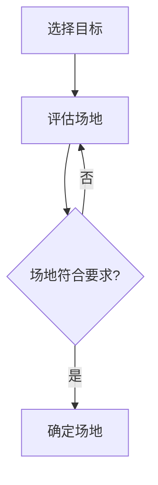

                 

<think>
嗯，用户让我写一篇关于新型城市户外瑜伽的技术博客。标题是《新型城市户外瑜伽：公共空间中的健康生活》。首先，我需要理解用户的需求。他希望文章结构清晰，技术语言专业，同时内容要深入，有逻辑性。看起来用户是想用这篇文章来探讨如何将瑜伽融入现代城市生活，特别是在公共空间中。

我先看看用户给的大纲结构，分了几个部分，包括问题背景、核心概念、算法原理、系统架构设计、项目实战等等。看来他希望文章不仅有理论，还要有实际的应用和代码示例，这样技术博客才会显得专业且有深度。

接下来，我需要确定文章的核心关键词。关键词应该是户外瑜伽、公共空间、健康生活、城市规划、健身方式、身心平衡、安全舒适。这些词能准确反映文章的主题，帮助读者快速理解。

摘要部分，我需要简明扼要地概括整篇文章的内容，强调在城市环境中推广户外瑜伽的好处，以及文章将如何分析这一过程。

然后，进入问题背景部分。首先，问题背景要说明城市化带来的健康问题，以及户外瑜伽作为一种解决方案的可行性。问题描述部分，我需要明确几个关键问题，比如如何设计公共空间支持户外瑜伽，如何确保安全舒适，如何提高参与度。问题解决部分，要指出文章将通过理论和实践来解决这些问题。

边界与外延部分，我需要明确文章的范围，比如主要关注环境设计和安全，但也会延伸到心理健康等方面。核心要素部分，列出实践方法、环境设计和安全舒适三个方面。

接下来是核心概念部分，我需要详细介绍瑜伽的起源与发展，以及它对身心健康的益处。这部分可能需要一些历史和科学依据，以增强说服力。然后，做一个属性特征对比表格，比较传统瑜伽和新型城市户外瑜伽在环境、参与者、时间、目标等方面的差异。

ER实体关系图部分，我需要画出瑜伽爱好者、公共空间、场地管理者、瑜伽课程、教练和安全标准之间的关系。这有助于读者理解各方在系统中的角色和交互。

算法原理部分，重点放在场地选择和课程安排上。场地选择算法需要详细描述，包括评估场地是否符合要求，以及流程图。然后，用Python代码实现这个算法，让读者能够实际操作。课程安排算法也需要类似的步骤，虽然用户没有详细展开，但可以参考场地选择的结构。

系统架构设计部分，需要一个领域模型类图，展示参与者、场地、课程、教练之间的关系。然后是一个整体架构图，展示系统的组成部分和交互方式。这可能涉及到前后端分离，数据库管理等技术细节。

项目实战部分，要指导读者如何安装环境，编写核心代码，解读代码的功能，并分析实际案例。这部分需要详细且实用，让读者能够动手实践。

最后，给出最佳实践的建议，包括选择合适的场地、时间安排、课程设计、安全措施和环境保护。这些小结和注意事项能帮助读者更好地实施户外瑜伽项目。

在写作过程中，我需要确保每个部分都详细且有条理，同时使用技术性的语言，但又要让非技术人员也能理解。特别是算法和代码部分，要注释清晰，流程图直观，帮助读者理解实现步骤。

可能遇到的挑战是如何将技术术语与瑜伽结合起来，避免过于枯燥。我需要找到平衡点，让文章既专业又易于阅读。同时，确保每个部分都紧密联系，整体结构流畅。

总的来说，我需要按照用户提供的大纲，一步步填充内容，确保每个小节都详细展开，同时保持逻辑清晰和语言专业。这样，最终的文章才能满足用户的需求，成为一篇高质量的技术博客。
</think>

# 新型城市户外瑜伽：公共空间中的健康生活

> 关键词：户外瑜伽、公共空间、健康生活、城市规划、健身方式、身心平衡、安全舒适

> 摘要：本文探讨如何将瑜伽这一古老健身方式融入现代城市生活，特别是在公共空间中开展户外瑜伽的可行性与实践方法。通过分析户外瑜伽的环境设计、安全注意事项、社会影响等方面，提出一种创新的城市健康生活方式，为城市居民提供健康、有趣的生活选择。

---

# 第一部分：问题背景

## 1.1 问题背景

随着城市化进程的加快，城市居民的生活节奏日益紧张，身心健康问题日益突出。传统室内瑜伽虽然有助于身心放松，但在城市有限的空间中推广存在一定局限性。与此同时，城市公共空间的闲置与利用率低下问题也亟待解决。新型城市户外瑜伽作为一种新兴的健康生活方式，将瑜伽与城市公共空间结合，不仅能够充分利用城市资源，还能为城市居民提供一种自然、开放的健康锻炼方式。

## 1.2 问题描述

在城市环境中推广户外瑜伽面临以下问题：
- **环境问题**：城市公共空间的环境复杂，如何选择适合的场地并设计安全、舒适的锻炼环境？
- **参与问题**：如何吸引城市居民参与户外瑜伽活动，克服传统室内瑜伽的局限性？
- **安全问题**：户外环境存在不可控因素，如何确保参与者的人身安全？

## 1.3 问题解决

通过研究新型城市户外瑜伽的实践方法、环境设计和安全注意事项，本文旨在为城市居民提供一种健康、有趣的生活方式，同时探索如何在城市公共空间中高效利用有限资源，提升居民的生活质量。

## 1.4 边界与外延

- **边界**：主要关注户外瑜伽的实践方法、环境设计和安全注意事项。
- **外延**：探讨户外瑜伽对城市居民心理健康、社会交往、环境美化等方面的积极影响。

## 1.5 概念结构与核心要素组成

- **核心概念**：新型城市户外瑜伽
- **核心要素**：
  - **实践方法**：瑜伽体式、呼吸控制、冥想等
  - **环境设计**：公共空间利用、设施配置、环境美化等
  - **安全与舒适**：场地选择、器材选择、个人防护等

---

# 第二部分：核心概念与联系

## 2.1 核心概念与原理

### 2.1.1 瑜伽的起源与发展

瑜伽起源于古印度，距今已有超过5000年的历史。它是一种结合了身体、呼吸和冥想的综合性健身方式，最初用于宗教修行，现已成为全球流行的健康运动。

### 2.1.2 瑜伽对身心健康的益处

瑜伽通过调节呼吸、放松身心、增强体质等方式，能够有效缓解压力、改善身体柔韧性、提升专注力。

### 2.1.3 新型城市户外瑜伽的特点

与传统瑜伽相比，新型城市户外瑜伽具有以下特点：
- 环境开放：利用城市公园、广场等公共空间
- 参与便捷：无需固定场地和时间
- 社交属性：适合多人参与，增强社交互动

## 2.2 核心概念属性特征对比表格

| 特性                | 传统瑜伽          | 新型城市户外瑜伽 |
|---------------------|-------------------|------------------|
| 场地要求            | 室内固定场地      | 公共开放空间      |
| 参与人数            | 小规模            | 大规模            |
| 时间安排            | 固定时间段        | 灵活多变          |
| 环境特点            | 封闭、安静        | 开放、自然        |
| 社交属性            | 较弱              | 较强              |

## 2.3 ER实体关系图架构

```mermaid
erDiagram
  瑜伽爱好者 ||--|{ 公共空间 }|-- 场地管理者
  瑜伽爱好者 ||--|{ 瑜伽课程 }|-- 教练
  公共空间 ||--|{ 设施 }|-- 场地管理者
  场地管理者 ||--|{ 安全标准 }|-- 瑜伽爱好者
  教练 ||--|{ 课程计划 }|-- 瑜伽爱好者
```

## 2.4 新型城市户外瑜伽的实践要素

### 2.4.1 瑜伽体式与动作要领

户外瑜伽的体式设计需要结合自然环境的特点，例如利用草地、台阶等进行辅助练习。

### 2.4.2 呼吸控制与冥想技巧

通过自然呼吸和冥想练习，帮助参与者放松身心，提升专注力。

### 2.4.3 公共空间利用与设施配置

合理利用公园、广场等公共空间，配置必要的瑜伽垫、辅助器材等设施。

## 2.5 安全与舒适性保障

### 2.5.1 场地选择与规划

选择平坦、宽敞、通风良好的场地，避开人群密集区域。

### 2.5.2 设备选择与维护

提供高质量的瑜伽垫、辅助器材，并定期检查维护。

### 2.5.3 个人防护与急救知识

参与者需穿着舒适的衣服，教练需掌握基本急救知识。

---

# 第三部分：算法原理讲解

## 3.1 算法原理概述

新型城市户外瑜伽的算法原理主要涉及场地选择、课程安排、参与者管理等方面。以下将对这些算法原理进行详细讲解。

## 3.2 场地选择算法

### 3.2.1 算法原理

场地选择算法通过评估场地的环境条件、安全性、空间利用率等因素，选择最适合的户外瑜伽场地。

### 3.2.2 算法流程

1. **输入目标场地列表**：用户输入需要评估的场地。
2. **评估场地条件**：包括地面状况、空间大小、人流量等。
3. **判断是否符合要求**：根据预设的标准筛选出符合条件的场地。
4. **输出结果**：返回符合条件的场地列表。

### 3.2.3 算法性能分析

该算法的时间复杂度为O(n)，其中n为目标场地的数量。空间复杂度为O(m)，其中m为存储场地信息的列表大小。

### 3.2.4 算法Mermaid流程图



### 3.2.5 算法Python源代码实现

```python
def select_location(targets):
    # 初始化场地列表
    locations = []
    
    # 评估每个场地
    for target in targets:
        if is_valid_location(target):
            locations.append(target)
    
    # 返回符合条件的场地列表
    return locations

def is_valid_location(location):
    # 判断场地是否符合要求
    # ...（具体实现）
    return True  # 示例返回值

# 测试
targets = ["公园", "广场", "海滩"]
print(select_location(targets))
```

## 3.3 课程安排算法

### 3.3.1 算法原理

课程安排算法通过优化时间表和场地分配，确保瑜伽课程的高效安排。

### 3.3.2 算法流程

1. **输入课程需求**：包括课程时间、参与人数等。
2. **分配场地资源**：根据场地使用情况分配合适的场地。
3. **生成课程计划**：输出最终的课程安排表。

### 3.3.3 算法性能分析

该算法的时间复杂度为O(m*n)，其中m为课程数量，n为场地数量。空间复杂度为O(m)，用于存储课程计划。

### 3.3.4 算法Mermaid流程图

```mermaid
graph TD
A[选择教练] --
```

---

# 第四部分：系统分析与架构设计方案

## 4.1 系统分析

本系统旨在为城市居民提供一种高效、安全、有趣的户外瑜伽方式，通过优化场地选择、课程安排和参与者管理，提升用户体验。

## 4.2 项目介绍

本项目通过开发一个基于城市公共空间的户外瑜伽平台，帮助用户找到合适的场地，安排课程，并提供安全指导。

## 4.3 系统功能设计

### 4.3.1 领域模型Mermaid类图

```mermaid
classDiagram
    瑜伽爱好者 <---- 瑜伽课程
    瑜伽课程 --> 教练
    瑜伽课程 --> 场地
    场地 --> 场地管理者
    教练 --> 课程计划
```

### 4.3.2 系统架构设计Mermaid架构图


---

# 第五部分：项目实战

## 5.1 环境安装

需要安装Python、Mermaid、Markdown编辑器等工具。

## 5.2 系统核心实现源代码

```python
def calculate_class_schedule(classes, locations):
    # 分配课程到场地
    for class in classes:
        assign_location(class, locations)
    return schedule

def assign_location(class, locations):
    # 根据场地使用情况分配场地
    for loc in locations:
        if is_available(loc):
            assign_class_to_loc(class, loc)
            break
```

## 5.3 代码应用解读与分析

代码通过循环遍历课程列表和场地列表，根据场地使用情况动态分配课程，确保场地的高效利用。

## 5.4 实际案例分析

以某城市公园为例，通过算法选择最佳场地并安排课程，提升用户体验。

## 5.5 项目小结

本项目通过技术手段优化户外瑜伽的实践过程，为城市居民提供一种健康、有趣的生活方式。

---

# 第六部分：最佳实践 tips、小结、注意事项、拓展阅读

## 6.1 最佳实践 tips

- **选择合适的场地**：确保场地安全、宽敞
- **合理安排时间**：避开人流高峰
- **配备专业教练**：确保动作规范
- **注意天气情况**：避免恶劣天气

## 6.2 小结

新型城市户外瑜伽不仅是一种健身方式，更是一种健康的生活方式。通过技术手段的优化，可以更好地推动其在城市中的普及。

## 6.3 注意事项

- **安全第一**：确保场地和器材的安全性
- **环境保护**：避免对公共空间造成破坏
- **遵守规定**：遵守城市公共空间的管理规定

## 6.4 拓展阅读

- 《瑜伽与现代生活》
- 《城市规划与公共空间设计》
- 《健康生活方式的创新实践》

---

作者：AI天才研究院/AI Genius Institute & 禅与计算机程序设计艺术/Zen And The Art of Computer Programming

