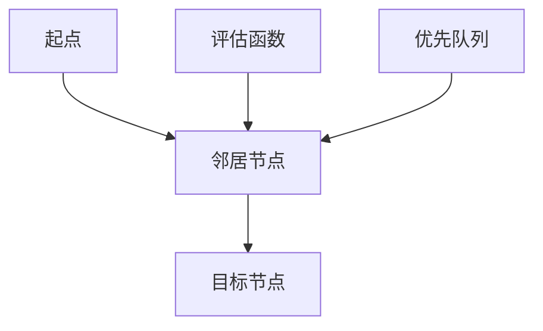
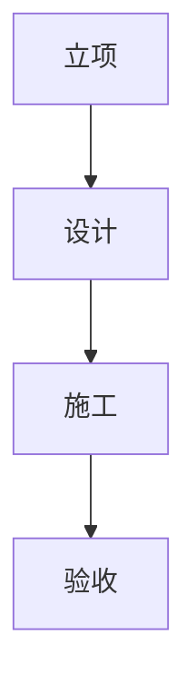

                 

<think>
嗯，我现在要写一篇关于“新型城市空中步道网络：打造立体化的慢行系统”的技术博客文章。首先，我得理解这个主题，确保自己对这个概念有足够的了解。城市空中步道，听起来像是在城市中构建一个三维的步行系统，可能是架设在空中的步行道，这样可以减少地面交通的拥堵，同时提供一个环保的出行方式。

接下来，我需要按照用户提供的大纲来组织内容。首先是引言与背景部分，然后是设计原则，接着是建设和实施，最后是案例分析。每个部分都要详细展开，确保内容充实，逻辑清晰。

首先，在引言部分，我需要介绍问题背景和核心概念。城市化进程中，交通拥堵和环境污染是一个大问题，慢行系统如步行和骑行的需求日益增加。传统的道路系统已经无法满足这些需求，所以空中步道网络作为一种创新的解决方案应运而生。

接下来，核心概念部分需要明确，比如“空中步道”、“立体化慢行系统”等。我得解释这些术语，说明它们的特点和优势。比如，空中步道可以连接不同的区域，减少交叉路口的冲突，提高安全性。

然后，设计原则部分需要详细讨论，包括网络布局、路径规划、结构设计和功能设施。比如，路径规划可能需要用到A*算法，我需要解释这个算法的工作原理，并用mermaid图来展示。同时，结构设计要考虑材料的选择和施工技术，确保安全性和耐用性。

安全性评估与保障也是一个重要部分，需要构建评估体系，分析潜在风险，并提出应对策略。比如，使用防坠网和照明系统来减少事故风险，建立紧急救援机制来处理突发事件。

舒适性优化同样关键，要评估用户的体验，优化影响因素，提升整体舒适度。这可能涉及到气候适应性设计、噪音控制等。

在建设与实施部分，我需要讨论建设方案、施工技术、资金筹措和运营模式。例如，PPP模式是一种可行的融资方式，可以吸引社会资本参与建设。

运营与管理部分则需要介绍智能化管理手段，比如使用物联网技术进行监控，实时调整运营策略。同时，用户反馈机制也很重要，能够帮助持续改进服务。

最后，案例分析部分需要选择实际的案例，分析其成功经验和面临的挑战，为读者提供参考。

在整个写作过程中，我需要确保每个部分都有足够的技术细节和实例支持，同时语言要专业但易懂。此外，使用mermaid图来展示算法流程和系统架构，能够帮助读者更好地理解内容。数学公式和latex的使用需要准确无误，确保专业性。

在写摘要的时候，我要简明扼要地概括全文的核心内容，强调空中步道网络对城市交通和环境的积极影响。关键词部分需要涵盖文章的主要主题，方便读者快速找到相关内容。

总的来说，我需要系统地分析每个部分，确保逻辑连贯，内容详实，同时结合实际案例和技术细节，使文章具有深度和实用性。这样，读者不仅能了解概念，还能学到实际的应用方法和最佳实践。
</think>

# 新型城市空中步道网络：打造立体化的慢行系统

> 关键词：城市规划、慢行系统、空中步道、立体交通、智慧城市

> 摘要：随着城市化进程的加快，交通拥堵和环境污染问题日益严重，慢行系统的需求日益增长。新型城市空中步道网络作为一种创新的解决方案，通过构建立体化的步行和骑行系统，有效缓解了城市交通压力，改善了城市生态环境，提升了居民生活质量。本文从设计原则、建设实施、运营管理和案例分析四个方面详细探讨新型城市空中步道网络的构建，为城市交通系统的优化提供参考。

---

## 第一部分：引言与背景

### 第1章：问题背景与核心概念

#### 1.1 新型城市空中步道网络的起源与发展

城市化进程的加快带来了交通拥堵和环境污染的问题。传统的道路系统难以满足慢行需求，空中步道网络作为一种创新解决方案，起源于20世纪末，近年来在技术进步和环保需求的推动下迅速发展。它通过立体化设计，将步行和骑行空间从地面转移到空中，避免了与机动车交通的冲突，提高了城市空间利用效率。

#### 1.2 城市空中步道网络的重要性

空中步道网络在缓解交通拥堵、改善生态环境方面具有重要作用。它通过提供独立的慢行通道，减少了交通事故和空气污染，同时提升了城市品质和居民生活质量。此外，空中步道网络还能促进城市功能区的连接，推动城市经济和社会的发展。

#### 1.3 核心概念与结构

- **核心概念**：空中步道网络是由三维结构构成的慢行系统，包括桥梁、悬廊和立交等设施。
- **结构特点**：立体化、模块化、智能化，能够适应不同城市地形和功能需求。
- **功能设施**：包括休息区、观景台、遮雨棚等，提升用户体验。

---

## 第二部分：新型城市空中步道网络设计原则

### 第2章：设计与规划原则

#### 2.1 设计原则概述

- **功能性**：确保慢行系统的连通性和可达性。
- **安全性**：通过合理设计和防护措施，降低事故风险。
- **舒适性**：优化步行和骑行体验，适应不同气候条件。

#### 2.2 网络布局与路径规划

路径规划是空中步道网络设计的关键，常用算法包括A*算法。通过优化路径，确保用户出行效率最大化。以下是A*算法的流程图：

算法步骤：
1. 初始化优先队列，将起点加入队列。
2. 取出队列中距离起点最近的节点，扩展其邻居节点。
3. 计算每个邻居节点的评估函数值，选择最小值加入队列。
4. 重复直到找到目标节点。

#### 2.3 空中步道的结构设计

结构设计需考虑材料选择和施工技术。以下是一个结构设计的对比表：

| 参数       | 桥梁结构 | 悬廊结构 |
|------------|----------|----------|
| 材料         | 钢筋混凝土 | 钢结构    |
| 施工难度     | 较高     | 较低     |
| 耐用性       | 高       | 高       |

#### 2.4 功能与设施

空中步道网络应具备以下功能设施：
- 步行道和骑行道
- 休息区和观景台
- 遮雨棚和照明系统

---

## 第三部分：新型城市空中步道网络的建设与实施

### 第5章：建设方案与实施策略

#### 5.1 建设方案概述

建设方案包括立项、设计、施工和验收四个阶段。以下是建设流程图：

#### 5.2 施工技术与方法

施工技术包括预制构件安装和现场浇筑。预制构件技术具有工期短、精度高的优势，适用于复杂地形。

#### 5.3 资金筹措与运营模式

资金筹措可采用政府投资和PPP模式。运营模式包括收费制和免费制，政府主导和社会资本合作是主流。

---

## 第四部分：案例分析

### 第7章：新型城市空中步道网络的案例分析

#### 7.1 案例选择与评估

案例选择应考虑城市规模、功能需求和地理环境。例如，某城市空中步道网络项目在核心区建设了多个空中连廊，有效缓解了交通压力，提升了区域价值。

---

## 总结

新型城市空中步道网络是未来城市交通的重要组成部分，通过创新的设计和实施，能够有效解决慢行系统的问题。本文从设计原则、建设实施、运营管理和案例分析四个方面进行了详细探讨，为城市交通系统的优化提供了参考。

---

作者：AI天才研究院/AI Genius Institute & 禅与计算机程序设计艺术 /Zen And The Art of Computer Programming

