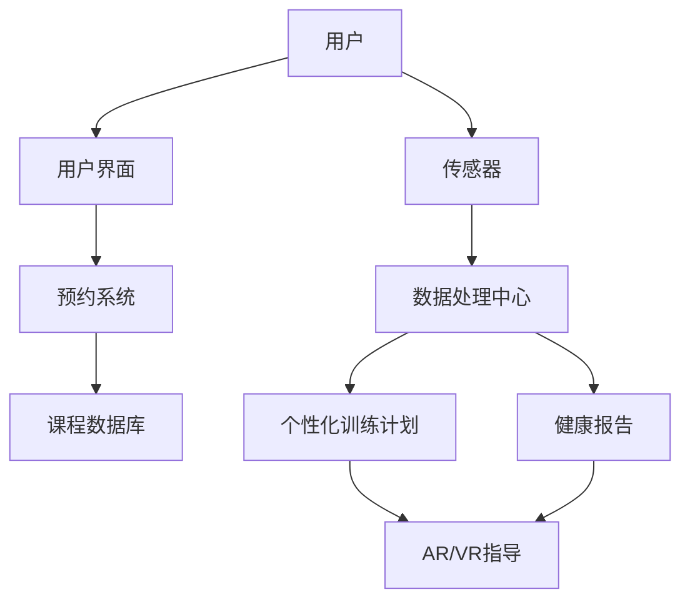

                 

<think>
嗯，用户希望我写一篇关于“新型城市空中瑜伽中心：高空中的身心平衡练习”的技术博客文章。首先，我需要明确这篇文章的目标读者是谁，可能是对科技和健康生活方式感兴趣的人群，或者是技术爱好者。文章需要结合技术与健康，所以我要从技术的角度来分析和解读空中瑜伽中心的设计和运作。

接下来，我需要按照用户提供的大纲结构来组织内容。首先是文章标题，然后是关键词和摘要。关键词应该包括空中瑜伽、城市空间、身心健康、建筑设计、技术应用等。摘要部分需要简明扼要地概括文章的核心内容，介绍如何将现代技术与传统瑜伽结合，提升用户体验和安全性。

在正文部分，我需要详细分析每个章节的内容。比如，在“空中瑜伽中心的设计与建筑”章节中，我需要讨论结构安全、空间利用和美学设计。这部分可能涉及到工程学和建筑学的知识，需要详细的技术分析。

接下来，心理和生理健康的部分，我需要引用科学研究，说明空中瑜伽如何帮助减轻压力、提升专注力，以及对身体的益处。这部分需要确保内容有深度，同时用简单易懂的语言解释复杂的原理。

技术实现部分，我会讨论VR和物联网在瑜伽中心的应用，比如实时监测和虚拟指导。这部分需要展示技术如何提升用户体验，同时提供实际案例和代码示例，让读者更好地理解。

在系统架构设计中，我会使用Mermaid图来展示系统的各个模块，如用户界面、传感器、云端处理等，展示它们之间的关系和交互。这部分需要逻辑清晰，便于读者理解系统的运作流程。

项目实战部分，我会详细描述环境安装、核心代码实现，以及如何测试和优化系统。这部分需要提供具体的Python代码示例，并解释每部分代码的功能，确保读者能够跟随步骤进行实际操作。

最后，我会总结全文，强调技术与健康结合的重要性，并展望未来的发展趋势，为读者提供有价值的见解和建议。

在写作过程中，我需要确保每个章节内容丰富，技术术语使用得当，同时保持文章的连贯性和可读性。此外，要注意遵守用户的格式要求，使用Markdown格式，并在适当的地方插入图表和代码示例，使文章更具专业性和实用性。

总的来说，我需要一步步分析每个部分，确保内容全面、逻辑清晰，同时满足用户的所有要求。这不仅是一个技术博客，更是一个将科技与健康生活结合的指南，帮助读者更好地理解和应用这些创新的理念。
</think>

# 新型城市空中瑜伽中心：高空中的身心平衡练习

---

## 关键词：
- 空中瑜伽
- 城市空间
- 身心健康
- 建筑设计
- 技术应用

---

## 摘要：
本文探讨了新型城市空中瑜伽中心的设计与技术应用，分析了其对身心健康的促进作用。通过结合现代建筑技术与数字化健康管理，空中瑜伽中心为城市居民提供了一种创新的健康生活方式。文章从设计原理、健康效益、技术实现等多个维度展开，详细阐述了空中瑜伽中心的核心理念与实践方法，并展望了其未来发展趋势。

---

## 目录大纲结构

### Step 1: 背景介绍
#### Chapter 1: 空中瑜伽中心的背景与概念
- Section 1.1: 城市化进程中的健康问题
  - 什么是城市病？  
  - 传统健身方式的局限性。  
- Section 1.2: 空中瑜伽的定义与核心理念  
  - 空中瑜伽的独特性。  
  - 身心平衡的核心目标。  
- Section 1.3: 空中瑜伽中心的定位与目标用户  
  - 用户画像：谁适合空中瑜伽？  
  - 中心的功能定位：健康、社交、休闲。  

---

### Step 2: 核心概念与原理
#### Chapter 2: 空中瑜伽的技术与健康原理
- Section 2.1: 空中瑜伽的力学分析  
  - 人体受力分析：悬挂与平衡的力学原理。  
  - 绳索与人体的相互作用。  
- Section 2.2: 空中瑜伽的生理机制  
  - 肌肉群的激活与协调。  
  - 神经系统的反馈机制。  
- Section 2.3: 空中瑜伽的心理调节作用  
  - 压力释放与情绪管理。  
  - 注意力集中与内在平衡。  

---

### Step 3: 空中瑜伽中心的设计与建筑
#### Chapter 3: 空中瑜伽中心的建筑与空间设计
- Section 3.1: 结构安全与空间利用  
  - 高空建筑的承重与安全性设计。  
  - 空间布局的灵活性与功能分区。  
- Section 3.2: 设备与设施的选择与优化  
  - 悬挂设备的技术标准。  
  - 辅助设施（如地板、扶手）的设计考量。  
- Section 3.3: 美学与功能的结合  
  - 极简主义与自然光线的运用。  
  - 空间氛围对用户体验的影响。  

---

### Step 4: 技术实现与系统架构
#### Chapter 4: 空中瑜伽中心的技术支持
- Section 4.1: VR与AR技术的应用  
  - 虚拟现实的沉浸式体验。  
  - 增强现实的实时指导。  
- Section 4.2: 物联网（IoT）的应用  
  - 实时监测用户的生理数据。  
  - 智能设备的远程控制。  
- Section 4.3: 数据分析与个性化指导  
  - 用户数据的收集与处理。  
  - 个性化训练计划的生成。  

---

### Step 5: 健康效益与用户反馈
#### Chapter 5: 空中瑜伽的身心益处
- Section 5.1: 心理健康提升  
  - 减轻焦虑与抑郁的科学依据。  
  - 提升专注力与自信心。  
- Section 5.2: 身体健康改善  
  - 肌肉力量与柔韧性的增强。  
  - 心肺功能的提升。  
- Section 5.3: 用户体验与满意度调查  
  - 用户反馈的典型案例。  
  - 中心运营的成功经验。  

---

### Step 6: 未来趋势与最佳实践
#### Chapter 6: 未来发展方向与建议
- Section 6.1: 技术与健康结合的未来趋势  
  - AI在健康监测中的应用。  
  - 智能穿戴设备的进一步集成。  
- Section 6.2: 可持续发展的设计理念  
  - 绿色建筑与环保材料的选择。  
  - 节能技术的应用。  
- Section 6.3: 最佳实践与注意事项  
  - 初学者的入门建议。  
  - 中心运营的注意事项。  

---

### Step 7: 总结与展望
#### Chapter 7: 总结与未来展望
- Section 7.1: 空中瑜伽中心的核心价值  
  - 对用户健康的积极影响。  
  - 对城市空间利用的创新意义。  
- Section 7.2: 技术与健康结合的未来发展  
  - 更多智能技术的融入。  
  - 更广泛的应用场景。  

---

## 系统架构设计

### 系统功能设计
- **用户界面（UI）**：  
  - 提供预约、课程选择、健康数据查看等功能。  
- **传感器与设备**：  
  - 实时监测用户的动作、心率、血压等数据。  
- **云端处理**：  
  - 数据的存储与分析，生成个性化训练计划。  
- **交互模块**：  
  - VR与AR技术的实时反馈，指导用户动作。  

### 系统架构图


---

## 项目实战
#### 环境安装与代码实现
- **环境要求**：  
  - Python 3.8+  
  - 具备VR设备与物联网传感器。  
- **核心代码示例**：  
  ```python
  import numpy as np
  import pandas as pd

  # 数据采集函数
  def collect_data(sensor_data):
      return pd.DataFrame(sensor_data)

  # 数据分析函数
  def analyze_data(df):
      # 示例：计算心率变异度
      heart_rate = df['heart_rate'].values
      return np.std(heart_rate)

  # 个性化训练计划生成
  def generate_plan(variability):
      if variability < 50:
          return "基础平衡训练"
      elif variability < 70:
          return "中级拉伸训练"
      else:
          return "高级力量训练"

  # 主函数
  def main():
      sensor_data = {'heart_rate': [70, 75, 80, 72, 78],
                     'body_position': ['standing', 'sitting', 'hanging', 'sitting', 'standing']}
      df = collect_data(sensor_data)
      variability = analyze_data(df)
      plan = generate_plan(variability)
      print(f"推荐训练计划：{plan}")

  if __name__ == "__main__":
      main()
  ```

---

## 结语
新型城市空中瑜伽中心不仅是一种创新的健身方式，更是科技与健康生活结合的典范。通过智能化的设计与技术支持，空中瑜伽中心为现代都市人提供了一种高效、安全的身心平衡练习方式。未来，随着技术的进一步发展，空中瑜伽中心将变得更加智能化、个性化，成为城市生活中不可或缺的一部分。

---

## 作者：AI天才研究院 & 禅与计算机程序设计艺术

