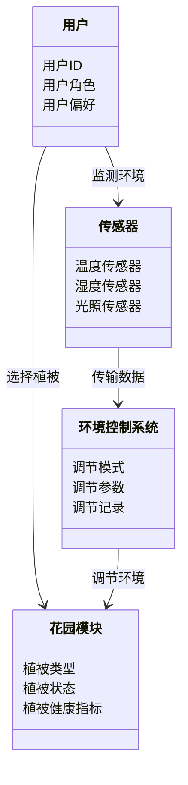
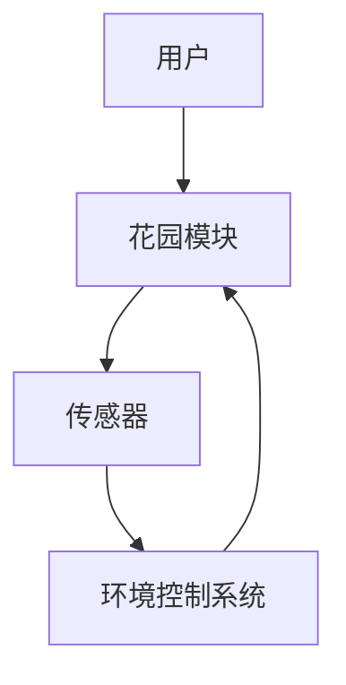
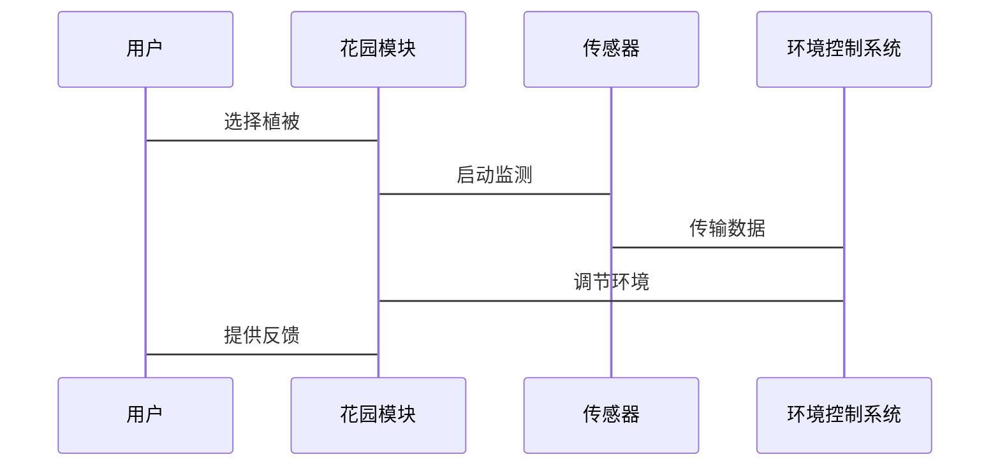

                 

<think>
嗯，用户让我写一篇关于“新型城市空中花园网络：连接社区的绿色生态系统”的技术博客文章。首先，我需要理解这个主题的核心是什么。看起来这是一个结合了城市规划、环境科学和信息技术的项目，旨在通过空中花园网络连接社区，创建绿色生态系统。

我应该先从背景开始分析。随着城市化进程加快，绿地面积减少，空气污染和热岛效应问题日益突出。空中花园作为一种解决方案，可以有效缓解这些问题。所以，引言部分需要说明这些背景，让读者明白问题的严重性和空中花园的重要性。

接下来，文章结构部分，用户已经给了一个大纲，我需要按照这个大纲来展开。首先是引言，然后是基本概念、设计原则、技术支撑、社区连接、系统分析、项目实战和总结。每个部分都要详细展开。

在基本概念部分，我需要定义什么是城市空中花园网络，它的分类，组成部分。这里可能会有一些技术术语，比如支撑结构、环境控制系统，这些需要解释清楚，避免读者理解困难。

设计原则部分，我需要讨论功能性、美观性和可持续性。可能需要举一些例子，比如某个城市如何应用这些原则来设计空中花园，这样读者更容易理解。

技术支持部分，材料选择和结构设计是关键。我需要详细讲解不同材料的优缺点，以及结构设计中的抗风抗震等考量。同时，环境控制系统中的传感器和自动化技术也需要详细描述，可能需要加入一些图表来辅助说明。

社区连接部分，重点在于如何通过公共空间设计促进社区参与。可能需要讨论如何设计互动区域，如何利用数字平台促进社区成员的参与，比如在线管理系统或社交媒体。

系统分析部分，需要构建领域模型，用类图展示系统的各个部分，比如用户、花园模块、传感器等。然后用序列图展示系统交互过程，比如用户登录、环境监测等步骤。

项目实战部分，我需要选择一个具体的案例，比如某个社区的空中花园项目，详细描述其实现过程，包括环境监测系统的代码实现，以及如何部署和维护。

最后，总结部分要回顾整个系统的优点，比如环境效益、社会效益，以及未来的发展方向，比如与智慧城市结合的可能性。

在写作过程中，我需要确保每个部分都符合用户的要求，比如使用markdown格式，插入图表，确保内容丰富具体，涵盖所有约束条件。同时，语言要专业但易懂，逻辑清晰，结构紧凑。

现在，我需要开始组织每个部分的内容，确保每个章节都有足够的细节和深度，能够满足10000到12000字的要求。可能还需要加入一些最佳实践和注意事项，帮助读者更好地理解和应用这些概念。
</think>

# 新型城市空中花园网络：连接社区的绿色生态系统

## 关键词：城市空中花园、绿色生态系统、社区连接、技术支持、系统设计

## 摘要：  
随着城市化进程的加速，城市绿地面积不断减少，空气污染和热岛效应等问题日益突出。城市空中花园网络作为一种创新的绿色解决方案，通过垂直绿化和空中生态系统的构建，为城市居民提供了绿色公共空间，改善了环境质量，同时也促进了社区的连接与互动。本文将从概念、设计、技术支持到实际应用，全面探讨新型城市空中花园网络的构建与实现。

---

## 引言

### 1. 问题背景

#### 1.1 城市化进程中的绿色挑战
城市化进程的加快导致绿地面积减少，居民生活环境质量下降，空气污染和热岛效应等问题日益严重。传统城市绿化方式难以满足现代城市对绿色空间的需求。

#### 1.2 城市空中花园的潜力
城市空中花园作为一种创新的绿化形式，利用建筑屋顶、桥梁、墙体等空间，将绿色植物与建筑结构相结合，为城市居民提供了更多的绿色公共空间。

#### 1.3 书籍目的与读者对象
本文旨在探讨城市空中花园网络的设计理念、技术支持和实际应用，为城市规划者、建筑师、环境科学家以及社区居民提供参考。

#### 1.4 结构安排
本文将从概念、设计、技术支持到实际应用，全面探讨新型城市空中花园网络的构建与实现。

---

## 第一部分：城市空中花园网络概述

## 第1章：城市空中花园网络的基本概念

### 1.1 城市空中花园的定义与历史演变

#### 1.1.1 传统城市绿化与空中花园的对比
传统城市绿化主要集中在地面绿地和公园，而城市空中花园则是将绿化空间拓展到建筑顶部、桥梁和垂直结构。

#### 1.1.2 空中花园的分类
- 屋顶花园
- 墙体花园
- 桥梁花园
- 天台花园

### 1.2 城市空中花园网络的组成要素

#### 1.2.1 绿化植物与植被
- 选择适合城市环境的植物
- 植被的层次分布

#### 1.2.2 支撑结构与技术
- 建筑结构的加固与改造
- 支撑结构的设计与施工

#### 1.2.3 环境控制系统
- 水资源管理
- 气候调节
- 生态监测

---

## 第2章：城市空中花园网络的设计原则

### 2.1 设计原则概述

#### 2.1.1 功能性原则
- 提供休闲娱乐空间
- 改善环境质量
- 促进社区互动

#### 2.1.2 美学原则
- 融入城市建筑风格
- 突出生态美感
- 建立视觉连贯性

#### 2.1.3 可持续原则
- 使用环保材料
- 节约能源
- 循环利用资源

### 2.2 设计流程与步骤

#### 2.2.1 需求分析
- 社区需求调研
- 环境评估
- 资源分配

#### 2.2.2 绿化策略制定
- 植被选择与布局
- 空间利用规划
- 生态功能设计

#### 2.2.3 结构设计
- 支撑结构选型
- 承重与稳定性设计
- 抗风抗震设计

#### 2.2.4 环境控制设计
- 水资源管理方案
- 气候调节系统
- 生态监测与维护

---

## 第二部分：城市空中花园网络的技术支持

## 第3章：支撑结构技术

### 3.1 材料选择

#### 3.1.1 常用材料类型
- 钢结构
- 混凝土结构
- 复合材料

#### 3.1.2 材料性能评估
- 耐久性
- 承载能力
- 抗腐蚀性

### 3.2 结构设计原则

#### 3.2.1 抗风与抗震设计
- 风力分析
- 抗震评估
- 结构优化

#### 3.2.2 承重与稳定性设计
- 荷载计算
- 结构稳定性分析
- 支撑点优化

### 3.3 施工技术

#### 3.3.1 空中花园的建造过程
- 结构搭建
- 植被种植
- 设施安装

#### 3.3.2 施工安全措施
- 安全规范
- 施工人员培训
- 应急预案

---

## 第4章：环境控制系统

### 4.1 环境控制系统的功能与组成部分

#### 4.1.1 调节气候与空气质量
- 温度控制
- 湿度调节
- 空气净化

#### 4.1.2 水资源管理
- 雨水收集
- 循环利用
- 智能灌溉

#### 4.1.3 生态监测与维护
- 植被健康监测
- 土壤质量检测
- 环境数据采集

### 4.2 环境控制技术的应用

#### 4.2.1 自动化控制系统
- 智能传感器
- 自动调节设备
- 数据分析系统

#### 4.2.2 传感器技术
- 温度传感器
- 湿度传感器
- 光照传感器

#### 4.2.3 智能温室技术
- 环境调节系统
- 智能灌溉系统
- 光照调节系统

---

## 第三部分：城市空中花园网络的社区连接

## 第5章：社区参与与公共空间设计

### 5.1 社区参与的重要性

#### 5.1.1 社区成员的角色
- 植物养护
- 设施维护
- 环境监测

#### 5.1.2 社区参与的方法
- 志愿者活动
- 公共教育
- 数字平台互动

### 5.2 公共空间设计原则

#### 5.2.1 互动与参与性设计
- 休闲区
- 活动区
- 学习区

#### 5.2.2 可访问性设计
- 无障碍设计
- 多功能空间
- 空间共享

---

## 第四部分：城市空中花园网络的系统分析与设计

## 第6章：系统分析与架构设计

### 6.1 问题场景介绍
- 环境问题
- 社区需求
- 系统目标

### 6.2 项目介绍
- 项目目标
- 项目范围
- 项目需求

### 6.3 系统功能设计

#### 6.3.1 领域模型（领域模型 Mermaid 类图）


### 6.4 系统架构设计

#### 6.4.1 系统架构图（系统架构 Mermaid 图）


### 6.5 系统接口设计

#### 6.5.1 用户接口
- 登录与注册
- 植被选择
- 环境数据查看

#### 6.5.2 系统接口
- 传感器数据接口
- 环境控制接口
- 用户反馈接口

### 6.6 系统交互设计

#### 6.6.1 系统交互流程（交互流程 Mermaid 图）


---

## 第五部分：项目实战

## 第7章：项目实战

### 7.1 环境监测系统实现

#### 7.1.1 环境监测系统代码实现
```python
import sensors
import environment_controller

class GardenSystem:
    def __init__(self):
        self.sensors = sensors.Sensors()
        self.controller = environment_controller.EnvironmentController()

    def monitor_environment(self):
        temperature = self.sensors.read_temperature()
        humidity = self.sensors.read_humidity()
        light = self.sensors.read_light()

        self.controller.adjust_climate(temperature, humidity, light)

    def display_data(self):
        print(f"Temperature: {temperature}°C")
        print(f"Humidity: {humidity}%")
        print(f"Light: {light} lux")
```

#### 7.1.2 环境监测系统实现解读
- 传感器数据采集
- 环境控制器调节
- 数据显示与反馈

### 7.2 项目小结

---

## 第六部分：最佳实践与总结

## 第8章：最佳实践与总结

### 8.1 最佳实践 tips
- 系统设计要注重可持续性
- 社区参与是成功的关键
- 系统维护要定期检查与优化

### 8.2 项目总结
城市空中花园网络是一种创新的绿色解决方案，通过技术支持和社区连接，为城市居民提供了绿色公共空间，改善了环境质量，同时也促进了社区的互动与合作。

### 8.3 注意事项
- 系统设计要结合实际需求
- 社区参与要注重可操作性
- 系统维护要定期更新与优化

### 8.4 拓展阅读
- 城市生态系统的构建
- 可持续城市设计
- 数字化社区建设

---

## 结语

新型城市空中花园网络作为一种创新的绿色解决方案，不仅能够改善城市环境，还能够促进社区的连接与互动。通过技术支持和系统设计，我们可以构建一个更加绿色、健康、可持续的城市生态系统。

---

## 作者：AI天才研究院/AI Genius Institute & 禅与计算机程序设计艺术 /Zen And The Art of Computer Programming

