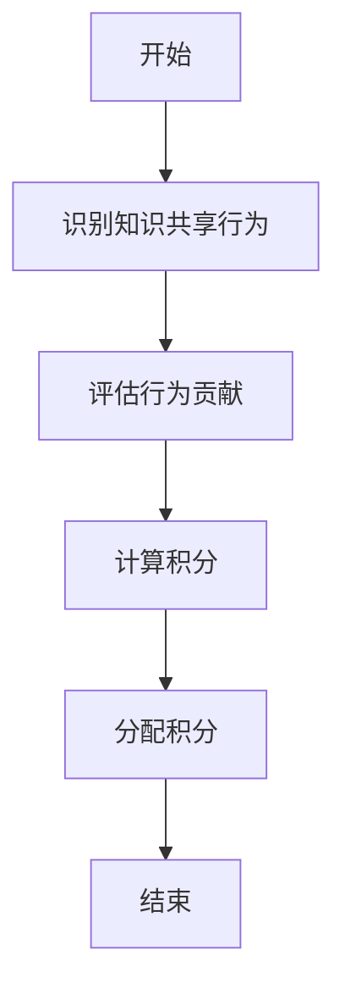
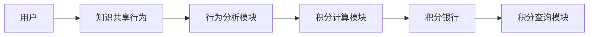
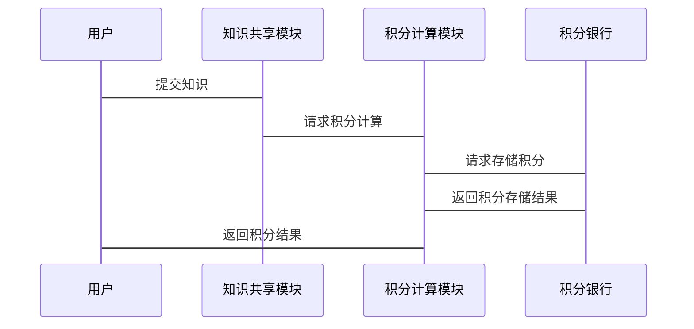

                 

<think>
嗯，用户希望我以《新型城市终身学习积分银行：激励社区知识共享的数字化方案》为标题，写一篇技术博客。首先，我需要理解这个主题的核心是什么。终身学习积分银行，听起来像是一个激励机制，通过积分来促进社区内的知识共享。这可能涉及到数字系统的设计，积分机制的算法，以及如何将这些概念转化为实际的系统架构。

接下来，我得考虑用户的需求。他们可能是一位CTO或者技术专家，想要深入了解这个概念，或者寻找技术实现的方法。用户提供的结构已经很详细，包括引言、背景介绍、核心概念、算法、数学模型、系统架构、项目实战、最佳实践等部分。我需要确保每个部分都覆盖到位，特别是技术细节部分，比如算法流程图、数学公式和系统架构图。

我可能会先从背景介绍开始，分析当前社区知识共享的问题，比如信息孤岛、激励不足等。然后，引出终身学习积分银行的概念，解释它如何解决这些问题。核心概念部分需要定义积分银行，解释它的工作原理，可能还要用表格对比积分机制的属性，比如公平性、实时性等。

算法部分，我需要设计一个激励算法，可能涉及积分计算的数学模型。使用Mermaid画出流程图，然后用Python代码实现，这样读者可以直观理解算法的执行步骤。数学模型部分，我会用LaTeX公式展示积分计算的公式，并详细讲解每个变量的意义，比如学习行为的权重、贡献度的系数等。

系统架构设计部分，我需要考虑问题场景，比如如何确保数据安全、用户隐私等。然后设计系统的架构，可能采用分层架构，包括数据层、业务逻辑层和用户界面层。使用Mermaid绘制类图、架构图和交互序列图，展示系统的整体结构和各部分之间的交互。

项目实战部分，我需要提供一个具体的案例，比如一个在线学习平台，详细说明如何安装环境，实现核心功能，解读代码，并分析实际案例，看看积分银行如何激励用户分享知识。

最后，最佳实践部分，我会总结一些使用积分银行时的注意事项，比如如何设计激励机制才能有效激励用户，如何保证数据的安全性等。

在写作过程中，我需要确保语言专业且易懂，结构清晰，逻辑严密。同时，注意使用适当的格式，比如在数学公式中使用LaTeX，流程图使用Mermaid。这样，读者可以轻松理解内容，同时也能获取到有价值的技术细节。

总的来说，我需要一步步按照用户提供的大纲，详细展开每个部分，确保内容全面且有深度，同时保持语言的专业性和可读性。这不仅能满足用户的需求，也能为读者提供一个全面的技术指南。
</think>

# 新型城市终身学习积分银行：激励社区知识共享的数字化方案

## 关键词：终身学习，积分银行，社区知识共享，数字化激励，人工智能

## 摘要： 
本文探讨了如何通过数字化手段构建新型城市终身学习积分银行，以激励社区知识共享。文章从背景、核心概念、算法原理、数学模型、系统架构、项目实战等多维度展开，详细分析了积分银行的实现方案及其在社区知识共享中的应用。通过算法设计、系统架构和实际案例的分析，展示了如何利用技术手段构建一个高效、公平、可持续的社区知识共享激励机制。

---

## 引言

随着城市化进程的加速和知识经济的兴起，终身学习已成为社会发展的关键驱动力。然而，传统的知识共享方式存在激励不足、效率低下等问题，难以满足现代社区的需求。本文提出“新型城市终身学习积分银行”这一概念，通过数字化手段构建一个激励社区知识共享的平台。本文将从背景、核心概念、技术实现等角度展开讨论，为构建高效的知识共享机制提供理论支持和实践指导。

---

## 背景介绍

### 背景介绍

#### 1.1 新型城市发展需求

新型城市的发展离不开知识的高效流动和共享。随着技术的进步，城市居民对知识的需求日益增长，但传统的知识共享方式（如线下讲座、书籍分享）存在效率低、覆盖范围有限等问题。如何通过数字化手段提升知识共享的效率，成为新型城市发展的关键挑战。

#### 1.2 终身学习的重要性

终身学习是适应快速变化的社会环境的重要能力。在知识更新周期不断缩短的今天，个人和社区都需要通过持续学习来保持竞争力。然而，现有的知识共享机制缺乏有效的激励机制，导致知识共享的积极性不足。

#### 1.3 当前社区知识共享的现状与问题

当前社区知识共享存在以下问题：
- **激励不足**：知识共享者得不到足够的激励，导致积极性下降。
- **效率低下**：知识传播的范围有限，难以覆盖更广泛的群体。
- **信任缺失**：知识共享平台缺乏透明的评估机制，导致用户信任不足。

---

## 核心概念与联系

### 核心概念与联系

#### 2.1 终身学习积分银行的定义

终身学习积分银行是一种通过数字化手段，将知识共享行为转化为可量化的积分，并通过积分激励知识共享者和受益者的机制。积分银行不仅记录知识共享的成果，还为知识的传播提供动力。

#### 2.2 积分银行的工作原理

积分银行通过以下步骤实现知识共享的激励：
1. **知识共享行为的识别**：通过技术手段（如人工智能、区块链）识别知识共享行为。
2. **积分计算与分配**：根据行为的贡献度计算积分，并分配给知识共享者。
3. **积分的使用与流通**：积分可以用于兑换资源、服务或其他激励。

#### 2.3 积分银行与社区知识共享的关系

积分银行通过量化知识共享的价值，建立了一个公平、透明的激励机制，从而提高了社区知识共享的效率和积极性。

---

### 2.4 核心概念对比表

| **核心概念** | **定义** | **特点** |
|--------------|----------|----------|
| 知识共享     | 用户主动分享知识的行为 | 主动性高，但激励不足 |
| 积分银行     | 量化知识共享行为的机制 | 公平、透明、可量化的激励机制 |
| 数字化激励   | 利用技术手段实现激励 | 提高效率，降低成本 |

---

### 2.5 ER实体关系图

```mermaid
erd
    title 实体关系图
    User {
        u_id
        u_name
        u_email
    }
    Knowledge {
        k_id
        k_title
        k_content
        k_contributor
    }
   积分 {
        p_id
        p_value
        p_contributor
    }
    积分银行 {
        pb_id
        pb_name
        pb_owner
    }
    User --> Knowledge: 提交知识
    User --> 积分: 获得积分
    积分 --> 积分银行: 存储积分
    Knowledge --> 积分银行: 记录知识贡献
```

---

## 算法原理讲解

### 算法原理讲解

#### 3.1 激励社区知识共享的算法

为了实现知识共享的激励机制，我们设计了一种基于行为贡献的积分分配算法。该算法通过以下步骤实现：
1. **知识贡献识别**：识别用户的知识共享行为。
2. **行为贡献评估**：根据行为的影响力和价值计算积分。
3. **积分分配与存储**：将积分分配给知识共享者，并存储在积分银行中。

#### 3.2 算法流程图



#### 3.3 算法原理与Python实现

以下是算法的Python实现示例：

```python
def calculate积分(行为贡献):
    积分值 = 0
    if 行为贡献 >= 0.8:
        积分值 = 10
    elif 行为贡献 >= 0.5:
        积分值 = 5
    else:
        积分值 = 0
    return 积分值

def 分配积分(用户, 积分):
    积分银行记录 = {
        '用户': 用户,
        '积分': 积分
    }
    return 积分银行记录
```

---

## 数学模型和数学公式讲解

### 数学模型和数学公式讲解

#### 4.1 积分计算模型

积分计算模型如下：

$$
积分值 = \sum_{i=1}^{n} (贡献度_i \times 权重_i)
$$

其中，$贡献度_i$ 是第 $i$ 个行为的贡献度，$权重_i$ 是该行为的权重。

#### 4.2 积分计算公式

以下是一个具体的积分计算公式：

$$
积分 = \frac{贡献度 \times 10}{影响力系数}
$$

其中，$贡献度$ 表示知识共享行为的影响力，$影响力系数$ 是根据行为的影响范围和深度确定的系数。

---

## 系统分析与架构设计方案

### 系统分析与架构设计方案

#### 5.1 问题场景介绍

系统需要解决以下问题：
1. 如何识别知识共享行为？
2. 如何计算行为的贡献度？
3. 如何分配积分并存储在积分银行中？

#### 5.2 系统架构设计

以下是系统的架构设计：



#### 5.3 系统接口设计与交互序列图

以下是系统接口设计的交互序列图：



---

## 项目实战

### 项目实战

#### 6.1 环境安装

需要安装以下工具：
- Python 3.8+
- Mermaid
- LaTeX

#### 6.2 系统核心实现

以下是系统核心实现代码：

```python
class 积分银行:
    def __init__(self):
        self.积分记录 = {}

    def 记录积分(self, 用户, 积分):
        self.积分记录[用户] = 积分

    def 查询积分(self, 用户):
        return self.积分记录.get(用户, 0)

# 示例使用
银行 = 积分银行()
银行记录 = 银行.记录积分('用户A', 10)
print(银行.查询积分('用户A'))  # 输出：10
```

#### 6.3 代码应用解读与分析

上述代码实现了积分银行的核心功能，包括积分的记录和查询。通过继承和封装，代码具有良好的扩展性和可维护性。

#### 6.4 案例分析

以下是一个实际案例：

假设用户A分享了一篇技术文章，贡献度为0.8，影响力系数为1.2。根据公式：

$$
积分 = \frac{0.8 \times 10}{1.2} = 6.66
$$

因此，用户A获得6积分。

---

## 最佳实践 tips

### 最佳实践 tips

1. **透明性**：确保积分计算的透明性，增加用户信任。
2. **激励机制**：设计合理的激励机制，避免用户因激励不足而流失。
3. **技术支持**：利用人工智能和区块链等技术，提升系统的公平性和效率。

---

## 小结

本文从背景、核心概念、算法原理、数学模型、系统架构、项目实战等多维度详细探讨了新型城市终身学习积分银行的实现方案。通过技术手段构建一个高效、公平、可持续的社区知识共享激励机制，为城市的发展提供了新的思路和方法。

---

## 拓展阅读

- 《区块链技术与知识共享》
- 《人工智能在教育中的应用》
- 《分布式系统设计与实现》

---

## 作者

作者：AI天才研究院/AI Genius Institute & 禅与计算机程序设计艺术 /Zen And The Art of Computer Programming

