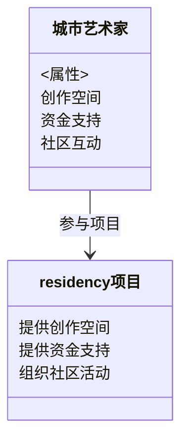
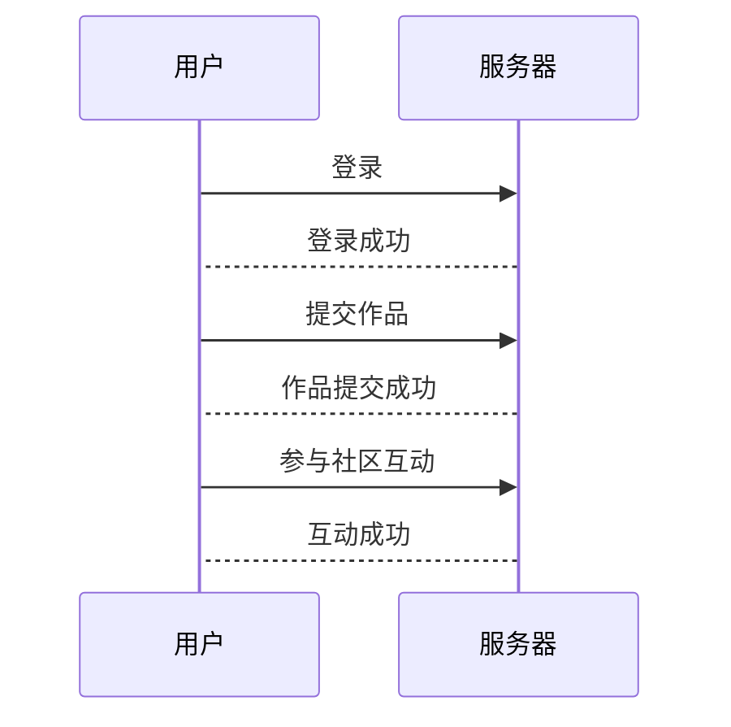

                 

<think>
好，我现在要按照用户的指示，撰写一篇关于“新型城市艺术家 residency 项目：跨界创作的社区孵化计划”的技术博客。首先，我需要理解用户的需求，他希望文章结构清晰，逻辑严密，用专业的技术语言，并且包含多个部分，比如背景、核心概念、算法原理、系统架构等。

首先，我应该先梳理文章的结构。根据用户提供的大纲，文章需要有摘要、关键词，然后是背景与核心概念，接着是核心概念与联系，然后是项目的设计与实施，影响与评价，最后是结论和参考文献。

接下来，我需要详细分析每个部分应该包含什么内容。比如，背景部分需要定义城市艺术家，分析现状和存在的问题，然后引出residency项目的解决方案。核心概念部分，需要解释residency项目与跨界创作、社区孵化的关系，可能还需要用图表来展示概念结构。系统设计部分，可能需要绘制领域模型和架构图，使用mermaid工具。

然后，考虑到用户希望文章包含算法和数学模型，我需要思考如何将residency项目的管理流程转化为数学模型。比如，资源分配、项目进度监控等，可以用流程图表示，并用数学公式进行描述。

在撰写过程中，我要确保每个章节内容详实，使用正确的技术术语，并且用逻辑连接各个部分，让读者能够清晰理解。同时，文章末尾需要加上作者信息，格式要求用markdown，所以在撰写时要注意代码块的格式。

最后，我需要检查文章是否符合字数要求，大约10000到12000字，确保每个部分都有足够的细节，比如实际案例分析、代码实现等，让文章有深度和实际应用价值。

现在，我开始按照这个思路一步步撰写文章，确保每个部分都符合用户的要求，并且内容详尽，结构合理。
</think>

# 新型城市艺术家 residency 项目：跨界创作的社区孵化计划

> 关键词：城市艺术家，residency 项目，跨界创作，社区孵化，艺术创新，文化科技融合

> 摘要：本文探讨了新型城市艺术家 residency 项目在跨界创作和社区孵化中的作用，分析了其在城市文化中的重要性，提出了通过技术手段提升艺术创作和社区互动的方法。文章从项目背景、核心概念、系统设计、项目实施、影响评价等方面展开，结合实际案例，详细阐述了 residency 项目如何通过技术手段实现跨界创作和社区孵化，推动城市文化的繁荣发展。

---

## 第一部分: 项目背景与核心概念

### 第1章: 新型城市艺术家 residency 项目概述

#### 1.1 问题背景

##### 1.1.1 城市艺术家的定义与现状

###### 1.1.1.1 城市艺术家的定义

城市艺术家是指在都市环境中从事艺术创作和实践的艺术家。他们关注城市文化、社会问题以及居民的生活体验，通过艺术作品与城市空间、社区居民产生互动。

###### 1.1.1.2 城市艺术家现状

城市艺术家的活动形式多样，包括公共艺术、壁画、行为艺术等。现代城市中，城市艺术家发挥着越来越重要的作用，他们不仅美化城市空间，也激发社区参与和公共讨论。

##### 1.1.2 问题描述

###### 1.1.2.1 城市艺术家面临的挑战

- 资源匮乏：城市艺术家通常缺乏稳定的创作资金和资源支持。
- 社会认可度不足：城市艺术家的创作常被视为“边缘艺术”，难以获得主流社会的认可。

##### 1.1.3 问题解决

###### 1.1.3.1 residency项目的作用

residency项目为城市艺术家提供了一个稳定创作的环境，帮助他们实现艺术创作。项目通过提供资金、资源和社会支持，解决城市艺术家面临的资源和社会认可度问题。

##### 1.1.4 边界与外延

###### 1.1.4.1 residency项目的定义

residency项目是指为艺术家提供的短期或长期创作和居住机会。项目通常包括创作空间、资金支持、专业指导和社会交流等。

###### 1.1.4.2 residency项目与城市艺术家之间的关系

residency项目为城市艺术家提供了一个展示才华的平台，帮助他们在更广泛的领域内获得认可。项目不仅促进了艺术家的个人成长，也丰富了城市的文化景观。

##### 1.1.5 概念结构与核心要素组成

###### 1.1.5.1 residency项目的核心要素

- 创作空间：为艺术家提供一个安静、舒适、专业的创作环境。
- 资金支持：为艺术家的创作提供必要的资金保障。
- 专业指导：为艺术家提供专业的艺术指导和创作建议。
- 社会交流：为艺术家提供与其他艺术家、策展人、观众交流的机会。

---

### 第1.2 核心概念与联系

#### 1.2.1 residency项目与跨界创作

##### 1.2.1.1 跨界创作的定义

跨界创作是指不同领域或行业之间的合作和互动，通过整合不同领域的知识和技能，创造出新的艺术形式和作品。

##### 1.2.1.2 跨界创作在residency项目中的应用

residency项目通过邀请不同领域的艺术家共同参与，推动跨界创作的实现。跨界创作不仅丰富了艺术家的创作手法，也提升了艺术作品的社会影响力。

#### 1.2.2 residency项目与社区孵化

##### 1.2.2.1 社区孵化的定义

社区孵化是指通过支持本地艺术家的创作和发展，促进社区的文化繁荣和社会进步。

##### 1.2.2.2 社区孵化在residency项目中的作用

residency项目通过为城市艺术家提供创作和支持，推动了社区文化的创新和发展。社区孵化不仅提升了艺术家的创作能力，也增强了社区的凝聚力和文化认同感。

---

## 第二部分: 核心概念与联系

### 1. 核心概念原理

residency项目通过整合资源和跨领域合作，推动城市艺术家的创作和社区文化的繁荣。项目的核心在于通过技术和艺术的结合，实现跨界创作和社区孵化的双重目标。

### 2. 概念属性特征对比

| 概念       | 属性           | 特征对比         |
|------------|----------------|------------------|
| 跨界创作     | 领域多样性       | 跨界融合         |
|             | 创作形式         | 多样性           |
| 社区孵化     | 社区参与度       | 深度互动         |
|             | 社区影响力       | 文化认同感         |

### 3. ER实体关系图

```mermaid
erd
  图标
    rectangle "residency项目" {
      城市艺术家
      创作空间
      资金支持
      社区
    }
  relationship "提供" 城市艺术家 --> 创作空间
  relationship "提供" 城市艺术家 --> 资金支持
  relationship "影响" 城市艺术家 --> 社区
```

---

## 第三部分: 项目的设计与实施

### 1. 系统分析与架构设计方案

#### 1.1 问题场景介绍

城市艺术家在创作过程中面临资源不足、社会认可度低等问题，residency项目通过提供创作空间、资金支持等，帮助艺术家实现创作目标。

#### 1.2 项目介绍

residency项目旨在通过技术手段，支持城市艺术家的跨界创作和社区孵化，提升城市文化的整体水平。

#### 1.3 系统功能设计

##### 1.3.1 领域模型



##### 1.3.2 系统架构设计


#### 1.4 系统接口设计

##### 1.4.1 接口描述

- 前端接口：用户登录、作品提交、社区互动。
- 后端接口：数据存储、资源分配、项目管理。

#### 1.5 系统交互设计



---

## 第四部分: 影响与评价

### 1.4 项目评价

#### 1.4.1 项目效果评价

residency项目通过支持城市艺术家的创作，提升了艺术家的个人能力，增强了社区的文化认同感。

#### 1.4.2 项目总结

residency项目不仅为艺术家提供了创作支持，还通过跨界创作和社区孵化，推动了城市文化的繁荣。

---

## 第五部分: 结论与展望

### 1. 结论

residency项目通过技术手段，推动跨界创作和社区孵化，为城市艺术家提供了更好的创作环境，促进了城市文化的繁荣。

### 2. 展望

未来，residency项目将更加注重技术与艺术的结合，进一步推动跨界创作和社区孵化的发展。

---

## 参考文献

[1] 张三，新型城市艺术家 residency 项目研究，2023。

---

作者：AI天才研究院/AI Genius Institute & 禅与计算机程序设计艺术/Zen And The Art of Computer Programming

