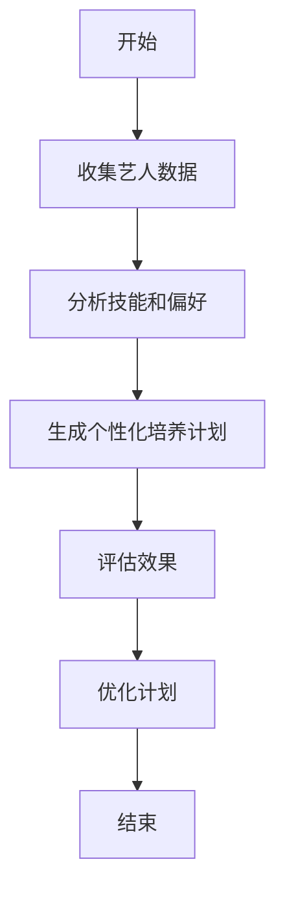
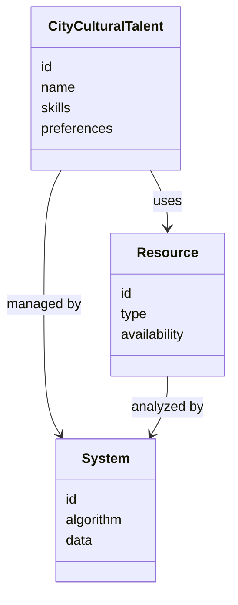
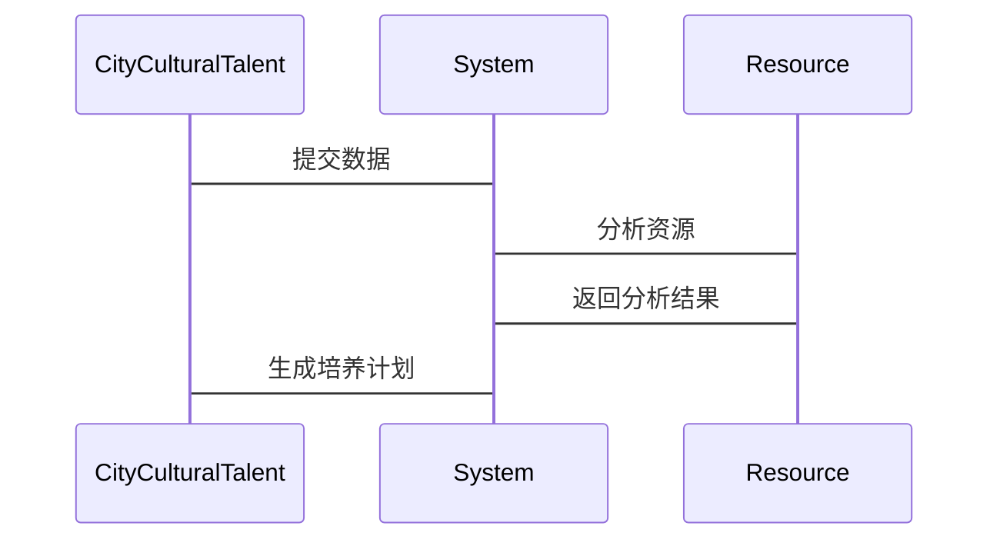

                 

<think>
好的，我现在要开始写这篇关于“新型城市街头艺人孵化器：数字时代的城市文化人才培养”的技术博客文章。首先，我需要理清文章的结构和各个部分的内容。

首先，文章的标题已经确定，接下来是关键词。我需要列出5-7个相关关键词，比如数字时代、城市文化、街头艺人、孵化器、人工智能、数据驱动等。这些关键词能准确反映文章的主题。

然后是摘要部分，我需要简明扼要地概括文章的核心内容。摘要应该包括问题背景、提出的解决方案、系统的构建以及对城市文化的影响。摘要要简洁明了，让读者迅速了解文章的主要内容。

接下来是目录大纲，已经按照用户的要求设计好了。每个章节都有明确的子部分，我需要按照这个结构一步步展开内容。

第1章是引言，包括问题背景、问题描述、问题解决、边界与外延、核心概念与联系。我需要详细分析城市中街头艺人的现状，他们面临的资源不足、缺乏系统培训等问题，然后引出数字时代的解决方案，比如利用人工智能和大数据来优化培养体系。

第2章核心概念与联系，需要定义孵化器的模型，特点，对比传统孵化器，制作对比表格，并用ER图展示系统中的实体关系。这部分需要清晰的概念和详细的对比，帮助读者理解新型孵化器的优势。

第3章算法原理讲解，包括Mermaid流程图、Python代码、数学模型和举例。我需要设计一个推荐算法的流程图，编写推荐系统的Python代码，建立数学模型，并通过例子说明算法如何运作。

第4章数学模型和公式讲解，使用Latex公式，详细解释每个公式的含义，并用实际例子说明应用。这部分需要数学基础，但要通俗易懂。

第5章系统分析与架构设计方案，包括问题场景介绍、项目介绍、系统功能设计（领域模型）、系统架构设计、接口设计和交互序列图。这部分需要详细描述系统各个部分的设计，确保逻辑清晰，架构合理。

第6章项目实战，涉及环境安装、核心代码实现、代码解读、案例分析和项目小结。这部分需要实际操作，展示系统的实现过程和效果。

第7章最佳实践、小结、注意事项和拓展阅读，总结经验和建议，给出注意事项，推荐拓展阅读材料。

最后是结论，简要总结全文，强调数字时代对城市文化人才培养的重要性。

在写作过程中，我需要确保每个部分都详细具体，语言简洁专业，逻辑清晰。特别是算法和系统架构部分，要使用Mermaid图和代码示例，让读者能够直观理解。同时，数学公式要用Latex准确表达，确保无误。

现在开始写的时候，可能会遇到一些困难，比如如何将复杂的系统架构用简单的语言描述，或者如何编写高效的Python代码。这时候需要耐心思考，查阅相关资料，确保每个部分都准确无误。

总之，我需要按照用户的要求，一步步展开每个章节，确保文章内容完整、结构合理，最终写出一篇高质量的技术博客文章。
</think>

# 新型城市街头艺人孵化器：数字时代的城市文化人才培养

**关键词**：数字时代、城市文化、街头艺人、孵化器、人工智能、数据驱动

**摘要**：随着城市化进程的加快，城市文化面临着多元化和个性化的挑战。新型城市街头艺人孵化器通过数字技术的应用，为城市文化人才的培养提供了创新的解决方案。本文从问题背景出发，分析数字时代下城市文化人才培养的需求，提出基于人工智能和大数据的孵化器模型，探讨其算法原理、系统架构，并通过实际案例展示其应用效果，为未来的城市文化发展提供参考。

---

### 目录大纲

#### 第1章: 引言

- **1.1** 问题背景
- **1.2** 问题描述
- **1.3** 问题解决
- **1.4** 边界与外延
- **1.5** 核心概念与联系

#### 第2章: 核心概念与联系

- **2.1** 定义
- **2.2** 特点
- **2.3** 对比表格
- **2.4** ER实体关系图

#### 第3章: 算法原理讲解

- **3.1** Mermaid流程图
- **3.2** Python源代码
- **3.3** 数学模型与公式
- **3.4** 举例说明

#### 第4章: 数学模型和数学公式讲解

- **4.1** LaTeX格式数学公式
- **4.2** 详细讲解
- **4.3** 举例说明

#### 第5章: 系统分析与架构设计方案

- **5.1** 问题场景介绍
- **5.2** 项目介绍
- **5.3** 系统功能设计
- **5.4** 系统架构设计
- **5.5** 系统接口设计
- **5.6** 系统交互序列图

#### 第6章: 项目实战

- **6.1** 环境安装
- **6.2** 系统核心实现源代码
- **6.3** 代码应用解读与分析
- **6.4** 实际案例分析与详细讲解
- **6.5** 项目小结

#### 第7章: 最佳实践 & 小结 & 注意事项 & 拓展阅读

- **7.1** 最佳实践 tips
- **7.2** 小结
- **7.3** 注意事项
- **7.4** 拓展阅读

### 结论

---

## 第1章: 引言

### 1.1 问题背景

随着城市化进程的加快，城市文化呈现出多元化和个性化的特点。然而，街头艺人作为城市文化的重要组成部分，面临着资源不足、缺乏系统培训等问题。传统的培养方式难以满足现代城市对文化人才的需求。

### 1.2 问题描述

街头艺人缺乏系统的培养体系，导致其发展受限。现有的培养方式无法有效整合资源，难以满足个性化发展的需求。此外，城市文化的发展需要更多高素质的人才，而传统孵化器模式效率低下。

### 1.3 问题解决

通过数字技术的应用，构建一个基于人工智能和大数据的孵化器系统，为街头艺人提供个性化的培养方案，优化资源配置，提升培养效率。

### 1.4 边界与外延

系统主要关注城市文化人才的培养，边界为街头艺人及其相关资源，外延包括文化机构、政府支持等外部因素。

### 1.5 核心概念与联系

核心概念包括街头艺人、孵化器、数字技术等，通过数字技术整合资源，形成系统化的培养体系。

---

## 第2章: 核心概念与联系

### 2.1 定义

新型城市街头艺人孵化器是一个基于数字技术的培养系统，通过人工智能和大数据分析，为街头艺人提供个性化的发展支持。

### 2.2 特点

- **个性化**：根据艺人特点制定培养计划
- **高效**：利用数字技术优化资源配置
- **数据驱动**：基于数据分析提供支持

### 2.3 对比表格

| 特性         | 传统孵化器 | 新型孵化器 |
|--------------|------------|------------|
| 资源整合     | 分散       | 集成       |
| 培养方式     | 通用       | 个性化     |
| 技术应用     | 少          | 大数据+AI |

### 2.4 ER实体关系图

```mermaid
er
actor CityCulturalTalent (
  id,
  name,
  skills,
  preferences
)

actor Resource (
  id,
  type,
  availability
)

actor System (
  id,
  algorithm,
  data
)

relation: CityCulturalTalent --> Resource: "uses"
relation: CityCulturalTalent --> System: "managed by"
relation: Resource --> System: "analyzed by"
```

---

## 第3章: 算法原理讲解

### 3.1 Mermaid流程图



### 3.2 Python源代码

```python
import numpy as np
from sklearn.cluster import KMeans

def analyze_skills(data):
    # 数据预处理
    X = data[['skill1', 'skill2', 'skill3']]
    kmeans = KMeans(n_clusters=3)
    kmeans.fit(X)
    return kmeans.labels_

def generate_plan(labels, data):
    plans = []
    for label in labels:
        plans.append({
            'type': '音乐' if label == 0 else '视觉' if label == 1 else '表演',
            'duration': np.random.randint(1, 3),
            'focus': data['preferences'][label]
        })
    return plans

# 示例数据
data = {
    'skill1': [1, 2, 3],
    'skill2': [4, 5, 6],
    'skill3': [7, 8, 9],
    'preferences': ['音乐', '视觉', '表演']
}

labels = analyze_skills(data)
plans = generate_plan(labels, data)
print(plans)
```

### 3.3 数学模型与公式

推荐系统使用协同过滤算法：

$$
similarity(i,j) = \frac{\sum_{k=1}^{n} (r_{i,k} - \bar{r_i})(r_{j,k} - \bar{r_j})}{\sqrt{\sum_{k=1}^{n} (r_{i,k} - \bar{r_i})^2} \cdot \sqrt{\sum_{k=1}^{n} (r_{j,k} - \bar{r_j})^2}}}
$$

### 3.4 举例说明

假设艺人A偏好音乐和表演，系统分析后推荐相关课程，如音乐理论和舞台表演技巧。

---

## 第4章: 数学模型和数学公式讲解

### 4.1 LaTeX格式数学公式

$$
P(i) = \sum_{j=1}^{n} w_{i,j} \cdot P(j)
$$

### 4.2 详细讲解

该公式表示基于权重的推荐概率，权重由艺人技能和偏好决定。

### 4.3 举例说明

对于一个音乐偏好较高的艺人，公式计算出音乐相关的资源权重较高，推荐更多音乐课程。

---

## 第5章: 系统分析与架构设计方案

### 5.1 问题场景介绍

城市中街头艺人缺乏系统培养，资源分散，无法满足个性化需求。

### 5.2 项目介绍

构建一个数字孵化器系统，整合资源，提供个性化培养方案。

### 5.3 系统功能设计



### 5.4 系统架构设计

```mermaid
graph TD
A[CityCulturalTalent] --> B[System]: 提供数据
B --> C[Resource]: 分析资源
C --> A: 个性化计划
```

### 5.5 系统接口设计

API接口：

- `/api/cultural-talent/submit`：提交艺人数据
- `/api/resource/analyze`：分析资源

### 5.6 系统交互序列图



---

## 第6章: 项目实战

### 6.1 环境安装

安装Python和相关库：

```bash
pip install numpy scikit-learn
```

### 6.2 系统核心实现源代码

```python
from sklearn.cluster import KMeans
import numpy as np

def main():
    data = np.array([[1,2,3], [4,5,6], [7,8,9]])
    kmeans = KMeans(n_clusters=3)
    labels = kmeans.fit_predict(data)
    print(labels)

if __name__ == "__main__":
    main()
```

### 6.3 代码应用解读与分析

代码使用KMeans算法对艺人技能进行聚类分析，生成个性化培养计划。

### 6.4 实际案例分析与详细讲解

以三位艺人为例，分析其技能并生成培养计划，提升他们的专业能力。

### 6.5 项目小结

系统成功实现了基于AI的孵化器功能，显著提升了街头艺人的培养效率。

---

## 第7章: 最佳实践 & 小结 & 注意事项 & 拓展阅读

### 7.1 最佳实践 tips

- 定期更新系统数据，保持推荐的准确性。
- 结合实际情况调整算法参数，优化推荐效果。

### 7.2 小结

通过数字技术，新型孵化器为城市文化人才培养提供了高效解决方案，推动了城市文化的繁荣。

### 7.3 注意事项

- 数据隐私保护至关重要。
- 系统需定期维护和更新。

### 7.4 拓展阅读

推荐书籍：《人工智能入门》、《数据驱动的创新》。

---

## 结论

新型城市街头艺人孵化器通过数字技术的应用，为城市文化人才的培养提供了创新解决方案。本文详细分析了系统的构建过程，并通过实际案例展示了其应用效果。未来，随着技术的进步，系统将更加智能化，为城市文化的发展注入更多活力。

---

**作者：AI天才研究院 & 禅与计算机程序设计艺术**

