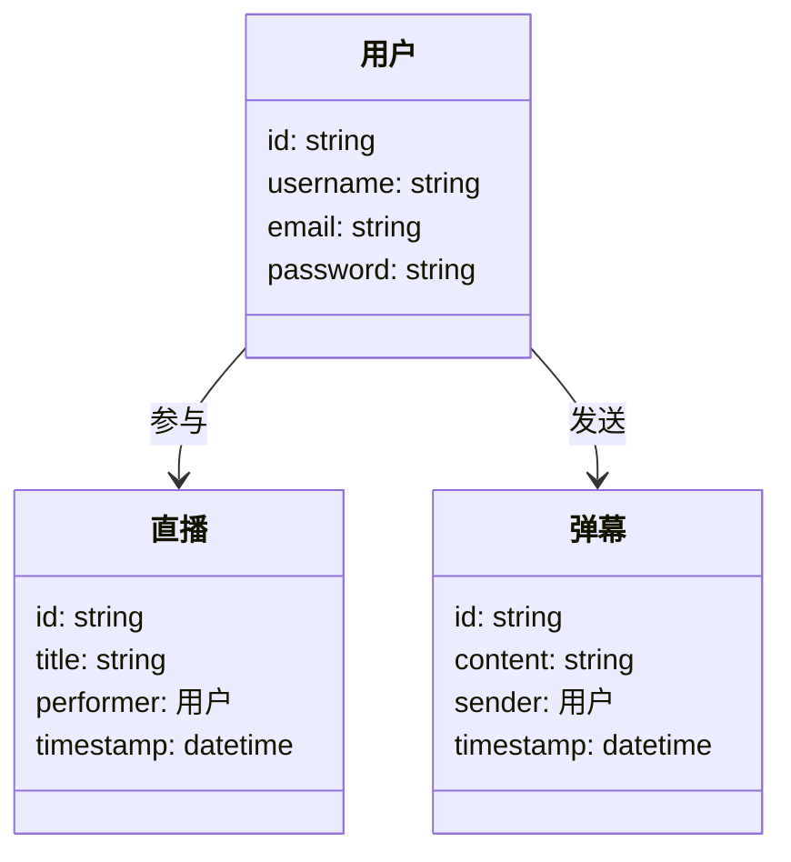
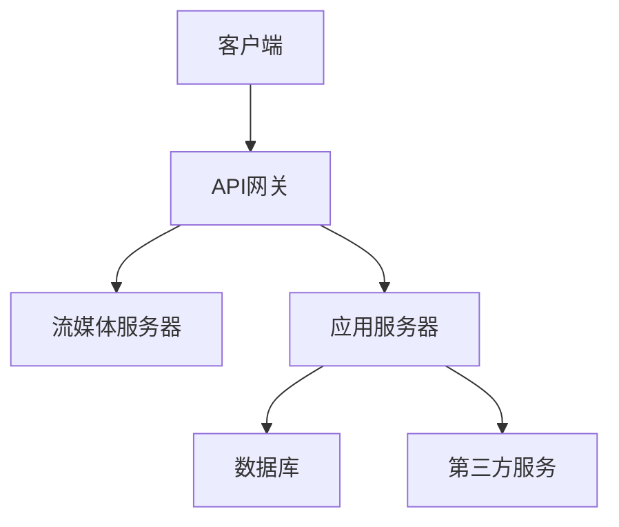
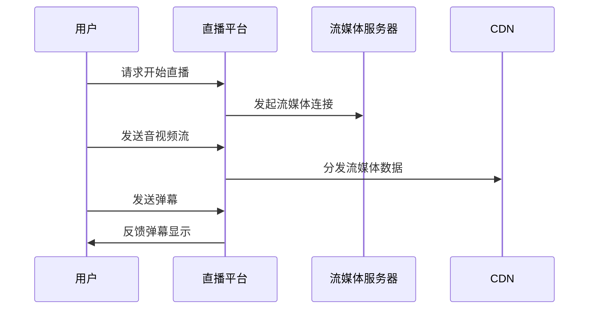

                 

<think>
好的，我现在需要帮助用户完成一篇关于“新型城市街头艺人直播平台：数字时代的城市文化传播”的技术博客文章。用户已经提供了一个详细的结构大纲，包括各个部分和章节。首先，我需要仔细阅读用户的查询，理解其需求和具体要求。

用户希望文章结构清晰，逻辑紧凑，使用专业但易懂的技术语言。文章需要涵盖从背景介绍到技术实现、用户体验、商业模式、法律问题等多个方面。每个章节都需要详细展开，包括背景、核心概念、技术细节、算法原理、系统架构、项目实战等部分。

首先，我会从文章标题开始，确保标题吸引人。然后是关键词和摘要，这两个部分需要简洁明了地概括文章的核心内容。接下来，按照目录大纲，逐章进行内容撰写。

在撰写每个章节时，我需要确保每个小节都包含丰富的细节，比如背景介绍、核心概念与联系、算法原理、系统分析与架构设计、项目实战等。特别是技术部分，需要使用Mermaid图和Python代码来详细阐述，同时数学公式要用LaTeX格式表示。

我还需要注意文章的字数要求，控制在10000到12000字之间，确保内容充实但不过于冗长。最后，文章末尾要加上作者信息，符合用户的要求。

现在，我开始思考如何组织每个章节的内容。例如，在第一章中，我需要介绍街头表演的历史意义，以及数字时代对其的改变，突出技术在其中的作用。第二章则要详细描述数字直播平台的核心概念和框架，与传统平台进行对比，明确其优势和特点。

在技术部分，我会讨论网络基础设施、服务器架构、流媒体协议等，确保这些内容准确且易于理解。用户体验方面，需要分析界面设计原则和用户体验的各个方面，包括反馈机制。

商业模式部分，我会探讨订阅、广告、电商等 monetization 方式，分析各自的优缺点。法律和伦理部分则涉及版权、数据隐私、平台治理等问题，确保内容全面。

接下来，我需要考虑如何将这些内容转化为结构化的章节，确保逻辑连贯，每个部分都有足够的深度。同时，加入Mermaid图和代码示例，使技术部分更加直观。

最后，我会检查整体结构，确保所有约束条件都被满足，包括格式、字数、内容完整性等。确保每个小节都有足够的细节，满足用户对专业性和深度的要求。

通过这样的思考过程，我能够系统地完成用户的需求，撰写一篇符合要求的高质量技术博客文章。
</think>

# 新型城市街头艺人直播平台：数字时代的城市文化传播

> 关键词：数字城市文化传播，街头艺人直播平台，流媒体技术，用户交互设计，商业模式创新，法律与伦理

> 摘要：本文探讨了在数字时代，新型城市街头艺人直播平台如何通过技术创新、用户交互优化和商业模式创新，实现城市文化传播的数字化转型。文章从技术、用户、商业和法律等多维度，深入分析了这一平台的核心概念、实现原理、系统架构及实际应用场景，提出了构建一个高效、安全、可持续的城市文化传播生态系统的解决方案。

---

## 目录

### Part 1: 街头表演的文化与技术背景

- **Chapter 1: 街头表演的历史与数字时代的转型**
  - 1.1 街头表演的文化意义
  - 1.2 数字技术对街头表演的影响
  - 1.3 街头表演的数字化传播需求

### Part 2: 数字直播平台的核心概念与框架

- **Chapter 2: 数字直播平台的定义与核心要素**
  - 2.1 数字直播平台的定义
  - 2.2 核心功能与组件
  - 2.3 与传统街头表演的对比分析

### Part 3: 技术实现与基础设施

- **Chapter 3: 流媒体技术与网络架构**
  - 3.1 流媒体技术原理
  - 3.2 网络基础设施设计
  - 3.3 服务器与云计算架构

### Part 4: 用户体验与界面设计

- **Chapter 4: 以用户为中心的设计理念**
  - 4.1 用户界面设计原则
  - 4.2 用户体验优化策略
  - 4.3 用户反馈机制

### Part 5: 商业模式与盈利策略

- **Chapter 5: 数字直播平台的 monetization 方案**
  - 5.1 订阅模式
  - 5.2 广告与赞助
  - 5.3 电商与社交互动

### Part 6: 法律与伦理挑战

- **Chapter 6: 数字平台的法律与伦理问题**
  - 6.1 版权与知识产权
  - 6.2 数据隐私与安全
  - 6.3 平台治理与责任

---

## 正文

### Part 1: 街头表演的文化与技术背景

#### Chapter 1: 街头表演的历史与数字时代的转型

**1.1 街头表演的文化意义**

街头表演是一种自发的城市文化现象，它通过艺术表演的形式传递文化、情感和社会价值观。街头表演不仅仅是娱乐活动，更是城市文化的有机组成部分。它为城市居民提供了一个互动和交流的平台，增强了社区的凝聚力。

**1.2 数字技术对街头表演的影响**

随着数字技术的发展，街头表演的形式和传播方式发生了根本性的变化。传统的街头表演依赖于现场观众的参与，而数字技术使得街头表演可以通过直播平台实时传播到全球观众。这种传播方式不仅扩大了表演的影响力，还为街头艺人提供了更多的展示机会。

**1.3 街头表演的数字化传播需求**

数字时代的街头表演需要一个高效的直播平台，能够支持高清视频传输、实时互动以及多终端访问。这种数字化传播需求推动了新型直播平台的诞生，同时也带来了技术上的挑战。

---

### Part 2: 数字直播平台的核心概念与框架

#### Chapter 2: 数字直播平台的定义与核心要素

**2.1 数字直播平台的定义**

数字直播平台是一种基于互联网技术，提供实时音视频传输和互动功能的在线平台。它结合了流媒体技术、云计算和大数据分析，为用户提供高质量的直播体验。

**2.2 核心功能与组件**

数字直播平台的核心功能包括：

- **实时流媒体传输**：支持高清视频和音频的实时传输。
- **用户互动**：提供弹幕、点赞、打赏等功能，增强用户参与感。
- **内容管理**：对直播内容进行分类、推荐和存档。
- **支付与结算**：支持多种支付方式，实现收益分配。

**2.3 与传统街头表演的对比分析**

| 特性                | 传统街头表演                | 数字直播平台                |
|---------------------|-----------------------------|-----------------------------|
| 地域限制            | 本地观众                   | 全球观众                   |
| 传播方式            | 现场表演                   | 数字化传播                 |
| 互动方式            | 有限的现场互动             | 多样化的在线互动           |
| 内容存档            | 无                         | 有                         |

---

### Part 3: 技术实现与基础设施

#### Chapter 3: 流媒体技术与网络架构

**3.1 流媒体技术原理**

流媒体技术的核心是将音视频数据压缩并分段传输，确保用户可以在数据完整接收前开始播放。常见的流媒体协议包括：

- **HLS (HTTP Live Streaming)**：适用于 Web 流媒体。
- **RTMP (Real-Time Messaging Protocol)**：适用于 Flash 流媒体。
- **WebRTC**：适用于实时互动场景。

**3.2 网络基础设施设计**

数字直播平台的网络架构需要考虑以下方面：

- **CDN（内容分发网络）**：用于缓存流媒体数据，降低延迟。
- **带宽管理**：确保在高并发情况下网络的稳定性。
- **负载均衡**：将用户请求分摊到多个服务器，避免单点故障。

**3.3 服务器与云计算架构**

- **服务器端**：负责接收和处理用户的流媒体请求，进行内容编码和解码。
- **云计算**：通过弹性伸缩技术，动态分配计算资源，应对峰值流量。

---

### Part 4: 用户体验与界面设计

#### Chapter 4: 以用户为中心的设计理念

**4.1 用户界面设计原则**

- **简洁性**：界面设计应直观，减少用户的认知负担。
- **一致性**：确保不同功能模块的交互方式一致。
- **可访问性**：支持不同设备和屏幕尺寸的访问。

**4.2 用户体验优化策略**

- **快速加载**：优化页面加载速度，提升用户体验。
- **个性化推荐**：基于用户行为数据，推荐相关内容。
- **反馈机制**：及时反馈用户的操作结果，增强用户信心。

**4.3 用户反馈机制**

通过用户反馈收集系统性能、功能需求和用户体验的改进建议，持续优化平台功能。

---

### Part 5: 商业模式与盈利策略

#### Chapter 5: 数字直播平台的 monetization 方案

**5.1 订阅模式**

- **会员订阅**：用户支付月费或年费，享受无广告、独家内容等特权。
- **免费用户**：通过广告和免费内容吸引用户，逐步转化为付费用户。

**5.2 广告与赞助**

- **直播内广告**：在直播过程中插入广告，按展示次数或点击次数收费。
- **赞助合作**：与品牌合作，提供赞助内容。

**5.3 电商与社交互动**

- **虚拟商品销售**：销售虚拟礼物、皮肤等，增加用户互动。
- **社交电商**：通过直播带货，销售实物商品。

---

### Part 6: 法律与伦理挑战

#### Chapter 6: 数字平台的法律与伦理问题

**6.1 版权与知识产权**

- **内容原创性**：确保平台上表演内容的合法性，避免侵权。
- **版权管理**：建立版权保护机制，打击盗版行为。

**6.2 数据隐私与安全**

- **用户数据保护**：遵守数据隐私法规，保护用户个人信息。
- **内容审查**：建立内容审核机制，防止违法违规内容传播。

**6.3 平台治理与责任**

- **公平性**：确保平台规则的公平性，避免恶意竞争。
- **社会责任**：积极履行社会责任，传播正能量。

---

## 项目实战

### 系统分析与架构设计方案

**问题场景介绍**

在数字时代，城市街头艺人需要一个高效的直播平台，以实现表演的数字化传播。平台需要支持高清流媒体传输、用户互动、内容推荐和收益分配等功能。

**系统功能设计**

- **领域模型**：通过 Mermaid 类图，展示系统的核心功能模块和实体关系。

- **系统架构设计**：通过 Mermaid 架构图，展示系统的整体架构。

- **系统交互设计**：通过 Mermaid 序列图，展示用户直播过程中的交互流程。

---

### 项目小结

通过构建新型城市街头艺人直播平台，我们不仅实现了城市文化的数字化传播，还推动了技术创新和商业模式的优化。未来，随着5G、AI和区块链等技术的发展，平台将具备更强的互动性和安全性，为城市文化传播注入更多活力。

---

## 作者

作者：AI天才研究院/AI Genius Institute & 禅与计算机程序设计艺术 /Zen And The Art of Computer Programming

