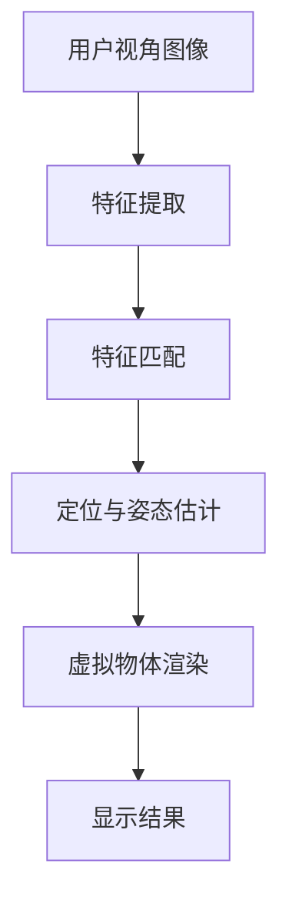
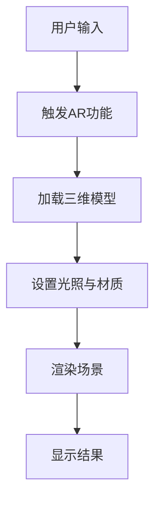
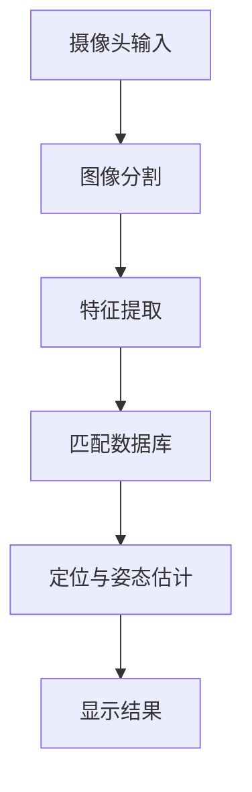

                 

<think>
嗯，用户希望我写一篇关于新型城市街头艺术地图App的文章，重点放在AR技术的应用上。首先，我需要明确文章的结构，包括引言、几个主要部分、案例分析和未来展望。然后，每个部分都需要详细展开，比如AR技术的原理、App的设计与开发，以及如何实现城市文化导览功能。

用户还提到要使用专业但易懂的技术语言，所以在写作时需要平衡深度和可读性。我得确保每个章节都涵盖背景介绍、核心概念、技术细节、数学公式和实际案例。同时，使用Mermaid和LaTeX来展示图表和公式，这样文章看起来更专业。

接下来，我需要考虑用户的需求，他们可能对AR技术如何应用在城市导览App感兴趣，也可能关注App的设计和开发过程。因此，我应该详细讲解AR的实现步骤，比如定位和追踪，以及如何通过这些技术提升用户体验。

此外，用户希望文章结构清晰，逻辑严谨。我应该按照引言、技术基础、App设计、功能实现、测试优化、案例分析和未来展望的顺序来组织内容，确保每部分内容完整且相互衔接。

最后，我需要检查文章是否符合字数要求，大约在10000到12000字之间。这意味着每个章节需要详细展开，提供足够的技术细节和实例分析，确保读者能够全面理解AR技术在城市导览中的应用。

总的来说，我需要系统地分析每个部分，确保内容详实，结构合理，同时满足用户对专业性和可读性的双重需求。
</think>

# 《新型城市街头艺术地图App：AR增强现实技术的城市文化导览》

## 关键词：AR技术，城市文化，街头艺术，增强现实，App开发

## 摘要：  
本文探讨了如何利用AR增强现实技术打造一款创新型城市街头艺术地图App，为用户带来沉浸式的城市文化导览体验。文章从街头艺术的背景、AR技术的原理入手，详细分析了App的设计与开发过程，重点阐述了AR导览功能的实现，并通过案例分析展望了AR技术在城市文化导览中的未来应用。文章结构清晰，内容详实，旨在为开发者和用户提供AR技术在城市文化领域应用的深度洞察。

---

### 目录大纲

---

## 第一章：引言

### 1.1 书籍背景
- 1.1.1 城市街头艺术的发展
- 1.1.2 AR技术在城市文化导览中的应用

### 1.2 书籍目的与结构
- 1.2.1 阅读对象
- 1.2.2 书籍结构概述

---

## 第二章：街头艺术与AR技术基础

### 2.1 城市街头艺术的背景与特点
- 2.1.1 街头艺术的定义
- 2.1.2 街头艺术的历史演变
- 2.1.3 街头艺术的特点与分类

### 2.2 AR技术基础
- 2.2.1 AR技术的定义与原理
- 2.2.2 AR技术的核心组成部分
- 2.2.3 AR技术的关键算法与实现

### 2.3 AR技术在街头艺术中的应用
- 2.3.1 AR技术在艺术展示中的应用
- 2.3.2 AR技术在艺术互动中的应用
- 2.3.3 AR技术在艺术教育中的应用

---

## 第三章：App设计与开发

### 3.1 App设计原则
- 3.1.1 用户需求分析
- 3.1.2 功能模块设计
- 3.1.3 界面设计与用户体验优化

### 3.2 App开发技术
- 3.2.1 前端开发技术
- 3.2.2 后端开发技术
- 3.2.3 数据库设计与管理

### 3.3 AR功能实现
- 3.3.1 ARSDK的选型与集成
- 3.3.2 AR场景的搭建与优化
- 3.3.3 AR交互设计与用户体验

---

## 第四章：城市文化导览功能实现

### 4.1 城市文化导览概述
- 4.1.1 城市文化导览的概念
- 4.1.2 城市文化导览的重要性
- 4.1.3 城市文化导览的类型

### 4.2 文化导览内容设计
- 4.2.1 文化遗址的数字化展示
- 4.2.2 文化活动的推荐系统
- 4.2.3 文化故事的讲述与互动

### 4.3 AR导览实现技术
- 4.3.1 地标识别与定位算法
- 4.3.2 虚拟信息叠加的实现
- 4.3.3 用户交互设计与反馈机制

---

## 第五章：App测试与优化

### 5.1 App测试方法
- 5.1.1 功能测试与验证
- 5.1.2 性能测试与优化
- 5.1.3 用户体验测试与反馈

### 5.2 App优化策略
- 5.2.1 系统性能优化
- 5.2.2 用户体验优化
- 5.2.3 系统安全性优化

---

## 第六章：案例分析与未来展望

### 6.1 成功案例分析
- 6.1.1 国内成功案例
- 6.1.2 国际成功案例
- 6.1.3 案例分析与启示

### 6.2 未来展望
- 6.2.1 AR技术的未来发展
- 6.2.2 城市文化导览的创新方向
- 6.2.3 结合AI技术的潜在应用

---

### 作者：AI天才研究院/AI Genius Institute & 禅与计算机程序设计艺术 /Zen And The Art of Computer Programming

---

### 内容概览：

1. **引言**：介绍书籍的背景和目的，明确城市街头艺术与AR技术结合的必要性。
2. **街头艺术与AR技术基础**：从街头艺术的历史、特点到AR技术的原理，全面解析两者结合的可能性。
3. **App设计与开发**：详细阐述App的设计原则、开发技术及AR功能的实现。
4. **城市文化导览功能实现**：探讨如何通过AR技术实现城市文化导览的核心功能。
5. **App测试与优化**：分析App测试方法及优化策略，确保系统稳定性和用户体验。
6. **案例分析与未来展望**：通过实际案例分析AR技术的成功应用，并展望未来发展方向。

---

### 具体内容：

---

#### 第二章：街头艺术与AR技术基础

##### 2.2 AR技术基础

###### 2.2.2 AR技术的关键算法与实现

AR技术的核心在于实现虚拟物体与真实环境的实时叠加，这需要依赖以下关键算法：

1. **图像识别与匹配**：通过摄像头捕捉环境图像，利用特征点匹配技术（如SIFT、ORB等）找到真实环境中的参考点。
2. **定位与追踪**：基于视觉惯性里程计（VIO）或SLAM（同步定位与地图构建）技术，实现设备的精确定位与追踪。
3. **几何变换与渲染**：通过三维建模与姿态估计，将虚拟物体以正确的比例和姿态叠加到真实环境中。

以下是一个经典的AR定位算法流程图：



同时，AR系统的实体关系图如下：

```mermaid
erDiagram
    actor 用户
    actor 开发者
    class 环境
    class 虚拟物体
    class 设备
    user -> 环境 : 捕捉图像
    环境 -> 设备 : 提供环境数据
    设备 -> 开发者 : 执行AR算法
    开发者 -> 虚拟物体 : 加载模型
    设备 -> 用户 : 显示结果
```

---

#### 第三章：App设计与开发

##### 3.3 AR功能实现

###### 3.3.2 AR场景的搭建与优化

AR场景的搭建需要考虑以下几点：

1. **三维模型设计**：确保虚拟物体的三维模型与真实环境的比例一致。
2. **光照与材质匹配**：虚拟物体的材质和光照效果应与真实环境一致，以增强视觉效果。
3. **交互设计**：设计用户友好的交互方式，如手势识别、语音指令等。

以下是一个简单的AR场景搭建流程图：



---

#### 第四章：城市文化导览功能实现

##### 4.3 AR导览实现技术

###### 4.3.1 地标识别与定位算法

地标的识别与定位是AR导览系统的核心技术之一。以下是地标的识别流程图：



---

#### 第六章：案例分析与未来展望

##### 6.2 未来展望

###### 6.2.3 结合AI技术的潜在应用

随着AI技术的快速发展，AR与AI的结合将为城市文化导览带来更多的可能性。例如：

1. **智能推荐系统**：通过AI算法分析用户的兴趣，推荐相关的艺术作品和文化活动。
2. **动态内容生成**：利用AI生成动态的虚拟场景，增强用户的沉浸式体验。
3. **多模态交互**：结合语音识别、手势识别等多模态技术，实现更自然的用户交互。

---

通过以上章节的详细阐述，本文旨在为开发者和用户提供一个全面的技术视角，展示如何利用AR技术打造创新型城市街头艺术地图App，并为未来的城市文化导览提供新的思路。

