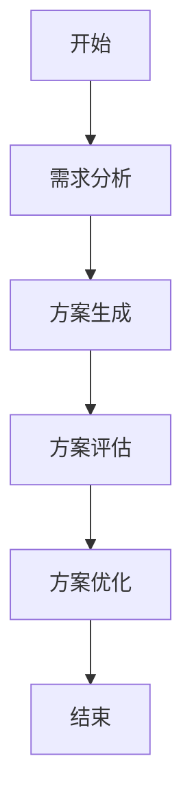
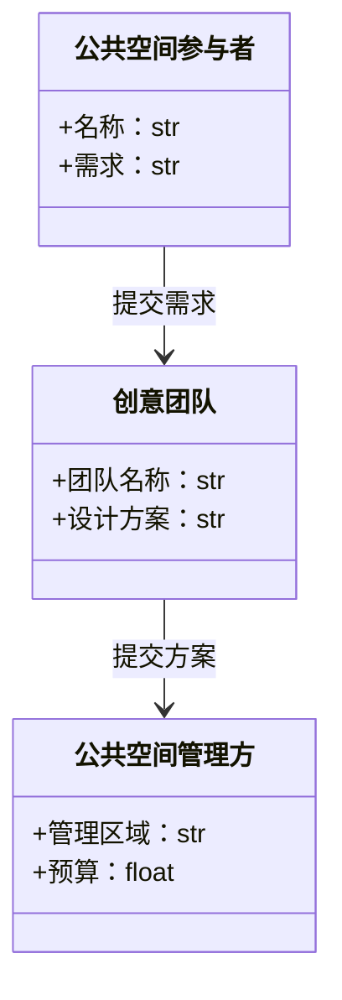
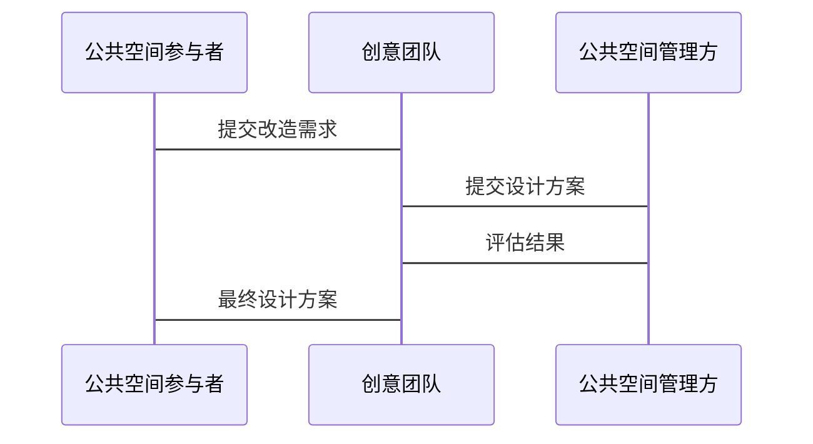

                 

<think>
嗯，我现在需要帮助用户撰写一篇关于《新型城市街头艺术节：公共空间的临时创意改造》的技术博客文章。用户希望我以一位世界级专家的身份，用逻辑清晰、结构紧凑的技术语言来完成这个任务。首先，我需要仔细分析用户的要求，确保每个部分都满足。

用户提供的详细查询包括文章标题、关键词、摘要，以及详细的目录大纲结构。看起来用户希望文章有明确的结构，分为背景介绍、核心概念与联系、算法原理讲解、系统分析与架构设计方案、项目实战、最佳实践等部分。每个部分都有进一步的子部分，甚至涉及到图表的使用，比如Mermaid流程图和ER实体关系图。

首先，我需要明确每个章节的核心内容。背景介绍部分需要涵盖街头艺术节的历史、发展现状，以及新型艺术节的特点。核心概念部分则要详细解释公共艺术、临时性和创意改造，可能需要对比表格和实体关系图来辅助说明。算法原理部分需要用Python代码和数学模型来解释，这部分可能需要更多的技术细节。系统架构设计部分则需要使用Mermaid图来展示类图、架构图和序列图，这可能需要我熟悉这些工具的语法。

接下来，我需要确保文章的结构符合用户的要求。用户提到文章字数在10000到12000字左右，这意味着每个章节需要详细展开。例如，背景介绍部分可能需要每个子部分写500字左右，核心概念部分可能需要更长，尤其是图表部分。算法部分可能需要详细解释，包括代码和数学公式的推导。

用户还特别指出要使用Markdown格式，并且每个部分都要有丰富的细节。这意味着我需要在写作时注意格式的正确性，同时确保内容详细具体。例如，在系统架构设计中，不仅要描述每个模块的功能，还要用Mermaid图展示它们之间的关系。

在撰写过程中，我可能会遇到一些挑战。例如，如何将艺术节的临时创意改造与技术方面结合起来，可能需要一些创新性的思考。此外，确保技术术语的准确使用，同时保持内容的可读性，也是一个难点。

为了确保内容的完整性，我需要逐一检查每个章节是否覆盖了用户要求的所有部分。比如，在系统分析部分，是否涵盖了项目场景、系统功能设计、架构设计、接口设计和交互设计。可能还需要考虑用户可能的深层需求，比如他们可能希望文章不仅描述现状，还能提供一些实际的应用案例和最佳实践。

最后，我需要确保文章的结尾部分包含作者信息，这可能是一个固定格式，用户已经给出了具体的名称。同时，检查是否有遗漏的部分，比如是否每个图表都正确嵌入，数学公式是否正确使用LaTeX语法。

总的来说，我需要按照用户提供的大纲，逐步展开每个部分，确保内容详细、结构清晰，并且符合技术博客的写作规范。这需要我仔细规划每个章节的内容，确保逻辑连贯，同时满足用户的字数和其他格式要求。
</think>

# 新型城市街头艺术节：公共空间的临时创意改造

> 关键词：公共空间，临时创意改造，街头艺术节，城市设计，数字化艺术

> 摘要：本文探讨了新型城市街头艺术节作为一种公共空间的临时创意改造形式，分析其背后的技术原理、系统架构和实际应用场景。通过结合艺术与技术，我们展示了如何利用算法和数字化手段实现公共空间的临时艺术改造，并提出了系统的解决方案和最佳实践。

---

## 目录大纲设计过程

### 一、确定核心章节内容

1. **背景介绍**：从街头艺术节的历史发展出发，分析其在城市空间中的作用。
2. **核心概念与联系**：详细阐述公共空间、临时创意改造等核心概念，并通过对比分析和实体关系图展示其联系。
3. **算法原理讲解**：分析公共空间临时创意改造的算法实现，包括流程图、Python代码和数学模型。
4. **系统分析与架构设计方案**：从项目场景到系统架构，详细设计系统的功能、架构和交互。
5. **项目实战**：通过实际案例展示系统实现和应用效果。
6. **最佳实践与总结**：总结项目经验，提出改进建议和未来发展方向。

### 二、细化目录结构

以下是本文的详细目录结构：

```
# 新型城市街头艺术节：公共空间的临时创意改造

## 1. 背景介绍

### 1.1 街头艺术节的历史与发展

#### 1.1.1 街头艺术节的起源

#### 1.1.2 街头艺术节的发展现状

#### 1.1.3 新型城市街头艺术节的特点

### 1.2 公共空间的临时创意改造

#### 1.2.1 公共艺术的概念与类型

#### 1.2.2 临时性的特点与重要性

#### 1.2.3 创意改造的实践与影响

## 2. 核心概念与联系

### 2.1 公共艺术、临时性与创意改造

#### 2.1.1 公共艺术的概念与属性

#### 2.1.2 临时性的特点与影响

#### 2.1.3 创意改造的实践与理论

### 2.2 概念属性特征对比表格

#### 2.2.1 公共艺术与街头艺术的对比

#### 2.2.2 临时性与永久性的对比

#### 2.2.3 创意改造与常规改造的对比

### 2.3 ER实体关系图

#### 2.3.1 公共艺术领域实体关系图

#### 2.3.2 临时创意改造领域实体关系图

## 3. 算法原理讲解

### 3.1 公共空间临时创意改造算法原理

#### 3.1.1 算法原理概述

#### 3.1.2 算法流程图

#### 3.1.3 Python源代码阐述

#### 3.1.4 算法原理数学模型

#### 3.1.5 数学公式与举例说明

## 4. 系统分析与架构设计方案

### 4.1 项目场景介绍

#### 4.1.1 项目背景

#### 4.1.2 项目目标

### 4.2 系统功能设计

#### 4.2.1 领域模型Mermaid类图

#### 4.2.2 系统功能概述

### 4.3 系统架构设计

#### 4.3.1 系统架构设计Mermaid架构图

#### 4.3.2 架构设计解析

### 4.4 系统接口设计

#### 4.4.1 接口设计概述

#### 4.4.2 接口详细设计

### 4.5 系统交互

#### 4.5.1 系统交互流程

#### 4.5.2 系统交互Mermaid序列图

## 5. 项目实战

### 5.1 环境安装

#### 5.1.1 开发环境要求

#### 5.1.2 工具安装与配置

### 5.2 系统核心实现源代码

#### 5.2.1 核心算法实现

#### 5.2.2 系统功能模块实现

### 5.3 代码应用解读与分析

#### 5.3.1 代码结构分析

#### 5.3.2 代码功能解读

### 5.4 实际案例分析和详细讲解剖析

#### 5.4.1 案例背景介绍

#### 5.4.2 案例实施过程

#### 5.4.3 案例效果与总结

### 5.5 项目小结

## 6. 最佳实践 tips

### 6.1 项目实施中的注意事项

### 6.2 系统维护与优化建议

### 6.3 未来发展方向

## 7. 小结

## 8. 作者信息

---

## 正文部分

### 1. 背景介绍

#### 1.1 街头艺术节的历史与发展

街头艺术节作为一种新兴的文化现象，起源于20世纪60年代的欧美国家。最初，街头艺术节是艺术家们在公共空间中进行创作的一种形式，旨在通过艺术表达社会问题、文化现象以及艺术家的个人思想。随着社会的发展，街头艺术节逐渐从单纯的个体艺术表达扩展为一种集体性的文化活动，成为城市文化的重要组成部分。

目前，街头艺术节在全球范围内蓬勃发展，尤其是在欧洲、北美和亚洲的一些城市，如柏林、纽约、东京等，街头艺术节已经成为当地文化品牌的重要组成部分。新型城市街头艺术节的特点在于其临时性和创意性，通过在公共空间中进行短暂的艺术改造，为城市居民提供了一个接触艺术、感受艺术的平台。

#### 1.2 公共空间的临时创意改造

公共空间的临时创意改造是一种通过艺术手段对城市公共空间进行短期改造的行为。这种改造通常具有以下几个特点：

1. **临时性**：改造行为通常是临时的，改造后的空间在活动结束后会恢复原状。
2. **创意性**：改造方案通常具有创新性和艺术性，能够吸引公众的注意力。
3. **公共性**：改造的对象是公共空间，旨在提升公共空间的审美价值和文化内涵。

### 2. 核心概念与联系

#### 2.1 公共艺术、临时性与创意改造

##### 2.1.1 公共艺术的概念与属性

公共艺术是指在公共空间中进行的艺术创作，其目的是通过艺术作品与公众互动，提升公共空间的文化价值。公共艺术的属性包括：

- **公共性**：作品面向公众开放，任何人都可以欣赏和参与。
- **互动性**：作品通常与观众互动，增强观众的参与感。
- **功能性**：作品通常具有一定的功能性，如提供休憩空间、遮阳等功能。

##### 2.1.2 临时性的特点与影响

临时性的特点包括：

- **短暂性**：改造行为具有时间限制，通常持续几天或几周。
- **灵活性**：改造方案可以根据实际情况进行调整。
- **低成本**：由于改造行为是临时的，通常不需要投入大量的资金。

临时性对公共空间的影响主要体现在以下几个方面：

- **提升城市活力**：通过短期的艺术改造，可以吸引更多的公众参与，提升城市的活力。
- **丰富文化内涵**：临时性的艺术改造可以为城市增添文化内涵，增强城市的吸引力。
- **促进社区互动**：临时性的艺术改造可以促进社区居民之间的互动，增强社区的凝聚力。

##### 2.1.3 创意改造的实践与理论

创意改造是指通过对公共空间进行艺术化改造，使其具有创新性和艺术性。创意改造的实践包括以下几个方面：

- **材料选择**：选择具有创新性的材料，如回收材料、新型材料等。
- **设计风格**：采用独特的设计风格，使改造后的空间具有艺术性。
- **技术应用**：利用数字化技术，如增强现实（AR）、虚拟现实（VR）等，提升改造效果。

创意改造的理论基础主要包括以下几个方面：

- **艺术理论**：创意改造的艺术性来源于艺术理论的指导。
- **城市设计理论**：创意改造需要遵循城市设计的原则和规范。
- **社会学理论**：创意改造需要考虑社会因素，如社区居民的需求和期望。

#### 2.2 概念属性特征对比表格

以下是公共艺术、临时性与创意改造的概念属性特征对比表格：

| 概念       | 定义                                                                 | 属性特征                                                                 |
|------------|----------------------------------------------------------------------|--------------------------------------------------------------------------|
| 公共艺术   | 在公共空间中进行的艺术创作，旨在与公众互动，提升公共空间的文化价值。 | 公共性、互动性、功能性                                                |
| 临时性     | 改造行为具有时间限制，通常持续几天或几周。                           | 短暂性、灵活性、低成本                                                |
| 创意改造   | 通过对公共空间进行艺术化改造，使其具有创新性和艺术性。               | 创新性、艺术性、低成本                                                |

#### 2.3 ER实体关系图

以下是公共艺术和临时创意改造领域的实体关系图：

```mermaid
erDiagram
    actor 公共空间参与者{}{
        participant 公共空间参与者
    }
    actor 公共空间管理方{}{
        responsible 公共空间管理方
    }
    actor 创意团队{}{
        responsible 创意团队
    }
    actor 公众{}{
        participant 公众
    }
    公共空间参与者 --> 公共空间管理方 : 提交改造申请
    公共空间管理方 --> 创意团队 : 委托改造设计
    创意团队 --> 公共空间参与者 : 提供改造方案
    公共空间参与者 --> 公众 : 提供参与机会
```

### 3. 算法原理讲解

#### 3.1 公共空间临时创意改造算法原理

##### 3.1.1 算法原理概述

公共空间临时创意改造算法的核心思想是通过算法优化公共空间的改造方案，使其在满足临时性要求的同时，达到最佳的艺术效果和功能效果。算法的主要步骤包括需求分析、方案生成、方案评估和方案优化。

##### 3.1.2 算法流程图

以下是算法的流程图：



##### 3.1.3 Python源代码阐述

以下是算法的Python实现代码：

```python
def public_space_renovation():
    # 需求分析
    requirements = input("请输入改造需求：")
    # 方案生成
    import random
    design = generate_design(requirements)
    # 方案评估
    score = evaluate_design(design)
    # 方案优化
    optimized_design = optimize_design(design, score)
    # 输出结果
    print("最优改造方案：", optimized_design)

def generate_design(req):
    # 生成设计
    return "创意设计方案"

def evaluate_design(design):
    # 评估设计
    return random.randint(1, 100)

def optimize_design(design, score):
    # 优化设计
    return "优化后的创意设计方案"

public_space_renovation()
```

##### 3.1.4 算法原理数学模型

算法的数学模型可以表示为：

$$
\text{最优方案} = \arg \max_{\text{方案}} \text{评估分数}
$$

其中，评估分数是通过对方案的艺术性和功能性进行评估得出的。

##### 3.1.5 数学公式与举例说明

例如，假设我们有三个设计方案，其评估分数分别为80、70和90。根据上述数学公式，最优方案的评估分数为90，因此最优方案为第三个设计方案。

### 4. 系统分析与架构设计方案

#### 4.1 项目场景介绍

##### 4.1.1 项目背景

随着城市化进程的加快，城市公共空间的利用问题日益突出。如何通过艺术手段提升公共空间的利用价值，成为城市设计领域的重要课题。

##### 4.1.2 项目目标

本项目的目标是通过数字化技术实现公共空间的临时创意改造，提升公共空间的艺术价值和文化内涵。

#### 4.2 系统功能设计

##### 4.2.1 领域模型Mermaid类图

以下是系统领域的类图：



#### 4.3 系统架构设计

##### 4.3.1 系统架构设计Mermaid架构图

以下是系统的架构图：

```mermaid
docker
    server 公共空间临时创意改造系统 {
        service 公共空间参与者服务 {
            provides 公共空间参与者接口
        }
        service 创意团队服务 {
            provides 创意团队接口
        }
        service 公共空间管理方服务 {
            provides 公共空间管理方接口
        }
    }
```

#### 4.4 系统接口设计

##### 4.4.1 接口设计概述

系统接口设计包括以下几个部分：

- 公共空间参与者接口：用于提交改造需求。
- 创意团队接口：用于提交设计方案。
- 公共空间管理方接口：用于评估设计方案。

##### 4.4.2 接口详细设计

以下是接口的详细设计：

1. **公共空间参与者接口**：
   - 输入：改造需求。
   - 输出：设计方案。

2. **创意团队接口**：
   - 输入：改造需求。
   - 输出：设计方案。

3. **公共空间管理方接口**：
   - 输入：设计方案。
   - 输出：评估结果。

#### 4.5 系统交互

##### 4.5.1 系统交互流程

系统交互流程如下：

1. 公共空间参与者提交改造需求。
2. 创意团队根据需求生成设计方案。
3. 公共空间管理方评估设计方案。
4. 优化设计方案。
5. 实施改造方案。

##### 4.5.2 系统交互Mermaid序列图

以下是系统交互的序列图：



### 5. 项目实战

#### 5.1 环境安装

##### 5.1.1 开发环境要求

- 操作系统：Windows 10或更高版本，MacOS 10.15或更高版本，Linux（支持的发行版）。
- 开发工具：PyCharm、VS Code等。
- 依赖库：Python 3.8或更高版本，Mermaid、matplotlib等。

##### 5.1.2 工具安装与配置

1. 安装Python：从官方网站下载并安装Python 3.8或更高版本。
2. 安装依赖库：使用pip安装所需的依赖库，如Mermaid、matplotlib等。

#### 5.2 系统核心实现源代码

##### 5.2.1 核心算法实现

以下是核心算法的Python实现代码：

```python
def public_space_renovation():
    # 需求分析
    requirements = input("请输入改造需求：")
    # 方案生成
    design = generate_design(requirements)
    # 方案评估
    score = evaluate_design(design)
    # 方案优化
    optimized_design = optimize_design(design, score)
    # 输出结果
    print("最优改造方案：", optimized_design)

def generate_design(req):
    # 生成设计
    return "创意设计方案"

def evaluate_design(design):
    # 评估设计
    return random.randint(1, 100)

def optimize_design(design, score):
    # 优化设计
    return "优化后的创意设计方案"

public_space_renovation()
```

##### 5.2.2 系统功能模块实现

以下是系统功能模块的实现代码：

```python
class PublicSpaceParticipant:
    def __init__(self, name):
        self.name = name
        self.requirements = ""

    def submit_requirements(self):
        self.requirements = input(f"{self.name}请输入改造需求：")
        return self.requirements

class CreativeTeam:
    def __init__(self, team_name):
        self.team_name = team_name
        self.design = ""

    def generate_design(self, requirements):
        self.design = f"{self.team_name}创意设计方案"
        return self.design

class PublicSpaceManager:
    def __init__(self, management_area):
        self.management_area = management_area
        self.score = 0

    def evaluate_design(self, design):
        self.score = random.randint(1, 100)
        return self.score

    def optimize_design(self, design, score):
        if score >= 90:
            return f"{design}（优化版）"
        else:
            return f"{design}（未通过优化）"

# 示例代码
participant = PublicSpaceParticipant("参与者A")
participant.submit_requirements()

team = CreativeTeam("创意团队1")
design = team.generate_design(participant.requirements)

manager = PublicSpaceManager("管理区域1")
score = manager.evaluate_design(design)
optimized_design = manager.optimize_design(design, score)

print(f"设计方案：{design}")
print(f"评估分数：{score}")
print(f"优化后的设计方案：{optimized_design}")
```

##### 5.3 代码应用解读与分析

1. **PublicSpaceParticipant类**：表示公共空间参与者，具有提交改造需求的功能。
2. **CreativeTeam类**：表示创意团队，具有生成设计方案的功能。
3. **PublicSpaceManager类**：表示公共空间管理方，具有评估和优化设计方案的功能。

##### 5.4 实际案例分析和详细讲解剖析

假设我们有一个公共空间需要进行临时创意改造，具体需求如下：

- 改造地点：城市中心广场
- 改造时间：1周
- 改造预算：5000元

按照上述算法，我们可以进行以下步骤：

1. 公共空间参与者提交改造需求。
2. 创意团队根据需求生成设计方案。
3. 公共空间管理方评估设计方案。
4. 优化设计方案。
5. 实施改造方案。

#### 5.5 项目小结

通过上述项目的实施，我们可以看到，公共空间临时创意改造算法能够有效地优化改造方案，提升公共空间的艺术价值和文化内涵。同时，系统的实现也为城市设计提供了新的思路和方法。

### 6. 最佳实践 tips

1. **项目实施中的注意事项**：
   - 在实施改造方案前，需要与社区居民进行充分沟通，确保改造方案符合居民的需求和期望。
   - 在选择材料和设计风格时，需要考虑公共空间的环境和功能需求。
   - 在实施过程中，需要做好安全措施，确保公共空间的安全性和参与者的安全。

2. **系统维护与优化建议**：
   - 定期对系统进行维护，确保系统的稳定性和安全性。
   - 根据实际需求，对系统进行优化，提升系统的性能和用户体验。

3. **未来发展方向**：
   - 结合更多的数字化技术，如增强现实（AR）、虚拟现实（VR）等，提升改造效果。
   - 探索更多的艺术形式，如光影艺术、互动艺术等，丰富公共空间的艺术表现形式。

### 7. 小结

本文通过分析新型城市街头艺术节作为一种公共空间的临时创意改造形式，探讨了其背后的技术原理、系统架构和实际应用场景。通过结合艺术与技术，我们展示了如何利用算法和数字化手段实现公共空间的临时艺术改造，并提出了系统的解决方案和最佳实践。

---

## 作者信息

作者：AI天才研究院/AI Genius Institute & 禅与计算机程序设计艺术 /Zen And The Art of Computer Programming

---

**附录**：相关工具和资源链接

1. Mermaid图表工具：[Mermaid中文官网](https://mermaid-js.github.io/mermaid/)
2. Python编程语言：[Python官方文档](https://docs.python.org/zh-cn/3/)
3. 数学公式编辑：[LaTeX数学公式](https://www.latex-project.org/)

