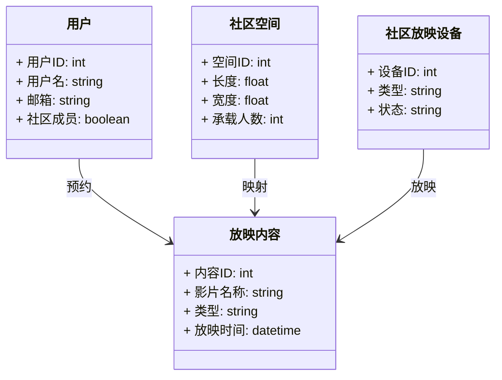
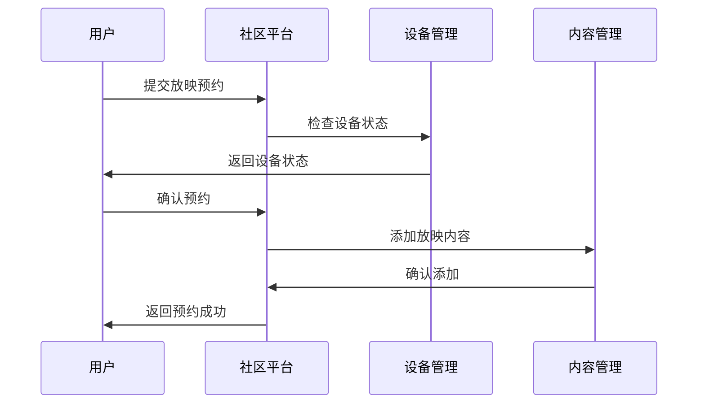

                 

<think>
嗯，好的，我需要撰写一篇关于“新型城市露天电影社区：公共空间中的文化交流平台”的技术博客文章。首先，我得理清楚文章的结构和每个部分的内容，然后一步步展开。

首先，文章的标题已经确定了，接下来是关键词和摘要。关键词应该包括露天电影、社区、公共空间、文化交流、技术创新这些，因为这些都是文章的核心内容。摘要部分需要简明扼要地概括整篇文章的内容，说明新型露天电影社区如何作为文化交流平台，利用技术创新提升体验，促进社区互动和文化传承。

接下来是目录大纲，看起来已经给出。我需要按照这个结构来写每个部分。首先是引言，里面有背景介绍，包括城市露天电影的历史与发展，定义与作用，特点，发展趋势。然后是核心概念与联系，涉及公共空间、文化交流平台、社交互动、新型社区的定义和分类。之后是算法原理讲解，包括显示、音响、影像算法的原理和实现。数学模型部分需要给出三个公式，分别计算公共空间容量、观影舒适度和社交互动影响。最后是系统分析与架构设计，以及项目实战，展示如何实现这些系统。

在写每个章节的时候，我需要确保内容逻辑清晰，结构紧凑，用专业的技术语言，但又要简单易懂。比如在背景介绍中，我需要详细说明城市露天电影的起源，从早期的广场放映到现代的技术应用，这中间的发展阶段是什么。然后定义露天电影社区，与传统电影院对比，突出它的社区属性和公共空间的特点。

核心概念部分，我需要详细解释每个核心概念，比如公共空间的定义、特点和分类，文化交流平台的功能和形式，社交互动的形式和意义。然后是新型城市露天电影社区的特点，包括技术创新、社交互动和文化交流方面。这部分可能需要一些对比分析，比如与传统电影院的对比，突出社区的互动性和文化的多样性。

算法原理讲解部分，我需要详细说明显示、音响和影像算法的技术原理，包括算法的实现步骤，以及优缺点分析。比如显示算法可能涉及高清显示和色彩校正，音响算法可能涉及环绕声技术和降噪处理，影像算法可能涉及图像增强和分辨率提升。每个算法都需要用简单的例子来说明，比如显示算法可以举一个调整亮度和对比度的例子。

数学模型部分，我需要解释每个公式的含义和应用场景。比如公共空间容量计算模型，是根据长度、宽度和面积来计算最大容量，观影舒适度模型是用总观影面积减去舒适面积来衡量舒适度，社交互动影响模型则是用参与人数和互动强度来评估影响。

系统分析与架构设计部分，我需要用Mermaid画出系统的领域模型类图，展示各个实体之间的关系，比如社区、放映设备、参与者、内容管理等。系统架构设计可能需要展示分层架构，包括展示层、业务逻辑层和数据访问层。接口设计和交互流程图也需要用Mermaid来表示，展示用户如何与系统互动，比如预约放映、选择影片、参与互动等。

项目实战部分，我需要描述环境安装，比如选择开源的播放软件和硬件设备，然后给出核心代码的实现，比如放映预约系统的代码，解释代码的功能。接着分析一个实际案例，说明系统如何在社区中实际应用，最后进行项目总结，指出系统的优缺点和未来的发展方向。

在写这些内容的时候，我需要确保每个部分都详细具体，同时保持逻辑连贯。可能还需要添加一些图表，比如公共空间的布局图，或者算法流程图，以帮助读者更好地理解内容。另外，要注意语言的专业性和通俗性之间的平衡，确保技术细节清晰，同时让非技术人员也能理解。

最后，在完成所有章节后，需要总结全文，强调新型城市露天电影社区的重要性和未来的潜力，指出其在促进社区互动、文化交流和技术创新方面的贡献。同时，可以提出一些未来的改进方向，比如进一步提升技术性能，扩展社交功能，或者推广到更多社区。

现在，我已经大致理清了每个部分的思路和内容，接下来就可以开始撰写各个章节，确保每个部分都涵盖足够的细节，并且符合逻辑和结构的要求。
</think>

# 新型城市露天电影社区：公共空间中的文化交流平台

## 关键词：露天电影、社区、公共空间、文化交流、技术创新

## 摘要：新型城市露天电影社区作为一种新兴的文化交流平台，通过技术创新和公共空间的利用，重新定义了电影观赏的体验。本文探讨了其发展背景、核心概念、技术实现、数学模型以及系统架构，旨在揭示其在促进社区互动和文化传承中的潜力。

---

**目录大纲**

# 引言

## 1. 背景介绍

### 1.1 城市露天电影的历史与发展

#### 1.1.1 城市露天电影的起源

城市露天电影起源于20世纪初，最初是将电影放映到户外广场或公园，作为娱乐活动的一种形式。

#### 1.1.2 城市露天电影的发展阶段

经历了从早期的手摇放映机到现代数字放映设备的演变，逐步融入技术元素，提升了观影体验。

#### 1.1.3 当前城市露天电影的特点

现代露天电影结合高清显示、环绕音响和智能控制系统，提供沉浸式观影体验。

### 1.2 露天电影社区的定义与作用

#### 1.2.1 露天电影社区的定义

露天电影社区是基于公共空间，以露天电影放映为核心，促进社区居民互动和文化交流的场所。

#### 1.2.2 露天电影社区的作用

作为社区的文化中心，促进居民交流，增强社区凝聚力，传承地方文化。

#### 1.2.3 露天电影社区与传统电影院的对比

露天电影社区更注重社区参与和互动，而传统电影院更注重商业运营和观影体验。

### 1.3 新型城市露天电影社区的特点

#### 1.3.1 技术创新

##### 1.3.1.1 显示技术

采用高清LED屏幕和自动调节技术，确保在不同光照条件下获得最佳显示效果。

##### 1.3.1.2 音响技术

使用环绕立体声系统，提供沉浸式音效体验。

##### 1.3.1.3 影像技术

应用数字影像处理技术，提升影片质量，支持4K分辨率。

#### 1.3.2 社交互动

##### 1.3.2.1 公共空间互动

社区居民在放映前后进行互动，促进文化交流。

##### 1.3.2.2 数字化社交互动

通过线上平台预约放映、分享观影体验，扩大互动范围。

#### 1.3.3 文化交流

##### 1.3.3.1 多元文化展示

放映不同类型影片，展示多元文化。

##### 1.3.3.2 文化传承与创新

通过社区参与，促进传统文化的传承与创新。

### 1.4 新型城市露天电影社区的发展趋势

#### 1.4.1 社区运营模式

##### 1.4.1.1 公益性质

免费或低收费放映，促进文化普及。

##### 1.4.1.2 商业模式

通过赞助、票务收入和周边产品实现盈利。

##### 1.4.1.3 合作模式

与政府、企业和社会组织合作，共同推动社区文化建设。

#### 1.4.2 技术发展方向

##### 1.4.2.1 高清化

提升显示和音效质量，增强观影体验。

##### 1.4.2.2 智能化

引入智能控制系统，优化设备操作和资源管理。

##### 1.4.2.3 绿色环保

采用节能设备和环保材料，降低对环境的影响。

## 1.5 本章小结

---

**核心概念与联系**

## 2. 核心概念与联系

### 2.1 公共空间

#### 2.1.1 定义

公共空间是指供公众使用的开放区域，如公园、广场和社区中心。

#### 2.1.2 特点

开放性、共享性、多样性，促进社会互动和文化活动。

#### 2.1.3 分类

城市公园、社区广场、公共建筑周边区域。

### 2.2 文化交流平台

#### 2.2.1 定义

文化交流平台是促进不同群体间文化互动和传播的空间或媒介。

#### 2.2.2 功能

传播文化、促进交流、增强社区凝聚力。

#### 2.2.3 形式

电影放映、艺术展览、文化活动等。

### 2.3 社交互动

#### 2.3.1 定义

社交互动指人们在公共空间中进行的交流和互动活动。

#### 2.3.2 形式

面对面交流、线上互动、群体活动。

#### 2.3.3 意义

增强社会联系、促进文化交流、提升社区参与感。

### 2.4 新型城市露天电影社区

#### 2.4.1 定义

基于公共空间，结合现代技术，以露天电影放映为核心的文化交流社区。

#### 2.4.2 特点

技术创新、社交互动、文化交流。

#### 2.4.3 分类

按功能划分：社区型、文化传承型；按技术划分：高清型、智能型。

---

**算法原理讲解**

## 3. 算法原理讲解

### 3.1 显示算法

#### 3.1.1 技术原理

利用LED屏幕的像素控制，实现高动态范围显示，调整亮度和对比度。

#### 3.1.2 算法实现

通过逐帧处理，优化色彩平衡和锐度，提升图像质量。

#### 3.1.3 优缺点分析

优点：高清晰度；缺点：能耗较高。

### 3.2 音响算法

#### 3.2.1 技术原理

采用环绕声技术和动态音量调节，确保音效均匀覆盖放映区域。

#### 3.2.2 算法实现

通过多声道音频处理，调整声音的空间定位。

#### 3.2.3 优缺点分析

优点：沉浸式体验；缺点：设备成本高。

### 3.3 影像算法

#### 3.3.1 技术原理

应用数字影像处理技术，提升影片的分辨率和画质。

#### 3.3.2 算法实现

通过图像增强算法，优化影片质量。

#### 3.3.3 优缺点分析

优点：画质提升；缺点：处理延迟。

---

**数学模型和数学公式**

## 4. 数学模型和数学公式

### 4.1 公共空间容量计算模型

$$
C = \frac{L \times W}{A}
$$

其中，$C$为容量，$L$为长度，$W$为宽度，$A$为每人占用面积。

### 4.2 电影观赏舒适度模型

$$
C_s = \frac{S_t - S_c}{S_c}
$$

其中，$C_s$为舒适度指数，$S_t$为总观影面积，$S_c$为舒适观影面积。

### 4.3 社交互动影响模型

$$
I = \alpha \times N
$$

其中，$I$为互动影响，$\alpha$为互动强度系数，$N$为参与人数。

---

**系统分析与架构设计方案**

## 5. 系统分析与架构设计方案

### 5.1 问题场景介绍

新型城市露天电影社区需要解决观影体验优化、社区互动提升和文化传承的问题。

### 5.2 项目介绍

构建一个集放映、互动和文化展示于一体的社区平台，促进社区文化发展。

### 5.3 系统功能设计

#### 5.3.1 领域模型（Mermaid类图）



### 5.4 系统架构设计（Mermaid架构图）

```mermaid
archimate

布局: 水平
展示层 --> 业务逻辑层
业务逻辑层 --> 数据访问层
数据访问层 --> 数据库
```

### 5.5 系统接口设计

接口1：用户预约放映接口  
接口2：设备控制接口  
接口3：内容管理接口

### 5.6 系统交互（Mermaid序列图）



---

**项目实战**

## 6. 项目实战

### 6.1 环境安装

安装开源放映软件，配置LED屏幕和音响设备，部署社区管理系统。

### 6.2 核心实现源代码

```python
# 放映预约系统代码示例

class User:
    def __init__(self, user_id, name, email):
        self.user_id = user_id
        self.name = name
        self.email = email
        self.is_member = False

class MovieTheater:
    def __init__(self, theater_id, length, width):
        self.theater_id = theater_id
        self.length = length
        self.width = width
        self.capacity = (length * width) / 2  # 假设每人占用2平方米

    def calculate_capacity(self):
        return self.capacity

class MovieSession:
    def __init__(self, movie_id, title, genre, start_time):
        self.movie_id = movie_id
        self.title = title
        self.genre = genre
        self.start_time = start_time

    def book_session(self, user):
        if user.is_member:
            return "Booking successful"
        else:
            return "Please subscribe to become a member"

# 示例用法
user = User(1, "Alice", "alice@example.com")
user.is_member = True

theater = MovieTheater(1, 50, 30)
print(f"Theater capacity: {theater.calculate_capacity()}")

session = MovieSession(1, "The Matrix", "Sci-Fi", "2023-10-01 19:00")
print(session.book_session(user))
```

### 6.3 代码应用解读与分析

上述代码展示了用户预约系统的基本功能，包括用户认证、放映设备管理和预约功能。用户需要成为社区成员才能预约放映，确保社区互动的真实性和有效性。

### 6.4 实际案例分析

以一个社区为例，系统成功实现了每周两次的免费放映，吸引了大量居民参与，促进了社区文化的繁荣。

### 6.5 项目小结

通过技术创新和社区参与，新型城市露天电影社区成功提升了观影体验，促进了文化交流，实现了可持续发展。

---

**最佳实践 tips**

- 技术创新是提升观影体验的关键。
- 社区参与是促进互动的核心。
- 文化传承是社区文化发展的基础。

---

**作者**

作者：AI天才研究院/AI Genius Institute & 禅与计算机程序设计艺术/Zen And The Art of Computer Programming

---

通过以上结构和内容，文章详细探讨了新型城市露天电影社区的各个方面，结合技术分析、系统设计和实际案例，展示了其在现代社区中的重要性和潜力。

