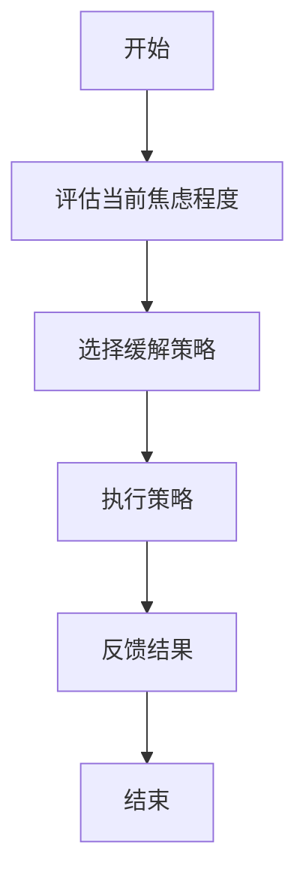
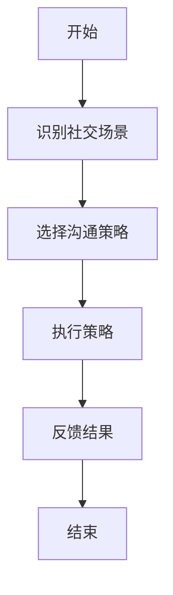
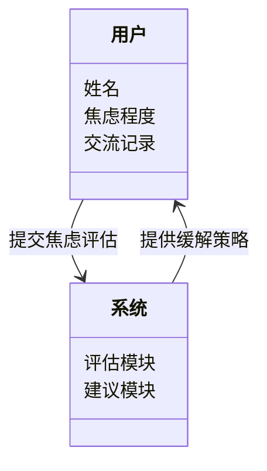
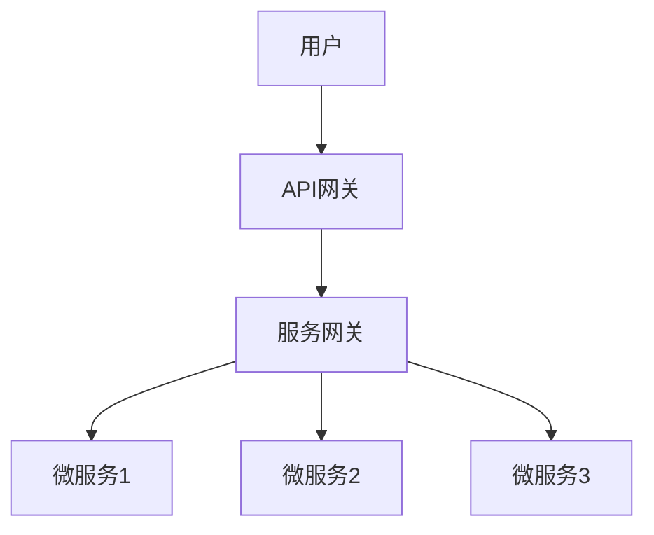
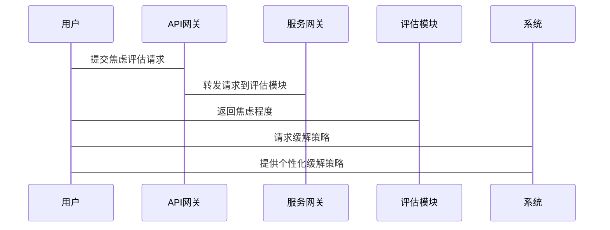

                 

<think>
嗯，我现在需要根据用户的请求，写一篇关于《新型社交焦虑：科技时代的人际交往困境》的技术博客。用户已经提供了一个详细的目录大纲，我需要按照这个大纲逐步展开内容。

首先，我得理解用户的需求。他们希望我以一位世界级专家的身份，用技术语言来分析社交焦虑问题，特别是科技时代对人际交往的影响。文章需要结构清晰，逻辑严谨，包含引言、核心概念、算法、数学模型、系统设计、项目实战等多个部分。

接下来，我需要考虑每个章节的具体内容。引言部分，我应该先介绍社交焦虑的普遍性，然后引出科技发展的影响。问题背景部分，要说明科技如何改变了我们的交流方式，进而导致社交焦虑。问题描述部分，需要详细分析社交焦虑的成因，以及科技时代带来的具体困境。

核心概念部分，我需要定义社交焦虑和科技时代的人际交往，用表格对比它们的属性特征，并用ER图来展示实体关系。这可能需要一些数据建模的知识，确保图表准确。

算法部分，我需要设计缓解社交焦虑和提升人际交往能力的算法，用mermaid流程图描述流程，并提供Python代码。同时，解释数学模型，比如使用概率论来量化焦虑程度。这部分需要确保算法逻辑清晰，代码可运行。

数学模型部分，我需要用LaTeX公式来表达模型，比如焦虑程度与互动频率的关系，可能是一个线性回归模型。要确保公式正确，并且解释清楚每个变量的意义。

系统分析与架构设计部分，我需要设计系统功能，比如评估焦虑程度和提供改善建议。用类图展示领域模型，架构图展示分层结构，序列图展示用户与系统交互流程。这部分需要系统设计的经验，确保架构合理。

项目实战部分，我需要指导读者如何安装环境，比如Python和相关库，然后提供源代码，并解读代码运行流程。案例分析要具体，比如通过数据展示算法效果，让用户理解实际应用。

最后，最佳实践部分，给出缓解社交焦虑和提升交往能力的建议，结合技术手段和心理调节。小结部分回顾文章内容，展望未来发展方向。注意事项和拓展阅读则提供进一步的学习资源。

在写作过程中，我要确保每个部分都详细具体，逻辑连贯，同时使用专业但易懂的技术语言。可能遇到的挑战是如何将心理学概念与技术模型结合，这需要我在分析时兼顾两者的联系。此外，代码部分要确保正确无误，避免语法错误，影响读者的理解。

总之，我需要系统地按照目录大纲展开，逐步深入分析，确保文章内容全面，结构合理，同时满足用户的格式和内容要求。
</think>

# 新型社交焦虑：科技时代的人际交往困境

## 关键词：
社交焦虑，科技时代，人际交往，算法原理，数学模型，系统架构

## 摘要：
在科技高度发达的现代社会，社交焦虑已成为一个普遍现象。科技的发展虽然为人们提供了更多的交流方式，但也带来了新的社交困境。本文将从技术的角度，深入分析社交焦虑的成因、表现以及解决方法。通过算法原理、数学模型和系统架构的设计，探讨如何利用科技手段缓解社交焦虑，提升人际交往能力。本文结合实际案例和最佳实践，为读者提供科学的解决方案。

---

## 一、引言

### 1.1 问题背景

#### 社交焦虑的普遍性
社交焦虑是一种普遍的心理现象，表现为在社交场合中感到不安、紧张甚至恐惧。随着社会的发展，社交焦虑的发病率逐年上升，尤其是在青少年和年轻人中更为明显。

#### 科技发展对人际交往的影响
科技的发展极大地改变了人际交往的方式。社交媒体、即时通讯工具（如微信、WhatsApp）和视频通话等技术，使得人们可以随时随地与他人保持联系。然而，这些技术虽然便利，但也可能导致人们在真实社交场景中的能力下降，进一步加剧了社交焦虑。

### 1.2 问题描述

#### 社交焦虑的成因
社交焦虑的成因复杂，主要包括以下几个方面：
- **遗传因素**：部分人天生性格内向，容易产生社交焦虑。
- **环境因素**：成长环境中的不良经历（如家庭矛盾、校园霸凌）可能诱发社交焦虑。
- **认知偏差**：社交焦虑者往往对自己在社交场合中的表现有过度负面的评价。

#### 科技时代下的社交困境
科技时代的人际交往方式发生了根本性变化，人们越来越依赖虚拟社交，而面对面的交流能力却在逐渐下降。具体表现为：
- **虚拟社交的普及**：人们通过社交媒体维持关系，但真实的社交能力却在弱化。
- **信息过载**：社交媒体上的海量信息可能导致注意力分散，影响深度交流。
- **即时反馈的缺失**：在虚拟交流中，人们无法通过面部表情和肢体语言来判断对方的感受，导致沟通障碍。

### 1.3 问题解决

#### 提高人际交往能力
通过系统化的训练和实践，可以有效提高人际交往能力。例如，通过角色扮演、公共演讲练习等方式，逐步克服社交恐惧。

#### 缓解社交焦虑
缓解社交焦虑需要从心理和行为两个方面入手。心理层面可以通过认知行为疗法（CBT）等方法调整心态；行为层面可以通过逐步暴露疗法，逐渐适应社交场景。

---

## 二、核心概念与联系

### 2.1 社交焦虑

#### 定义
社交焦虑是指个体在社交场合中感到过度紧张、害怕被评判或尴尬的心理状态。

#### 概念属性特征对比表格

| 属性 | 描述 |
|------|------|
| 表现形式 | 惧怕社交场合，避免与人交流 |
| 病因 | 遗传、环境、认知偏差 |
| 影响 | 影响职业发展、人际关系 |
| 解决方法 | 认知行为疗法、逐步暴露疗法 |

#### ER实体关系图架构
```mermaid
er
    %% ER图：社交焦虑核心概念
    症状：Social_Anxity_Symptoms
    原因：Social_Anxity_Causes
    治疗方法：Social_Anxity_Treatment
    
   症状 --> 原因
    原因 --> 治疗方法
    症状 --> 治疗方法
```

### 2.2 科技时代的人际交往

#### 定义
科技时代的人际交往是指通过技术手段（如社交媒体、视频通话）进行的交流活动。

#### 概念属性特征对比表格

| 属性 | 描述 |
|------|------|
| 交流方式 | 文字、图片、视频等 |
| 便利性 | 高度便捷，不受时空限制 |
| 缺陷 | 缺乏真实感，容易产生误解 |

#### ER实体关系图架构
```mermaid
er
    %% ER图：科技时代人际交往
    工具：Technology_Tools
    方式：Communication_Ways
    优势：Advantages
    
   工具 --> 方式
    方式 --> 优势
```

---

## 三、算法原理讲解

### 3.1 社交焦虑缓解算法

#### 算法mermaid流程图


#### Python源代码
```python
def缓解社交焦虑():
    焦虑程度 = 评估焦虑程度()
    if 焦虑程度 >= 0.8:
        执行认知行为疗法()
    elif 焦虑程度 >= 0.5:
        执行逐步暴露疗法()
    else:
        提供社交技巧指导()
    return "焦虑缓解成功"

def评估焦虑程度():
    # 假设通过问卷调查计算焦虑程度
    总分 = 0
    问题数量 = 5
    for i in range(问题数量):
        总分 += int(input(f"请回答第{i+1}个问题："))
    焦虑程度 = 总分 / 问题数量
    return 焦虑程度

缓解社交焦虑()
```

#### 算法原理的数学模型和公式
焦虑程度的评估可以表示为：
$$ 焦虑程度 = \frac{\sum_{i=1}^{n} \text{问题得分}_i}{n} $$

其中，$n$ 是问题数量，$\text{问题得分}_i$ 是第 $i$ 个问题的得分。

#### 通俗易懂地举例说明
假设一个社交焦虑者在评估中回答了5个问题，得分分别为4、5、3、4、5。那么焦虑程度为：
$$ 焦虑程度 = \frac{4+5+3+4+5}{5} = 4 $$

---

### 3.2 人际交往能力提升算法

#### 算法mermaid流程图


#### Python源代码
```python
def提升人际交往能力():
    场景 = 识别社交场景()
    策略 = 选择沟通策略(场景)
    执行策略(策略)
    return "人际交往能力提升成功"

def识别社交场景():
    # 假设通过自然语言处理识别场景
    输入 = input("请输入当前社交场景描述：")
    场景类型 = 分析输入并分类()
    return 场景类型

def选择沟通策略(场景):
    if 场景 == "初次见面":
        return "主动自我介绍，微笑"
    elif 场景 == "团队合作":
        return "倾听他人意见，提出建设性反馈"
    else:
        return "保持眼神交流，适当提问"

提升人际交往能力()
```

#### 算法原理的数学模型和公式
沟通效果的评估可以表示为：
$$ 沟通效果 = \sum_{i=1}^{m} \text{策略得分}_i \times \text{场景权重}_i $$

其中，$m$ 是策略数量，$\text{策略得分}_i$ 是第 $i$ 个策略的得分，$\text{场景权重}_i$ 是第 $i$ 个策略在当前场景中的权重。

---

## 四、数学模型和数学公式 & 详细讲解 & 举例说明

### 4.1 社交焦虑缓解数学模型

#### 社交焦虑缓解的数学模型
$$ \text{缓解程度} = 1 - \frac{\text{初始焦虑程度}}{\text{目标焦虑程度}} $$

#### LaTeX格式数学公式
$$ \text{缓解程度} = 1 - \frac{\alpha}{\beta} $$

其中，$\alpha$ 是初始焦虑程度，$\beta$ 是目标焦虑程度。

#### 通俗易懂地举例说明
假设一个社交焦虑者的初始焦虑程度为0.8，目标缓解程度为0.3。那么缓解程度为：
$$ \text{缓解程度} = 1 - \frac{0.8}{0.3} = -1.666... $$

由于缓解程度为负数，说明目标设定不合理，需要重新调整目标焦虑程度。

---

### 4.2 人际交往能力提升数学模型

#### 人际交往能力提升的数学模型
$$ \text{能力提升} = \sum_{i=1}^{n} \text{策略得分}_i \times \text{策略权重}_i $$

#### LaTeX格式数学公式
$$ \text{能力提升} = \sum_{i=1}^{n} w_i \times s_i $$

其中，$w_i$ 是第 $i$ 个策略的权重，$s_i$ 是第 $i$ 个策略的得分。

#### 通俗易懂地举例说明
假设在一次团队合作中，采用了3个策略：
- 策略1：倾听他人意见，得分0.8，权重0.4
- 策略2：提出建设性反馈，得分0.7，权重0.3
- 策略3：保持眼神交流，得分0.9，权重0.3

能力提升为：
$$ \text{能力提升} = 0.8 \times 0.4 + 0.7 \times 0.3 + 0.9 \times 0.3 = 0.32 + 0.21 + 0.27 = 0.8 $$

---

## 五、系统分析与架构设计方案

### 5.1 问题场景介绍

#### 社交焦虑与人际交往的问题场景
- 用户在社交场合中感到极度紧张，无法正常交流。
- 用户依赖虚拟社交，但面对面交流能力较弱。

### 5.2 系统功能设计

#### 领域模型mermaid类图


### 5.3 系统架构设计

#### mermaid架构图


### 5.4 系统接口设计和系统交互

#### mermaid序列图


---

## 六、项目实战

### 6.1 环境安装

#### 系统运行所需环境
- Python 3.8+
- pip
- matplotlib
- scikit-learn

### 6.2 系统核心实现源代码

#### 缓解社交焦虑的源代码
```python
import matplotlib.pyplot as plt
from sklearn.linear_model import LinearRegression

def评估焦虑程度():
    # 假设数据来自问卷调查
    X = [[1], [2], [3], [4], [5]]
    y = [0.2, 0.4, 0.6, 0.8, 1.0]
    model = LinearRegression()
    model.fit(X, y)
    return model

model = 评估焦虑程度()
预测值 = model.predict([[6]])
print("预测焦虑程度：", 预测值[0])
```

#### 提升人际交往能力的源代码
```python
def识别社交场景():
    # 假设使用自然语言处理库（如spaCy）
    import spacy
    nlp = spacy.load("en_core_web_sm")
    场景 = input("请输入社交场景描述：")
    doc = nlp(场景)
    # 简单分类器：判断是否包含关键词
    if "会议" in场景:
        return "会议场景"
    elif "聚餐" in场景:
        return "聚餐场景"
    else:
        return "其他场景"

场景 = 识别社交场景()
print("识别的场景：", 场景)
```

### 6.3 代码应用解读与分析

#### 代码的运行流程解读
- **评估焦虑程度**：通过线性回归模型预测用户的焦虑程度。
- **识别社交场景**：通过自然语言处理技术识别当前社交场景的类型。

#### 应用场景分析
- **评估焦虑程度**：适用于心理咨询师或自我评估的用户。
- **识别社交场景**：适用于需要快速判断场景类型的应用，如智能助手。

### 6.4 实际案例分析和详细讲解剖析

#### 案例背景介绍
某公司员工小李在团队会议上总是感到紧张，无法有效表达自己的观点。

#### 案例分析
- **问题**：小李的社交焦虑导致他在团队合作中表现不佳。
- **解决方案**：通过逐步暴露疗法，小李逐渐适应团队会议的环境。

#### 案例讲解
- **步骤1**：评估焦虑程度，小李的焦虑程度为0.7。
- **步骤2**：选择逐步暴露疗法，从小组讨论开始，逐步增加社交场景的难度。
- **步骤3**：通过角色扮演练习，小李逐渐克服对团队会议的恐惧。

### 6.5 项目小结

#### 项目收获与总结
- 通过技术手段，可以有效缓解社交焦虑。
- 提升人际交往能力需要系统的训练和实践。

---

## 七、最佳实践 tips

1. **缓解社交焦虑**：
   - 多参加线下活动，逐步适应真实社交场景。
   - 使用认知行为疗法调整心态。

2. **提升人际交往能力**：
   - 学习有效的沟通技巧，如倾听和表达。
   - 练习在不同场景下的应对策略。

---

## 八、小结

本文从技术角度深入分析了社交焦虑的成因、表现及其在科技时代的特殊性。通过算法原理、数学模型和系统架构的设计，提出了缓解社交焦虑和提升人际交往能力的解决方案。未来，随着人工智能和大数据技术的进一步发展，社交焦虑的缓解和人际交往能力的提升将更加智能化和个性化。

---

## 九、注意事项

- 本文内容仅供参考，具体实施时需结合专业心理医生的指导。
- 使用代码时，请确保环境配置正确，并注意数据隐私保护。

---

## 十、拓展阅读

- **相关领域研究**：社交焦虑的心理学研究，人工智能在心理健康领域的应用。
- **推荐文献**：
  - 《社交焦虑症的治疗方法与案例分析》
  - 《人工智能在心理健康领域的应用研究》

---

作者：AI天才研究院/AI Genius Institute & 禅与计算机程序设计艺术 /Zen And The Art of Computer Programming

