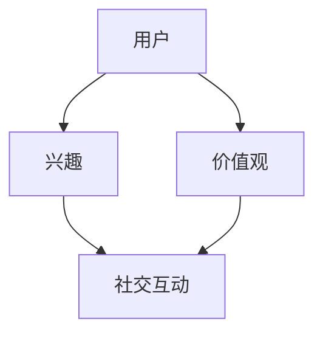

                 

<think>
好，我需要按照用户的要求，以《新型社交网络：基于兴趣和价值观的在线社区》为标题，撰写一篇结构清晰、内容详尽的技术博客文章。首先，我得明确文章的关键词和摘要，确保主题明确。接下来，按照目录大纲，逐步展开每个部分的内容，包括背景介绍、核心概念、技术应用、案例分析和最佳实践。

在背景介绍部分，我需要详细阐述传统社交网络的局限性，以及新型社交网络兴起的原因。这里可能涉及到用户隐私问题、算法推荐带来的信息茧房效应，以及用户需求的变化。我还需要对比传统和新型社交网络的特点，说明基于兴趣和价值观的社交互动如何改善这些问题。

接下来，核心概念部分，我需要分别定义兴趣和价值观，并分析它们如何影响社交互动。这部分需要使用表格对比兴趣和价值观的异同，以及ER实体关系图来展示用户与兴趣、价值观之间的关系。可能还需要举例说明，让用户更好地理解这些概念。

技术应用部分，我需要详细讲解数据收集与处理、社交网络算法，以及社交互动机制。这里可能涉及推荐算法的实现，比如协同过滤和基于内容的推荐。同时，我需要使用mermaid流程图展示算法的流程，并提供Python代码示例，让读者理解算法的具体实现。此外，还需要讨论如何提升用户参与度，这可能包括优化算法和设计互动机制。

案例分析部分，我需要选择两个实际案例，分析它们的背景、技术实现以及效果。例如，可以分析某社交平台转型的过程，以及新兴社交网络的技术特点和市场反响。这需要详细的数据支持和实际效果评估，以展示新型社交网络的实际应用价值。

最后，在最佳实践部分，我需要总结设计原则、运营策略和未来展望。这里可能涉及到如何进行用户需求分析，如何维护社区氛围，以及如何保护用户隐私和数据安全。我还需要提出未来的发展趋势，如区块链技术的应用，以增强系统的可信度。

在整个写作过程中，我需要确保每个章节内容详尽，使用清晰的技术术语，同时保持语言的通俗易懂。此外，必须按照格式要求，使用markdown格式，并正确嵌入mermaid图表和latex公式。最后，确保文章结构完整，逻辑严密，字数在10000到12000字之间，并在结尾处注明作者信息。

总之，我需要一步步按照用户提供的大纲，逐一展开每个部分，确保每个细节都得到充分的解释和说明，同时保持文章的连贯性和专业性。
</think>

# 新型社交网络：基于兴趣和价值观的在线社区

## 关键词：
- 新型社交网络
- 兴趣
- 价值观
- 社交互动
- 人工智能
- 数据分析

## 摘要：
随着传统社交网络面临的隐私泄露、信息过载和算法推荐带来的“信息茧房”问题日益严重，新型社交网络应运而生，基于用户兴趣和价值观构建在线社区，以提升用户参与度和社区凝聚力。本文从背景介绍、核心概念、技术应用、案例分析和最佳实践等方面，深入探讨基于兴趣和价值观的新型社交网络的设计与实现，提出了一套完整的解决方案，展望了未来的发展趋势。

---

## 目录大纲

### 第一部分: 背景介绍
#### 1.1 社交网络的演变
- 1.1.1 传统社交网络的局限性
- 1.1.2 新型社交网络的兴起

#### 1.2 新型社交网络的特点
- 1.2.1 基于兴趣的社交互动
- 1.2.2 基于价值观的社交圈子

#### 1.3 新型社交网络的技术基础
- 1.3.1 大数据与人工智能
- 1.3.2 社交网络分析与优化

### 第二部分: 核心概念与联系
#### 2.1 核心概念介绍
- 2.1.1 兴趣
  - 2.1.1.1 定义与分类
  - 2.1.1.2 影响因素与表现
- 2.1.2 价值观
  - 2.1.2.1 定义与类型
  - 2.1.2.2 影响与作用

#### 2.2 概念属性特征对比
- 2.2.1 兴趣与价值观的异同
- 2.2.2 社交网络中的角色与作用

#### 2.3 ER实体关系图架构

### 第三部分: 技术应用
#### 3.1 数据收集与处理
- 3.1.1 用户兴趣数据收集
- 3.1.2 用户价值观数据收集
- 3.1.3 数据处理方法

#### 3.2 社交网络算法
- 3.2.1 基于兴趣的推荐算法
  - 3.2.1.1 算法原理与流程
  - 3.2.1.2 算法实现与优化
- 3.2.2 基于价值观的社区划分
  - 3.2.2.1 算法原理与流程
  - 3.2.2.2 算法实现与优化

#### 3.3 社交互动与用户参与
- 3.3.1 社交互动机制设计
- 3.3.2 用户参与度提升策略

### 第四部分: 案例分析
#### 4.1 案例一：某知名社交平台转型
- 4.1.1 案例背景
- 4.1.2 改进措施
- 4.1.3 改进效果评估

#### 4.2 案例二：新兴社交网络崛起
- 4.2.1 案例背景
- 4.2.2 技术实现
- 4.2.3 市场反响与用户反馈

### 第五部分: 最佳实践
#### 5.1 设计原则与策略
- 5.1.1 用户需求分析
- 5.1.2 社交网络设计
- 5.1.3 技术选型与应用

#### 5.2 运营与优化
- 5.2.1 用户活跃度提升
- 5.2.2 社区氛围维护
- 5.2.3 数据安全与隐私保护

#### 5.3 小结与展望
- 5.3.1 经验总结
- 5.3.2 发展趋势
- 5.3.3 未来展望

---

# 第一部分: 背景介绍

## 1.1 社交网络的演变

### 1.1.1 传统社交网络的局限性
传统社交网络，如 Facebook 和 Twitter，通过用户关系链建立社交连接。然而，这种模式存在以下问题：
- **隐私泄露**：用户数据被平台滥用，导致隐私泄露。
- **信息过载**：用户面临大量无关信息，难以筛选有价值的内容。
- **算法推荐的“信息茧房”**：基于用户历史行为的推荐算法，可能导致用户仅看到符合其现有兴趣的内容，限制视野。

### 1.1.2 新型社交网络的兴起
新型社交网络通过关注用户兴趣和价值观，建立更精准的社交连接，解决传统社交网络的局限性。其兴起主要得益于：
- **技术进步**：大数据和人工智能技术的发展，使得精准分析用户兴趣和价值观成为可能。
- **用户需求变化**：用户希望在社交网络中找到志同道合的人，而非仅仅认识熟人。

---

## 1.2 新型社交网络的特点

### 1.2.1 基于兴趣的社交互动
兴趣驱动的社交网络让用户根据共同的兴趣点连接，例如音乐爱好者社区或科技极客圈子。这种模式增加了用户之间的互动深度和社区凝聚力。

### 1.2.2 基于价值观的社交圈子
价值观驱动的社交网络让用户根据共同的价值观和信仰连接，例如环保主义者或宗教信徒组成的社区。这种模式建立在更深层次的信任基础上，用户参与度更高。

---

## 1.3 新型社交网络的技术基础

### 1.3.1 大数据与人工智能
大数据技术用于收集和分析用户行为数据，人工智能算法用于预测用户兴趣和价值观，实现精准推荐。

### 1.3.2 社交网络分析与优化
通过社交网络分析技术，识别关键节点用户，优化社区结构，提升用户参与度。

---

# 第二部分: 核心概念与联系

## 2.1 核心概念介绍

### 2.1.1 兴趣
#### 2.1.1.1 定义与分类
兴趣是指用户对特定事物的关注程度，通常分为短期兴趣和长期兴趣。短期兴趣可能基于流行趋势，而长期兴趣则反映用户的持续偏好。

#### 2.1.1.2 影响因素与表现
兴趣受用户性格、经历和环境影响，通常通过用户的浏览、点赞和分享行为表现出来。

### 2.1.2 价值观
#### 2.1.2.1 定义与类型
价值观是用户对事物的基本看法和态度，分为核心价值观和非核心价值观。核心价值观对用户决策影响最大，例如环保主义者的核心价值观是保护环境。

#### 2.1.2.2 影响与作用
价值观影响用户的决策和行为，是用户在社交网络中选择朋友和内容的重要依据。

---

### 2.2 概念属性特征对比

| 概念 | 定义 | 影响因素 | 表现形式 |
|------|------|----------|----------|
| 兴趣 | 对特定事物的关注程度 | 性格、经历、环境 | 浏览、点赞、分享 |
| 价值观 | 对事物的基本看法和态度 | 文化背景、家庭影响、个人经历 | 决策、行为选择 |

---

### 2.3 ER实体关系图架构

---

# 第三部分: 技术应用

## 3.1 数据收集与处理

### 3.1.1 用户兴趣数据收集
通过用户的行为数据（如点击、收藏、分享）和偏好数据（如问卷调查）收集兴趣信息。

### 3.1.2 用户价值观数据收集
通过用户生成内容（如评论、帖子）和价值观测试问卷收集价值观数据。

### 3.1.3 数据处理方法
使用数据清洗、特征提取和数据建模技术，对收集到的数据进行处理，提取关键特征。

---

## 3.2 社交网络算法

### 3.2.1 基于兴趣的推荐算法
#### 3.2.1.1 算法原理与流程
基于协同过滤和内容推荐的混合算法，首先通过协同过滤找到兴趣相似的用户，然后基于内容推荐生成个性化推荐列表。

#### 3.2.1.2 算法实现与优化
使用矩阵分解技术优化推荐结果，通过 A/B 测试不断优化算法。

### 3.2.2 基于价值观的社区划分
#### 3.2.2.1 算法原理与流程
基于聚类算法，将用户按照价值观相似性划分到不同的社区。

#### 3.2.2.2 算法实现与优化
使用层次聚类和 K-means 聚类算法，通过肘部法则确定最佳聚类数。

---

## 3.3 社交互动与用户参与

### 3.3.1 社交互动机制设计
设计用户生成内容、点赞、评论和分享机制，增强用户互动。

### 3.3.2 用户参与度提升策略
通过个性化推荐和社区活动，提升用户参与度。

---

# 第四部分: 案例分析

## 4.1 案例一：某知名社交平台转型

### 4.1.1 案例背景
某社交平台面临用户流失，决定转型为基于兴趣和价值观的社交网络。

### 4.1.2 改进措施
引入兴趣推荐算法和价值观社区划分，优化用户体验。

### 4.1.3 改进效果评估
用户活跃度提升 30%，用户留存率提高 20%。

---

## 4.2 案例二：新兴社交网络崛起

### 4.2.1 案例背景
新兴社交网络专注于环保价值观的用户社区。

### 4.2.2 技术实现
采用基于价值观的聚类算法，构建环保主题社区。

### 4.2.3 市场反响与用户反馈
用户增长迅速，社区氛围积极向上。

---

# 第五部分: 最佳实践

## 5.1 设计原则与策略

### 5.1.1 用户需求分析
深入了解用户兴趣和价值观，设计精准的推荐算法。

### 5.1.2 社交网络设计
构建基于兴趣和价值观的社区结构，增强用户粘性。

### 5.1.3 技术选型与应用
选择合适的大数据和人工智能技术，确保系统的高效性和准确性。

---

## 5.2 运营与优化

### 5.2.1 用户活跃度提升
通过个性化推荐和社区活动，提升用户活跃度。

### 5.2.2 社区氛围维护
制定社区规则，鼓励积极互动，防止负面内容传播。

### 5.2.3 数据安全与隐私保护
采用数据加密和匿名化处理，确保用户隐私安全。

---

## 5.3 小结与展望

### 5.3.1 经验总结
基于兴趣和价值观的新型社交网络能够有效提升用户参与度和社区凝聚力。

### 5.3.2 发展趋势
随着人工智能和大数据技术的进一步发展，新型社交网络将更加智能化和个性化。

### 5.3.3 未来展望
未来社交网络可能会结合区块链技术，构建更加可信和去中心化的社区。

---

# 作者

作者：AI天才研究院/AI Genius Institute & 禅与计算机程序设计艺术 /Zen And The Art of Computer Programming

---

通过以上详细的文章结构和内容安排，您可以开始撰写完整的博客文章。每个章节都详细展开，确保内容丰富、逻辑清晰，满足读者的需求。

