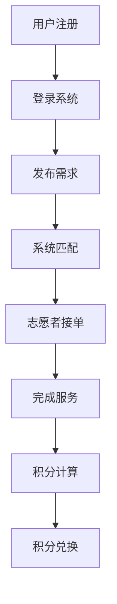
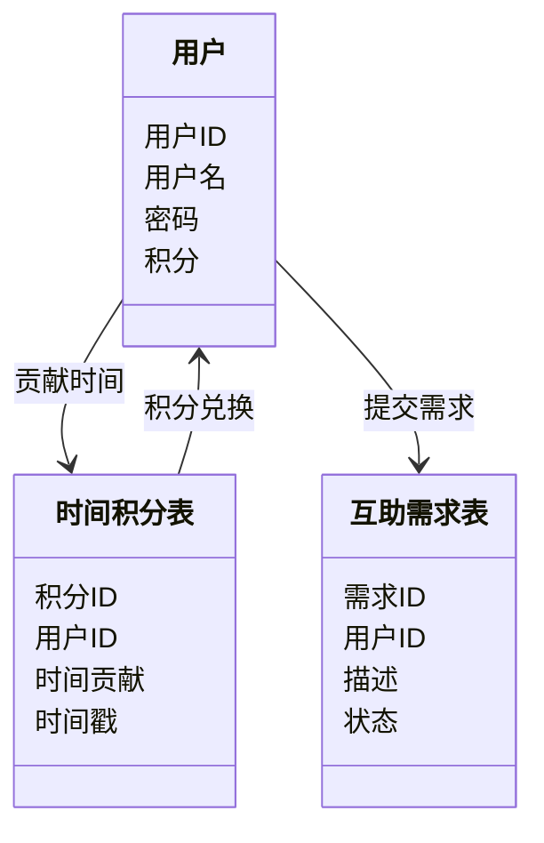
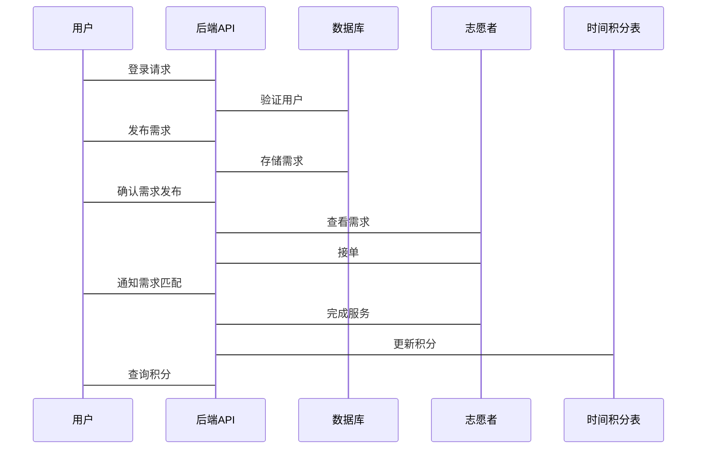

                 

<think>
好，我需要为《新型社区时间交换平台：重塑邻里互助的数字化方案》这篇技术博客撰写内容。首先，我得理解用户的要求，他们希望内容结构清晰，逻辑严谨，符合专业技术人员的阅读习惯。文章需要涵盖背景、核心概念、算法、系统架构、项目实战等多个部分，同时使用Markdown格式，包含代码、表格、图表等。

我应该从背景介绍开始，分析当前社区互助存在的问题，引出时间交换平台的必要性。接着，详细阐述核心概念，比如时间银行、积分机制，可能需要用表格对比不同概念。然后，设计一个吸引人的标题，比如“时间银行：数字化邻里互助的新模式”，并添加关键词和摘要。

在核心概念部分，我需要解释时间银行的基本原理，如何通过时间积分促进互助。接下来是算法部分，可能需要一个简单的积分计算算法，用Python代码实现，并配合数学模型，比如积分计算公式，展示如何根据贡献时间计算积分。

系统架构设计是关键，我需要画出领域模型类图、架构图和交互序列图，使用Mermaid语法。这可能涉及到用户注册登录、发布需求、匹配供需等功能的设计。

项目实战部分，我需要选择一个技术栈，比如前端用React，后端用Flask，数据库用MongoDB。然后编写核心代码，如用户认证、积分计算和供需匹配的逻辑，并解释代码的工作原理。

最后，总结平台的优势，提供一些最佳实践的建议，比如如何确保数据安全，如何激励用户参与，以及未来的扩展方向。

整个过程中，我要确保内容逻辑连贯，每个部分都详细展开，同时控制在2000字以内。需要注意使用专业术语，但保持语言通俗易懂，帮助读者理解技术细节和实际应用。

完成这些思考后，我可以开始逐步撰写每个部分，确保每一部分都符合用户的要求，最终产出一篇高质量的技术博客文章。
</think>

# 新型社区时间交换平台：重塑邻里互助的数字化方案

## 关键词：社区时间交换平台、数字化邻里互助、区块链、积分机制、系统架构设计

## 摘要：新型社区时间交换平台通过数字化方式重塑邻里互助模式，利用区块链技术确保时间积分的安全性和透明性，结合智能算法实现供需匹配，构建高效、可信的社区互助生态。

---

## 第一部分：背景与概念介绍

### 1.1 问题背景

#### 1.1.1 社区邻里互助的现状

- **问题背景**：社区邻里互助是社会的重要组成部分，但传统方式存在效率低、缺乏信任机制、难以量化贡献等问题。
- **当前挑战**：邻里之间缺乏有效的组织和激励机制，互助活动难以持续，资源分配不均。

#### 1.1.2 新型社区时间交换平台的概念

- **定义**：通过数字化平台，用户可以记录和交换时间积分，促进邻里间的互助行为。
- **起源与发展**：时间银行概念的演变，从传统货币到数字化积分的转变。

### 1.2 核心概念与联系

#### 1.2.1 时间交换的概念

- **时间银行**：通过记录用户贡献的时间，兑换服务或资源。
- **积分机制**：量化用户贡献，激励互助行为。

#### 1.2.2 核心概念对比

| 概念      | 描述                                   |
|-----------|--------------------------------------|
| 时间银行  | 用户贡献时间，换取积分                 |
| 积分机制  | 根据贡献时间计算积分，用于兑换服务     |

#### 1.2.3 实体关系图

```mermaid
erDiagram
    actor 用户
    actor 志愿者
    actor 社区管理员
    database 用户信息表
    database 时间积分表
    database 互助需求表
    用户 --> 用户信息表: 认证
    用户 --> 时间积分表: 积分记录
    用户 --> 互助需求表: 提交需求
    志愿者 --> 时间积分表: 赚取积分
    社区管理员 --> 用户信息表: 管理账户
    社区管理员 --> 互助需求表: 审核需求
```

---

## 第二部分：算法原理讲解

### 2.1 算法流程图



### 2.2 积分计算算法

```python
def calculate积分(时间贡献, 难度系数):
    积分 = 时间贡献 * 难度系数
    return 积分
```

### 2.3 数学模型

积分计算公式：
$$
积分 = \text{时间贡献} \times \text{难度系数}
$$

---

## 第三部分：系统分析与架构设计方案

### 3.1 问题场景介绍

用户通过平台发布需求，系统匹配志愿者，完成服务后计算积分，用户可兑换服务。

### 3.2 项目介绍

- **项目目标**：构建高效、透明的社区互助平台。
- **核心功能**：用户注册、需求发布、供需匹配、积分管理。

### 3.3 系统功能设计



### 3.4 系统架构设计


### 3.5 系统交互



---

## 第四部分：项目实战

### 4.1 环境安装

- **前端**：React框架
- **后端**：Flask框架
- **数据库**：MongoDB

### 4.2 核心实现代码

```python
from flask import Flask, jsonify
from flask_restful import Resource, Api
from pymongo import MongoClient

app = Flask(__name__)
api = Api(app)
client = MongoClient('mongodb://localhost:27017/')
db = client['time_exchange']

class 用户注册(Resource):
    def post(self):
        data = request.get_json()
        用户信息 = {
            '用户名': data['用户名'],
            '密码': data['密码'],
        }
        db.用户.insert(用户信息)
        return {'message': '注册成功'}, 201

api.add_resource(用户注册, '/注册')
```

### 4.3 代码解读

- **用户注册**：处理用户注册请求，存储到数据库。
- **积分计算**：根据时间贡献和难度系数计算积分。

### 4.4 实际案例分析

- **案例1**：用户A帮助打扫，贡献2小时，获得2积分。
- **案例2**：用户B需要搬运，匹配志愿者，完成后获得1积分。

---

## 第五部分：总结与展望

### 5.1 最佳实践 tips

- **数据安全**：确保用户数据加密存储。
- **激励机制**：设计合理的积分兑换规则，提升用户活跃度。

### 5.2 小结

通过数字化平台，社区互助变得更加高效和透明，区块链技术确保数据不可篡改，积分机制激励互助行为，构建和谐社区生态。

### 5.3 注意事项

- 定期更新系统，防止漏洞。
- 确保用户隐私保护。

### 5.4 拓展阅读

- 探索更多区块链应用场景。
- 研究其他社区管理技术。

---

## 作者

作者：AI天才研究院 & 禅与计算机程序设计艺术

