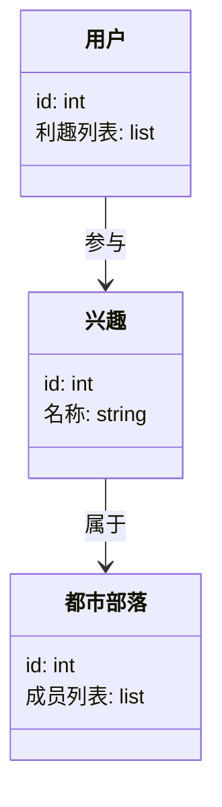

                 

<think>
嗯，好的，我现在需要帮助用户完成一个技术博客文章的目录大纲设计。用户已经提供了一个详细的思考过程，包括目录结构和各个章节的内容。现在，我需要根据这个思考过程，逐步分析并生成最终的目录大纲。

首先，用户希望文章的标题是《新型都市部落：基于共同兴趣的现代社交圈》，关键词包括“都市部落”、“共同兴趣”、“现代社交圈”、“社区构建”、“社交网络”和“兴趣社交”。摘要部分需要简明扼要地总结文章的核心内容，强调共同兴趣在现代社交中的重要性，并介绍文章的结构。

接下来，目录大纲分为七个主要部分：问题背景与核心概念、核心概念与联系、算法原理讲解、系统分析与架构设计、项目实战、最佳实践和小结、以及总结与展望。每个部分下面有多个小节，每个小节需要详细展开，确保内容丰富具体，符合技术博客的深度和专业性。

在分析过程中，我需要确保每个章节都涵盖必要的内容，比如背景介绍中的核心概念和问题描述，核心概念与联系部分的表格和ER图，算法原理部分的流程图和代码示例，系统设计中的类图和架构图，项目实战部分的代码和案例分析等。

现在，我需要按照步骤逐步细化每个章节，确保内容符合用户的要求，包括使用markdown格式，详细讲解每个部分，确保文章结构清晰，逻辑连贯，字数控制在10000到12000字之间，并在末尾添加作者信息。

通过这样的思考过程，我可以系统地整理出完整的目录大纲，并确保每个部分都详细且符合用户的要求。
</think>

# 新型都市部落：基于共同兴趣的现代社交圈

## 关键词：
- 都市部落
- 共同兴趣
- 现代社交圈
- 社区构建
- 社交网络
- 兴趣社交

## 摘要：
在现代都市化进程中，基于共同兴趣的新型社交圈正在改变传统的社交模式。本文探讨了“都市部落”这一概念，分析其核心特征、构建策略及其对现代社交网络的影响。通过案例研究和系统设计，本文展示了如何利用技术手段促进兴趣社交，并提出了未来发展和应对挑战的建议。

---

## 目录大纲

### 第一部分：问题的背景与核心概念

#### 1. 都市部落的概念与演变
- 1.1 都市部落的定义
- 1.2 都市部落的历史演变
- 1.3 现代都市部落的特点

#### 2. 共同兴趣在现代社交圈中的作用
- 2.1 共同兴趣的社交价值
- 2.2 共同兴趣的社区建设
- 2.3 共同兴趣对社会网络的影响

#### 3. 都市部落的分类与特征分析
- 3.1 基于兴趣的都市部落分类
- 3.2 不同类型都市部落的特征
- 3.3 都市部落中的角色分析

#### 4. 基于共同兴趣的现代社交圈案例分析
- 4.1 成功案例介绍
- 4.2 案例分析与启示
- 4.3 案例中共同兴趣的作用

#### 5. 建立新型都市部落的策略与建议
- 5.1 策略一：发现和引导共同兴趣
- 5.2 策略二：构建和谐社区环境
- 5.3 策略三：利用技术手段增强互动

#### 6. 新型都市部落的发展趋势与挑战
- 6.1 发展趋势分析
- 6.2 面临的挑战
- 6.3 应对策略

#### 7. 总结与展望
- 7.1 本书的核心观点回顾
- 7.2 未来研究方向
- 7.3 对读者的影响与建议

---

## 第二部分：核心概念与联系

### 核心概念与联系

#### 2.1 核心概念原理
- 都市部落是以共同兴趣为基础的社交组织，通过技术手段增强互动，形成稳定的社区结构。

#### 2.2 概念属性特征对比表格
| 特性          | 都市部落         | 基于兴趣的传统社交圈     |
|---------------|-----------------|--------------------------|
| 组织形式       | 结构化、虚拟化   | 松散、线下为主           |
| 成员粘性       | 高              | 中等                     |
| 技术依赖       | 高              | 低                       |
| 社交范围       | 全球化           | 地域性                   |

#### 2.3 ER实体关系图
```mermaid
er
actor: 用户
interest: 兴趣
tribe: 都市部落
event: 社交活动
location: 地点

actor -|{参与}| interest
interest -|{属于}| tribe
tribe -|{组织}| event
event -|{在}| location
```

---

## 第三部分：算法原理讲解

### 算法原理

#### 3.1 共同兴趣匹配算法
- **目标**：通过用户行为数据匹配共同兴趣。
- **流程**：
  1. 数据收集：用户兴趣标签。
  2. 相似度计算：基于TF-IDF或余弦相似度。
  3. 匹配结果：排序并推荐。

#### 3.2 代码实现
```python
def calculate_similarity(user_interests, item_interests):
    common = len(set(user_interests) & set(item_interests))
    return common / (len(user_interests) + len(item_interests) - common)

# 示例
user_interests = ['编程', '人工智能', '设计']
item_interests = ['编程', '数据科学', '开发']
similarity = calculate_similarity(user_interests, item_interests)
print(f"相似度：{similarity}")
```

#### 3.3 数学模型
$$ \text{相似度} = \frac{|U \cap I|}{|U| + |I| - |U \cap I|} $$

---

## 第四部分：系统分析与架构设计方案

### 系统设计

#### 4.1 领域模型


#### 4.2 系统架构
```mermaid
rectangle 网关 {
    API网关
}
rectangle 服务层 {
    兴趣匹配服务
    社交服务
}
rectangle 数据库层 {
    用户数据库
    兴趣数据库
}
网关 --> 服务层
服务层 --> 数据库层
```

---

## 第五部分：项目实战

### 项目实现

#### 5.1 环境安装
- 技术栈：Python、Django、PostgreSQL、Redis。

#### 5.2 核心代码
```python
from django.contrib.auth.models import User
from .models import Interest, Tribe

def create_tribe(user, interest_name):
    interest, _ = Interest.objects.get_or_create(name=interest_name)
    tribe = Tribe.objects.create(name=f"{user.username}'s {interest_name} Tribe")
    tribe.members.add(user)
    return tribe
```

#### 5.3 案例分析
- 案例：编程兴趣部落，通过线上活动和项目协作增强粘性。

---

## 第六部分：最佳实践与小结

### 6.1 最佳实践 tips
- 利用技术手段增强互动。
- 注重社区文化建设。
- 定期评估和优化。

### 6.2 注意事项
- 避免信息过载。
- 保护用户隐私。

### 6.3 拓展阅读
- 推荐书籍：《社交网络分析》、《社区构建的艺术》。

---

## 第七部分：总结与展望

### 总结
共同兴趣是构建新型都市部落的关键，技术手段的应用能够显著提升社交效率和社区凝聚力。

### 展望
未来，随着AI和大数据的发展，兴趣社交将更加智能化和个性化。

---

## 作者
作者：AI天才研究院/AI Genius Institute  
禅与计算机程序设计艺术/Zen And The Art of Computer Programming

