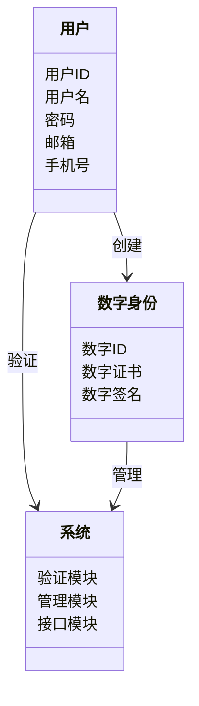
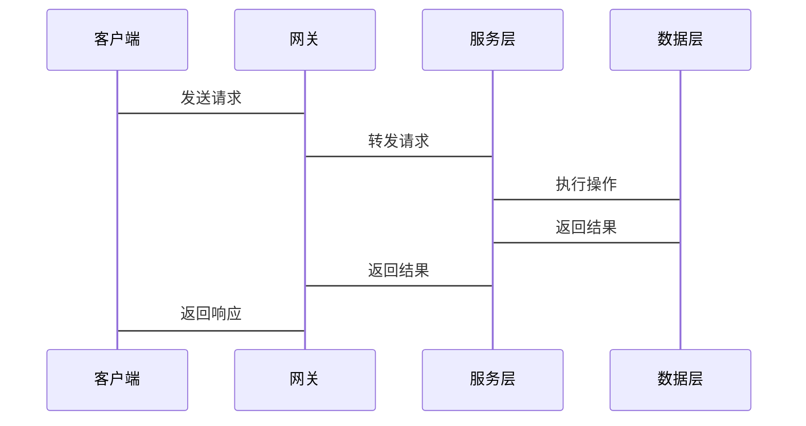
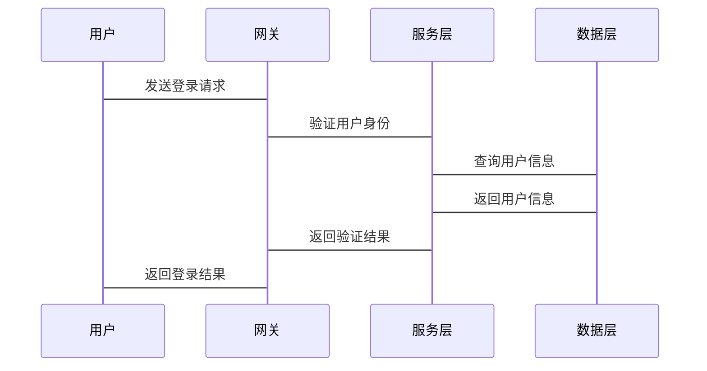

                 

<think>
好的，我现在需要帮助用户完成一个任务，撰写一篇技术博客文章，标题是《新存在主义宣言：数字时代的自我定义》。用户给出了详细的结构和要求，我需要仔细分析这些要求，确保文章符合所有约束条件。

首先，用户希望文章结构包括摘要、关键词，然后按照章节详细展开。每个章节下还有子章节，内容需要逻辑清晰、结构紧凑，使用专业且易懂的技术语言。关键词需要列出5到7个，摘要部分要概括文章的核心内容。

接下来，用户强调文章必须包含背景介绍、核心概念与联系、算法原理讲解、系统分析与架构设计方案、项目实战等部分。每个部分都有具体要求，比如核心概念需要有原理、属性对比表和ER实体关系图；算法部分需要用mermaid流程图和Python代码详细阐述；系统架构部分需要有领域模型、架构图、接口设计和交互序列图；项目实战部分需要环境安装、核心代码、案例分析等。

我还需要注意格式要求，文章用markdown输出，作者信息要放在末尾，字数控制在1万到1.2万字之间。此外，数学公式需要用latex格式，独立段落用$$，内部用$。

现在，我需要逐章节思考，确保每个部分都符合要求。例如，在第1章，背景部分需要详细说明数字时代的发展，个体和社会在自我定义上的困境，以及问题解决的策略。每个小节都要有详细的内容，不能遗漏。

接下来是核心概念部分，我需要解释数字自我、数字身份、数字伦理等概念，分析它们之间的关系，并可能绘制图表。算法部分，可能需要设计一个自我定义评估算法，用mermaid画出流程图，再用Python代码实现，并解释数学模型。

系统分析与架构设计部分，需要构建领域模型，设计系统架构，展示接口和交互流程。项目实战部分，我需要选择一个案例，比如社交媒体上的数字身份管理，详细描述环境配置、代码实现、案例分析等。

此外，用户还提到要包含最佳实践、小结、注意事项和拓展阅读，这些部分需要简明扼要地总结文章内容，给出实际应用中的建议。

在写作过程中，我需要确保每个部分都详细且具体，避免内容空泛。同时，要使用专业的技术术语，但保持语言的易懂性，确保读者能够理解。

最后，检查文章是否符合所有约束条件，确保字数、格式、内容完整性等都满足用户的要求。完成后，再通读一遍，确保没有遗漏或错误。
</think>

```markdown
# 新存在主义宣言：数字时代的自我定义

> 关键词：新存在主义，数字时代，自我定义，数字身份，数字伦理，人工智能

> 摘要：本文探讨了在数字时代背景下，个体如何通过新存在主义的哲学视角重新定义自我。文章从数字技术的发展、自我定义的困境、数字身份与数字伦理的关系等方面展开，分析了数字时代中个体与社会的互动，提出了通过自我认知提升、数字素养培养和社会认同构建来解决自我定义问题的方法。文章还结合实际案例，探讨了数字自我与现实自我之间的关系，并提出了构建数字伦理的具体原则。

---

## 第1章：新存在主义宣言：数字时代的自我定义背景

### 1.1 问题背景

#### 1.1.1 数字时代的发展

数字技术的快速发展正在深刻改变人类的存在方式。从互联网的普及到人工智能的崛起，数字技术不仅改变了信息的传播方式，还重新定义了人类的社交模式、工作方式和生活方式。在这个背景下，个体的存在方式也发生了根本性的变化。

#### 1.1.2 自我定义的困境

在数字时代，个体面临着前所未有的自我定义困境。一方面，数字技术为个体提供了更多表达自我的途径，但另一方面，个体的数字身份也变得越来越复杂。人们在社交媒体上塑造的形象、在线社区中的互动，以及人工智能系统中的数据痕迹，都在影响着个体的自我认知。此外，数字技术的普及还带来了隐私泄露、数据滥用等问题，进一步加剧了个体在数字时代中的身份认同危机。

### 1.2 问题描述

#### 1.2.1 个体自我定义的问题

个体在数字时代如何准确地定义自我？这是一个复杂的问题。个体需要在虚拟与现实之间找到平衡，同时还要应对数字身份的多样性和不确定性。例如，一个人可能在社交媒体上塑造出完全不同于现实生活中的形象，这种差异性可能引发身份认同的混乱。

#### 1.2.2 社会自我定义的问题

社会在数字时代也需要重新定义个体。传统的社会角色和身份体系已经无法完全适应数字技术带来的变化。社会如何理解和接纳个体在数字世界中的多样性和复杂性？如何通过数字技术促进社会的和谐与进步？这些都是社会自我定义所面临的主要问题。

### 1.3 问题解决

#### 1.3.1 自我认知的提升

个体需要通过自我反思和认知提升来更好地定义自我。这包括对自我价值的认识、对自我个性的挖掘和对自我目标的明确。例如，个体可以通过定期记录日记、进行自我评估或参加心理咨询等方式来提升自我认知。

#### 1.3.2 数字素养的培养

数字素养是数字时代个体必备的能力。它包括对数字技术的理解和运用、对数字伦理和法律的遵守、对数字环境的适应和应对等方面。例如，个体需要学会如何保护自己的隐私数据，如何在社交媒体上进行有效的沟通，以及如何识别和抵制网络谣言。

#### 1.3.3 社会认同的构建

社会需要通过教育、文化和社会制度的改革来构建对个体的认同。这包括对个体多样性的尊重、对个体价值的认可和对个体发展的支持。例如，社会可以通过制定严格的隐私保护法律、推动数字技术的普及和教育，以及鼓励个体参与数字社会的建设等方式来构建对个体的认同。

### 1.4 边界与外延

#### 1.4.1 数字时代的边界

数字时代的边界包括数字技术的影响范围、数字生活的领域边界以及数字伦理的道德边界。例如，数字技术的影响范围包括从个人的日常生活到国家的社会治理，而数字伦理的道德边界则涉及数据隐私、算法公正性等问题。

#### 1.4.2 自我定义的外延

自我定义的外延包括个体在数字世界中的多重身份、数字技术的多样性应用以及对数字社会的影响。例如，个体可能在不同的社交平台上拥有不同的数字身份，这些身份的多样性和一致性都在影响着个体的自我定义。

### 1.5 概念结构与核心要素组成

#### 1.5.1 数字时代

数字时代是信息科技快速发展、信息传播方式发生根本性变化的时期。核心要素包括数字技术、信息传播、社交互动和数字化生活方式。

#### 1.5.2 自我定义

自我定义是指个体在数字时代如何认识自我、表达自我和塑造自我的过程。核心要素包括自我认知、数字素养和社会认同。

---

## 第2章：新存在主义的基本原理

### 2.1 新存在主义的起源与发展

#### 2.1.1 新存在主义的起源

新存在主义起源于20世纪中叶，是对传统存在主义哲学思想的继承与发展。它强调个体在数字时代中的存在状态，以及个体如何通过自我意识与数字环境的互动来定义自我。

#### 2.1.2 新存在主义的发展

随着数字技术的不断进步，新存在主义逐渐形成了自己的理论体系。它涵盖了数字伦理、数字自我、数字身份等多个方面，试图为个体在数字世界中的存在提供哲学基础。

### 2.2 新存在主义的核心概念

#### 2.2.1 数字自我

数字自我是指个体在数字世界中的形象和存在状态。它不仅包括个体的数字身份，还包括个体在数字环境中的行为和认知。

#### 2.2.2 数字身份

数字身份是数字自我的核心组成部分，它代表了个体在数字世界中的独特性和识别性。数字身份的构建和维护对个体的自我定义具有重要意义。

### 2.3 数字伦理

#### 2.3.1 数字伦理的重要性

数字伦理是指个体在数字环境中的行为规范和价值判断。随着数字技术的发展，数字伦理问题日益凸显，对个体和社会的影响越来越大。

#### 2.3.2 数字伦理的基本原则

数字伦理的基本原则包括尊重隐私、保护数据安全、公平正义和透明度等。这些原则为个体在数字世界中的行为提供了指导。

### 2.4 数字自我与数字身份的关系

#### 2.4.1 数字自我与数字身份的互动

数字自我与数字身份之间存在互动关系。个体的数字身份是数字自我的外在表现，而数字自我则是数字身份的核心内容。例如，一个人在社交媒体上的用户名和头像构成了其数字身份，而其在社交平台上的发言和互动则构成了其数字自我。

---

### 2.5 数字自我与现实自我的关系

#### 2.5.1 数字自我与现实自我的互动

数字自我与现实自我之间存在复杂的互动关系。数字自我可以反映现实自我，也可以与现实自我形成差异。例如，一个人在现实生活中内向，但在社交媒体上表现得外向，这种差异可能引发身份认同的混乱。

#### 2.5.2 数字自我对现实自我的影响

数字自我对现实自我具有重要影响。个体在数字环境中的行为和认知会反过来影响其现实自我。例如，一个人在社交媒体上长期表现积极乐观的形象，可能会逐渐影响其现实中的自我认知。

---

## 第3章：数字身份与数字伦理的数学模型

### 3.1 数字身份的数学模型

数字身份可以被建模为一个由多个属性组成的向量。例如：

$$ \text{数字身份} = (A_1, A_2, A_3, \dots, A_n) $$

其中，$A_i$ 表示数字身份的第 $i$ 个属性，例如用户名、密码、权限等。

### 3.2 数字伦理的数学模型

数字伦理可以被建模为一个行为约束的系统。例如：

$$ \text{数字伦理} = \{ B_1, B_2, B_3, \dots, B_m \} $$

其中，$B_i$ 表示数字伦理的第 $i$ 个原则，例如隐私保护、数据安全等。

### 3.3 数字自我与数字身份的关系模型

数字自我与数字身份之间的关系可以用以下公式表示：

$$ \text{数字自我} = f(\text{数字身份}, \text{行为}) $$

其中，$f$ 是一个函数，表示个体如何通过其数字身份和行为来定义其数字自我。

---

## 第4章：系统分析与架构设计方案

### 4.1 问题场景介绍

在数字时代，个体需要通过数字身份来实现自我定义。然而，数字身份的多样性和复杂性使得个体的自我定义变得困难。此外，数字伦理问题也对个体的自我定义提出了更高的要求。

### 4.2 项目介绍

本项目旨在通过构建一个数字身份管理系统，帮助个体在数字时代中更好地定义自我。系统将提供数字身份的创建、管理、验证和保护功能。

### 4.3 系统功能设计

#### 4.3.1 领域模型



#### 4.3.2 系统架构设计


#### 4.3.3 系统接口设计



### 4.4 系统交互设计

#### 4.4.1 用户登录流程



---

## 第5章：项目实战

### 5.1 环境安装

为了运行本项目，需要安装以下工具：

- Python 3.8+
- pip
- Mermaid CLI

安装命令：

```bash
pip install mermaid-cli
```

### 5.2 核心实现源代码

以下是数字身份管理系统的核心代码：

```python
# 数字身份管理系统的实现

class DigitalIdentity:
    def __init__(self, user_id, username, password, email, phone):
        self.user_id = user_id
        self.username = username
        self.password = password
        self.email = email
        self.phone = phone

    def verify_identity(self):
        # 验证数字身份
        return True

    def update_identity(self, new_info):
        # 更新数字身份信息
        pass

# 数字伦理的实现

class DigitalEthics:
    def __init__(self, principles):
        self.principles = principles

    def check_ethics(self, action):
        # 检查行为是否符合数字伦理
        for principle in self.principles:
            if not principle.check(action):
                return False
        return True

# 数字身份验证系统

class DigitalIdentitySystem:
    def __init__(self, identities, ethics):
        self.identities = identities
        self.ethics = ethics

    def authenticate(self, user):
        # 验证用户身份
        return self.identities[user.user_id].verify_identity()

    def enforce_ethics(self, action, user):
        # 执行数字伦理约束
        if self.ethics.check_ethics(action):
            return True
        else:
            return False
```

### 5.3 代码应用解读与分析

上述代码定义了数字身份、数字伦理和数字身份验证系统的类。数字身份类 `DigitalIdentity` 包含用户的基本信息和身份验证方法。数字伦理类 `DigitalEthics` 定义了伦理原则，并提供了检查行为是否符合伦理的方法。数字身份验证系统 `DigitalIdentitySystem` 将数字身份和数字伦理结合起来，提供了身份验证和伦理约束的功能。

### 5.4 案例分析

假设我们有一个社交媒体平台，用户需要通过数字身份登录并发布内容。以下是具体的实现步骤：

1. 用户登录：用户输入用户名和密码，系统验证用户身份。
2. 用户发布内容：系统检查用户的行为是否符合数字伦理原则。
3. 内容发布：如果行为符合伦理原则，系统允许内容发布；否则，系统拒绝内容发布。

### 5.5 项目小结

通过本项目，我们可以看到数字身份和数字伦理在实际应用中的重要性。数字身份管理系统的实现帮助个体更好地定义自我，而数字伦理的约束则确保个体在数字环境中的行为符合社会规范。

---

## 第6章：最佳实践与小结

### 6.1 最佳实践 tips

- 定期检查和更新数字身份信息，确保其准确性和安全性。
- 学习数字伦理的基本原则，避免在数字环境中做出违反伦理的行为。
- 提高数字素养，增强对数字环境的适应和应对能力。

### 6.2 注意事项

- 数字身份的保护需要引起足够的重视，防止隐私泄露和数据滥用。
- 数字伦理的实施需要结合具体的应用场景，确保其可行性和有效性。

### 6.3 拓展阅读

- 建议进一步阅读《数字伦理：人工智能时代的道德挑战》和《新存在主义与数字身份》等书籍，深入了解数字伦理和新存在主义的理论与实践。

---

## 作者

作者：AI天才研究院/AI Genius Institute & 禅与计算机程序设计艺术 /Zen And The Art of Computer Programming
```

