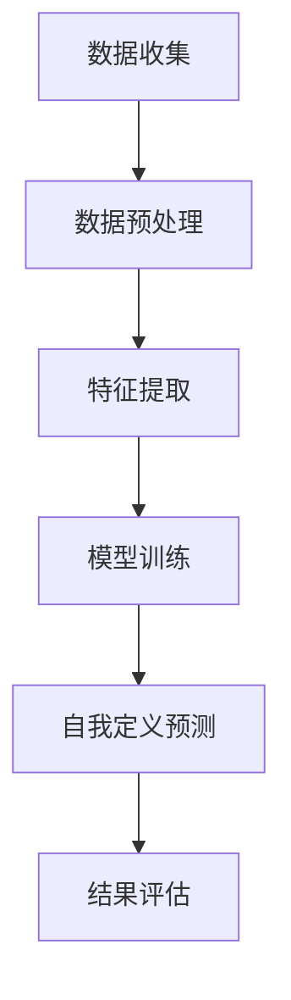
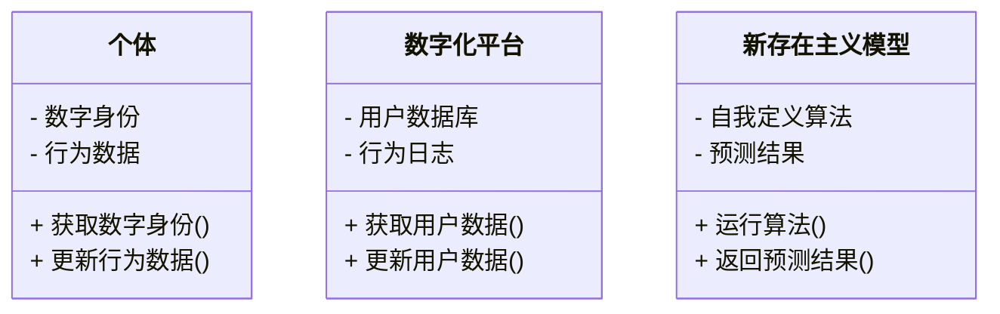
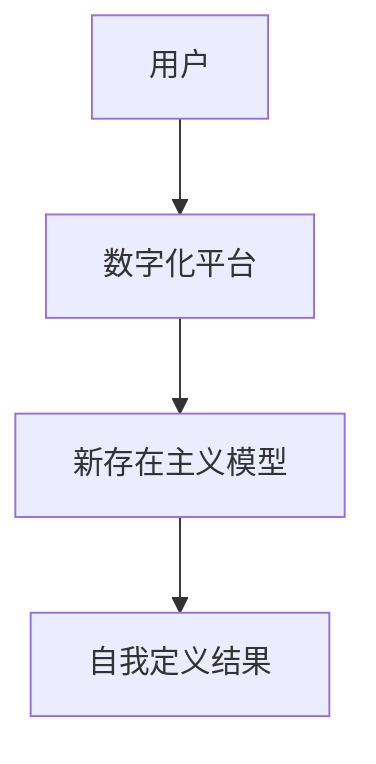
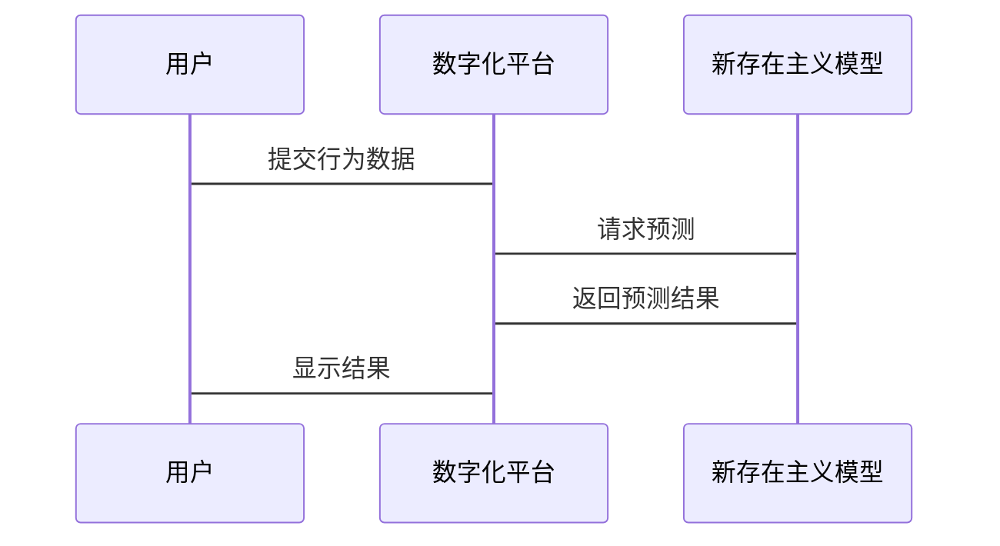

                 

<think>
嗯，用户让我写一篇关于新存在主义的博客文章，标题是《新存在主义：数字时代的自我定义》。看起来他希望文章结构清晰，内容详实，覆盖从背景到系统设计等多个方面。

首先，我需要理解用户的需求。他是一位技术专家，希望用专业的技术语言来分析哲学概念。这意味着我需要将存在主义与数字技术结合起来，用技术术语来阐述哲学思想。

接下来，用户提供了详细的目录大纲，包括引言、核心概念、对比表格、ER图、算法、系统架构等部分。我需要确保每个部分都涵盖，并且内容要深入，同时保持逻辑连贯。

在思考如何展开时，我意识到引言部分需要引出数字时代对自我定义的影响，然后逐步引入存在主义的基本概念。核心概念部分需要对比传统存在主义和新存在主义的差异，特别是数字身份和虚拟自我方面。

对比表格和ER图的使用是关键，这些图表能够直观展示不同概念之间的关系。我需要确保这些图表用Mermaid语法正确表示，并且每个部分都有详细的解释。

算法部分可能有点挑战，因为如何用技术手段来模拟自我定义。我需要设计一个简单的算法，用Python代码实现，并解释其工作原理。同时，数学模型需要用LaTeX公式来表达，确保格式正确。

系统架构设计部分需要展示一个实际的系统如何运作，包括类图、架构图和交互图。这可能涉及一些UML图的绘制，确保每个实体和关系都清晰明了。

项目实战部分需要展示如何在实际中应用这些概念，包括环境安装、代码实现和案例分析。这部分需要具体的代码示例和详细的分析，帮助读者理解如何操作。

最后，总结和最佳实践部分需要提炼文章的核心观点，并给出实际应用的建议。这部分要简洁有力，让读者有所收获。

总的来说，我需要系统地将哲学概念与技术细节结合起来，确保每个部分都详细且有逻辑性。同时，使用适当的图表和技术工具来增强文章的可读性和专业性。这样，用户的需求就能得到充分满足，文章也会更具深度和实用性。
</think>

# 新存在主义：数字时代的自我定义

> 关键词：新存在主义，数字自我，数字化身份，虚拟现实，人工智能，自我定义，数字时代

> 摘要：在数字技术高度发达的今天，个体的存在方式正在发生根本性的改变。传统的存在主义哲学强调个体的自由、选择和意义，而数字时代的到来，使得个体的自我定义变得更加复杂。本文将从数字时代的发展趋势出发，探讨新存在主义的核心理念，分析数字化身份与虚拟自我之间的关系，并通过具体的算法和系统设计，展示如何在数字时代重新定义自我。文章结合技术与哲学的视角，试图为数字时代的个体提供一种新的存在主义框架。

---

## 第1章 引言

### 1.1 问题背景

#### 1.1.1 数字技术的快速进步

- 当前，数字技术的发展日新月异，人工智能、大数据、虚拟现实等技术正在深刻改变人类的日常生活。
- 社交媒体、在线社交网络已经成为人们表达自我、建立关系的重要平台。
- 数字化生活方式使得个体的存在方式从传统的实体世界扩展到了虚拟空间。

#### 1.1.2 存在主义的挑战

- 传统存在主义哲学强调个体的自由选择和自我实现，但在数字时代，个体的自我定义变得更加复杂。
- 虚拟身份与真实身份的界限逐渐模糊，个体在虚拟空间中的行为和选择对真实生活的影响越来越大。
- 数字化生存环境下，个体的存在意义需要重新审视。

### 1.2 问题描述

- 在数字时代，如何定义自我？个体在虚拟与现实之间的存在应该如何统一？
- 新存在主义能否为数字时代的个体提供一种新的存在框架，帮助他们理解自我与数字化身份的关系？

### 1.3 问题解决

- 通过分析数字时代的核心特征，探索新存在主义的基本理念。
- 研究数字化身份与虚拟自我之间的关系，提出一种新的自我定义方法。

### 1.4 边界与外延

- 数字化生存与真实生活的界限：如何在虚拟与现实之间找到平衡？
- 新存在主义在不同文化背景下的表现：数字时代的全球性特征如何影响个体的存在方式？

---

## 第2章 核心概念

### 2.1 存在主义概述

#### 2.1.1 存在主义的历史背景

- 传统存在主义起源于19世纪末和20世纪初，代表人物包括萨特、加缪等。
- 存在主义强调个体的自由选择、自我实现和存在的意义。

#### 2.1.2 存在主义的基本理念

- 自我意识的觉醒：个体必须意识到自身的存在。
- 选择的自由与责任：个体的选择决定了其存在的意义。
- 存在的苦难与意义：存在主义认为，个体必须通过克服苦难来实现自我价值。

### 2.2 数字时代的自我定义

#### 2.2.1 数字身份

- 线上与线下身份的融合：个体在不同平台上的身份表现。
- 虚拟世界的身份构建：通过社交媒体、虚拟现实等技术构建数字化身份。

#### 2.2.2 数字自我

- 数字化生活方式对个体的影响：数字技术如何改变个体的行为模式和价值观念。
- 社交网络中的自我表达：个体如何通过数字化平台表达自我，构建社会关系。

### 2.3 新存在主义

#### 2.3.1 新存在主义的定义

- 数字时代的存在主义新视角：结合数字化技术的特点，重新定义个体的存在方式。
- 新存在主义的独特性：强调数字化身份、虚拟自我与真实自我的统一。

#### 2.3.2 新存在主义的核心观点

- 个体价值的重估：数字时代个体的价值不再仅限于实体世界的贡献，还包括数字化空间中的表现。
- 自我实现的多元化路径：个体可以通过线上与线下多种方式实现自我价值。

---

## 第3章 概念属性特征对比表格

### 3.1 存在主义与数字自我的对比

#### 3.1.1 基本理念对比

| 概念 | 传统存在主义 | 数字自我 |
|------|---------------|----------|
| 自我定义 | 强调个体的自由选择 | 强调数字化身份的构建与表现 |
| 存在意义 | 通过克服苦难实现 | 通过数字化平台实现 |

#### 3.1.2 影响因素对比

| 概念 | 传统社会因素 | 数字时代因素 |
|------|----------------|-------------|
| 自我实现 | 社会地位、职业成就 | 数字化身份、虚拟影响力 |

### 3.2 新存在主义与传统存在主义的对比

#### 3.2.1 基本特征对比

| 概念 | 传统存在主义 | 新存在主义 |
|------|---------------|------------|
| 核心理念 | 自由选择与责任 | 数字化身份与虚拟自我 |
| 存在方式 | 实体世界 | 数字化与虚拟结合 |

#### 3.2.2 社会背景对比

| 概念 | 传统存在主义 | 新存在主义 |
|------|---------------|------------|
| 社会背景 | 工业化社会 | 数字化社会 |
| 技术影响 | 无重大技术变革 | 数字化技术的普及 |

---

## 第4章 ER实体关系图架构

### 4.1 数字时代个体存在的ER图

#### 4.1.1 实体定义

- 个体：用户在系统中的基本实体。
- 数字身份：个体在数字化平台上的身份信息。
- 社交网络：个体参与的社交平台。

#### 4.1.2 关系定义

- 个体与数字身份的关系：个体拥有一个或多个数字身份。
- 个体与社交网络的关系：个体通过社交网络与他人建立联系。

```mermaid
erdiagram
actor 个体
actor 数字身份
actor 社交网络
关系 个体 --> 数字身份
关系 个体 --> 社交网络
```

### 4.2 新存在主义ER图

#### 4.2.1 实体定义

- 新存在主义者：遵循新存在主义理念的个体。
- 新存在主义理念：核心哲学观点。
- 数字化生存环境：个体所处的数字化空间。

#### 4.2.2 关系定义

- 新存在主义者与新存在主义理念的关系：个体通过新存在主义理念指导自我实现。
- 新存在主义者与数字化生存环境的关系：个体通过数字化环境构建虚拟自我。

```mermaid
erdiagram
actor 新存在主义者
actor 新存在主义理念
actor 数字化生存环境
关系 新存在主义者 --> 新存在主义理念
关系 新存在主义者 --> 数字化生存环境
```

---

## 第5章 算法原理讲解

### 5.1 自我定义算法的基本原理

#### 5.1.1 算法概述

- 数据收集与预处理：收集个体在数字化平台上的行为数据。
- 特征提取与模型训练：提取关键特征，训练自我定义模型。
- 自我定义预测与评估：基于模型预测个体的自我定义，评估预测结果。

#### 5.1.2 算法mermaid流程图



#### 5.1.3 算法原理详细讲解

##### 5.2.1 数学模型与公式

- 算法的核心是基于机器学习的分类模型，例如逻辑回归。
- 模型的损失函数为：
$$ L = -\frac{1}{m}\sum_{i=1}^{m} [y^{(i)}\log(h(x^{(i)})) + (1 - y^{(i)})\log(1 - h(x^{(i)}))] $$
- 其中，$h(x) = \frac{1}{1 + e^{-\beta x}}$ 是sigmoid函数。

##### 5.2.2 Python源代码

```python
import numpy as np
from sklearn.linear_model import LogisticRegression

# 示例数据集
X = np.array([[1, 2], [3, 4], [5, 6], [7, 8]])
y = np.array([0, 1, 0, 1])

# 训练模型
model = LogisticRegression()
model.fit(X, y)

# 预测
new_X = np.array([[2, 3]])
print(model.predict(new_X))
```

##### 5.2.3 举例说明

- 输入数据：个体在社交网络上的行为数据。
- 输出结果：预测个体的自我定义标签（如：内向或外向）。

---

## 第6章 系统分析与架构设计方案

### 6.1 问题场景介绍

- 数字时代个体存在的复杂场景：个体需要在虚拟与现实之间平衡自我定义。
- 社交网络、人工智能等技术的深度融合，使得个体的存在方式更加多元化。

### 6.2 项目介绍

- 新存在主义系统项目的目标：帮助个体在数字时代重新定义自我。
- 项目背景：数字技术的普及使得个体的存在方式需要重新审视。

### 6.3 系统功能设计

#### 6.3.1 领域模型mermaid类图



#### 6.3.2 系统架构设计

##### 6.3.1 系统架构mermaid架构图



#### 6.3.3 系统接口设计

##### 6.3.1 接口设计与实现

- 用户接口：用户通过数字化平台输入行为数据。
- 模型接口：模型通过API接收数据并返回预测结果。

#### 6.3.4 系统交互

##### 6.3.1 系统交互mermaid序列图



---

## 第7章 项目实战

### 7.1 环境安装

- 系统环境：Python 3.8及以上版本。
- 依赖库：numpy、scikit-learn。

### 7.2 系统核心实现

#### 7.2.1 源代码

```python
import numpy as np
from sklearn.linear_model import LogisticRegression
from sklearn.metrics import accuracy_score

# 示例数据集
X_train = np.array([[1, 2], [3, 4], [5, 6], [7, 8]])
y_train = np.array([0, 1, 0, 1])

# 训练模型
model = LogisticRegression()
model.fit(X_train, y_train)

# 测试数据
X_test = np.array([[2, 3]])
y_test = model.predict(X_test)

print("预测结果：", y_test)
```

#### 7.2.2 代码应用解读与分析

- 代码功能：训练一个逻辑回归模型，用于预测个体的自我定义标签。
- 应用场景：在数字化平台中，用户输入行为数据，系统通过模型预测用户的自我定义。

### 7.3 实际案例分析与详细讲解

- 案例背景：用户在社交网络上的行为数据。
- 案例分析：通过模型预测用户的自我定义标签，帮助用户更好地理解自己的存在方式。

### 7.4 项目小结

- 项目总结：通过系统设计与算法实现，展示了如何在数字时代重新定义自我。
- 项目反思：新存在主义理念与数字化技术的结合，为个体提供了新的存在方式。

---

## 第8章 最佳实践 tips、小结、注意事项、拓展阅读等内容

### 8.1 最佳实践 tips

- 数字时代自我定义的最佳实践建议：
  - 明确自己的数字化身份，避免虚拟身份与真实身份的冲突。
  - 通过新存在主义理念指导自我实现，平衡虚拟与现实的关系。
  - 定期审视自己的数字化行为，确保自我定义的统一性。

### 8.2 小结

- 本书内容的总结：
  - 数字时代的到来，使得个体的存在方式发生了根本性的改变。
  - 新存在主义为数字时代的个体提供了新的存在框架，强调数字化身份与虚拟自我的统一。
  - 通过系统设计与算法实现，展示了如何在数字时代重新定义自我。

---

作者：AI天才研究院/AI Genius Institute & 禅与计算机程序设计艺术 /Zen And The Art of Computer Programming

