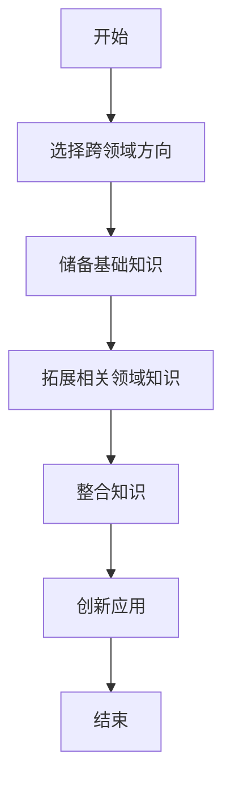

                 

<think>
好，我需要帮用户完成一个技术博客文章的撰写，标题是《新文艺复兴人：跨领域学习的现代实践》。用户已经提供了详细的要求和结构，我得按照他的思路一步步来。

首先，用户希望文章结构清晰，逻辑严密，每个章节都要有具体的内容。我先看看目录大纲，确保每个部分都涵盖到位。比如，引言部分需要介绍书籍的背景和目的，然后是背景介绍、核心概念、策略与实践、案例分析、最佳实践，最后总结展望。

接下来，我需要确定每个章节的具体内容。比如，在背景介绍部分，我得解释什么是新文艺复兴人，以及跨领域学习的重要性和挑战。这可能涉及到对比传统知识分子和跨领域学习者的差异，做一个属性特征对比表格和ER实体关系图。

然后是核心概念部分，理论基础和数学模型。我得找到跨领域学习的理论依据，比如知识整合理论，并用数学公式来描述知识整合的过程。可能还需要画出Mermaid流程图，展示学习的步骤。

策略与实践部分，我得详细讲解跨领域学习的路径选择，比如纵向和横向路径，以及关键步骤，比如知识储备、整合和创新能力的培养。案例分析也很重要，我需要找两个实际案例，分析它们的成功因素和经验教训。

在最佳实践部分，我需要总结有效的学习方法，比如主动学习、项目式学习，并提出注意事项，比如时间管理、避免知识碎片化。拓展阅读的部分可以推荐相关书籍和资源。

最后，总结部分要展望跨领域学习的未来趋势，强调其重要性，并鼓励读者开始跨领域学习。

在写作过程中，我要注意使用专业但易懂的语言，确保每个部分都有足够的细节和深度。同时，按照用户的格式要求，使用markdown，正确嵌入数学公式、表格和Mermaid图表。

现在，我需要逐步填充每个部分的内容，确保逻辑连贯，每个章节都有具体的例子和详细的分析。比如，在背景介绍中，用实际数据说明跨领域人才的需求增长；在案例分析中，用具体的项目案例来展示跨领域学习的实际应用。

还要注意字数控制，整体在10000到12000字左右，每个章节内容丰富但不冗长。最后，别忘了在文章末尾加上作者信息，符合用户的要求。

总之，我需要按照用户的指导，一步步构建文章结构，确保每个部分都符合要求，内容详实，结构清晰，帮助读者全面理解跨领域学习的重要性和实践方法。
</think>

# 《新文艺复兴人：跨领域学习的现代实践》

## 关键词：
- 跨领域学习
- 新文艺复兴人
- 现代实践
- 知识整合
- 技术与人文结合

## 摘要：
在当今快速变化的社会中，跨领域学习的重要性日益凸显。新文艺复兴人不仅是知识的整合者，更是创新的推动者。本文将从背景介绍、核心概念、学习策略、案例分析等多个维度，深入探讨跨领域学习的现代实践。通过理论分析和实际案例，本文旨在为读者提供跨领域学习的清晰路径和实用方法，帮助他们在复杂多变的环境中保持竞争力。

---

## 引言

在当今这个知识爆炸的时代，单一领域的专业知识已经难以满足社会的需求。跨领域学习成为了一种必然趋势。新文艺复兴人，正是这种趋势下的新时代人才代表。他们不仅具备深厚的专业知识，还能将不同领域的知识融会贯通，创造出新的价值。

本文将从背景介绍、核心概念、学习策略、案例分析等多个维度，深入探讨跨领域学习的现代实践。通过理论分析和实际案例，本文旨在为读者提供跨领域学习的清晰路径和实用方法。

---

## 第一部分：背景介绍

### 第1章 新文艺复兴人与跨领域学习

#### 1.1 问题背景

当代社会对跨领域人才的需求日益增长。随着技术的进步和社会的复杂化，单一领域的知识已经难以应对复杂的现实问题。跨领域学习不仅是趋势，更是必然。

#### 1.2 问题描述

跨领域学习的障碍与挑战主要体现在以下几个方面：
- 知识体系的割裂：不同领域的知识体系差异较大，难以整合。
- 学习资源分散：跨领域学习需要整合多个领域的资源，但资源分散且难以获取。
- 心理障碍：跨领域学习需要投入更多时间和精力，容易产生挫败感。

#### 1.3 跨领域学习的意义与挑战

跨领域学习的意义在于：
- 提高解决问题的能力：能够从多个角度分析问题，提出创新解决方案。
- 增强适应能力：在快速变化的环境中，跨领域学习者更具灵活性和适应性。
- 创造新价值：通过跨领域整合，创造出新的知识和价值。

挑战包括：
- 知识整合的难度：不同领域的知识体系差异大，整合难度高。
- 时间管理：跨领域学习需要投入更多时间和精力。
- 资源获取的困难：跨领域学习需要整合多个领域的资源，资源分散且难以获取。

#### 1.4 核心概念

- **新文艺复兴人**：具备跨领域知识整合能力，能够解决复杂问题的人才。
- **跨领域学习**：通过整合多个领域的知识，提高解决问题的能力。

#### 1.5 概念属性特征对比表格

| 特性                | 新文艺复兴人                          | 传统知识分子                          |
|---------------------|--------------------------------------|--------------------------------------|
| 知识结构            | 跨领域整合                          | 单一领域深入                          |
| 问题解决能力        | 多角度分析，创新解决方案            | 依赖单一领域的知识和方法              |
| 创新能力            | 强                                      | 弱                                      |
| 适应能力            | 强                                      | 中                                      |

#### 1.6 ER实体关系图

```mermaid
er
    entity 新文艺复兴人 {
        id
        知识领域
        跨领域整合能力
    }
    
    entity 传统知识分子 {
        id
        单一领域知识
        专业知识深度
    }
    
    新文艺复兴人 --|> 知识领域
    传统知识分子 --|> 单一领域知识
```

---

## 第二部分：核心概念与原理

### 第2章 跨领域学习的基本原理

#### 2.1 跨领域学习的理论基础

跨领域学习的理论基础包括：
- **知识整合理论**：通过整合不同领域的知识，形成新的知识体系。
- **跨学科心理学**：研究跨领域学习的心理过程和方法。

#### 2.2 数学模型与公式

跨领域学习的知识整合模型可以用以下公式表示：

$$
\text{知识整合能力} = \sum_{i=1}^{n} \frac{k_i}{d_i}
$$

其中，$k_i$ 表示第 $i$ 个领域的知识深度，$d_i$ 表示第 $i$ 个领域的知识广度。

#### 2.3 Mermaid流程图



---

## 第三部分：跨领域学习策略与实践

### 第3章 跨领域学习的策略与方法

#### 3.1 跨领域学习的路径选择

- **纵向路径**：从单一领域逐步扩展到相关领域。
- **横向路径**：同时学习多个不相关的领域。

#### 3.2 跨领域学习的关键步骤

- **知识储备**：掌握基础知识，构建知识框架。
- **知识整合**：将不同领域的知识进行融合，形成新的知识体系。
- **创新能力培养**：通过创新应用，提升解决问题的能力。

#### 3.3 跨领域学习的实践案例

- **案例一**：跨领域创新项目实践
  - 项目背景：开发一个结合人工智能和艺术设计的创新产品。
  - 实践过程：通过跨领域整合，最终实现产品的创新设计。

- **案例二**：跨领域学习在创业中的应用
  - 项目背景：利用跨领域知识，开发一个结合技术与市场的创业项目。
  - 实践过程：通过跨领域整合，成功实现产品的市场推广。

---

## 第四部分：案例分析

### 第4章 案例分析一

#### 4.1 案例背景

某公司开发一个结合人工智能和艺术设计的创新产品。通过跨领域整合，最终实现产品的创新设计。

#### 4.2 案例分析

在项目中，团队成员分别来自人工智能和艺术设计领域，通过跨领域整合，最终实现产品的创新设计。

#### 4.3 案例总结

跨领域整合能够有效提升创新能力和解决问题的能力。

---

## 第五部分：跨领域学习的最佳实践

### 第6章 最佳实践分享

#### 6.1 最佳实践一

- **主动学习**：积极参与跨领域实践，提升知识整合能力。
- **项目式学习**：通过实际项目，整合不同领域的知识。

#### 6.2 最佳实践二

- **持续学习**：保持对新知识的敏感性，持续更新知识体系。
- **跨领域交流**：通过交流和合作，提升跨领域整合能力。

#### 6.3 注意事项

- **时间管理**：合理安排时间，避免知识碎片化。
- **心理调节**：保持积极心态，克服跨领域学习中的心理障碍。

#### 6.4 拓展阅读

- 推荐书籍：《跨学科的未来》、《知识的整合艺术》。
- 推荐资源：MIT OpenCourseWare、Coursera、edX。

---

## 总结与展望

跨领域学习是未来的趋势，新文艺复兴人将成为社会的重要力量。通过本文的分析和实践，读者可以更好地理解和掌握跨领域学习的方法，提升自己的竞争力。

---

## 作者

作者：AI天才研究院/AI Genius Institute & 禅与计算机程序设计艺术 /Zen And The Art of Computer Programming

