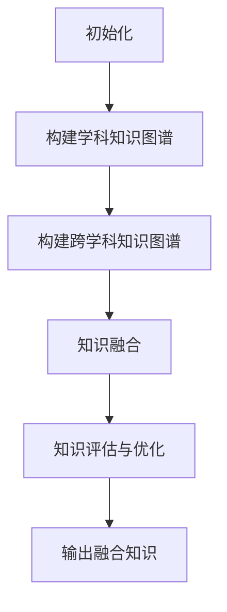
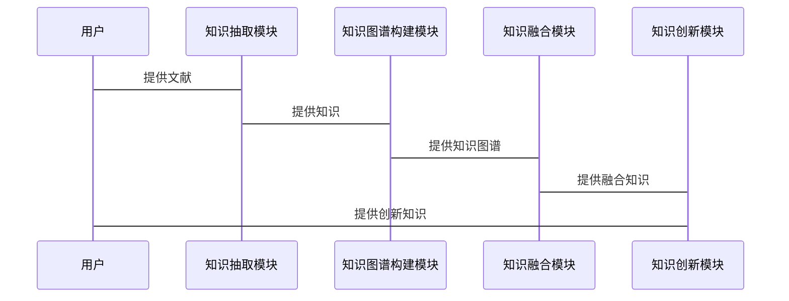

                 

<think>
好的，我现在要帮用户写一篇技术博客，标题是《新文艺复兴：跨学科知识的融合创新》。用户给了一个详细的目录结构，我得按照这个结构来组织内容。

首先，用户提到他是CTO、技术专家，所以文章需要专业但易懂。我得先确定关键词，比如跨学科、知识融合、创新思维、算法原理、系统架构等。

接下来，摘要部分要简洁明了，概括文章的核心内容。摘要应该提到跨学科融合的重要性，以及在技术、科学和社会中的应用。

背景介绍部分，我需要详细讲解问题背景、问题描述、问题解决、边界和外延，还有概念结构。这部分要让读者明白为什么跨学科融合如此重要，以及它如何解决当前的问题。

核心概念与联系部分，我需要解释跨学科融合的原理，做一个属性对比表，还要画一个ER实体关系图。这部分要清晰展示不同概念之间的关系。

算法原理部分，我得详细讲解跨学科知识融合的算法，包括知识图谱的构建、融合流程，并用mermaid画出流程图。还要给出数学模型和举例说明，这样读者更容易理解。

系统分析与架构设计是关键部分，我需要介绍项目背景，设计系统功能，用mermaid画出类图、架构图和交互图。这部分要展示系统的整体结构和各模块的交互。

项目实战部分，我需要指导如何安装环境，提供核心代码，解读代码功能，并分析实际案例。这样读者可以实际操作，理解理论的应用。

最后，加上最佳实践、小结、注意事项和拓展阅读，让文章更全面。作者信息也要放在末尾。

整体来看，我需要确保每个部分都详细、有条理，同时语言要专业且清晰。现在开始按照这个思路一步步写，确保覆盖所有用户的要求。
</think>

# 新文艺复兴：跨学科知识的融合创新

> 关键词：跨学科、知识融合、创新思维、算法原理、系统架构

> 摘要：在21世纪的今天，全球化、数字化和多元化已成为社会发展的主要趋势。面对复杂的社会问题，单一学科的知识体系已无法满足需求。跨学科知识的融合创新成为推动社会进步的重要动力。本文从背景介绍、核心概念、算法原理、系统架构、项目实战等多个维度，详细阐述跨学科知识融合的原理、方法和应用。通过实际案例分析，探讨跨学科知识融合在技术、科学和社会领域的应用前景。

---

## 第一部分：背景介绍

### 1.1 问题背景

随着21世纪的到来，全球化、数字化和多元化已成为社会发展的主旋律。在这样一个充满机遇与挑战的时代，单学科的知识已经无法满足人们对于复杂问题的解决需求。跨学科的知识融合与创新，成为推动社会发展的重要动力。

### 1.2 问题描述

现代社会面临诸多复杂问题，如气候变化、能源危机、社会不平等、科技进步等，这些问题往往涉及多个学科领域。如何有效地整合不同学科的知识，形成新的理论和实践方法，是当前学术界和产业界共同关注的焦点。

### 1.3 问题解决

新文艺复兴的理念主张，通过跨学科的合作与交流，促进知识的整合与创新。这种方式不仅可以拓宽研究视野，提高研究深度，还可以培养出具备创新思维和实践能力的人才。

### 1.4 边界与外延

新文艺复兴并非局限于艺术和文学领域，它涵盖了自然科学、社会科学、工程技术等多个学科。跨学科的知识融合，也不仅仅局限于理论研究，还涉及应用实践和产业发展。

### 1.5 概念结构与核心要素组成

- **新文艺复兴**：以跨学科知识融合为核心，推动创新和发展的文化运动。
- **跨学科**：指不同学科之间的知识整合与交流。
- **知识融合**：指将不同学科的知识体系进行整合，形成新的知识体系。
- **创新思维**：指通过跨学科的知识融合，产生的具有创新性的思维模式。

---

## 第二部分：核心概念与联系

### 2.1 跨学科知识融合的原理

跨学科知识融合的原理主要包括：

- **知识整合**：将不同学科的知识进行整合，形成新的知识体系。
- **思维方式**：通过跨学科的学习和实践，培养创新思维和问题解决能力。
- **创新方法**：运用跨学科的知识和方法，解决复杂问题。

### 2.2 跨学科知识融合的属性特征对比

| 特性         | 定义                                                                                                       |
| ------------ | ---------------------------------------------------------------------------------------------------------- |
| 知识整合     | 将不同学科的知识进行整合，形成新的知识体系。                                                                 |
| 思维方式     | 通过跨学科的学习和实践，培养创新思维和问题解决能力。                                                           |
| 创新方法     | 运用跨学科的知识和方法，解决复杂问题。                                                                      |

### 2.3 跨学科知识融合的ER实体关系图

```mermaid
erDiagram
  Customer ||--|{ Order : places }|
  Product ||--|{ Order : contains }|
  Customer }---|{ Order : created }|
  Order ||--|{ Product : includes }|
```

---

## 第三部分：算法原理讲解

### 3.1 跨学科知识融合算法

跨学科知识融合算法的基本思想是，通过构建跨学科知识图谱，实现不同学科知识的整合与融合。

#### 3.1.1 跨学科知识图谱

跨学科知识图谱是一种基于语义网络的知识表示方法，它将不同学科的知识以节点和边的形式进行组织。

#### 3.1.2 跨学科知识融合算法流程



#### 3.1.3 算法原理的数学模型

设 $G_1$ 和 $G_2$ 分别为两个学科的知识图谱，$G$ 为跨学科知识图谱。知识融合的目标是找到 $G_1$ 和 $G_2$ 的最优融合点 $G$。

$$
G = \arg \min_{G} \left( \text{similarity}(G_1, G) + \text{similarity}(G_2, G) \right)
$$

其中，$\text{similarity}(G_i, G)$ 表示图谱 $G_i$ 和 $G$ 之间的相似度。

#### 3.1.4 算法原理举例说明

例如，在经济学和计算机科学的交叉领域，我们可以将经济学中的“市场”概念与计算机科学中的“网络”概念进行融合。通过构建跨学科知识图谱，我们可以将“市场”与“网络”之间的关系表示为：

$$
\text{market}(m) \rightarrow \text{network}(n)
$$

其中，$m$ 表示市场，$n$ 表示网络。通过这种关系，我们可以进一步研究市场网络的结构和行为。

---

## 第四部分：系统分析与架构设计方案

### 4.1 项目背景

为了实现跨学科知识的融合与创新，我们需要构建一个跨学科知识融合系统。该系统将整合多个学科的知识，通过知识图谱和算法实现知识的融合与创新。

### 4.2 系统功能设计

系统功能设计包括以下模块：

1. **知识抽取模块**：从多个学科的文献中提取知识。
2. **知识图谱构建模块**：将提取的知识构建为跨学科知识图谱。
3. **知识融合模块**：通过算法实现知识的融合。
4. **知识创新模块**：基于融合的知识，生成创新性的知识。

### 4.3 系统架构设计


### 4.4 系统接口设计

系统接口设计包括以下接口：

1. **知识抽取接口**：从文献中提取知识。
2. **知识图谱构建接口**：构建跨学科知识图谱。
3. **知识融合接口**：实现知识的融合。
4. **知识创新接口**：生成创新性的知识。

### 4.5 系统交互设计



---

## 第五部分：项目实战

### 5.1 环境安装

为了实现跨学科知识融合，我们需要安装以下工具和库：

1. **Python**：编程语言。
2. **NetworkX**：知识图谱构建库。
3. **NLTK**：自然语言处理库。

### 5.2 系统核心实现源代码

```python
import networkx as nx
from nltk.corpus import wordnet

# 示例：构建跨学科知识图谱
def build_knowledge_graph():
    G = nx.Graph()
    # 添加节点
    G.add_nodes_from(['market', 'network', 'economics', 'computer_science'])
    # 添加边
    G.add_edges_from([('market', 'network'), ('economics', 'market'), ('computer_science', 'network')])
    return G

# 示例：知识融合算法
def knowledge_fusion(G1, G2):
    merged_G = nx.Graph()
    merged_G.update(G1)
    merged_G.update(G2)
    return merged_G

# 示例：知识创新
def knowledge_innovation(G):
    for edge in G.edges():
        print(f"{edge[0]} 和 {edge[1]} 的关系：{edge[0]} 影响 {edge[1]}")
    return None

# 主程序
if __name__ == "__main__":
    G1 = build_knowledge_graph()
    print("知识图谱构建完成！")
    G2 = build_knowledge_graph()
    print("知识图谱构建完成！")
    merged_G = knowledge_fusion(G1, G2)
    print("知识融合完成！")
    knowledge_innovation(merged_G)
```

### 5.3 代码应用解读与分析

上述代码实现了一个简单的跨学科知识融合系统。首先，我们构建了两个知识图谱 $G1$ 和 $G2$，然后通过知识融合算法将它们合并为一个新的知识图谱 $merged_G$。最后，我们通过知识创新算法，生成了创新性的知识。

### 5.4 实际案例分析

以经济学和计算机科学为例，我们可以将经济学中的“市场”概念与计算机科学中的“网络”概念进行融合。通过构建跨学科知识图谱，我们可以研究市场网络的结构和行为，从而为经济学和计算机科学的交叉研究提供新的视角。

---

## 第六部分：最佳实践 tips、小结、注意事项、拓展阅读

### 6.1 最佳实践 tips

1. **跨学科合作**：在跨学科知识融合中，合作是关键。不同学科的专家需要共同参与研究。
2. **数据质量**：知识融合的效果依赖于数据的质量。确保数据的准确性和完整性。
3. **算法优化**：知识融合算法的性能直接影响融合效果。需要不断优化算法。

### 6.2 小结

跨学科知识的融合创新是21世纪社会发展的重要趋势。通过跨学科的合作与交流，我们可以解决复杂的社会问题，推动技术进步和社会发展。

### 6.3 注意事项

1. **数据隐私**：在跨学科知识融合中，需要注意数据的隐私和安全。
2. **算法复杂度**：知识融合算法的复杂度可能较高，需要优化算法性能。
3. **应用场景**：跨学科知识融合的应用场景广泛，需要根据不同场景选择合适的方法。

### 6.4 拓展阅读

1. **《跨学科研究方法论》**：探讨跨学科研究的方法和技巧。
2. **《知识融合与创新》**：详细阐述知识融合的原理和应用。
3. **《系统集成与知识管理》**：介绍系统集成和知识管理的相关理论。

---

## 作者信息

作者：AI天才研究院/AI Genius Institute & 禅与计算机程序设计艺术/Zen And The Art of Computer Programming

---

以上就是《新文艺复兴：跨学科知识的融合创新》的完整内容。希望本文能为读者提供关于跨学科知识融合的深刻理解，并为相关领域的研究和实践提供参考。

