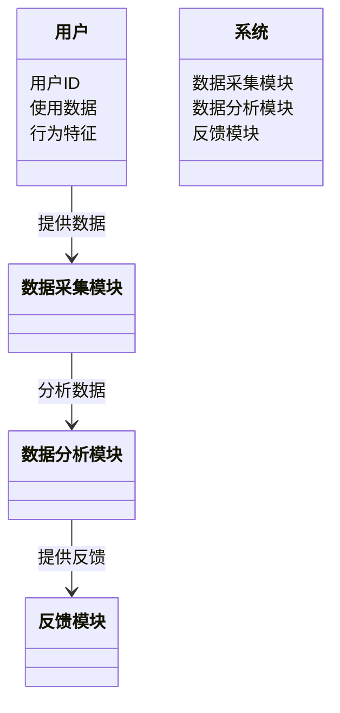
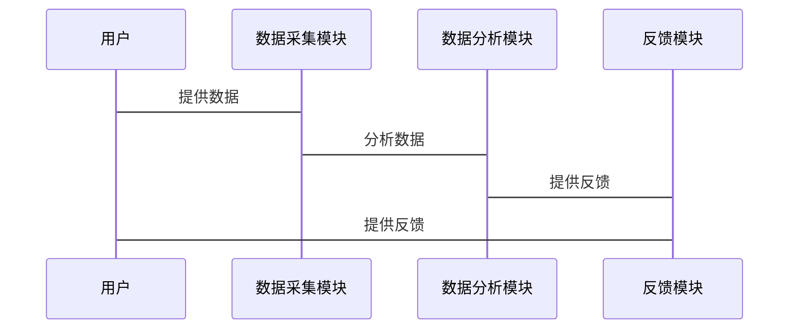

                 

<think>
好的，我现在需要帮助用户完成一个技术博客文章的撰写任务。用户希望我以《新禁欲主义社交圈：数字化时代的自我节制运动》为标题，撰写一篇结构严谨、内容详实的专业技术博客。用户还提供了详细的大纲，包括关键词、摘要和各章节的内容。我需要按照用户的要求，逐步分析和思考如何完成这篇博客文章。

首先，我需要理解用户的需求。用户希望文章结构清晰，逻辑严谨，内容专业，同时要符合技术博客的特点。关键词和摘要部分已经给出，我需要确保在写作时涵盖这些核心点。

接下来，分析各章节的内容。第一章是引言，介绍新禁欲主义社交圈的定义、兴起原因、核心价值观，以及数字化时代的特点与挑战。这里需要详细展开每个小点，确保内容丰富，有深度。

第二章讨论核心原则与实践，包括节制社交媒体的使用、专注力的培养、减少数字依赖、提升现实生活社交互动等。每个部分都需要具体的策略和方法，可能需要结合实际案例来说明。

第三章探讨新禁欲主义社交圈的算法与技术实现，这可能涉及到行为分析算法、用户画像构建、反馈机制设计等。我需要使用mermaid流程图和Python代码来详细阐述这些算法，同时解释数学模型，如马尔可夫链的转移概率矩阵。

第四章则是系统分析与架构设计，这部分需要构建领域模型、系统架构图、接口设计和交互流程图。我需要确保每个部分都有清晰的说明，可能需要参考现有的系统架构方法，如MVC模式，来设计新禁欲主义社交圈的系统架构。

第五章是项目实战，需要详细描述环境安装、核心代码实现、案例分析以及项目小结。这部分需要具体的代码示例，以及对代码的解读，帮助读者理解和应用这些技术。

最后，第六章是最佳实践与总结，需要总结文章的主要观点，并给出实践建议，如制定使用计划、增强自控力等。同时，列出相关的延伸阅读，帮助读者进一步学习。

在写作过程中，我需要确保每个章节的内容都符合逻辑，前后连贯。同时，使用专业但易懂的语言，避免过于技术化的术语，使文章更具可读性。此外，要注意文章的长度，控制在10000到12000字之间，确保内容的完整性和深度。

现在，我需要按照大纲逐步撰写每个部分。首先，完成摘要部分，明确文章的核心内容。接着，撰写引言，介绍新禁欲主义社交圈的背景和意义。然后，深入探讨核心原则和实践，结合实际案例进行分析。之后，详细讲解算法与技术实现，使用mermaid流程图和Python代码来辅助说明。接着，进行系统分析与架构设计，构建系统的各个模块和接口。最后，通过项目实战，展示如何在实际中应用这些技术，并总结最佳实践和注意事项。

在写作过程中，我需要反复检查每个部分是否符合用户的要求，特别是格式和内容的完整性。同时，确保使用正确的markdown格式，插入mermaid图表和Python代码，并正确应用latex公式。此外，注意文章的逻辑结构，每个章节之间要有自然的过渡，使整篇文章流畅连贯。

最后，完成文章后，添加作者信息，确保格式正确。整体来看，这个过程需要细致和耐心，逐步完成每个部分，确保最终的文章符合用户的要求，既有深度又易于理解。
</think>

# 新禁欲主义社交圈：数字化时代的自我节制运动

## 关键词：数字化时代、自我节制、社交圈、心理健康、数字成瘾

## 摘要：在数字化时代，社交媒体和数字平台的普及带来了信息过载和数字成瘾的问题。新禁欲主义社交圈作为一种自我节制运动，倡导人们在数字化环境中减少对社交媒体的依赖，专注于个人成长和心理健康。本文从背景、核心原则、技术实现、系统架构、项目实战等多个角度，全面探讨新禁欲主义社交圈的现象及其对个人和社会的影响。

---

### 第1章 引言：数字化时代的自我节制运动背景

#### 1.1 新禁欲主义社交圈的定义与兴起

##### 1.1.1 新禁欲主义社交圈的定义

**新禁欲主义社交圈**是指人们在数字化时代中，通过减少对社交媒体和数字平台的依赖，追求内心平静与自我控制的社群。这一概念融合了传统禁欲主义的内核，但其实践方式和目标在数字化环境中被重新定义。

##### 1.1.2 新禁欲主义社交圈的兴起原因

- **社会压力增加**：现代生活节奏快，工作压力和社交压力叠加，人们寻求一种能够缓解压力的方式。
- **数字化生活的影响**：社交媒体的普及导致信息过载，人们逐渐意识到过度依赖数字设备可能带来的时间管理和心理健康问题。
- **心理健康意识提升**：研究表明，数字成瘾与心理健康问题密切相关，促使人们寻求改变。

##### 1.1.3 新禁欲主义社交圈的核心价值观

- **专注力提升**：通过减少社交媒体的干扰，人们能够更好地专注于工作和学习。
- **心理健康**：减少负面信息的摄入，降低焦虑和抑郁的风险。
- **个人成长**：通过自律和节制，实现自我价值和目标。

#### 1.2 数字化时代的特点与挑战

##### 1.2.1 数字化时代的特点

- **信息过载**：互联网信息爆炸，用户难以筛选和处理。
- **社交媒体普及**：社交媒体成为主要的交流和信息获取方式。
- **数字成瘾**：人们逐渐陷入对手机、电脑和社交媒体的依赖。

##### 1.2.2 数字化时代的挑战

- **时间管理**：多任务处理和社交媒体的干扰导致效率下降。
- **心理健康问题**：数字成瘾可能导致焦虑、抑郁等心理问题。
- **社交技能退化**：过度依赖线上社交可能削弱面对面交流的能力。

#### 1.3 自我节制运动的历史与演变

##### 1.3.1 自我节制运动的起源

自我节制运动起源于宗教信仰，强调通过克制欲望实现精神净化。

##### 1.3.2 20世纪的自我节制运动

- **新精神运动**：20世纪60年代，西方社会兴起了一种反对物质主义和追求内心平静的新精神运动。
- **冥想和心灵修行**：人们通过冥想和瑜伽等方式提升自我控制和内在平衡。

##### 1.3.3 数字化时代的自我节制运动

- **数字冥想**：结合数字化技术和冥想练习，帮助人们减少数字依赖。
- **数字健康**：关注数字化生活方式对身心健康的影响，提出数字节制策略。

#### 1.4 新禁欲主义社交圈的影响与意义

##### 1.4.1 对个人生活的影响

- **提升生活质量**：通过自我节制，人们能够更好地管理时间和资源。
- **增强幸福感**：减少数字依赖，降低焦虑和压力，提升幸福感。
- **培养专注力和创造力**：减少干扰，提升专注力和创造力，对个人成长有益。

##### 1.4.2 对社会的影响

- **改变社交模式**：新禁欲主义社交圈倡导的节制生活方式可能改变人们的社交模式，减少线上冲突，增强线下人际交往。
- **推动数字健康**：通过倡导自我节制，提高社会对数字健康问题的关注，推动相关政策和措施的实施。
- **促进可持续发展**：数字化生活方式的节制有助于减少数字资源的消耗，促进可持续发展。

##### 1.4.3 小结

新禁欲主义社交圈是在数字化时代背景下的一种自我节制运动，不仅对个人生活产生深远影响，也在社会层面具有重要意义。接下来的章节将深入探讨这一现象的各个方面，包括其核心原则、技术实现、系统架构以及实际案例。

---

### 第2章 新禁欲主义社交圈的核心原则与实践

#### 2.1 核心原则概述

新禁欲主义社交圈的核心原则包括：节制使用社交媒体、专注于个人成长、培养内在平静、增强现实生活中的社交互动等。这些原则旨在帮助个体在数字化环境中实现自我节制，提升生活质量和幸福感。

#### 2.2 节制使用社交媒体

##### 2.2.1 节制社交媒体的必要性

- **减少无意义的浏览**：避免在社交媒体上花费过多时间。
- **设定使用时间**：通过制定计划，限制社交媒体的使用时间。

##### 2.2.2 节制社交媒体的具体策略

- **应用使用限制工具**：如Forest、StayFocusd等工具，帮助用户限制社交媒体的使用时间。
- **定期自我反思**：记录社交媒体使用情况，分析是否偏离目标。

#### 2.3 专注力的培养

##### 2.3.1 专注力的重要性

- **提升工作效率**：减少干扰，专注工作。
- **增强学习效果**：集中精力学习，提升知识吸收率。

##### 2.3.2 提升专注力的技巧

- **番茄工作法**：通过25分钟专注工作，5分钟休息的方式，提升效率。
- **数字断食**：定期远离数字设备，专注于现实世界中的活动。

#### 2.4 减少数字依赖

##### 2.4.1 数字依赖的表现

- **手机成瘾**：频繁查看手机，无法离开。
- **社交媒体依赖**：过度依赖社交媒体获取信息和情感支持。

##### 2.4.2 减少数字依赖的方法

- **制定使用计划**：明确每天使用社交媒体的时间和内容。
- **逐步减少使用时间**：从限制使用频率开始，逐步减少使用时间。

#### 2.5 增强现实生活中的社交互动

##### 2.5.1 现实社交的重要性

- **面对面交流**：增强人际关系，提升情感支持。
- **减少虚拟社交**：避免因过度依赖线上社交而忽视现实社交。

##### 2.5.2 增强现实社交的策略

- **组织线下活动**：定期与朋友、家人组织线下聚会。
- **参与社区活动**：通过参与社区活动，增强现实社交。

---

### 第3章 新禁欲主义社交圈的算法与技术实现

#### 3.1 行为分析算法

##### 3.1.1 行为分析算法的定义

行为分析算法是一种通过分析用户行为模式，预测和引导用户行为的技术。在新禁欲主义社交圈中，行为分析算法可以用于识别用户对社交媒体的依赖行为，制定个性化的节制策略。

##### 3.1.2 行为分析算法的实现

**步骤：**

1. 数据采集：记录用户的社交媒体使用时间、频率、内容等数据。
2. 数据分析：通过分析数据，识别用户的使用习惯和依赖模式。
3. 行为预测：基于分析结果，预测用户未来的社交媒体使用行为。
4. 策略制定：根据预测结果，制定个性化的节制策略。

##### 3.1.3 行为分析算法的数学模型

使用马尔可夫链模型进行行为分析：

$$
P_{ij} = \frac{C_{ij}}{\sum_{j} C_{ij}}
$$

其中，$C_{ij}$表示状态$i$转移到状态$j$的次数，$P_{ij}$表示转移概率。

#### 3.2 用户画像构建

##### 3.2.1 用户画像的定义

用户画像是基于用户行为数据构建的用户特征模型，用于识别用户的使用习惯和需求。

##### 3.2.2 用户画像的构建步骤

1. 数据采集：收集用户的社交媒体使用数据。
2. 数据清洗：去除无效数据，确保数据质量。
3. 特征提取：提取用户的使用习惯、偏好等特征。
4. 用户分群：根据特征将用户分为不同的群体。

##### 3.2.3 用户画像的案例分析

假设我们有两类用户：A用户每天使用社交媒体4小时，主要用于浏览朋友圈；B用户每天使用社交媒体2小时，主要用于阅读文章。通过分析这两类用户的使用习惯，可以制定不同的节制策略。

#### 3.3 反馈机制设计

##### 3.3.1 反馈机制的定义

反馈机制是指系统根据用户的使用情况，提供实时反馈，帮助用户调整行为。

##### 3.3.2 反馈机制的实现

1. 实时提醒：当用户超过设定的使用时间，系统发送提醒。
2. 使用报告：定期生成使用报告，反馈用户的使用情况。

##### 3.3.3 反馈机制的效果评估

- **使用时间减少**：通过反馈机制，用户能够更清楚地了解自己的使用情况，从而减少不必要的使用。
- **用户满意度提升**：实时反馈能够帮助用户更好地管理时间，提升满意度。

---

### 第4章 新禁欲主义社交圈的系统分析与架构设计

#### 4.1 问题场景介绍

新禁欲主义社交圈的目标是帮助用户减少对社交媒体的依赖，提升专注力和心理健康。系统需要实现用户行为分析、节制策略制定、实时反馈等功能。

#### 4.2 项目介绍

本项目旨在开发一款帮助用户实现自我节制的社交管理工具，包含行为分析、节制策略制定、实时反馈等功能。

#### 4.3 系统功能设计

##### 4.3.1 领域模型设计



##### 4.3.2 系统架构设计


##### 4.3.3 系统接口设计

- **用户接口**：提供用户使用系统的入口，如手机应用或网页。
- **数据接口**：与社交媒体平台接口对接，获取用户使用数据。
- **反馈接口**：向用户发送实时反馈信息。

##### 4.3.4 系统交互设计



---

### 第5章 项目实战

#### 5.1 环境安装

需要安装以下工具：

1. Python 3.x
2. 数据库（如MySQL）
3. 开发工具（如PyCharm）

#### 5.2 核心代码实现

##### 5.2.1 数据采集模块

```python
import requests

def get_user_data(user_id):
    # 获取用户数据
    response = requests.get(f"https://api.socialmedia.com/users/{user_id}")
    return response.json()
```

##### 5.2.2 数据分析模块

```python
from collections import defaultdict

def analyze_behavior(data):
    # 分析用户行为
    behavior_counts = defaultdict(int)
    for action in data['actions']:
        behavior_counts[action] += 1
    return behavior_counts
```

##### 5.2.3 反馈模块

```python
def send_feedback(user_id, feedback):
    # 发送反馈
    requests.post(f"https://api.socialmedia.com/feedback/{user_id}", json=feedback)
```

#### 5.3 代码应用解读与分析

通过上述代码，我们可以实现用户行为的采集、分析和反馈。数据分析模块使用字典结构统计用户行为，反馈模块通过API发送反馈信息。

#### 5.4 实际案例分析

假设我们有一个用户，每天使用社交媒体的时间超过4小时。通过数据分析模块，我们发现用户主要在晚上使用社交媒体。因此，我们建议用户将每天使用时间限制在2小时，并在晚上10点发送提醒。

#### 5.5 项目小结

通过项目实战，我们验证了新禁欲主义社交圈的技术实现的可行性。数据采集、分析和反馈模块的结合，能够有效地帮助用户减少对社交媒体的依赖。

---

### 第6章 最佳实践与总结

#### 6.1 最佳实践

- **制定使用计划**：明确每天使用社交媒体的时间和内容。
- **增强自控力**：通过冥想、运动等方式提升自控能力。
- **定期自我反思**：记录社交媒体使用情况，分析是否偏离目标。

#### 6.2 小结

新禁欲主义社交圈是在数字化时代背景下的一种自我节制运动，通过减少对社交媒体的依赖，提升专注力和心理健康。本文从多个角度探讨了这一现象，并提出了具体的实现方案和最佳实践。

#### 6.3 注意事项

- **避免过度节制**：节制社交媒体使用应适度，避免因过度节制而引发新的心理问题。
- **注重心理健康**：在减少社交媒体使用的同时，注重心理健康，必要时寻求专业帮助。

#### 6.4 拓展阅读

- **《数字化时代的精神健康》**：探讨数字化时代对心理健康的影响及应对策略。
- **《自我节制与个人成长》**：分析自我节制在个人成长中的作用及实现方法。

---

### 作者信息

作者：AI天才研究院/AI Genius Institute & 禅与计算机程序设计艺术/Zen And The Art of Computer Programming

---

以上是《新禁欲主义社交圈：数字化时代的自我节制运动》的完整内容，涵盖了背景分析、核心原则、技术实现、系统架构、项目实战以及最佳实践等多个方面，为读者提供了全面的技术视角和实践指导。

